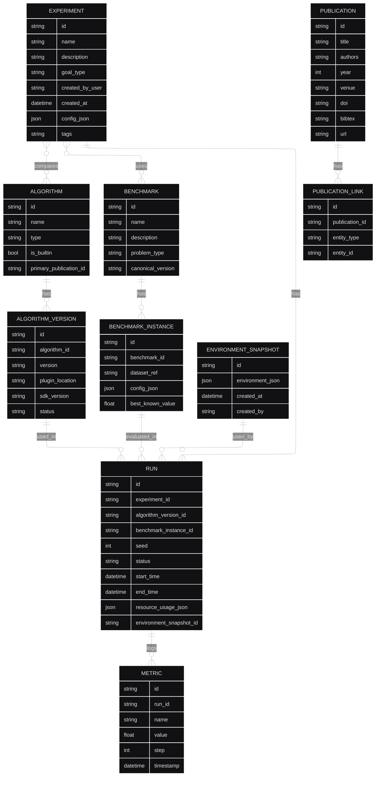

# Data Model

## 1. Introduction

The data model for Corvus Corone system was designed with focus on:
- **Reproducibility** of benchmarking experiments
- **Lineage tracking** of results 
- **Versioning** of algorithms and benchmarks
- **Scaling** from PC to cloud
- **Referential integrity** of data

## 2. Diagram ERD



## 3. Entity Details

### 3.1. EXPERIMENT
**Description**: Main organizational unit - collection of runs comparing algorithms on benchmarks

| Field | Type | Description |
|-------|------|-------------|
| `id` | string | Unique identifier (UUID) |
| `name` | string | Experiment name (max 255 characters) |
| `description` | text | Detailed description of experiment goal |
| `goal_type` | enum | `COMPARISON`, `PARAMETER_TUNING`, `ABLATION_STUDY` |
| `created_by_user` | string | User ID (FK to auth system) |
| `created_at` | datetime | Creation timestamp |
| `config_json` | json | Experiment configuration (budgets, limits, seeds) |
| `tags` | string | Comma-separated tags for categorization |

**Indexes**: 
- PRIMARY KEY (`id`)
- INDEX (`created_by_user`, `created_at`)
- INDEX (`tags`) - for searching

### 3.2. RUN
**Description**: Single algorithm run on a benchmark instance

| Field | Type | Description |
|-------|------|-------------|
| `id` | string | Unique run identifier (UUID) |
| `experiment_id` | string | FK to EXPERIMENT |
| `algorithm_version_id` | string | FK to ALGORITHM_VERSION |
| `benchmark_instance_id` | string | FK to BENCHMARK_INSTANCE |
| `seed` | int | Random seed for reproducibility |
| `status` | enum | `PENDING`, `RUNNING`, `COMPLETED`, `FAILED`, `CANCELLED` |
| `start_time` | datetime | Start time |
| `end_time` | datetime | End time (NULL if running) |
| `resource_usage_json` | json | CPU/RAM/GPU/time usage |
| `environment_snapshot_id` | string | FK to ENVIRONMENT_SNAPSHOT |

**Indexes**: 
- PRIMARY KEY (`id`)
- INDEX (`experiment_id`, `status`)
- INDEX (`algorithm_version_id`)
- INDEX (`benchmark_instance_id`)

### 3.3. METRIC
**Description**: Metrics logged during run (e.g. accuracy, loss, training time)

| Field | Type | Description |
|-------|------|-------------|
| `id` | string | Unique identifier (UUID) |
| `run_id` | string | FK to RUN |
| `name` | string | Metric name (e.g. 'accuracy', 'best_score') |
| `value` | float | Metric value |
| `step` | int | Step/iteration (optional, for temporal metrics) |
| `timestamp` | datetime | When metric was logged |

**Indexes**: 
- PRIMARY KEY (`id`)
- INDEX (`run_id`, `name`)
- INDEX (`run_id`, `step`)

### 3.4. ALGORITHM
**Description**: HPO algorithm definition (can have multiple versions)

| Field | Type | Description |
|-------|------|-------------|
| `id` | string | Unique identifier (UUID) |
| `name` | string | Algorithm name (e.g. 'Random Forest TPE') |
| `type` | enum | `BAYESIAN`, `EVOLUTIONARY`, `GRID_SEARCH`, `RANDOM_SEARCH`, `GRADIENT_BASED`, `OTHER` |
| `is_builtin` | boolean | Whether algorithm is built into the system |
| `primary_publication_id` | string | FK to main publication describing algorithm |

**Indexes**: 
- PRIMARY KEY (`id`)
- UNIQUE (`name`)
- INDEX (`type`)

### 3.5. ALGORITHM_VERSION
**Description**: Specific version of algorithm implementation

| Field | Type | Description |
|-------|------|-------------|
| `id` | string | Unique version identifier (UUID) |
| `algorithm_id` | string | FK to ALGORITHM |
| `version` | string | Semantic version (e.g. '1.2.3') |
| `plugin_location` | string | URL/path to plugin file (for plugins) |
| `sdk_version` | string | SDK version used to create plugin |
| `status` | enum | `DRAFT`, `UNDER_REVIEW`, `APPROVED`, `DEPRECATED` |

**Indexes**: 
- PRIMARY KEY (`id`)
- UNIQUE (`algorithm_id`, `version`)
- INDEX (`status`)

### 3.6. BENCHMARK
**Description**: Benchmark definition (collection of problem instances)

| Field | Type | Description |
|-------|------|-------------|
| `id` | string | Unique identifier (UUID) |
| `name` | string | Benchmark name (e.g. 'UCI Classification Suite') |
| `description` | text | Benchmark description and purpose |
| `problem_type` | enum | `CLASSIFICATION`, `REGRESSION`, `CLUSTERING`, `REINFORCEMENT_LEARNING` |
| `canonical_version` | string | Canonical/recommended version |

**Indexes**: 
- PRIMARY KEY (`id`)
- UNIQUE (`name`)
- INDEX (`problem_type`)

### 3.7. BENCHMARK_INSTANCE
**Description**: Specific problem instance in benchmark

| Field | Type | Description |
|-------|------|-------------|
| `id` | string | Unique identifier (UUID) |
| `benchmark_id` | string | FK to BENCHMARK |
| `dataset_ref` | string | Dataset reference (URL/path) |
| `config_json` | json | Problem configuration (split ratio, preprocessing, etc.) |
| `best_known_value` | float | Best known result (optional) |

**Indexes**: 
- PRIMARY KEY (`id`)
- INDEX (`benchmark_id`)

### 3.8. PUBLICATION
**Description**: Scientific publications linked to algorithms/benchmarks

| Field | Type | Description |
|-------|------|-------------|
| `id` | string | Unique identifier (UUID) |
| `title` | string | Publication title |
| `authors` | string | Author list |
| `year` | int | Publication year |
| `venue` | string | Venue (conference/journal) |
| `doi` | string | Digital Object Identifier |
| `bibtex` | text | Full BibTeX entry |
| `url` | string | URL to publication |

**Indexes**: 
- PRIMARY KEY (`id`)
- UNIQUE (`doi`) WHERE doi IS NOT NULL
- INDEX (`year`)
- FULLTEXT (`title`, `authors`)

### 3.9. PUBLICATION_LINK
**Description**: Links between publications and algorithms, benchmarks, experiments

| Field | Type | Description |
|-------|------|-------------|
| `id` | string | Unique identifier (UUID) |
| `publication_id` | string | FK to PUBLICATION |
| `entity_type` | enum | `ALGORITHM`, `BENCHMARK`, `EXPERIMENT` |
| `entity_id` | string | ID of linked entity |

**Indexes**: 
- PRIMARY KEY (`id`)
- UNIQUE (`publication_id`, `entity_type`, `entity_id`)
- INDEX (`entity_type`, `entity_id`)

### 3.10. ENVIRONMENT_SNAPSHOT
**Description**: Environment snapshot for reproducibility

| Field | Type | Description |
|-------|------|-------------|
| `id` | string | Unique identifier (UUID) |
| `environment_json` | json | Environment details |
| `created_at` | datetime | When snapshot was created |
| `created_by` | string | Who created snapshot |

**Indexes**: 
- PRIMARY KEY (`id`)
- INDEX (`created_at`)

**Structure of `environment_json`**:
```json
{
  "container_images": {
    "worker": "corvus-worker:1.2.3",
    "system": "corvus-core:1.2.3"
  },
  "python_packages": {
    "numpy": "1.21.0",
    "scikit-learn": "1.0.2",
    "pytorch": "1.10.0"
  },
  "system_info": {
    "os": "Ubuntu 20.04",
    "python_version": "3.9.7",
    "cuda_version": "11.2"
  },
  "resource_limits": {
    "cpu_cores": 4,
    "memory_gb": 16,
    "gpu_count": 1
  },
  "code_version": {
    "commit_hash": "abc123def456",
    "repository": "https://github.com/example/corvus",
    "branch": "main"
  }
}
```

## 4. Data Access Patterns

### 4.1. Common Queries

#### Get experiment with results
```sql
SELECT e.*, COUNT(r.id) as run_count,
       AVG(CASE WHEN r.status = 'COMPLETED' THEN 1.0 ELSE 0.0 END) as success_rate
FROM EXPERIMENT e
LEFT JOIN RUN r ON e.id = r.experiment_id
WHERE e.id = ?
GROUP BY e.id;
```

#### Algorithm ranking on benchmark
```sql
SELECT av.algorithm_id, a.name,
       AVG(m.value) as avg_score,
       COUNT(DISTINCT r.id) as run_count
FROM ALGORITHM_VERSION av
JOIN ALGORITHM a ON av.algorithm_id = a.id
JOIN RUN r ON av.id = r.algorithm_version_id
JOIN METRIC m ON r.id = m.run_id
WHERE r.benchmark_instance_id = ?
  AND m.name = 'accuracy'
  AND r.status = 'COMPLETED'
GROUP BY av.algorithm_id, a.name
ORDER BY avg_score DESC;
```

#### Search experiments by tags
```sql
SELECT * FROM EXPERIMENT
WHERE tags LIKE '%optimization%'
  AND tags LIKE '%neural_networks%'
ORDER BY created_at DESC;
```

### 4.2. Indexing and Partitioning

**Indexing strategy**:
- **EXPERIMENT**: partitioning by `created_at` (monthly)
- **RUN**: partitioning by `start_time` (weekly)  
- **METRIC**: partitioning by `run_id` + clustering by `timestamp`

**Materialized views**:
- `experiment_summary` - experiment aggregates
- `algorithm_rankings` - algorithm rankings per benchmark
- `recent_activities` - recent user activities

## 5. Migration Strategies

### 5.1. Schema Versioning
- **Flyway/Alembic** for versioned migrations
- **Backward compatibility** for min. 2 versions
- **Blue-green deployment** for major changes

### 5.2. Data Archiving
- **Hot data**: last 6 months in main database
- **Warm data**: 6-24 months in archived partition
- **Cold data**: >24 months in Object Storage (Parquet)

## 6. Cross-reference

- **Component Architecture**: [C4 Components](../architecture/c3-components.md)
- **API Reference**: [C4 Components - API Details](../architecture/c3-components.md#6-interfejsy-api---szczegóły-techniczne)
- **Deployment**: [Deployment Guide](../operations/deployment-guide.md)
- **Requirements**: [Functional Requirements](../requirements/functional-requirements.md), [Use Cases](../requirements/use-cases.md)
