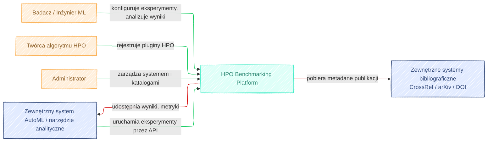

# Architektura systemu benchmarkowego HPO – C4 + UML (wersja wstępna)

> **Założenia ogólne / świadome uproszczenia**
>
> - Docelowa skala: pojedynczy zespół badawczy / małe laboratorium (kilku–kilkunastu użytkowników równoległych), ale z możliwością rozrostu do większego klastra.
> - Dominujący stack ML: Python (scikit-learn, PyTorch, TensorFlow, XGBoost itd.), ale architektura nie jest do niego twardo przywiązana.
> - Główny deployment: **PC-first (docker-compose, single-node)** z prostą ścieżką do **cloud / K8s**.
> - Autoryzacja: klasyczne role **Badacz / Twórca pluginu / Administrator**, integracja z zewnętrznym IdP w przyszłości.
> - Benchmarki dotyczą głównie trenowania modeli ML, ale architektura nie zakłada konkretnej domeny – można ją rozszerzyć na inne typy zadań optymalizacyjnych.


```mermaid
  info
```

---

## 1. Kontekst systemu (C4-1)



### 1.1. Użytkownicy / aktorzy biznesowi

- **Badacz / Inżynier ML**
  - Definiuje benchmarki, konfiguruje eksperymenty.
  - Uruchamia eksperymenty lokalnie / w chmurze.
  - Analizuje wyniki, porównuje algorytmy HPO.
  - Eksportuje dane do zewnętrznych narzędzi analitycznych.
- **Twórca algorytmu HPO (Plugin Author)**
  - Implementuje algorytmy HPO jako pluginy w oparciu o SDK.
  - Rejestruje i wersjonuje własne algorytmy.
  - Testuje je na istniejących benchmarkach.
- **Administrator systemu**
  - Zarządza deploymentem (PC / chmura).
  - Konfiguruje zasoby, uprawnienia, integracje (IdP, monitoring).
  - Dodaje / zatwierdza wbudowane algorytmy HPO i benchmarki „kanoniczne”.
- **Zewnętrzny system AutoML / narzędzie analityczne**
  - Wywołuje API w celu uruchamiania eksperymentów.
  - Pobiera wyniki benchmarków do dalszej analizy (np. BI, Jupyter, AutoML pipeline).
- **Źródła bibliograficzne (zewnętrzne systemy)**
  - np. CrossRef, arXiv, DOI resolver.
  - Umożliwiają walidację i uzupełnianie metadanych publikacji.

### 1.2. System w centrum – „HPO Benchmarking Platform”

**System (S): „HPO Benchmarking Platform”**  
Główny system wspierający:

- projektowanie benchmarków,
- uruchamianie eksperymentów HPO,
- śledzenie eksperymentów i runów,
- analizę wyników i raportowanie,
- zarządzanie algorytmami HPO (wbudowane + pluginy),
- zarządzanie referencjami do publikacji.

### 1.3. Diagram kontekstu C4 – opis słowny

Elementy:

- **System S: HPO Benchmarking Platform**
- Aktorzy:
  - A1: Badacz / Inżynier ML
  - A2: Twórca algorytmu HPO
  - A3: Administrator
  - A4: Zewnętrzny system AutoML / narzędzie analityczne
  - A5: Zewnętrzny system bibliograficzny (CrossRef / arXiv / DOI)
- Relacje (kierunek: → oznacza inicjatora przepływu):
  - A1 → S: „Konfiguruj i uruchamiaj benchmarki, analizuj wyniki, przeglądaj panel eksperymentów, eksportuj dane.”
  - A2 → S: „Rejestruj i testuj własne algorytmy HPO (pluginy).”
  - A3 → S: „Administruj systemem, zasobami i katalogami (algorytmy, benchmarki).”
  - A4 ↔ S: „Integracja przez API: uruchamianie eksperymentów, pobieranie metryk i wyników.”
  - S ↔ A5: „Pobieranie / weryfikacja metadanych publikacji (DOI, tytuł, autorzy, BibTeX).”

Słownie: na diagramie kontekstu system S jest centralnym prostokątem; aktorzy A1–A4 są umieszczeni wokół niego, połączeni strzałkami. Zewnętrzny system bibliograficzny A5 jest połączony dwukierunkowo z systemem S.

### 1.4. Wymagania funkcjonalne (R1–R15)

**Katalog funkcjonalny:**

- **R1.** Katalog algorytmów HPO (wbudowanych).  
- **R2.** Wsparcie dla algorytmów HPO jako pluginów (autorskie, zewnętrzne).
- **R3.** Wersjonowanie algorytmów HPO (wbudowanych i pluginów).
- **R4.** Katalog benchmarków (zbiory danych, definicje problemów, znane optimum / best-known).  
- **R5.** Konfiguracja eksperymentu benchmarkowego (dobór algorytmów, instancji, limitów zasobów, budżetów HPO itd.).
- **R6.** Orkiestracja eksperymentów (planowanie, kolejkowanie, uruchamianie runów, retry).  
- **R7.** Panel śledzenia eksperymentów (lista eksperymentów/runów, statusy, metryki, logi, parametry).  
- **R8.** Porównywanie wyników algorytmów (wykresy, statystyki, testy statystyczne, filtry, tagowanie).  
- **R9.** Rejestrowanie i przegląd logów oraz artefaktów (modele, wykresy, pliki konfiguracyjne).  
- **R10.** Zarządzanie referencjami do publikacji (dodawanie, edycja, powiązanie z algorytmami / eksperymentami / benchmarkami).  
- **R11.** Generowanie raportów (w tym sekcja bibliografii, cytowania, opis konfiguracji eksperymentów).  
- **R12.** API do integracji ze światem zewnętrznym (uruchamianie eksperymentów, fetch wyników, integracja z AutoML).  
- **R13.** API / SDK do tworzenia własnych algorytmów HPO (plugin API).  
- **R14.** Eksport danych (wyniki, metryki, konfiguracje) do formatów zewnętrznych (CSV/JSON/Parquet) dla narzędzi analitycznych.  
- **R15.** Uruchamianie systemu w trybie **PC-local** i **cloud / K8s** (w tym skalowanie workerów).  

### 1.5. Wymagania niefunkcjonalne (RNF1–RNF8)

- **RNF1 – Skalowalność:**  
  - Możliwość uruchamiania wielu workerów równolegle, zarówno lokalnie (wiele procesów / kontenerów), jak i w chmurze (K8s, autoscaling).  
- **RNF2 – Niezawodność:**  
  - Retry i wznawianie runów, transakcyjna rejestracja wyników, odporność Orchestratora na restart.  
- **RNF3 – Bezpieczeństwo:**  
  - Autoryzacja i uwierzytelnianie (role), izolacja pluginów (sandboxing), bezpieczne zarządzanie sekretami (np. w chmurze).  
- **RNF4 – Obserwowalność:**  
  - Kompletny logging, metryki systemowe (prometheus-like), śledzenie przepływu runów (trace IDs).  
- **RNF5 – Rozszerzalność (pluginy):**  
  - Stabilne, dobrze udokumentowane interfejsy SDK / API, brak zmian łamiących kontrakt.  
- **RNF6 – Cloud-ready, PC-first:**  
  - Możliwość uruchomienia wszystkich kontenerów lokalnie (docker-compose), ale z jasnymi granicami usług umożliwiającymi ich „wyniesienie” do chmury.  
- **RNF7 – Reprodukowalność:**  
  - Zapisywanie pełnej konfiguracji, wersji datasetów, kodu, obrazów kontenerów i losowych seedów.  
- **RNF8 – Użyteczność:**  
  - Intuicyjny Web UI, czytelne dashboardy, możliwość tagowania, filtrowania, quick-search.

---

## 2. Kontenery (C4-2)

### 2.1. Lista kontenerów

1. **Web UI (Frontend)**  
2. **API Gateway / Backend API**  
3. **Experiment Orchestrator Service**  
4. **Worker Runtime / Execution Engine**  
5. **Benchmark Definition Service**  
6. **Algorithm Registry Service**  
7. **Algorithm SDK / Plugin Runtime**  
8. **Experiment Tracking Service**  
9. **Metrics & Analysis Service**  
10. **Publication & Reference Service**  
11. **Results Store (Relacyjna baza danych)**  
12. **File / Object Storage**  
13. **Message Broker (kolejka zdarzeń)**  
14. **Monitoring & Logging Stack**  
15. **Auth / Identity Integration (opcjonalny kontener / proxy)**

### 2.2. Opis kontenerów i komunikacji

Dla każdego kontenera: odpowiedzialności, komunikacja (sync/async), rola w PC vs chmura, związek z dobrymi praktykami benchmarkingu.

---

#### 2.2.1. Web UI (Frontend)

- **Odpowiedzialności:**
  - Interfejs użytkownika do:
    - definicji benchmarków i eksperymentów,
    - podglądu katalogu algorytmów HPO,
    - panelu śledzenia eksperymentów,
    - porównania wyników,
    - zarządzania publikacjami i generowania raportów,
    - podstawowej administracji.
- **Komunikacja:**
  - REST/GraphQL/WebSocket z **API Gateway** (sync).
- **Rola PC vs chmura:**
  - W trybie PC: serwowany z lokalnego kontenera albo nawet plików statycznych.
  - W chmurze: standardowy frontend (np. hostowany w CDN / storage).  
- **Związek z benchmarkingiem:**
  - Umożliwia jasne prezentowanie celów eksperymentu, konfiguracji, wyników i statystyk.

---

#### 2.2.2. API Gateway / Backend API

- **Odpowiedzialności:**
  - Pojedynczy punkt wejścia dla Web UI i zewnętrznych systemów.
  - Routing żądań do usług domenowych: Orchestrator, Benchmark Definition, Algorithm Registry, Experiment Tracking, Publication & Reference, Metrics & Analysis.
  - Autoryzacja / uwierzytelnianie.
- **Komunikacja:**
  - Z Web UI / systemami zewn.: HTTP REST/GraphQL (sync).
  - Z usługami wewn.: HTTP/gRPC (sync) oraz publikacja zdarzeń do Message Broker (async).
- **PC vs chmura:**
  - W PC: jeden kontener, monolityczny backend lub prosty gateway.
  - W chmurze: gateway (np. API Gateway + microservices).

---

#### 2.2.3. Experiment Orchestrator Service

- **Odpowiedzialności:**
  - Przyjmowanie definicji eksperymentów, walidacja planu eksperymentu (dobór algorytmów, instancji).
  - Tworzenie „planu runów” (macierz: algorytm × instancja × seed × budżet).
  - Zlecanie runów do Workerów poprzez Message Broker.
  - Zarządzanie stanem eksperymentu (pending/running/completed/failed).
  - Kontrola powtarzalności (przekazywanie seedów, snapshotów konfiguracji).
- **Komunikacja:**
  - Sync: z API Gateway (definicje eksperymentów).
  - Async: do Worker Runtime (kolejka runów poprzez Message Broker), odbiór zdarzeń „RunCompleted/RunFailed”.
- **PC vs chmura:**
  - PC: jedna instancja, pojedynczy proces/ kontener.
  - Chmura: skalowalny microservice; może być HA.
- **Benchmarking:**
  - Implementuje **plan eksperymentu** (Główne dobre praktyki: plan, kontrola budżetu, coverage instancji).

---

#### 2.2.4. Worker Runtime / Execution Engine

- **Odpowiedzialności:**
  - Wykonywanie pojedynczych runów eksperymentu:
    - ładowanie benchmarku i instancji (dataset),
    - ładowanie i uruchamianie algorytmu HPO (plugin/wbudowany),
    - raportowanie metryk do Experiment Tracking Service.
- **Komunikacja:**
  - Async: odbiór zadań z Message Broker.
  - Sync/Async: zapisy do Experiment Tracking Service (REST/gRPC + batch/stream), logi do Logging Stack.
  - Dostęp do File/Object Storage po dataset i artefakty.
- **PC vs chmura:**
  - PC: 1–N workerów jako procesy/kontenery, uruchamiane przez docker-compose.
  - Chmura: worker pods w K8s, autoscaling na podstawie kolejki.
- **Benchmarking:**
  - Wymusza jednolite środowisko uruchomieniowe (konteneryzacja), co wspiera reprodukowalność i porównywalność.

---

#### 2.2.5. Benchmark Definition Service

- **Odpowiedzialności:**
  - Przechowywanie i wersjonowanie definicji benchmarków:
    - listy datasetów,
    - definicji problemów (np. klasyfikacja, regresja),
    - dostępnych metryk,
    - znanych optimum/best-known wartości.
- **Komunikacja:**
  - Sync: API dla Orchestratora i Web UI (GET/POST/PUT).
- **PC vs chmura:**
  - Jeden kontener, bez szczególnych wymagań skalowalności.
- **Benchmarking:**
  - Realizuje dobór i opis instancji problemowych (zróżnicowanie, reprezentatywność).

---

#### 2.2.6. Algorithm Registry Service

- **Odpowiedzialności:**
  - Rejestr i wersjonowanie algorytmów HPO (wbudowane + pluginy).
  - Przechowywanie metadanych: nazwa, typ, parametry, wymagania środowiskowe, powiązane publikacje.
  - Walidacja kompatybilności z benchmarkami (obszar rozwiązywanych problemów).
- **Komunikacja:**
  - Sync: API dla Web UI, Orchestratora i Plugin Runtime.
- **Benchmarking:**
  - Ułatwia świadomy dobór algorytmów i ich konfiguracji; wspiera cele G1–G5.

---

#### 2.2.7. Algorithm SDK / Plugin Runtime

- **Odpowiedzialności:**
  - Dostarczenie standardowego **interfejsu pluginu** (IAlgorithmPlugin).
  - Ładowanie pluginów (np. Python packages, gRPC serwisy) w sposób izolowany.
  - Walidacja zgodności pluginu z interfejsem.
- **Komunikacja:**
  - Używany lokalnie przez Worker Runtime (biblioteka / sidecar).
  - Może komunikować się z Workerem przez lokalne API lub bezpośrednie wywołania językowe.
- **PC vs chmura:**
  - Ten sam kod w obu przypadkach, różni się jedynie środowiskiem wykonawczym (docker image).
- **Benchmarking:**
  - Umożliwia łatwe dodawanie nowych algorytmów w ujednoliconym środowisku.

---

#### 2.2.8. Experiment Tracking Service

- **Odpowiedzialności:**
  - API do rejestrowania runów, metryk, parametrów, tagów i logów.
  - Przechowywanie powiązań między eksperymentem, runem, algorytmem, benchmarkiem i publikacją.
- **Komunikacja:**
  - Sync: API używane przez Worker Runtime, Orchestrator, Web UI.
- **Benchmarking:**
  - Stanowi centralny **panel śledzenia**, wspiera analizę wyników i reprodukowalność.

---

#### 2.2.9. Metrics & Analysis Service

- **Odpowiedzialności:**
  - Agregowanie wyników (średnie, wariancje, rankingi).
  - Obliczanie złożonych metryk (np. czas do osiągnięcia danego poziomu błędu).
  - Testy statystyczne, wykresy porównawcze (seria czasowa, boxplot, ranking).  
- **Komunikacja:**
  - Sync: API używane przez Web UI (porównania), ewentualnie Orchestrator (walidacje).
  - Async: może słuchać zdarzeń „RunCompleted” w celu preagregacji.
- **Benchmarking:**
  - Bezpośrednio implementuje część **analizy i prezentacji wyników**.

---

#### 2.2.10. Publication & Reference Service

- **Odpowiedzialności:**
  - Katalog publikacji (DOI, BibTeX, linki).
  - Powiązania publikacji z algorytmami, benchmarkami, eksperymentami.
  - Generowanie sekcji bibliografii w raportach.
  - Integracja z zewnętrznymi usługami bibliograficznymi.
- **Komunikacja:**
  - Sync: API dla Web UI, Algorithm Registry, Experiment Tracking, Reportowania.
  - Sync/Async: wywołania do zewnętrznych systemów bibliograficznych.
- **Benchmarking:**
  - Wspiera łączenie wyników z literaturą i teoretycznym uzasadnieniem algorytmów.

---

#### 2.2.11. Results Store (Relacyjna baza danych)

- **Odpowiedzialności:**
  - Przechowywanie danych domenowych:
    - Experiments, Runs, Metrics, Algorithms, Benchmarks, Publications, Linkowania, Konfiguracje.
- **Komunikacja:**
  - Internal: używana przez Experiment Tracking, Benchmark Definition, Algorithm Registry, Publication & Reference.
- **Technicznie:**
  - np. PostgreSQL / inny RDBMS, z migracjami schematu.
- **Benchmarking:**
  - Centralne repo do analizy i reprodukowalności.

---

#### 2.2.12. File / Object Storage

- **Odpowiedzialności:**
  - Przechowywanie dużych artefaktów:
    - datasetów,
    - modeli,
    - logów w plikach,
    - wygenerowanych raportów.
- **PC vs chmura:**
  - PC: lokalny dysk / MinIO.
  - Cloud: S3 / GCS / Azure Blob.
- **Benchmarking:**
  - Zapewnia przechowywanie datasetów i wyników w sposób odtwarzalny.

---

#### 2.2.13. Message Broker

- **Odpowiedzialności:**
  - Kolejka zadań runów.
  - Kanał zdarzeń systemowych (RunStarted, RunCompleted, RunFailed, ExperimentCompleted).
- **Benchmarking:**
  - Umożliwia elastyczny plan eksperymentu i skalowanie warstwy wykonawczej.

---

#### 2.2.14. Monitoring & Logging Stack

- **Odpowiedzialności:**
  - Zbieranie logów z kontenerów.
  - Metryki (czas trwania runów, obciążenie workerów, błędy).
- **Benchmarking:**
  - Wspiera obserwowalność i analizę wydajności algorytmów i samego systemu.

---

#### 2.2.15. Auth / Identity Integration

- **Odpowiedzialności:**
  - Integracja z IdP (OIDC/SAML).
  - Mapowanie użytkowników na role (Badacz, Twórca pluginu, Admin).
- **Benchmarking:**
  - Pozwala kontrolować, kto może modyfikować benchmarki, zatwierdzać algorytmy itd.

---

## 3. Komponenty (C4-3)

Poniżej wewnętrzna struktura najważniejszych kontenerów.

### 3.1. Experiment Orchestrator Service – komponenty

- **ExperimentConfigManager**
  - Waliduje konfigurację eksperymentu (z Benchmark Definition i Algorithm Registry).  
- **ExperimentPlanBuilder**
  - Tworzy plan runów (macierz konfiguracji).  
- **RunScheduler**
  - Przekłada plan na zadania w kolejce Message Broker (RunJob).  
- **ExperimentStateStore (komponent logiczny nad DB)**
  - Utrzymuje stan eksperymentu, runów, retry.  
- **ReproducibilityManager**
  - Odpowiada za seed, wersje obrazów, snapshoty konfiguracji.  
- **EventPublisher**
  - Publikuje zdarzenia systemowe (ExperimentStarted/Completed/Failed).  

**Interakcje:**
- ExperimentConfigManager ↔ Benchmark Definition Service, Algorithm Registry.
- RunScheduler → Message Broker.
- ReproducibilityManager ↔ Results Store, Experiment Tracking.

### 3.2. Benchmark Definition Service – komponenty

- **BenchmarkRepository**
  - CRUD benchmarków.  
- **ProblemInstanceManager**
  - Zarządza instancjami (dataset + konfiguracja tasku).  
- **BenchmarkVersioning**
  - Wersjonowanie benchmarków, oznaczanie „kanonicznych” wersji.  

### 3.3. Algorithm Registry Service – komponenty

- **AlgorithmMetadataStore**
  - Opis algorytmu: nazwa, typ, parametry, powiązania.  
- **AlgorithmVersionManager**
  - Wersjonowanie implementacji, status (draft, approved).  
- **CompatibilityChecker**
  - Sprawdza kompatybilność algorytmu z typami benchmarków.  

### 3.4. Algorithm SDK / Plugin Runtime – komponenty

- **IAlgorithmPlugin (interfejs)**
  - Metody np.:
    - `suggest(config_space, history)`
    - `observe(config, result)`
    - `init(seed, resources)`
  - Kontrakt input/output jasno zdefiniowany.  
- **PluginLoader**
  - Ładuje pluginy (np. z plików wheel, modułów Python, serwisów gRPC).  
- **SandboxManager**
  - Izoluje pluginy (np. przez subprocess lub kontener).  
- **PluginValidator**
  - Sprawdza implementację względem interfejsu (testowy run).  

### 3.5. Experiment Tracking Service – komponenty

- **TrackingAPI**
  - Publiczne API do logowania runów, metryk, artefaktów, tagów.  
- **RunLifecycleManager**
  - Tworzy runy, aktualizuje statusy.  
- **TaggingAndSearchEngine**
  - Filtrowanie i tagowanie eksperymentów/runów.  
- **LineageTracker**
  - Zapisuje powiązania: eksperyment → run → algorytm → benchmark → publikacja.  

### 3.6. Metrics & Analysis Service – komponenty

- **MetricCalculator**
  - Oblicza metryki z surowych wyników (np. accuracy, regret).  
- **AggregationEngine**
  - Agreguje po benchmarkach/algorytmach.  
- **StatisticalTestsEngine**
  - Testy parowane, rankingi (np. Friedman/Nemenyi – nazwy ogólne).  
- **VisualizationQueryAdapter**
  - Przygotowuje dane do wykresów dla Web UI.  

### 3.7. Publication & Reference Service – komponenty

- **ReferenceCatalog**
  - Baza publikacji.  
- **CitationFormatter**
  - Generuje cytowania i BibTeX.  
- **ReferenceLinker**
  - Łączy publikacje z algorytmami, benchmarkami i eksperymentami.  
- **ExternalBibliographyClient**
  - Klient do CrossRef/arXiv/DOI.  

### 3.8. Results Store – komponenty logiczne

- **ExperimentDAO**, **RunDAO**, **MetricDAO**, **AlgorithmDAO**, **BenchmarkDAO**, **PublicationDAO**, **LinkDAO**  
  - Komponenty dostępu do danych, wykorzystywane przez powyższe usługi.  

### 3.9. Web UI – komponenty

- **ExperimentDesignerUI**
  - Kreator konfiguracji eksperymentów.  
- **TrackingDashboardUI**
  - Panel eksperymentów/runów.  
- **ComparisonViewUI**
  - Wykresy i porównania algorytmów.  
- **BenchmarkCatalogUI**  
- **AlgorithmCatalogUI**  
- **PublicationManagerUI**  
- **AdminSettingsUI**  

**Wsparcie wymagań:**
- Tworzenie i porównywanie algorytmów: AlgorithmCatalogUI + ComparisonViewUI + Metrics & Analysis.
- Panel śledzenia: TrackingDashboardUI + TrackingAPI + RunLifecycleManager.
- Referencje: PublicationManagerUI + ReferenceCatalog + ReferenceLinker.
- Reprodukowalność: ReproducibilityManager + LineageTracker + Results Store.

---

## 4. Szczegóły techniczne / Code (C4-4)

### 4.1. Wzorce architektoniczne i technologie (przykładowe)

- **Styl:** mikroserwisy z możliwością spakowania w monolit modułowy na PC.
- **Komunikacja:** REST/GraphQL + gRPC między usługami; Message Broker (RabbitMQ/Kafka) dla runów.
- **Bazy danych:**
  - Relacyjna (PostgreSQL) – Results Store.
  - Object Storage (S3/MinIO) – artefakty, dataset.
- **Konteneryzacja:** Docker; deployment:
  - PC: `docker-compose`.
  - Cloud: K8s (Deployment + StatefulSet dla DB).  
- **Pluginy:**
  - SDK: biblioteka Python (i potencjalnie inne języki).
  - Interfejs pluginu: IAlgorithmPlugin, rejestrowany w Algorithm Registry.

### 4.2. Strategia reprodukowalności

- Wymuszenie zapisu:
  - pełnej konfiguracji eksperymentu (JSON),
  - wersji datasetu, algorytmu, pluginu,
  - wersji obrazu kontenera workerów,
  - seedów losowych,
  - referencji do publikacji (np. artykuł definiujący algorytm).  
- Każdy run ma:
  - `environment_snapshot_id`: opis środowiska,
  - `code_ref`: commit hash / tag repozytorium lub wersja pluginu.  
- Możliwość odtworzenia runu przez „Re-run with same config/environment”.

### 4.3. Model danych – kluczowe encje

Przykładowy model (w skrócie):

- **Experiment**
  - `id`
  - `name`
  - `description`
  - `goal_type` (G1–G5 / wielokrotny)
  - `benchmark_ids[]`
  - `algorithm_ids[]`
  - `created_by_user`
  - `created_at`
  - `config_json`
  - `tags[]`
- **Run**
  - `id`
  - `experiment_id`
  - `algorithm_version_id`
  - `benchmark_instance_id`
  - `seed`
  - `status` (pending/running/completed/failed)
  - `start_time`, `end_time`
  - `resource_usage_json`
  - `environment_snapshot_id`
- **Metric**
  - `id`
  - `run_id`
  - `name`
  - `value`
  - `step` / `epoch` (opcjonalne)
  - `timestamp`
- **Algorithm**
  - `id`
  - `name`
  - `type` (bayes, TPE, random, grid, evo, other)
  - `is_builtin`
  - `primary_publication_id` (FK)  
- **AlgorithmVersion**
  - `id`
  - `algorithm_id`
  - `version`
  - `plugin_location` (np. URL, ścieżka pakietu)
  - `sdk_version`
  - `status` (draft/approved/deprecated)
- **Benchmark**
  - `id`
  - `name`
  - `description`
  - `problem_type`
  - `canonical_version`
- **BenchmarkInstance**
  - `id`
  - `benchmark_id`
  - `dataset_ref`
  - `config_json`
  - `best_known_value` (opcjonalnie)
- **Publication**
  - `id`
  - `title`
  - `authors`
  - `year`
  - `venue`
  - `doi`
  - `bibtex`
  - `url`
- **PublicationLink**
  - `id`
  - `publication_id`
  - `entity_type` (Algorithm, Benchmark, Experiment)
  - `entity_id`

---

## 5. Przypadki użycia i opis UC

### 5.1. Lista przypadków użycia

- **UC1:** Skonfiguruj i uruchom eksperyment benchmarkowy.  
- **UC2:** Dodaj nowy wbudowany algorytm HPO.  
- **UC3:** Zaimplementuj i zarejestruj własny algorytm HPO (plugin).  
- **UC4:** Porównaj wyniki algorytmów (w tym autorskich).  
- **UC5:** Przeglądaj i filtruj eksperymenty w panelu śledzenia.  
- **UC6:** Zarządzaj referencjami do artykułów i powiąż je z algorytmami / eksperymentami.  
- **UC7:** Uruchom system lokalnie na PC.  
- **UC8:** Uruchom system w chmurze / skaluj workerów.  
- **UC9:** Eksportuj dane do analizy zewnętrznej.  

### 5.2. Diagram przypadków użycia – opis słowny

**Aktorzy:**

- A1: Badacz / Inżynier ML  
- A2: Twórca algorytmu HPO  
- A3: Administrator  
- A4: Zewnętrzny system AutoML / narzędzie analityczne  

**Powiązania:**

- A1:
  - UC1, UC4, UC5, UC6, UC9.
- A2:
  - UC3, UC4 (jako konsument wyników), UC5 (podgląd wyników własnych algorytmów).
- A3:
  - UC2, UC7, UC8, UC6 (walidacja referencji), częściowo UC1 (zatwierdzanie benchmarków).
- A4:
  - UC1 (poprzez API – inicjowanie eksperymentów),
  - UC4, UC5 (pobieranie wyników i metryk),
  - UC9 (masowy eksport).

**Relacje include/extend (logiczne):**

- UC1 **include**:
  - „Zapisz konfigurację eksperymentu” (część obsługi przez Experiment Tracking).
  - „Waliduj plan eksperymentu” (przez Orchestrator).  
- UC3 **include**:
  - „Walidacja pluginu” (PluginValidator).
  - „Rejestracja algorytmu w Algorithm Registry”.  
- UC4 **include**:
  - „Pobierz metryki z Tracking Service”.
  - „Przeprowadź analizę statystyczną (Metrics & Analysis)”.  
- UC5 **extend**:
  - „Otwórz szczegóły runu” (rozszerzenie panelu).  
- UC9 **include**:
  - „Wygeneruj raport”, „Wyeksportuj dane surowe”.  

### 5.3. Opisy wybranych przypadków użycia

#### UC1: Skonfiguruj i uruchom eksperyment benchmarkowy

- **Aktorzy:**  
  - Główny: Badacz / Inżynier ML (A1)  
  - Współuczestniczący: System (Orchestrator, Benchmark Definition, Algorithm Registry, Tracking)  
- **Cel:**  
  - Utworzenie eksperymentu benchmarkowego, zdefiniowanie planu runów, uruchomienie i zapis wyników.  
- **Warunki początkowe:**  
  - Istnieją zarejestrowane benchmarki i algorytmy HPO (wbudowane lub pluginy).  
  - Użytkownik jest zalogowany i posiada uprawnienia do tworzenia eksperymentów.  
- **Główny scenariusz:**
  1. A1 otwiera Web UI – sekcję „Nowy eksperyment”.
  2. System pobiera listę benchmarków z Benchmark Definition Service.
  3. A1 wybiera jeden lub więcej benchmarków oraz instancje problemów.
  4. System pobiera listę dostępnych algorytmów z Algorithm Registry.
  5. A1 wybiera algorytmy i konfiguruje ich parametry/limity budżetu HPO.
  6. A1 definiuje cele eksperymentu (G1–G5) i metryki.
  7. A1 zapisuje konfigurację eksperymentu.
  8. API Gateway przekazuje konfigurację do Experiment Orchestrator.
  9. Orchestrator waliduje konfigurację (Benchmark Definition, Algorithm Registry).
  10. Orchestrator tworzy plan runów i zapisuje eksperyment w Experiment Tracking Service.
  11. A1 uruchamia eksperyment (przycisk „Run”).
  12. Orchestrator wysyła zadania runów do Message Broker.
  13. Workery pobierają zadania, wykonują runy, raportują metryki i logi do Tracking Service.
  14. Orchestrator aktualizuje status eksperymentu, dopóki wszystkie runy nie zostaną zakończone.
- **Scenariusze alternatywne / błędy:**
  - 9a. Walidacja nie powiodła się (niekompatybilny algorytm → benchmark)
    - System informuje A1 o błędach konfiguracji; eksperyment nie jest tworzony.
  - 12a. Brak dostępnych workerów
    - Runy pozostają w stanie „pending”; A1 jest informowany o opóźnieniu.
  - 13a. Run zakończony błędem
    - Workery raportują błąd; Orchestrator może spróbować ponownego uruchomienia (wg polityki retry).  
- **Warunki końcowe:**  
  - Eksperyment ma status completed/failed.
  - Wszystkie runy mają metryki i logi zapisane w Tracking Service.
  - Dane są gotowe do analizy (UC4).

---

#### UC3: Zaimplementuj i zarejestruj własny algorytm HPO (plugin)

- **Aktorzy:**  
  - Główny: Twórca algorytmu HPO (A2)  
  - Współuczestniczący: Algorithm SDK/Plugin Runtime, Algorithm Registry, Publication & Reference Service  
- **Cel:**  
  - Udostępnienie nowego algorytmu HPO jako pluginu, kompatybilnego z platformą benchmarkową.  
- **Warunki początkowe:**  
  - A2 ma dostęp do SDK i repozytorium pluginów.
  - Użytkownik jest zalogowany i ma uprawnienia do rejestracji pluginów.  
- **Główny scenariusz:**
  1. A2 pobiera SDK (np. pip install).
  2. A2 implementuje klasę/serwis IAlgorithmPlugin (metody init/suggest/observe).
  3. A2 uruchamia lokalne testy (komenda SDK, np. `hpo-sdk validate`), które odpalają PluginValidator.
  4. PluginValidator sprawdza zgodność API, uruchamia krótką symulację.
  5. A2 pakuje plugin (np. wheel lub obraz kontenera).
  6. A2 w Web UI otwiera widok „Rejestruj algorytm HPO”.  
  7. A2 podaje metadane (nazwa, opis, typ, parametry, publikacje) oraz wskazuje lokalizację pluginu (URL, plik).  
  8. API przekazuje dane do Algorithm Registry.
  9. Algorithm Registry zapisuje Algorithm i AlgorithmVersion ze statusem „draft”.
  10. System (lub A3 – administrator) zatwierdza algorytm (status „approved”).  
- **Scenariusze alternatywne / błędy:**
  - 3a. Walidacja lokalna się nie powiedzie
    - SDK raportuje błędy implementacji; algorytm nie jest rejestrowany.
  - 9a. Rejestracja w Registry się nie powiedzie (np. brak dostępu do storage)
    - System informuje A2; algorytm pozostaje lokalny.
- **Warunki końcowe:**  
  - Nowy algorytm HPO jest dostępny w Algorithm Registry i może być użyty w UC1.

---

#### UC4: Porównaj wyniki algorytmów (w tym autorskich)

- **Aktorzy:**  
  - Główny: Badacz / Inżynier ML (A1)  
  - Współuczestniczący: Metrics & Analysis Service, Experiment Tracking Service  
- **Cel:**  
  - Wizualne i statystyczne porównanie algorytmów HPO na zestawie benchmarków.  
- **Warunki początkowe:**  
  - Istnieją zakończone eksperymenty z runami dla co najmniej dwóch algorytmów.  
- **Główny scenariusz:**
  1. A1 otwiera Web UI – sekcję „Porównaj algorytmy”.
  2. A1 wybiera eksperymenty lub zestaw runów do porównania (np. filtr po algorytmie, benchmarku, tagach).
  3. Web UI pobiera listę runów i metryk z Experiment Tracking Service.
  4. Web UI wysyła zapytanie do Metrics & Analysis Service z wybranymi runami.
  5. Metrics & Analysis agreguje metryki per algorytm/benchmark, wykonuje testy statystyczne.
  6. Metrics & Analysis zwraca dane do wizualizacji (np. tablica wyników, rankingi, wartości p).
  7. Web UI prezentuje wykresy i tabele.
  8. A1 może zapisać „widok porównania” lub wygenerować raport.  
- **Scenariusze alternatywne / błędy:**
  - 2a. Zbyt mała liczba runów
    - System ostrzega, że porównanie jest statystycznie słabe.
  - 5a. Błąd obliczeń (np. brak metryk)
    - System informuje A1 o niekompletnych danych.
- **Warunki końcowe:**  
  - A1 uzyskuje porównanie algorytmów, może podjąć decyzję badawczą i ewentualnie opublikować wyniki.

---

#### UC5: Przeglądaj i filtruj eksperymenty w panelu śledzenia

- **Aktorzy:**  
  - Główny: Badacz / Inżynier ML (A1), Twórca algorytmu HPO (A2)  
  - Współuczestniczący: Experiment Tracking Service  
- **Cel:**  
  - Szybkie znalezienie eksperymentów, runów, ich statusów, metryk i logów.  
- **Warunki początkowe:**  
  - Istnieją zarejestrowane eksperymenty i runy.  
- **Główny scenariusz:**
  1. Użytkownik otwiera panel śledzenia w Web UI.
  2. Web UI wysyła zapytanie do Tracking Service (lista eksperymentów).
  3. Użytkownik filtruje po tagach, czasie, benchmarkach, algorytmach, statusach.
  4. Tracking Service zwraca przefiltrowane eksperymenty i agregaty (np. liczba runów).
  5. Użytkownik wybiera konkretny eksperyment i rozwija listę runów.
  6. Użytkownik ogląda detale runu (metryki, logi, konfiguracja, linki do artefaktów).  
- **Scenariusze alternatywne / błędy:**
  - 2a. Duża liczba eksperymentów – paginacja, cache, lazy loading.
- **Warunki końcowe:**  
  - Użytkownik może efektywnie nawigować po historii eksperymentów.

---

#### UC6: Zarządzaj referencjami do artykułów i powiąż je z algorytmami / eksperymentami

- **Aktorzy:**  
  - Główny: Badacz / Inżynier ML (A1), Administrator (A3)  
  - Współuczestniczący: Publication & Reference Service, Algorithm Registry, Experiment Tracking  
- **Cel:**  
  - Utrzymywanie bazy publikacji oraz powiązań z obiektami systemu (algorytmy, benchmarki, eksperymenty).  
- **Warunki początkowe:**  
  - Użytkownik jest zalogowany, ma odpowiednie uprawnienia.  
- **Główny scenariusz:**
  1. Użytkownik otwiera moduł „Publikacje” w Web UI.
  2. Użytkownik dodaje nową publikację, podając DOI lub dane ręcznie.
  3. Publication Service, jeśli jest DOI, pobiera metadane z zewnętrznego systemu.
  4. Użytkownik zapisuje publikację.
  5. Użytkownik wybiera algorytm/benchmark/eksperyment i dodaje do niego referencję (link PublicationLink).
  6. System zapisuje powiązanie i aktualizuje widoki (np. w katalogu algorytmów pokazuje „powiązane publikacje”).  
- **Scenariusze alternatywne / błędy:**
  - 3a. DOI nie zostaje odnalezione – użytkownik uzupełnia dane ręcznie.
- **Warunki końcowe:**  
  - Publikacje są dostępne w systemie i poprawnie powiązane z artefaktami benchmarku.

---

## 6. Diagram komponentów (UML)

### 6.1. Komponenty i interfejsy

Przykładowe komponenty UML (z poziomu logicznego):

- **ExperimentOrchestrator (komponent)**  
  - Dostępne interfejsy:
    - `IExperimentOrchestration` – przyjmowanie definicji eksperymentu (API Gateway).  
- **AlgorithmRegistry (komponent)**  
  - Interfejs:
    - `IAlgorithmCatalog` – zarządzanie algorytmami/wersjami.  
- **PluginRuntime (komponent)**  
  - Interfejs:
    - `IAlgorithmPluginRuntime` – uruchamianie pluginu HPO.  
- **TrackingService (komponent)**  
  - Interfejs:
    - `ITrackingAPI` – logowanie runów, metryk, artefaktów.  
- **MetricsAnalysis (komponent)**  
  - Interfejs:
    - `IAnalysisAPI` – żądania porównań i agregacji.  
- **BenchmarkDefinition (komponent)**  
  - Interfejs:
    - `IBenchmarkCatalog` – definicje benchmarków i instancji.  
- **PublicationService (komponent)**  
  - Interfejs:
    - `IPublicationAPI` – publikacje i linki.  
- **ReportGenerator (komponent)**  
  - Interfejs:
    - `IReportAPI` – generowanie raportów z wynikami i bibliografią.  
- **WebUI (komponent)**  
  - Korzysta z interfejsów powyższych komponentów.

### 6.2. Relacje między komponentami – opis słowny

- **WebUI** → `IExperimentOrchestration` (utworzenie i uruchomienie eksperymentu).  
- **WebUI** → `IAlgorithmCatalog` (przegląd i rejestracja algorytmów).  
- **WebUI** → `ITrackingAPI` (panel śledzenia).  
- **WebUI** → `IAnalysisAPI` (porównania).  
- **WebUI** → `IPublicationAPI` (zarządzanie publikacjami).  
- **ReportGenerator** → `ITrackingAPI`, `IAnalysisAPI`, `IPublicationAPI` (zbiera dane do raportu).  
- **ExperimentOrchestrator** → `IBenchmarkCatalog` (walidacja instancji).  
- **ExperimentOrchestrator** → `IAlgorithmCatalog` (walidacja algorytmów).  
- **ExperimentOrchestrator** → `ITrackingAPI` (rejestracja eksperymentu).  
- **WorkerRuntime / PluginRuntime** → `ITrackingAPI` (logowanie metryk).  
- **MetricsAnalysis** → bazuje na danych z `ITrackingAPI` (pośrednio: DB).  
- **PublicationService** ↔ `AlgorithmRegistry` i `ExperimentTracking` (poprzez linki PublicationLink).  

Na diagramie UML komponenty są prostokątami z nazwą; interfejsy reprezentowane lollipopami. Strzałki pokazują zależności „używa”.

---

## 7. Przepływy danych i diagramy aktywności

Dla kluczowych UC: UC1, UC3, UC4, UC5, UC6.

### 7.1. UC1 – przepływ danych (DFD, wysoki poziom)

**Strumienie danych:**

1. **Konfiguracja eksperymentu**  
   - Badacz → Web UI → API → Orchestrator → Tracking Service → DB.  
2. **Zadania runów**  
   - Orchestrator → Message Broker → WorkerRuntime.  
3. **Wyniki runów (metryki, logi, artefakty)**  
   - WorkerRuntime → Tracking Service → Results Store + Object Storage.  
4. **Status eksperymentu**  
   - Orchestrator → Tracking Service → Web UI.

**Powiązanie z komponentami:**

- `ExperimentDesignerUI`, `ExperimentOrchestrator`, `RunScheduler`, `TrackingAPI`, `ExperimentDAO`, `MetricDAO`, `ObjectStorageClient`.

### 7.2. UC1 – diagram aktywności (swimlane’y)

**Swimlane’y:** Użytkownik, Web UI, API Gateway, Orchestrator, Worker, Tracking Service.

Kroki:

1. **Użytkownik**: Start → „Otwórz kreator eksperymentu”.
2. **Web UI**: „Pobierz listę benchmarków/algorytmów” → odwołania do API.
3. **Użytkownik**: „Wprowadź konfigurację eksperymentu”.
4. **Web UI**: „Wyślij konfigurację eksperymentu” → API Gateway.
5. **API Gateway**: „Przekaż konfigurację do Orchestratora”.
6. **Orchestrator**: Akcja „Waliduj konfigurację” (decyzja: OK? / Błąd).  
   - Jeśli błąd → powrót do UI z listą błędów.  
7. **Orchestrator**: „Utwórz plan eksperymentu” → „Zapisz eksperyment w Tracking Service”.
8. **Użytkownik**: „Kliknij Start”.
9. **Orchestrator**: „Zaplanuj runy” → „Wyślij zadania do kolejki”.
10. **Worker**: „Pobierz zadanie” → „Wykonaj run (ładowanie benchmarku, algorytmu)” → „Raportuj metryki/logi do Tracking Service”.
11. **Tracking Service**: „Zapisz run, metryki, logi, artefakty”.
12. **Orchestrator**: „Monitoruj status runów, aktualizuj status eksperymentu”.
13. **Web UI**: „Odśwież panel eksperymentu”.  

Decyzje: walidacja, retry runów (pętla).

---

### 7.3. UC3 – przepływ danych

**Strumienie danych:**

1. **Kod pluginu** – Twórca pluginu ↔ SDK / lokalne środowisko.
2. **Metadane algorytmu** – Web UI → API → Algorithm Registry → DB.
3. **Powiązania publikacji** – Web UI → Publication Service → DB.

### 7.4. UC3 – diagram aktywności

Swimlane’y: Twórca pluginu, SDK/PluginRuntime, Web UI, API, Algorithm Registry.

1. Twórca: „Implementuje IAlgorithmPlugin”.
2. SDK: „Uruchom `validate`” → „Wczytaj plugin” → „Wykonaj testy symulacyjne”.
3. Decyzja: „Walidacja OK?”  
   - jeśli NIE: koniec z błędem, raport do twórcy.  
4. Twórca: „Zbuduj paczkę pluginu”.
5. Twórca: „Otwórz Web UI – Rejestruj algorytm”.
6. Web UI: „Pobierz formularz”.
7. Twórca: „Wprowadź metadane, wskaż paczkę / obraz, powiąż publikacje”.
8. Web UI: „Wyślij dane do API”.
9. API: „Przekaż do Algorithm Registry”.
10. Algorithm Registry: „Zapisz Algorithm + AlgorithmVersion (draft)”.
11. (Opcjonalne) Administrator: „Zatwierdza (approved)”.

---

### 7.5. UC4 – przepływ danych

1. Web UI żąda listy eksperymentów i runów z Tracking Service.
2. Użytkownik wybiera runy / eksperymenty → Web UI formuje zapytanie porównawcze.
3. Web UI → Metrics & Analysis: lista run_id + metryki do analizy.
4. Metrics & Analysis:
   - pobiera metryki z Results Store (MetricDAO),
   - oblicza agregaty i testy,
   - zwraca dane do Web UI.
5. Web UI renderuje wykresy i tabelę porównawczą.

### 7.6. UC4 – diagram aktywności

Swimlane’y: Użytkownik, Web UI, Tracking Service, Metrics & Analysis.

1. Użytkownik: „Otwórz widok porównań”.
2. Web UI: „Pobierz listę eksperymentów/runów”.
3. Użytkownik: „Wybierz, co porównać”.
4. Web UI: „Wyślij żądanie analizy” → Metrics & Analysis.
5. Metrics & Analysis: „Pobierz metryki (Tracking Service / DB)”.
6. Metrics & Analysis: „Oblicz agregaty i testy statystyczne”.
7. Metrics & Analysis: „Zwróć wynik analizy”.
8. Web UI: „Wyświetl wykresy i tabele”.
9. Decyzja: „Czy wygenerować raport?” → jeśli tak, wchodzi w pipeline raportowania (osobny diagram).

---

### 7.7. UC5 – przepływ danych i aktywności

Analogicznie jak wyżej:

- Strumień: żądanie listy eksperymentów / runów / filtrów i odpowiedzi z Tracking Service.
- Aktywności: wybór filtrów, paginacja, podgląd runu, pobieranie logów i artefaktów z Object Storage.

---

### 7.8. UC6 – przepływ danych

- Dane publikacji (DOI / BibTeX) → Publication Service → DB.
- Linki PublicationLink → powiązanie z Algorithm / Benchmark / Experiment.

### 7.9. Dodatkowe kluczowe aktywności

#### 7.9.1. Cykl życia pluginu algorytmu HPO

Swimlane’y: Twórca, SDK, Algorithm Registry, WorkerRuntime.

1. Implementacja pluginu.  
2. Walidacja lokalna.  
3. Rejestracja w Registry (draft).  
4. Zatwierdzenie (approved).  
5. Użycie w eksperymentach (WorkerRuntime ładuje plugin na podstawie AlgorithmVersion).  
6. Ewentualne wycofanie (status deprecated).  

#### 7.9.2. Pipeline generowania raportu

Swimlane’y: Użytkownik, Web UI, ReportGenerator, Tracking Service, Metrics & Analysis, Publication Service.

1. Użytkownik wybiera eksperyment/eksperymenty.  
2. Web UI → ReportGenerator: żądanie raportu.  
3. ReportGenerator pobiera metryki (Tracking), agregaty (Metrics & Analysis), publikacje (Publication Service).  
4. ReportGenerator składa raport (np. markdown/PDF) i zapisuje do Object Storage.  
5. Web UI prezentuje link do pobrania.  

#### 7.9.3. Migracja deploymentu z PC do chmury

Swimlane’y: Administrator, DeploymentTooling (helm/terraform), System.

1. Admin eksportuje konfigurację z docker-compose (env, secrets, volume).  
2. Admin używa skryptów do wygenerowania manifestów K8s.  
3. Deployment w chmurze (DB, Object Storage, Message Broker, Orchestrator, Workery, Monitoring).  
4. System w chmurze wskazuje na te same (lub zmigrowane) dane w Results Store / Object Storage.  
5. Testowe uruchomienie eksperymentu w nowym środowisku.  

---

## 8. Diagramy sekwencji

### 8.1. UC1 – Skonfiguruj i uruchom eksperyment

**Uczestnicy:** `User`, `WebUI`, `APIGateway`, `ExperimentOrchestrator`, `BenchmarkDefinition`, `AlgorithmRegistry`, `TrackingService`, `MessageBroker`, `Worker`.

**Kolejność interakcji (skrócona):**

1. `User → WebUI`: openExperimentWizard().  
2. `WebUI → APIGateway`: getBenchmarks(), getAlgorithms().  
3. `APIGateway → BenchmarkDefinition`: listBenchmarks().  
4. `APIGateway → AlgorithmRegistry`: listAlgorithms().  
5. `WebUI ↔ User`: configureExperiment().  
6. `WebUI → APIGateway`: createExperiment(config).  
7. `APIGateway → ExperimentOrchestrator`: createExperiment(config).  
8. `ExperimentOrchestrator → BenchmarkDefinition`: validateBenchmarks(config).  
9. `ExperimentOrchestrator → AlgorithmRegistry`: validateAlgorithms(config).  
10. `ExperimentOrchestrator → TrackingService`: registerExperiment().  
11. `ExperimentOrchestrator → TrackingService`: registerInitialRuns(plan).  
12. `User → WebUI`: startExperiment().  
13. `WebUI → APIGateway`: startExperiment(experimentId).  
14. `APIGateway → ExperimentOrchestrator`: startExperiment(experimentId).  
15. `ExperimentOrchestrator → MessageBroker`: publish(RunJob).  
16. `Worker → MessageBroker`: consume(RunJob).  
17. `Worker → TrackingService`: logRunStarted().  
18. `Worker → TrackingService`: logMetrics(), logArtifacts().  
19. `Worker → TrackingService`: logRunCompleted().  
20. `TrackingService → ExperimentOrchestrator`: notifyRunCompleted().  
21. `ExperimentOrchestrator → TrackingService`: updateExperimentStatus().  
22. `WebUI → APIGateway → TrackingService`: getExperimentStatus(). → `User` (UI update).  

### 8.2. UC3 – Rejestracja własnego algorytmu HPO

**Uczestnicy:** `PluginAuthor`, `SDK`, `WebUI`, `APIGateway`, `AlgorithmRegistry`, `PublicationService`.

1. `PluginAuthor → SDK`: validatePlugin(localPath).  
2. `SDK → PluginRuntime`: loadPlugin(), runTestSuite().  
3. `PluginRuntime → SDK`: validationResult(OK).  
4. `PluginAuthor → WebUI`: openRegisterAlgorithm().  
5. `WebUI → APIGateway`: getPublicationList() (opcjonalnie).  
6. `PluginAuthor → WebUI`: submitAlgorithmMetadata(metadata, pluginPackage).  
7. `WebUI → APIGateway`: registerAlgorithm(metadata, pluginPackage).  
8. `APIGateway → AlgorithmRegistry`: createAlgorithm(metadata).  
9. `AlgorithmRegistry → PublicationService`: validateLinkedPublications(pubIds).  
10. `AlgorithmRegistry → APIGateway`: algorithmCreated(algorithmId, versionId).  
11. `APIGateway → WebUI`: success().  

### 8.3. UC4 – Porównaj wyniki algorytmów

**Uczestnicy:** `User`, `WebUI`, `APIGateway`, `TrackingService`, `MetricsAnalysis`.

1. `User → WebUI`: openComparisonView().  
2. `WebUI → APIGateway`: listExperiments(filters).  
3. `APIGateway → TrackingService`: listExperiments(filters).  
4. `TrackingService → APIGateway → WebUI`: experimentsList.  
5. `User → WebUI`: selectExperimentsAndAlgorithms().  
6. `WebUI → APIGateway`: compare(experimentIds, algorithmIds, metricNames).  
7. `APIGateway → MetricsAnalysis`: compare(...).  
8. `MetricsAnalysis → TrackingService`: getMetrics(runIds).  
9. `TrackingService → MetricsAnalysis`: metrics.  
10. `MetricsAnalysis`: computeAggregatesAndTests().  
11. `MetricsAnalysis → APIGateway → WebUI`: comparisonResult.  
12. `WebUI → User`: showPlotsAndTables().  

### 8.4. UC5 – Przeglądaj i filtruj eksperymenty

**Uczestnicy:** `User`, `WebUI`, `APIGateway`, `TrackingService`.

1. `User → WebUI`: openTrackingDashboard().  
2. `WebUI → APIGateway`: listExperiments(defaultFilters).  
3. `APIGateway → TrackingService`: listExperiments(defaultFilters).  
4. `TrackingService → APIGateway → WebUI`: experiments.  
5. `User → WebUI`: applyFilters().  
6. `WebUI → APIGateway → TrackingService`: listExperiments(newFilters).  
7. `User → WebUI`: openRunDetails(runId).  
8. `WebUI → APIGateway → TrackingService`: getRunDetails(runId).  
9. `TrackingService → WebUI`: run details, metrics, logs links.  

### 8.5. UC6 – Zarządzanie referencjami

**Uczestnicy:** `User`, `WebUI`, `APIGateway`, `PublicationService`, `ExternalBibliography`, `AlgorithmRegistry`, `TrackingService`.

1. `User → WebUI`: openPublications().  
2. `WebUI → APIGateway → PublicationService`: listPublications().  
3. `User → WebUI`: addPublication(doi).  
4. `WebUI → APIGateway → PublicationService`: addPublication(doi).  
5. `PublicationService → ExternalBibliography`: fetchMetadata(doi).  
6. `ExternalBibliography → PublicationService`: metadata.  
7. `PublicationService → APIGateway → WebUI`: publicationCreated(pubId).  
8. `User → WebUI`: linkPublicationToAlgorithm(pubId, algorithmId).  
9. `WebUI → APIGateway → PublicationService`: createLink(pubId, algorithmId).  
10. `PublicationService`: zapis PublicationLink.  
11. Analogicznie dla eksperymentów i benchmarków.  

---

## 9. Pokrycie wymagań przez UC (traceability)

### 9.1. Lista wymagań (skrót)

- **R1** – katalog algorytmów wbudowanych  
- **R2** – pluginy algorytmów HPO  
- **R3** – wersjonowanie algorytmów  
- **R4** – katalog benchmarków  
- **R5** – konfiguracja eksperymentów  
- **R6** – orkiestracja eksperymentów  
- **R7** – panel śledzenia  
- **R8** – porównywanie wyników  
- **R9** – logi i artefakty  
- **R10** – zarządzanie publikacjami  
- **R11** – generowanie raportów  
- **R12** – API integracyjne (AutoML)  
- **R13** – API/SDK pluginów  
- **R14** – eksport danych  
- **R15** – PC-local + cloud/K8s deployment  

Niefunkcjonalne (RNF1–RNF8) powiązane są raczej z architekturą niż pojedynczym UC, ale wskażemy główne powiązania.

### 9.2. Macierz pokrycia (tabela tekstowa)

Legenda: `X` – UC realizuje istotnie wymaganie, `(x)` – częściowo / pomocniczo.

| Wymaganie | UC1 | UC2 | UC3 | UC4 | UC5 | UC6 | UC7 | UC8 | UC9 |
|-----------|-----|-----|-----|-----|-----|-----|-----|-----|-----|
| R1        | (x) | X   |     |     | (x) |     |     |     |     |
| R2        |     |     | X   |     | (x) |     |     |     |     |
| R3        |     | X   | X   |     | (x) |     |     |     |     |
| R4        | X   |     |     | (x) | (x) |     |     |     |     |
| R5        | X   |     |     |     |     |     |     |     |     |
| R6        | X   |     |     |     |     |     |     |     |     |
| R7        | (x) |     |     |     | X   |     |     |     |     |
| R8        |     |     |     | X   |     |     |     |     |     |
| R9        | X   |     |     | (x) | X   |     |     |     |     |
| R10       |     |     | (x) |     |     | X   |     |     |     |
| R11       | (x) |     |     | (x) | (x) | (x) |     |     | X   |
| R12       | (x) |     |     | (x) | (x) |     |     |     | X   |
| R13       |     |     | X   |     |     |     |     |     |     |
| R14       |     |     |     | (x) | (x) |     |     |     | X   |
| R15       |     |     |     |     |     |     | X   | X   |     |

**RNF – przykładowe powiązania:**

- **RNF1 (skalowalność):** mocno dotknięte przez UC1, UC8 (runy, skalowanie workerów).  
- **RNF2 (niezawodność):** UC1 (retry, idempotencja), UC5 (odporność panelu).  
- **RNF3 (bezpieczeństwo):** wszystkie UC, ale krytyczne UC2, UC3, UC7, UC8.  
- **RNF4 (obserwowalność):** UC1, UC4, UC5 (metryki, logi).  
- **RNF5 (pluginy):** UC3 przede wszystkim.  
- **RNF6 (cloud-ready, PC-first):** UC7, UC8.  
- **RNF7 (reprodukowalność):** UC1, UC4, UC9.  

### 9.3. Komentarz

- Wszystkie kluczowe wymagania R1–R15 mają pokrycie przez co najmniej jeden UC.  
- UC2 (dodawanie wbudowanego algorytmu) i UC7/UC8 są bardziej operacyjne, ale bez nich system nie spełnia wymogów architektonicznych (PC-first, rozszerzalność).  
- Nie ma UC, które nie realizują żadnego wymagania – każdy scenariusz ma uzasadnienie biznesowe lub architektoniczne.

---

## 10. Jak architektura wspiera dobre praktyki benchmarkingu

### 10.1. Cele G1–G5 a architektura

Przypomnienie (w skrócie):

- **G1 – Ocena wydajności algorytmu**  
- **G2 – Porównanie algorytmów między sobą**  
- **G3 – Analiza wrażliwości / robustności**  
- **G4 – Ekstrapolacja / generalizacja wyników**  
- **G5 – Wsparcie teorii i rozwoju algorytmów**  

**Mapowanie:**

- **G1 (Ocena)**  
  - Kontenery: Experiment Orchestrator, WorkerRuntime, Experiment Tracking, Metrics & Analysis.  
  - UC: UC1, UC5.  
  - Komponenty: MetricCalculator, RunLifecycleManager.  
- **G2 (Porównanie)**  
  - Kontenery: Metrics & Analysis, Web UI (ComparisonView), Tracking Service.  
  - UC: UC4, UC1 (źródło danych).  
- **G3 (Wrażliwość)**  
  - Konfiguracja eksperymentu (UC1) pozwala na różne seeds, warianty konfiguracji i instancji benchmarków.  
  - Metrics & Analysis może obliczać wariancję, robustność; Orchestrator wspiera plany eksperymentów z różnymi parametrami.  
- **G4 (Ekstrapolacja)**  
  - Benchmark Definition Service umożliwia definiowanie zróżnicowanych instancji (różne rozmiary, trudności), co pozwala badać skalowalność.  
  - UC1/UC4 pomagają zorganizować eksperymenty obejmujące szerokie spektrum problemów.  
- **G5 (Teoria i rozwój)**  
  - Publication & Reference Service łączy eksperymenty i algorytmy z literaturą.  
  - Plugin SDK (UC3) ułatwia szybkie wdrażanie nowych pomysłów i testowanie ich w tym samym środowisku, co algorytmy literaturowe.

### 10.2. Checklist dobrych praktyk benchmarkingu i ich wsparcie

Poniżej lista praktyk i powiązania z architekturą.

1. **Jasno określone cele eksperymentu (G1–G5)**  
   - Kontenery: Web UI (ExperimentDesignerUI), Experiment Orchestrator.  
   - UC: UC1 (konfiguracja celu), UC4 (interpretacja wyników).  

2. **Dobrze zdefiniowane problemy / instancje benchmarku**  
   - Benchmark Definition Service + BenchmarkRepository, ProblemInstanceManager.  
   - UC: UC1 (wybór instancji).  

3. **Świadomy dobór algorytmów / konfiguracji**  
   - Algorithm Registry + AlgorithmMetadataStore, CompatibilityChecker.  
   - UC: UC1, UC2, UC3.  

4. **Dobrze zdefiniowane miary wydajności**  
   - Metrics & Analysis + MetricCalculator.  
   - UC: UC1 (wybór metryk), UC4 (analiza).  

5. **Plan eksperymentu (design), w tym budżety i powtórzenia**  
   - Experiment Orchestrator + ExperimentPlanBuilder, RunScheduler.  
   - UC: UC1.  

6. **Analiza wyników i prezentacja**  
   - Metrics & Analysis, Web UI (ComparisonView, dashboardy).  
   - UC: UC4, UC5.  

7. **Pełna reprodukowalność**  
   - ReproducibilityManager, LineageTracker, Results Store, Object Storage.  
   - UC: UC1 (zapisywanie konfiguracji), UC9 (eksport i raport).  

8. **Możliwość powiązania wyników z literaturą naukową**  
   - Publication & Reference Service, ReferenceLinker.  
   - UC: UC6, UC3 (przypisanie publikacji do pluginu).  

9. **Iteracyjne projektowanie i testowanie algorytmów HPO**  
   - Algorithm SDK / Plugin Runtime, Algorithm Registry, Experiment Orchestrator.  
   - UC: UC3 (dodanie algorytmu), UC1 (uruchamianie kolejnych eksperymentów), UC4 (porównania), UC5 (panel śledzenia).  

10. **Cloud-ready, PC-first**  
    - Jasny podział na warstwę kontrolną (API, Orchestrator, Registry, Benchmark Definition, Publication) i warstwę wykonawczą (Workery).  
    - UC7/UC8 – operacyjne procedury deploymentu i skalowania.

---

**Koniec dokumentu.**
