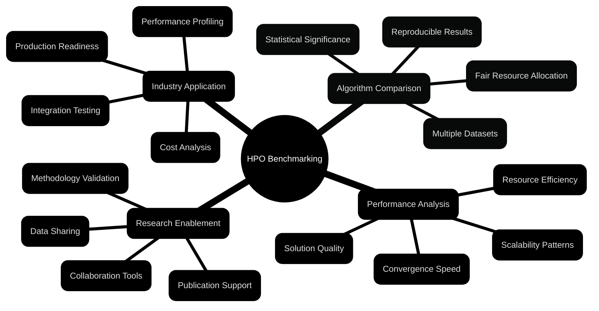

# Benchmarking Practices

> **Methodologies and best practices for HPO benchmarking platform**

---

## HPO Benchmarking Overview

### **Benchmarking Platform Goals**

Corvus Corone system was designed to enable:



### **Benchmarking Dimensions**

#### Performance Metrics
- **Solution Quality:** Best found objective function values
- **Convergence Rate:** Speed of convergence to optimum
- **Sample Efficiency:** Quality of results relative to number of evaluations
- **Robustness:** Stability of results across different seed values

#### Resource Metrics  
- **Time Efficiency:** Wall-clock time, CPU time, GPU time
- **Memory Usage:** Peak memory, average memory footprint
- **Energy Consumption:** Power usage during execution
- **Scalability:** Performance with different problem sizes

#### Reliability Metrics
- **Success Rate:** % runs that completed successfully
- **Reproducibility:** Consistency of results with identical settings
- **Fault Tolerance:** Resilience to system/data problems
- **Configuration Sensitivity:** Stability with respect to hyperparameters

---

## Benchmarking Methodology

### **Experimental Design Principles**

#### Controlled Experiments
```python
# Example configuration for controlled experiment
experiment_config = {
    \"name\": \"bayesian_vs_random_search\",
    \"description\": \"Statistical comparison of Bayesian optimization vs random search\",
    
    # Controlled variables
    \"algorithms\": [
        {\"id\": \"gaussian_process_bo\", \"version\": \"1.2.0\"},
        {\"id\": \"random_search\", \"version\": \"1.0.0\"}
    ],
    \"benchmarks\": [
        {\"dataset\": \"hartmann6d\", \"budget\": 200},
        {\"dataset\": \"branin\", \"budget\": 50},
        {\"dataset\": \"rosenbrock_10d\", \"budget\": 500}
    ],
    
    # Statistical rigor
    \"replications\": 50,  # Minimum for statistical significance
    \"random_seeds\": \"deterministic_sequence\",  # For reproducibility
    \"timeout\": 3600,  # Per-run timeout in seconds
    
    # Resource control  
    \"resource_limits\": {
        \"cpu_cores\": 1,
        \"memory_gb\": 4,
        \"gpu_count\": 0
    },
    
    # Analysis parameters
    \"confidence_level\": 0.95,
    \"effect_size_threshold\": 0.2,  # Cohen's d
    \"multiple_testing_correction\": \"holm_bonferroni\"
}
```

#### Randomization and Blocking
```python
# Proper randomization strategy
def generate_experiment_schedule(config):
    \"\"\"Generate randomized execution schedule to minimize systematic bias.\"\"\"
    
    runs = []
    for replication in range(config['replications']):
        for algorithm in config['algorithms']:
            for benchmark in config['benchmarks']:
                runs.append({
                    'replication': replication,
                    'algorithm': algorithm,
                    'benchmark': benchmark,
                    'seed': SEED_SEQUENCE[replication],  # Predetermined sequence
                    'priority': random.random()  # For execution order randomization
                })
    
    # Randomize execution order to avoid temporal effects
    runs.sort(key=lambda x: x['priority'])
    
    # Add blocking by computational requirements if needed
    runs = apply_resource_blocking(runs)
    
    return runs

def apply_resource_blocking(runs):
    \"\"\"Group runs by resource requirements to optimize cluster utilization.\"\"\"
    
    # Separate CPU-heavy vs GPU-heavy algorithms
    cpu_runs = [r for r in runs if not requires_gpu(r['algorithm'])]
    gpu_runs = [r for r in runs if requires_gpu(r['algorithm'])]
    
    # Randomize within blocks
    random.shuffle(cpu_runs)
    random.shuffle(gpu_runs)
    
    # Interleave blocks for better resource utilization
    return interleave_runs(cpu_runs, gpu_runs)
```

### **Benchmark Suite Design**

#### Problem Diversity Matrix
```yaml
Benchmark Categories:
  Synthetic Functions:
    - Unimodal: \"sphere\", \"quadratic\"
    - Multimodal: \"ackley\", \"rastrigin\"  
    - Noisy: \"sphere_noise\", \"branin_noise\"
    - High-dimensional: \"rosenbrock_50d\", \"ellipsoid_100d\"
    
  Real-world Problems:
    - ML Hyperparameters: \"neural_net_mnist\", \"svm_adult\", \"random_forest_wine\"
    - Engineering: \"antenna_design\", \"airfoil_optimization\"
    - Scientific: \"protein_folding\", \"materials_discovery\"
    
  Problem Characteristics:
    - Dimensionality: [2, 5, 10, 20, 50, 100+]
    - Budget: [25, 50, 100, 200, 500, 1000+] 
    - Evaluation Cost: [ms, s, min, hour]
    - Noise Level: [0%, 1%, 5%, 10%]
    - Constraint Type: [unconstrained, box, mixed_integer, non_linear]
```

#### Benchmark Implementation Standards
```python
# Standard benchmark interface
class BenchmarkFunction:
    \"\"\"Base class for all benchmark functions with required metadata.\"\"\"
    
    def __init__(self):
        # Required metadata for fair comparison
        self.metadata = {
            'name': self.get_name(),
            'dimensions': self.get_dimensions(),
            'bounds': self.get_bounds(),
            'optimum': self.get_global_optimum(),
            'characteristics': self.get_characteristics(),
            'references': self.get_references(),
            'computational_cost': self.estimate_cost()
        }
    
    def evaluate(self, x, seed=None):
        \"\"\"Evaluate function at point x with optional random seed.\"\"\"
        
        # Input validation
        self._validate_input(x)
        
        # Set seed for reproducibility if noise is involved
        if seed is not None and self.has_noise():
            np.random.seed(seed)
        
        # Actual evaluation with timing
        start_time = time.time()
        y = self._compute_function_value(x)
        eval_time = time.time() - start_time
        
        # Return structured result
        return {
            'y': y,
            'x': x.copy(),
            'evaluation_time': eval_time,
            'seed': seed,
            'metadata': self.metadata
        }
    
    @abstractmethod
    def _compute_function_value(self, x):
        \"\"\"Implement actual function computation.\"\"\"
        pass
    
    def get_characteristics(self):
        \"\"\"Return problem characteristics for algorithm selection.\"\"\"
        return {
            'modality': self._analyze_modality(),
            'separability': self._check_separability(), 
            'smoothness': self._assess_smoothness(),
            'noise_level': self._get_noise_level(),
            'constraint_type': self._get_constraint_type()
        }
```

---

## Statistical Analysis Framework

### **Performance Comparison Methods**

#### Significance Testing
```python
# Statistical comparison implementation
def compare_algorithms_statistically(results_df):
    \"\"\"Perform rigorous statistical comparison of algorithm performance.\"\"\"
    
    comparisons = []
    algorithms = results_df['algorithm'].unique()
    benchmarks = results_df['benchmark'].unique()
    
    for benchmark in benchmarks:
        benchmark_data = results_df[results_df['benchmark'] == benchmark]
        
        # Pairwise comparisons
        for i, alg1 in enumerate(algorithms):
            for alg2 in algorithms[i+1:]:
                
                data1 = benchmark_data[benchmark_data['algorithm'] == alg1]['best_value']
                data2 = benchmark_data[benchmark_data['algorithm'] == alg2]['best_value']
                
                # Check assumptions
                normality_p1 = stats.shapiro(data1)[1]
                normality_p2 = stats.shapiro(data2)[1]
                equal_var_p = stats.levene(data1, data2)[1]
                
                # Choose appropriate test
                if normality_p1 > 0.05 and normality_p2 > 0.05:
                    if equal_var_p > 0.05:
                        # Use t-test
                        stat, p_value = stats.ttest_ind(data1, data2)
                        test_used = 'ttest_ind'
                    else:
                        # Use Welch's t-test
                        stat, p_value = stats.ttest_ind(data1, data2, equal_var=False)
                        test_used = 'welch_ttest'
                else:
                    # Use Mann-Whitney U test (non-parametric)
                    stat, p_value = stats.mannwhitneyu(data1, data2, alternative='two-sided')
                    test_used = 'mannwhitneyu'
                
                # Effect size calculation
                if test_used.startswith('ttest'):
                    effect_size = cohen_d(data1, data2)
                    effect_measure = 'cohen_d'
                else:
                    effect_size = cliff_delta(data1, data2) 
                    effect_measure = 'cliff_delta'
                
                comparisons.append({
                    'benchmark': benchmark,
                    'algorithm_1': alg1,
                    'algorithm_2': alg2,
                    'test_statistic': stat,
                    'p_value': p_value,
                    'test_used': test_used,
                    'effect_size': effect_size,
                    'effect_measure': effect_measure,
                    'mean_1': data1.mean(),
                    'mean_2': data2.mean(),
                    'std_1': data1.std(),
                    'std_2': data2.std(),
                    'n_1': len(data1),
                    'n_2': len(data2)
                })
    
    comparison_df = pd.DataFrame(comparisons)
    
    # Multiple testing correction
    comparison_df['p_value_corrected'] = multipletests(
        comparison_df['p_value'], 
        method='holm'
    )[1]
    
    return comparison_df

def cohen_d(group1, group2):
    \"\"\"Calculate Cohen's d effect size.\"\"\"
    n1, n2 = len(group1), len(group2)
    pooled_std = np.sqrt(((n1-1)*group1.var() + (n2-1)*group2.var()) / (n1+n2-2))
    return (group1.mean() - group2.mean()) / pooled_std

def cliff_delta(group1, group2):
    \"\"\"Calculate Cliff's delta effect size (non-parametric).\"\"\"
    n1, n2 = len(group1), len(group2)
    pairs = [(x, y) for x in group1 for y in group2]
    wins = sum(1 for x, y in pairs if x > y)
    ties = sum(1 for x, y in pairs if x == y)
    return (wins - (n1*n2 - wins - ties)) / (n1 * n2)
```

#### Performance Profiles and Rankings
```python
def generate_performance_profiles(results_df):
    \"\"\"Generate performance profiles for algorithm comparison.\"\"\"
    
    # Calculate performance ratios
    profiles = {}
    algorithms = results_df['algorithm'].unique()
    benchmarks = results_df['benchmark'].unique()
    
    for benchmark in benchmarks:
        benchmark_data = results_df[results_df['benchmark'] == benchmark]
        
        # Find best performance for this benchmark
        best_scores = benchmark_data.groupby('algorithm')['best_value'].mean()
        overall_best = best_scores.min()  # Assuming minimization
        
        # Calculate performance ratios
        ratios = best_scores / overall_best
        
        for algorithm in algorithms:
            if algorithm not in profiles:
                profiles[algorithm] = []
            profiles[algorithm].append(ratios[algorithm])
    
    # Generate cumulative distribution for performance profiles
    tau_values = np.linspace(1.0, 10.0, 100)
    profile_data = {}
    
    for algorithm in algorithms:
        ratios = np.array(profiles[algorithm])
        profile_values = []
        
        for tau in tau_values:
            # Fraction of problems where algorithm is within factor tau of best
            fraction = np.mean(ratios <= tau)
            profile_values.append(fraction)
        
        profile_data[algorithm] = {
            'tau': tau_values,
            'rho': profile_values,
            'auc': np.trapz(profile_values, tau_values)  # Area under curve
        }
    
    return profile_data

def compute_algorithm_rankings(results_df):
    \"\"\"Compute various ranking methods for algorithm comparison.\"\"\"
    
    rankings = {}
    algorithms = results_df['algorithm'].unique()
    benchmarks = results_df['benchmark'].unique()
    
    # Average rank across benchmarks
    rank_matrix = []
    for benchmark in benchmarks:
        benchmark_data = results_df[results_df['benchmark'] == benchmark]
        mean_performance = benchmark_data.groupby('algorithm')['best_value'].mean()
        ranks = mean_performance.rank(method='average')  # Handle ties properly
        rank_matrix.append(ranks)
    
    rank_df = pd.DataFrame(rank_matrix, columns=algorithms, index=benchmarks)
    
    rankings['average_rank'] = rank_df.mean().sort_values()
    rankings['median_rank'] = rank_df.median().sort_values()
    rankings['rank_variance'] = rank_df.var().sort_values()
    
    # Borda count (tournament-style ranking)
    borda_scores = {}
    for i, alg1 in enumerate(algorithms):
        score = 0
        for alg2 in algorithms:
            if alg1 != alg2:
                # Count wins across all benchmarks
                wins = 0
                for benchmark in benchmarks:
                    data1 = results_df[(results_df['algorithm'] == alg1) & 
                                     (results_df['benchmark'] == benchmark)]['best_value']
                    data2 = results_df[(results_df['algorithm'] == alg2) & 
                                     (results_df['benchmark'] == benchmark)]['best_value']
                    if data1.mean() < data2.mean():  # Assuming minimization
                        wins += 1
                score += wins
        borda_scores[alg1] = score
    
    rankings['borda_count'] = pd.Series(borda_scores).sort_values(ascending=False)
    
    return rankings
```

### **Visualization Standards**

#### Performance comparison plots
```python
def create_performance_comparison_plots(results_df, output_dir):
    \"\"\"Generate standardized performance comparison visualizations.\"\"\"
    
    # 1. Convergence plots with confidence intervals
    fig, axes = plt.subplots(2, 2, figsize=(15, 12))
    
    algorithms = results_df['algorithm'].unique()
    benchmarks = results_df['benchmark'].unique()[:4]  # Show top 4 benchmarks
    
    for i, benchmark in enumerate(benchmarks):
        ax = axes[i//2, i%2]
        
        for algorithm in algorithms:
            data = results_df[(results_df['algorithm'] == algorithm) & 
                            (results_df['benchmark'] == benchmark)]
            
            # Group by evaluation number and compute statistics
            convergence = data.groupby('evaluation').agg({
                'current_best': ['mean', 'std', 'count']
            }).reset_index()
            
            evals = convergence['evaluation']
            means = convergence[('current_best', 'mean')]
            stds = convergence[('current_best', 'std')]
            counts = convergence[('current_best', 'count')]
            
            # Confidence intervals
            ci = 1.96 * stds / np.sqrt(counts)  # 95% CI
            
            ax.plot(evals, means, label=algorithm, linewidth=2)
            ax.fill_between(evals, means - ci, means + ci, alpha=0.2)
        
        ax.set_xlabel('Function Evaluations')
        ax.set_ylabel('Best Value Found')
        ax.set_title(f'{benchmark}')
        ax.legend()
        ax.grid(True, alpha=0.3)
        ax.set_yscale('log')
    
    plt.tight_layout()
    plt.savefig(f'{output_dir}/convergence_plots.pdf', dpi=300, bbox_inches='tight')
    
    # 2. Performance profiles
    profiles = generate_performance_profiles(results_df)
    
    plt.figure(figsize=(10, 6))
    for algorithm, data in profiles.items():
        plt.plot(data['tau'], data['rho'], label=f\"{algorithm} (AUC: {data['auc']:.2f})\", 
                linewidth=2)
    
    plt.xlabel('Performance Ratio (τ)')
    plt.ylabel('Fraction of Problems (ρ)')
    plt.title('Performance Profiles')
    plt.legend()
    plt.grid(True, alpha=0.3)
    plt.xlim(1, 5)
    plt.ylim(0, 1)
    plt.savefig(f'{output_dir}/performance_profiles.pdf', dpi=300, bbox_inches='tight')
    
    # 3. Critical difference diagram (Nemenyi test)
    from scipy.stats import friedmanchisquare
    import Orange
    
    # Prepare data for critical difference analysis
    rank_matrix = []
    for benchmark in benchmarks:
        benchmark_data = results_df[results_df['benchmark'] == benchmark]
        mean_performance = benchmark_data.groupby('algorithm')['best_value'].mean()
        ranks = mean_performance.rank(method='average')
        rank_matrix.append(ranks.values)
    
    # Perform Friedman test
    stat, p_value = friedmanchisquare(*np.array(rank_matrix).T)
    
    if p_value < 0.05:  # Significant difference exists
        # Calculate critical difference
        avg_ranks = np.mean(rank_matrix, axis=0)
        
        plt.figure(figsize=(12, 6))
        Orange.evaluation.graph_ranks(avg_ranks, algorithms, 
                                    cd=Orange.evaluation.compute_CD(avg_ranks, len(benchmarks)),
                                    width=6, textspace=1.5)
        plt.savefig(f'{output_dir}/critical_difference.pdf', dpi=300, bbox_inches='tight')
```

---

## Algorithm Evaluation Framework

### **Algorithm Characterization**

#### Meta-learning features
```python
class AlgorithmProfiler:
    \"\"\"Profile algorithm behavior across different problem types.\"\"\"
    
    def __init__(self):
        self.meta_features = [
            'convergence_speed', 'exploration_vs_exploitation', 
            'parameter_sensitivity', 'scalability_profile',
            'noise_robustness', 'constraint_handling'
        ]
    
    def profile_algorithm(self, algorithm_id, benchmark_results):
        \"\"\"Extract meta-learning features from algorithm performance.\"\"\"
        
        profile = {}
        
        # Convergence speed analysis
        profile['convergence_speed'] = self._analyze_convergence_speed(benchmark_results)
        
        # Exploration vs exploitation balance
        profile['exploration_balance'] = self._analyze_exploration_balance(benchmark_results)
        
        # Parameter sensitivity
        profile['parameter_sensitivity'] = self._analyze_parameter_sensitivity(algorithm_id)
        
        # Scalability with problem dimension
        profile['scalability_profile'] = self._analyze_scalability(benchmark_results)
        
        # Robustness to noise
        profile['noise_robustness'] = self._analyze_noise_robustness(benchmark_results)
        
        # Constraint handling capability
        profile['constraint_handling'] = self._analyze_constraint_handling(benchmark_results)
        
        return profile
    
    def _analyze_convergence_speed(self, results):
        \"\"\"Measure how quickly algorithm converges to good solutions.\"\"\"
        
        convergence_metrics = {}
        
        for benchmark in results['benchmark'].unique():
            bench_data = results[results['benchmark'] == benchmark]
            
            # Calculate convergence curve statistics
            convergence_curves = []
            for run_id in bench_data['run_id'].unique():
                run_data = bench_data[bench_data['run_id'] == run_id].sort_values('evaluation')
                best_so_far = run_data['objective_value'].cummin()
                convergence_curves.append(best_so_far.values)
            
            # Average convergence curve
            avg_curve = np.mean(convergence_curves, axis=0)
            
            # Metrics
            convergence_metrics[benchmark] = {
                'time_to_50_percent': self._time_to_percentage_of_optimum(avg_curve, 0.5),
                'time_to_90_percent': self._time_to_percentage_of_optimum(avg_curve, 0.9),
                'early_convergence_slope': np.polyfit(range(min(20, len(avg_curve))), 
                                                    avg_curve[:min(20, len(avg_curve))], 1)[0],
                'late_convergence_slope': np.polyfit(range(max(0, len(avg_curve)-20), len(avg_curve)), 
                                                   avg_curve[max(0, len(avg_curve)-20):], 1)[0]
            }
        
        return convergence_metrics
    
    def _analyze_exploration_balance(self, results):
        \"\"\"Analyze exploration vs exploitation behavior.\"\"\"
        
        balance_metrics = {}
        
        for benchmark in results['benchmark'].unique():
            bench_data = results[results['benchmark'] == benchmark]
            
            exploration_scores = []
            for run_id in bench_data['run_id'].unique():
                run_data = bench_data[bench_data['run_id'] == run_id].sort_values('evaluation')
                
                # Calculate diversity of evaluated points
                points = np.array([eval(pt) for pt in run_data['point_evaluated']])
                
                # Average pairwise distance (exploration measure)
                if len(points) > 1:
                    distances = pdist(points)
                    avg_distance = np.mean(distances)
                    
                    # Normalize by search space diagonal
                    bounds = self._get_benchmark_bounds(benchmark)
                    diagonal = np.sqrt(np.sum((bounds[:, 1] - bounds[:, 0])**2))
                    normalized_diversity = avg_distance / diagonal
                    
                    exploration_scores.append(normalized_diversity)
            
            balance_metrics[benchmark] = {
                'mean_exploration': np.mean(exploration_scores),
                'exploration_consistency': 1.0 / (1.0 + np.std(exploration_scores))
            }
        
        return balance_metrics
```

#### Algorithm recommendation system
```python
class AlgorithmRecommender:
    \"\"\"Recommend algorithms based on problem characteristics.\"\"\"
    
    def __init__(self, algorithm_profiles, benchmark_metadata):
        self.algorithm_profiles = algorithm_profiles
        self.benchmark_metadata = benchmark_metadata
        self.recommendation_model = self._train_recommendation_model()
    
    def recommend_algorithms(self, problem_description, top_k=3):
        \"\"\"Recommend top-k algorithms for a given problem.\"\"\"
        
        # Extract problem features
        problem_features = self._extract_problem_features(problem_description)
        
        # Score each algorithm
        algorithm_scores = {}
        for alg_id, profile in self.algorithm_profiles.items():
            score = self._calculate_compatibility_score(problem_features, profile)
            algorithm_scores[alg_id] = score
        
        # Rank algorithms
        ranked_algorithms = sorted(algorithm_scores.items(), 
                                 key=lambda x: x[1], reverse=True)
        
        recommendations = []
        for alg_id, score in ranked_algorithms[:top_k]:
            recommendations.append({
                'algorithm_id': alg_id,
                'compatibility_score': score,
                'reasoning': self._generate_recommendation_reasoning(
                    alg_id, problem_features, self.algorithm_profiles[alg_id]
                ),
                'expected_performance': self._predict_performance(
                    alg_id, problem_features
                )
            })
        
        return recommendations
    
    def _calculate_compatibility_score(self, problem_features, algorithm_profile):
        \"\"\"Calculate how well algorithm matches problem characteristics.\"\"\"
        
        score = 0.0
        
        # Dimension compatibility
        if problem_features['dimensionality'] <= 10:
            if algorithm_profile['scalability_profile']['low_dim_performance'] > 0.7:
                score += 0.3
        elif problem_features['dimensionality'] <= 50:
            if algorithm_profile['scalability_profile']['medium_dim_performance'] > 0.7:
                score += 0.3
        else:
            if algorithm_profile['scalability_profile']['high_dim_performance'] > 0.7:
                score += 0.3
        
        # Noise tolerance
        if problem_features['noise_level'] > 0.05:
            score += 0.2 * algorithm_profile['noise_robustness']['noise_tolerance']
        
        # Budget considerations
        if problem_features['evaluation_budget'] < 100:
            score += 0.2 * algorithm_profile['convergence_speed']['early_performance']
        else:
            score += 0.2 * algorithm_profile['convergence_speed']['asymptotic_performance']
        
        # Problem type matching
        problem_type = problem_features['problem_type']
        if problem_type in algorithm_profile['problem_type_performance']:
            score += 0.3 * algorithm_profile['problem_type_performance'][problem_type]
        
        return score
```

---

## Reproducibility Standards

### **Reproducibility Requirements**

#### Environment standardization
```yaml
# Reproducibility checklist for all experiments
Required Elements:
  Software Environment:
    - Algorithm version (exact git commit or release tag)
    - Library dependencies (requirements.txt with pinned versions)
    - Python/R version specification
    - Operating system and hardware specification
    - Containerized environment (Docker image digest)
    
  Random Number Generation:
    - Seed specification for all random components
    - Deterministic initialization procedures
    - Documentation of stochastic elements
    - Reproducible train/test splits
    
  Data Integrity:
    - Dataset checksums (MD5/SHA256)
    - Preprocessing pipeline documentation
    - Feature engineering code
    - Data versioning information
    
  Configuration Management:
    - Complete hyperparameter specification
    - Configuration file versioning
    - Default parameter documentation
    - Sensitivity analysis results
    
  Execution Environment:
    - Resource allocation (CPU/memory/GPU)
    - Execution timeout settings
    - Parallel execution handling
    - System load considerations
```

#### Reproducibility validation
```python
class ReproducibilityValidator:
    \"\"\"Validate experiment reproducibility.\"\"\"
    
    def __init__(self):
        self.tolerance_levels = {
            'identical': 1e-15,      # Bit-exact reproduction
            'numerical': 1e-10,      # Numerical precision limits
            'statistical': 0.05      # Statistical equivalence
        }
    
    def validate_reproduction(self, original_results, reproduced_results, 
                            tolerance_level='numerical'):
        \"\"\"Validate that reproduced results match original within tolerance.\"\"\"
        
        validation_report = {
            'overall_status': 'PASS',
            'tolerance_level': tolerance_level,
            'detailed_checks': [],
            'statistics': {}
        }
        
        tolerance = self.tolerance_levels[tolerance_level]
        
        # Check final objective values
        original_final = original_results.groupby('run_id')['best_value'].last()
        reproduced_final = reproduced_results.groupby('run_id')['best_value'].last()
        
        if tolerance_level in ['identical', 'numerical']:
            # Exact comparison
            abs_diff = np.abs(original_final - reproduced_final)
            exact_matches = (abs_diff <= tolerance).sum()
            
            validation_report['detailed_checks'].append({
                'check': 'final_objective_exact',
                'passed': exact_matches == len(original_final),
                'details': f'{exact_matches}/{len(original_final)} runs exactly reproduced'
            })
            
        elif tolerance_level == 'statistical':
            # Statistical comparison
            stat, p_value = stats.ttest_rel(original_final, reproduced_final)
            
            validation_report['detailed_checks'].append({
                'check': 'final_objective_statistical',
                'passed': p_value > 0.05,
                'details': f'Paired t-test p-value: {p_value:.6f}'
            })
        
        # Check convergence trajectories
        trajectory_match = self._compare_convergence_trajectories(
            original_results, reproduced_results, tolerance
        )
        validation_report['detailed_checks'].append(trajectory_match)
        
        # Check algorithm behavior patterns
        behavior_match = self._compare_algorithm_behavior(
            original_results, reproduced_results, tolerance_level
        )
        validation_report['detailed_checks'].append(behavior_match)
        
        # Overall status
        all_passed = all(check['passed'] for check in validation_report['detailed_checks'])
        validation_report['overall_status'] = 'PASS' if all_passed else 'FAIL'
        
        return validation_report
    
    def generate_reproducibility_report(self, experiment_id):
        \"\"\"Generate comprehensive reproducibility report.\"\"\"
        
        report = {
            'experiment_id': experiment_id,
            'timestamp': datetime.utcnow().isoformat(),
            'environment': self._capture_environment_info(),
            'data_integrity': self._verify_data_integrity(experiment_id),
            'configuration': self._verify_configuration_completeness(experiment_id),
            'reproducibility_score': None,
            'recommendations': []
        }
        
        # Calculate reproducibility score
        score_components = {
            'environment_complete': report['environment']['completeness_score'],
            'data_verified': report['data_integrity']['verification_score'],
            'config_complete': report['configuration']['completeness_score']
        }
        
        report['reproducibility_score'] = np.mean(list(score_components.values()))
        
        # Generate recommendations
        if report['reproducibility_score'] < 0.9:
            report['recommendations'] = self._generate_reproducibility_recommendations(
                report
            )
        
        return report
```

---

## Resource Management

### **Computational Resource Optimization**

#### Resource allocation strategies
```python
class ResourceOptimizer:
    \"\"\"Optimize resource allocation for benchmark experiments.\"\"\"
    
    def __init__(self, cluster_config):
        self.cluster_config = cluster_config
        self.resource_history = []
        self.algorithm_profiles = {}
    
    def optimize_resource_allocation(self, experiment_queue):
        \"\"\"Optimize resource allocation across queued experiments.\"\"\"
        
        allocations = []
        available_resources = self.cluster_config.copy()
        
        # Sort experiments by priority and resource efficiency
        prioritized_queue = self._prioritize_experiments(experiment_queue)
        
        for experiment in prioritized_queue:
            # Estimate resource requirements
            estimated_resources = self._estimate_resource_needs(experiment)
            
            # Check resource availability
            if self._can_allocate(estimated_resources, available_resources):
                allocation = self._allocate_resources(experiment, estimated_resources)
                allocations.append(allocation)
                
                # Update available resources
                available_resources = self._update_available_resources(
                    available_resources, allocation
                )
            else:
                # Queue for later execution
                allocations.append({
                    'experiment_id': experiment['id'],
                    'status': 'queued',
                    'estimated_wait_time': self._estimate_wait_time(experiment)
                })
        
        return allocations
    
    def _estimate_resource_needs(self, experiment):
        \"\"\"Estimate CPU, memory, and time requirements for experiment.\"\"\"
        
        algorithm_id = experiment['algorithm']['id']
        benchmark_set = experiment['benchmarks']
        
        # Base resource requirements from algorithm profile
        if algorithm_id in self.algorithm_profiles:
            base_cpu = self.algorithm_profiles[algorithm_id]['avg_cpu_usage']
            base_memory = self.algorithm_profiles[algorithm_id]['avg_memory_usage']
            base_time = self.algorithm_profiles[algorithm_id]['avg_execution_time']
        else:
            # Conservative defaults for unknown algorithms
            base_cpu = 1.0
            base_memory = 4.0  # GB
            base_time = 3600  # seconds
        
        # Scale based on benchmark complexity
        complexity_multiplier = self._calculate_benchmark_complexity(benchmark_set)
        
        # Scale based on replication count
        replication_multiplier = experiment.get('replications', 1)
        
        estimated_resources = {
            'cpu_cores': min(base_cpu * complexity_multiplier, 
                           self.cluster_config['max_cpu_per_job']),
            'memory_gb': base_memory * complexity_multiplier * 1.2,  # 20% buffer
            'estimated_time_hours': (base_time * complexity_multiplier * 
                                   replication_multiplier) / 3600,
            'gpu_count': self._estimate_gpu_needs(algorithm_id, benchmark_set)
        }
        
        return estimated_resources
    
    def _calculate_benchmark_complexity(self, benchmark_set):
        \"\"\"Calculate relative complexity of benchmark set.\"\"\"
        
        complexity_score = 0
        
        for benchmark in benchmark_set:
            # Dimension complexity
            dims = benchmark.get('dimensions', 10)
            dim_score = min(dims / 10.0, 5.0)  # Cap at 5x
            
            # Budget complexity  
            budget = benchmark.get('budget', 100)
            budget_score = min(budget / 100.0, 10.0)  # Cap at 10x
            
            # Problem type complexity
            problem_type = benchmark.get('type', 'synthetic')
            type_multipliers = {
                'synthetic': 1.0,
                'ml_hyperparams': 2.0,
                'engineering': 3.0,
                'scientific': 4.0
            }
            type_score = type_multipliers.get(problem_type, 2.0)
            
            benchmark_complexity = dim_score * budget_score * type_score
            complexity_score += benchmark_complexity
        
        # Average complexity across benchmarks
        return complexity_score / len(benchmark_set) if benchmark_set else 1.0
```

#### Auto-scaling and load balancing
```python
class AutoScaler:
    \"\"\"Automatically scale resources based on experiment demand.\"\"\"
    
    def __init__(self, min_workers=1, max_workers=20):
        self.min_workers = min_workers
        self.max_workers = max_workers
        self.current_workers = min_workers
        self.scaling_history = []
        
    def evaluate_scaling_needs(self, queue_metrics, performance_metrics):
        \"\"\"Evaluate whether to scale up or down based on current load.\"\"\"
        
        current_time = datetime.utcnow()
        
        # Key metrics for scaling decisions
        queue_length = queue_metrics['pending_experiments']
        avg_wait_time = queue_metrics['avg_wait_time_minutes']
        worker_utilization = performance_metrics['avg_worker_utilization']
        failed_jobs_rate = performance_metrics['failed_jobs_rate_1h']
        
        # Scaling decision logic
        scaling_decision = {
            'action': 'hold',
            'target_workers': self.current_workers,
            'reasoning': [],
            'confidence': 0.5
        }
        
        # Scale up conditions
        if queue_length > self.current_workers * 5:  # Queue backing up
            scaling_decision['action'] = 'scale_up'
            scaling_decision['target_workers'] = min(
                self.current_workers + max(2, queue_length // 10),
                self.max_workers
            )
            scaling_decision['reasoning'].append('Queue length exceeds threshold')
            scaling_decision['confidence'] += 0.3
            
        elif avg_wait_time > 30 and worker_utilization > 0.8:  # High utilization
            scaling_decision['action'] = 'scale_up'
            scaling_decision['target_workers'] = min(
                self.current_workers + 2,
                self.max_workers
            )
            scaling_decision['reasoning'].append('High wait times with high utilization')
            scaling_decision['confidence'] += 0.2
        
        # Scale down conditions  
        elif worker_utilization < 0.3 and queue_length < self.current_workers:
            if self.current_workers > self.min_workers:
                scaling_decision['action'] = 'scale_down'
                scaling_decision['target_workers'] = max(
                    self.current_workers - 1,
                    self.min_workers
                )
                scaling_decision['reasoning'].append('Low utilization with small queue')
                scaling_decision['confidence'] += 0.2
        
        # Safety checks
        if failed_jobs_rate > 0.1:  # High failure rate
            scaling_decision['action'] = 'hold'
            scaling_decision['reasoning'].append('High failure rate - investigating issues')
            scaling_decision['confidence'] = 0.1
        
        # Record scaling decision
        self.scaling_history.append({
            'timestamp': current_time,
            'decision': scaling_decision,
            'metrics': {
                'queue_length': queue_length,
                'avg_wait_time': avg_wait_time,
                'worker_utilization': worker_utilization,
                'failed_jobs_rate': failed_jobs_rate,
                'current_workers': self.current_workers
            }
        })
        
        return scaling_decision
```

---

## Quality Assurance

### **Experiment Validation Pipeline**

#### Pre-execution validation
```python
class ExperimentValidator:
    \"\"\"Validate experiments before execution to catch issues early.\"\"\"
    
    def __init__(self):
        self.validation_rules = [
            self._validate_algorithm_availability,
            self._validate_benchmark_configuration,
            self._validate_resource_requirements,
            self._validate_statistical_design,
            self._validate_reproducibility_settings
        ]
    
    def validate_experiment(self, experiment_config):
        \"\"\"Run complete validation pipeline on experiment configuration.\"\"\"
        
        validation_results = {
            'experiment_id': experiment_config.get('id'),
            'overall_status': 'PENDING',
            'validation_checks': [],
            'warnings': [],
            'errors': [],
            'estimated_cost': None
        }
        
        # Run all validation rules
        for validation_rule in self.validation_rules:
            try:
                result = validation_rule(experiment_config)
                validation_results['validation_checks'].append(result)
                
                if result['status'] == 'ERROR':
                    validation_results['errors'].append(result)
                elif result['status'] == 'WARNING':
                    validation_results['warnings'].append(result)
                    
            except Exception as e:
                validation_results['errors'].append({
                    'check': validation_rule.__name__,
                    'status': 'ERROR',
                    'message': f'Validation rule failed: {str(e)}'
                })
        
        # Determine overall status
        if validation_results['errors']:
            validation_results['overall_status'] = 'FAILED'
        elif validation_results['warnings']:
            validation_results['overall_status'] = 'WARNING'
        else:
            validation_results['overall_status'] = 'PASSED'
        
        # Estimate execution cost
        if validation_results['overall_status'] in ['PASSED', 'WARNING']:
            validation_results['estimated_cost'] = self._estimate_execution_cost(
                experiment_config
            )
        
        return validation_results
    
    def _validate_algorithm_availability(self, config):
        \"\"\"Check if requested algorithms are available and compatible.\"\"\"
        
        result = {
            'check': 'algorithm_availability',
            'status': 'PASSED',
            'details': []
        }
        
        for algorithm in config.get('algorithms', []):
            alg_id = algorithm.get('id')
            alg_version = algorithm.get('version')
            
            # Check algorithm exists
            if not self._algorithm_exists(alg_id):
                result['status'] = 'ERROR'
                result['details'].append(f'Algorithm {alg_id} not found')
                continue
            
            # Check version compatibility
            available_versions = self._get_algorithm_versions(alg_id)
            if alg_version and alg_version not in available_versions:
                result['status'] = 'WARNING'
                result['details'].append(
                    f'Algorithm {alg_id} version {alg_version} not available. '
                    f'Available versions: {available_versions}'
                )
            
            # Check resource requirements
            algorithm_requirements = self._get_algorithm_requirements(alg_id)
            if algorithm_requirements.get('requires_gpu') and not self._gpu_available():
                result['status'] = 'WARNING'
                result['details'].append(f'Algorithm {alg_id} requires GPU but none available')
        
        return result
    
    def _validate_statistical_design(self, config):
        \"\"\"Validate statistical rigor of experiment design.\"\"\"
        
        result = {
            'check': 'statistical_design',
            'status': 'PASSED',
            'details': []
        }
        
        # Check replication count
        replications = config.get('replications', 1)
        if replications < 10:
            result['status'] = 'WARNING'
            result['details'].append(
                f'Low replication count ({replications}). Recommend ≥10 for statistical power'
            )
        
        # Check budget adequacy
        for benchmark in config.get('benchmarks', []):
            budget = benchmark.get('budget', 0)
            dimensions = benchmark.get('dimensions', 0)
            
            # Rule of thumb: budget should be at least 10x dimensions
            if budget < dimensions * 10:
                result['status'] = 'WARNING'
                result['details'].append(
                    f\"Benchmark {benchmark.get('name')} may have insufficient budget \"
                    f\"({budget}) for {dimensions}D problem\"
                )
        
        # Check algorithm count for comparison
        algorithm_count = len(config.get('algorithms', []))
        if algorithm_count < 2:
            result['status'] = 'WARNING'
            result['details'].append(
                'Single algorithm experiment. Consider adding baseline for comparison'
            )
        
        return result
```

#### Post-execution quality checks
```python
class ResultValidator:
    \"\"\"Validate experiment results for quality and consistency.\"\"\"
    
    def validate_experiment_results(self, experiment_id):
        \"\"\"Comprehensive validation of experiment results.\"\"\"
        
        # Load experiment results
        results = self._load_experiment_results(experiment_id)
        
        validation_report = {
            'experiment_id': experiment_id,
            'validation_timestamp': datetime.utcnow().isoformat(),
            'data_quality_score': 0.0,
            'completeness_score': 0.0,
            'consistency_score': 0.0,
            'overall_quality_score': 0.0,
            'issues_found': [],
            'recommendations': []
        }
        
        # Data quality checks
        validation_report['data_quality_score'] = self._assess_data_quality(results)
        
        # Completeness checks
        validation_report['completeness_score'] = self._assess_completeness(results)
        
        # Consistency checks
        validation_report['consistency_score'] = self._assess_consistency(results)
        
        # Overall quality score
        validation_report['overall_quality_score'] = np.mean([
            validation_report['data_quality_score'],
            validation_report['completeness_score'], 
            validation_report['consistency_score']
        ])
        
        # Generate recommendations based on issues found
        if validation_report['overall_quality_score'] < 0.8:
            validation_report['recommendations'] = self._generate_quality_recommendations(
                validation_report
            )
        
        return validation_report
    
    def _assess_data_quality(self, results):
        \"\"\"Assess quality of experimental data.\"\"\"
        
        quality_score = 1.0
        issues = []
        
        # Check for missing values
        missing_fraction = results.isnull().sum().sum() / (results.shape[0] * results.shape[1])
        if missing_fraction > 0.01:  # More than 1% missing
            quality_score -= 0.2
            issues.append(f'High missing data rate: {missing_fraction:.2%}')
        
        # Check for outliers in objective values
        for column in ['best_value', 'final_value']:
            if column in results.columns:
                values = results[column].dropna()
                z_scores = np.abs(stats.zscore(values))
                outlier_fraction = (z_scores > 3).sum() / len(values)
                
                if outlier_fraction > 0.05:  # More than 5% outliers
                    quality_score -= 0.1
                    issues.append(f'High outlier rate in {column}: {outlier_fraction:.2%}')
        
        # Check for convergence issues
        if 'converged' in results.columns:
            convergence_rate = results['converged'].mean()
            if convergence_rate < 0.8:  # Less than 80% converged
                quality_score -= 0.3
                issues.append(f'Low convergence rate: {convergence_rate:.2%}')
        
        # Check execution time consistency
        if 'execution_time' in results.columns:
            times = results['execution_time'].dropna()
            cv = times.std() / times.mean()  # Coefficient of variation
            if cv > 1.0:  # High variability
                quality_score -= 0.1
                issues.append(f'High execution time variability: CV={cv:.2f}')
        
        self.issues_found.extend(issues)
        return max(0.0, quality_score)
```

---

## Related Documents

- **Architecture**: [Context (C4-1)](../architecture/c1-context.md), [Containers (C4-2)](../architecture/c2-containers.md), [Components (C4-3)](../architecture/c3-components.md)
- **Operations**: [Monitoring Guide](../operations/monitoring-guide.md), [Deployment Guide](../operations/deployment-guide.md)
- **Requirements**: [Functional Requirements](../requirements/functional-requirements.md), [Use Cases](../requirements/use-cases.md)
- **User Guides**: [Workflows](../user-guides/workflows.md)
- **Design**: [Design Decisions](../design/design-decisions.md)
