# Use Cases

> **Usage scenarios for the HPO Benchmarking Platform system**

---

## Use Cases Overview

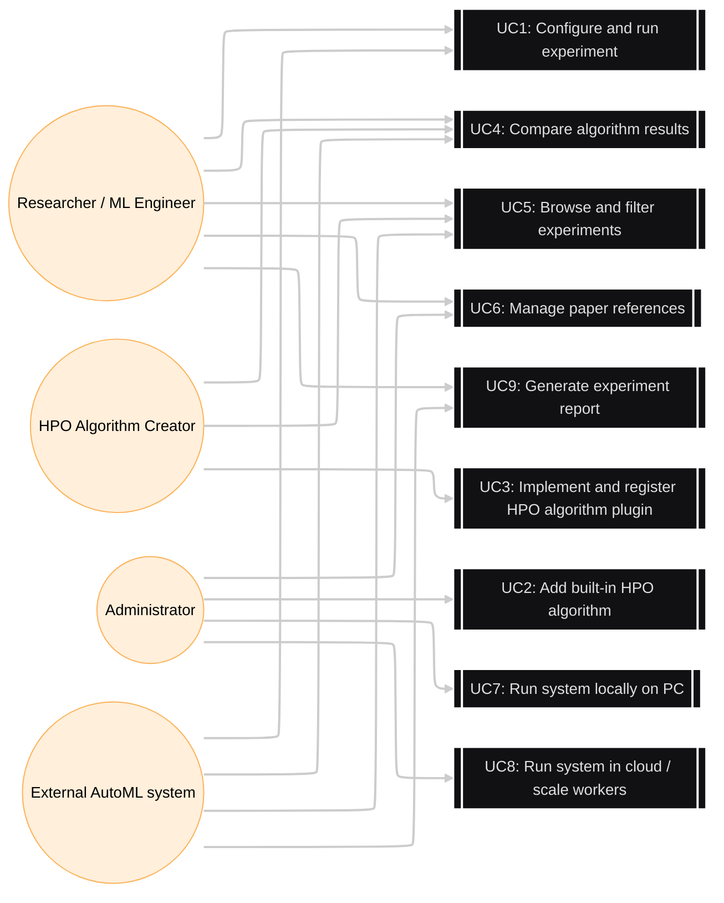
```mermaid
---
config:
  layout: elk
  theme: redux-dark
---
flowchart LR
    A1(("Researcher / ML Engineer")) --> UC1[["UC1: Configure and run experiment"]] & UC4[["UC4: Compare algorithm results"]] & UC5[["UC5: Browse and filter experiments"]] & UC6[["UC6: Manage paper references"]] & UC9[["UC9: Generate experiment report"]]
    A2(("HPO Algorithm Creator")) --> UC3[["UC3: Implement and register HPO algorithm plugin"]] & UC4 & UC5
    A3(("Administrator")) --> UC2[["UC2: Add built-in HPO algorithm"]] & UC6 & UC7[["UC7: Run system locally on PC"]] & UC8[["UC8: Run system in cloud / scale workers"]]
    A4(("External AutoML system")) --> UC1 & UC4 & UC5 & UC9
     A1:::Peach
     A2:::Peach
     A3:::Peach
     A4:::Peach
    classDef Peach stroke-width:1px, stroke-dasharray:none, stroke:#FBB35A, fill:#FFEFDB, color:#8F632D
    style A1 color:#000000
    style A2 color:#000000
    style A3 color:#000000
    style A4 color:#000000
```

---

## UC1: Configure and run benchmark experiment

### Basic information

| Property | Value |
|----------|-------|
| **Primary actors** | Researcher / ML Engineer |
| **Supporting actors** | System (Orchestrator, Benchmark Definition, Algorithm Registry, Tracking) |
| **Goal** | Create benchmark experiment, define run plan, execute and save results |
| **Level** | User goal |
| **Complexity** | Medium |

### Preconditions
- Registered benchmarks and HPO algorithms exist (built-in or plugins)
- User is logged in and has permissions to create experiments
- System is available and operational

### Main scenario

1. **Experiment initiation**
   - A1 opens Web UI – "New experiment" section
   - System retrieves benchmark list from Benchmark Definition Service

2. **Benchmark configuration**
   - A1 selects one or more benchmarks and problem instances
   - System displays details of selected benchmarks (datasets, metrics)

3. **Algorithm selection**
   - System retrieves list of available algorithms from Algorithm Registry
   - A1 selects algorithms and configures their parameters/HPO budget limits

4. **Goal definition**
   - A1 defines experiment goals (G1–G5) and metrics
   - A1 sets retry policies, timeouts, priorities

5. **Configuration save**
   - A1 saves experiment configuration
   - API Gateway passes configuration to Experiment Orchestrator

6. **Validation**
   - Orchestrator validates configuration (Benchmark Definition, Algorithm Registry)
   - System checks algorithm compatibility with benchmarks

7. **Experiment creation**
   - Orchestrator creates run plan and saves experiment in Experiment Tracking Service
   - Unique experiment_id is generated

8. **Execution**
   - A1 starts experiment ("Run" button)
   - Orchestrator sends run tasks to Message Broker

9. **Processing**
   - Workers retrieve tasks, execute runs
   - Workers report metrics and logs to Tracking Service in real-time

10. **Completion**
    - Orchestrator updates experiment status
    - A1 receives completion notification

### Alternative scenarios

#### 1A. Configuration validation failed
1. In step 6 Orchestrator detects incompatibility (e.g. algorithm requires GPU, but benchmark doesn't support GPU)
2. System returns detailed error report with codes: `INCOMPATIBLE_ALGORITHM`, `INSUFFICIENT_RESOURCES`, `INVALID_PARAMETER_SPACE`
3. Web UI displays errors with suggested fixes
4. A1 corrects configuration and retries from step 5

#### 1B. No available workers
1. In step 8 Message Broker accepts tasks, but no Workers are available
2. Orchestrator detects lack of active queue consumers after timeout (30s)
3. System informs A1: "Experiment scheduled, but no available workers"
4. A1 can: cancel experiment, start additional workers, or wait

#### 1C. Run failed during execution
1. In step 9 Worker encounters error (out of memory, plugin error, timeout)
2. Worker logs detailed error to Tracking Service
3. Orchestrator receives `RunFailed` event and checks retry policy
4. System automatically retries or marks run as failed

### Postconditions
- Experiment has status `COMPLETED` or `FAILED`
- All runs have metrics and logs saved in Tracking Service
- Data is ready for analysis (UC4)

### Diagrams

#### Activity Diagram
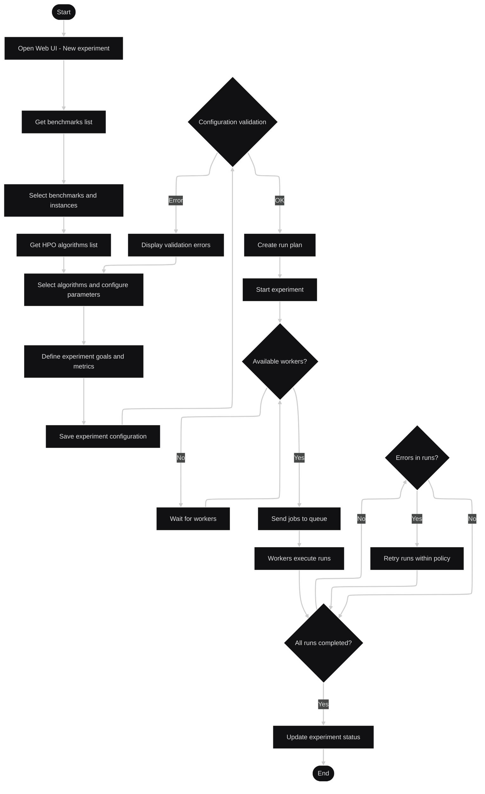
```mermaid
---
config:
  layout: elk
  theme: redux-dark
---
flowchart TB
    Start(["Start"]) --> OpenUI["Open Web UI - New experiment"]
    OpenUI --> GetBenchmarks["Get benchmarks list"]
    GetBenchmarks --> SelectBenchmarks["Select benchmarks and instances"]
    SelectBenchmarks --> GetAlgorithms["Get HPO algorithms list"]
    GetAlgorithms --> SelectAlgorithms["Select algorithms and configure parameters"]
    SelectAlgorithms --> DefineGoals["Define experiment goals and metrics"]
    DefineGoals --> SaveConfig["Save experiment configuration"]
    SaveConfig --> ValidateConfig{"Configuration validation"}
    ValidateConfig -- Error --> ShowErrors["Display validation errors"]
    ShowErrors --> SelectAlgorithms
    ValidateConfig -- OK --> CreatePlan["Create run plan"]
    CreatePlan --> StartExperiment["Start experiment"]
    StartExperiment --> CheckWorkers{"Available workers?"}
    CheckWorkers -- No --> WaitWorkers["Wait for workers"]
    WaitWorkers --> CheckWorkers
    CheckWorkers -- Yes --> SendJobs["Send jobs to queue"]
    SendJobs --> ExecuteRuns["Workers execute runs"]
    ExecuteRuns --> MonitorRuns{"All runs completed?"}
    MonitorRuns -- No --> HandleErrors{"Errors in runs?"}
    HandleErrors -- Yes --> RetryRuns["Retry runs within policy"]
    RetryRuns --> MonitorRuns
    HandleErrors -- No --> MonitorRuns
    MonitorRuns -- Yes --> UpdateStatus["Update experiment status"]
    UpdateStatus --> End(["End"])
```

#### Sequence Diagram - Main Scenario
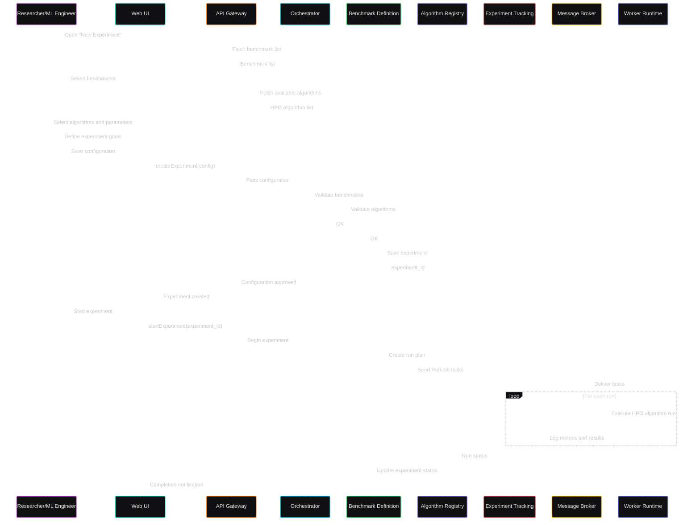
```mermaid
---
config:
  theme: redux-dark-color
---
sequenceDiagram
    participant A1 as Researcher/ML Engineer
    participant UI as Web UI
    participant API as API Gateway
    participant ORC as Orchestrator
    participant BDS as Benchmark Definition
    participant AR as Algorithm Registry
    participant ETS as Experiment Tracking
    participant MB as Message Broker
    participant WR as Worker Runtime
    
    A1->>UI: Open "New Experiment"
    UI->>BDS: Fetch benchmark list
    BDS-->>UI: Benchmark list
    A1->>UI: Select benchmarks
    UI->>AR: Fetch available algorithms
    AR-->>UI: HPO algorithm list
    A1->>UI: Select algorithms and parameters
    A1->>UI: Define experiment goals
    A1->>UI: Save configuration
    UI->>API: createExperiment(config)
    API->>ORC: Pass configuration
    ORC->>BDS: Validate benchmarks
    ORC->>AR: Validate algorithms
    BDS-->>ORC: OK
    AR-->>ORC: OK
    ORC->>ETS: Save experiment
    ETS-->>ORC: experiment_id
    ORC-->>API: Configuration approved
    API-->>UI: Experiment created
    A1->>UI: Start experiment
    UI->>API: startExperiment(experiment_id)
    API->>ORC: Begin experiment
    ORC->>ETS: Create run plan
    ORC->>MB: Send RunJob tasks
    MB-->>WR: Deliver tasks
    loop For each run
        WR->>WR: Execute HPO algorithm run
        WR->>ETS: Log metrics and results
    end
    WR-->>ORC: Run status
    ORC->>ETS: Update experiment status
    ORC-->>A1: Completion notification
```

#### Sequence Diagram - Alternative Scenario - Validation Error
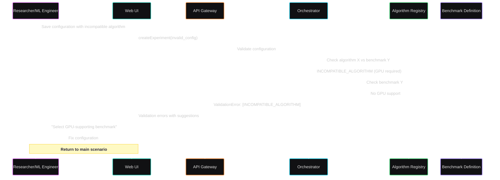
```mermaid
---
config:
  theme: redux-dark-color
---
sequenceDiagram
    participant A1 as Researcher/ML Engineer
    participant UI as Web UI
    participant API as API Gateway
    participant ORC as Orchestrator
    participant AR as Algorithm Registry
    participant BDS as Benchmark Definition
    A1->>UI: Save configuration with incompatible algorithm
    UI->>API: createExperiment(invalid_config)
    API->>ORC: Validate configuration
    ORC->>AR: Check algorithm X vs benchmark Y
    AR-->>ORC: INCOMPATIBLE_ALGORITHM (GPU required)
    ORC->>BDS: Check benchmark Y
    BDS-->>ORC: No GPU support
    ORC-->>API: ValidationError: [INCOMPATIBLE_ALGORITHM]
    API-->>UI: Validation errors with suggestions
    UI-->>A1: "Select GPU-supporting benchmark"
    A1->>UI: Fix configuration
    Note over A1,UI: Return to main scenario
```

---

## UC2: Add Built-in HPO Algorithm

### Basic Information

| Property | Value |
|----------|-------|
| **Primary actors** | Administrator |
| **Goal** | Adding a new built-in HPO algorithm to the system |
| **Level** | User goal |

### Main Scenario

1. **Algorithm preparation**
   - Administrator implements algorithm according to IAlgorithmPlugin interface
   - Prepares metadata: name, type, parameters, requirements

2. **System registration**
   - Administrator adds algorithm through Admin Panel
   - System validates implementation and compatibility

4. **Publication**
   - Algorithm receives `APPROVED` status
   - Becomes available to users in the catalog

### Diagrams

#### Activity Diagram

```mermaid
---
config:
  layout: elk
  theme: redux-dark
---
flowchart TB
    Start(["Start"]) --> OpenPanel["Open panel: HPO Algorithms"]
    OpenPanel --> ViewList["Display algorithms list"]
    ViewList --> SelectAdd["Select: Add built-in algorithm"]
    SelectAdd --> ShowForm["Display algorithm form"]
    ShowForm --> FillForm["Fill algorithm data"]
    FillForm --> ValidateUI{"UI Validation"}
    ValidateUI -- Error --> ShowUIErrors["Highlight error fields"]
    ShowUIErrors --> FillForm
    ValidateUI -- OK --> ConfirmSave["Confirm save"]
    ConfirmSave --> CheckPerms{"Check permissions"}
    CheckPerms -- None --> ShowAuthError["Display authorization error"]
    ShowAuthError --> End(["End"])
    CheckPerms -- OK --> ValidateMetadata{"Metadata validation"}
    ValidateMetadata -- Error --> ShowServerErrors["Display server errors"]
    ShowServerErrors --> FillForm
    ValidateMetadata -- OK --> CreateAlgorithm["Create Algorithm + AlgorithmVersion"]
    CreateAlgorithm --> CheckDOI{"Publications provided?"}
    CheckDOI -- No --> SaveSuccess["Display success"]
    CheckDOI -- Yes --> LinkPublications["Link publications"]
    LinkPublications --> PubSuccess{"Publications OK?"}
    PubSuccess -- Error --> PartialSuccess["Display partial success"]
    PubSuccess -- OK --> SaveSuccess
    SaveSuccess --> RefreshList["Refresh algorithm list"]
    RefreshList --> End
    PartialSuccess --> End
```

#### Sequence Diagram - Main Scenario
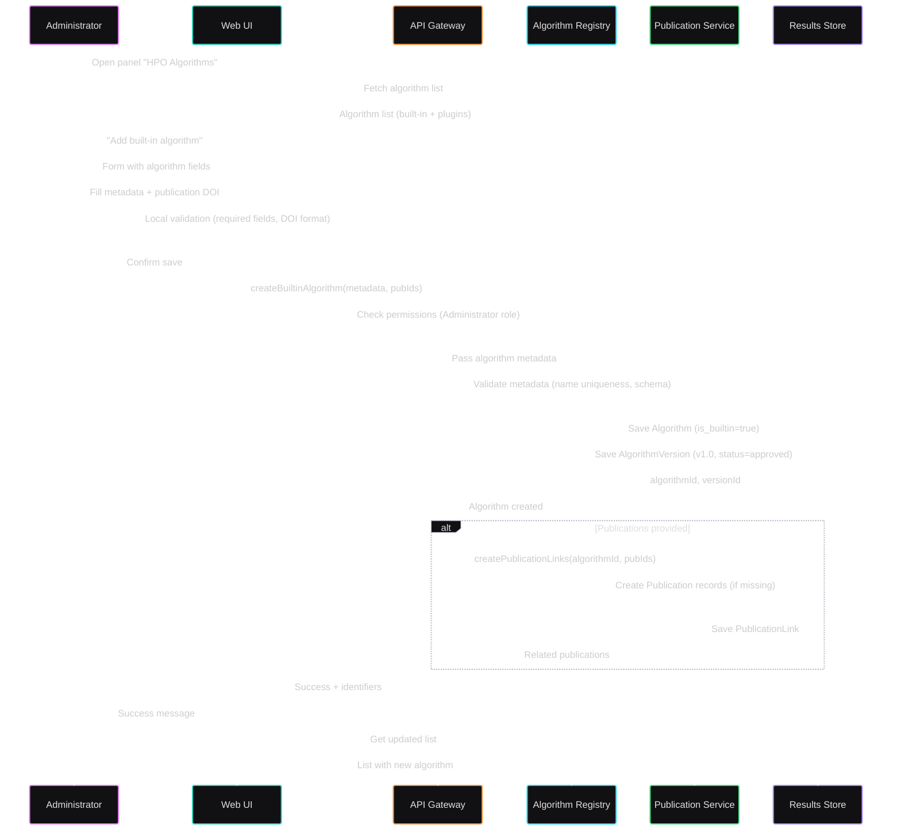
```mermaid
---
config:
  theme: redux-dark-color
---
sequenceDiagram
    participant A3 as Administrator
    participant UI as Web UI
    participant API as API Gateway
    participant AR as Algorithm Registry
    participant PS as Publication Service
    participant RS as Results Store
    A3->>UI: Open panel "HPO Algorithms"
    UI->>AR: Fetch algorithm list
    AR-->>UI: Algorithm list (built-in + plugins)
    A3->>UI: "Add built-in algorithm"
    UI-->>A3: Form with algorithm fields
    A3->>UI: Fill metadata + publication DOI
    UI->>UI: Local validation (required fields, DOI format)
    A3->>UI: Confirm save
    UI->>API: createBuiltinAlgorithm(metadata, pubIds)
    API->>API: Check permissions (Administrator role)
    API->>AR: Pass algorithm metadata
    AR->>AR: Validate metadata (name uniqueness, schema)
    AR->>RS: Save Algorithm (is_builtin=true)
    AR->>RS: Save AlgorithmVersion (v1.0, status=approved)
    RS-->>AR: algorithmId, versionId
    AR-->>API: Algorithm created
    alt Publications provided
        API->>PS: createPublicationLinks(algorithmId, pubIds)
        PS->>PS: Create Publication records (if missing)
        PS->>RS: Save PublicationLink
        PS-->>API: Related publications
    end
    API-->>UI: Success + identifiers
    UI-->>A3: Success message
    UI->>AR: Get updated list
    AR-->>UI: List with new algorithm
```

#### Sequence Diagram - Alternative Scenario - Validation Error
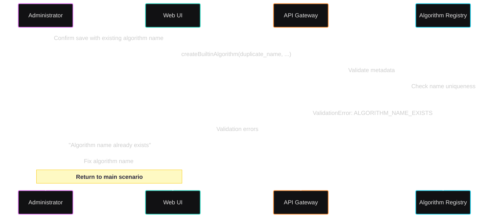
```mermaid
---
config:
  theme: redux-dark-color
---
sequenceDiagram
    participant A3 as Administrator
    participant UI as Web UI
    participant API as API Gateway
    participant AR as Algorithm Registry
    A3->>UI: Confirm save with existing algorithm name
    UI->>API: createBuiltinAlgorithm(duplicate_name, ...)
    API->>AR: Validate metadata
    AR->>AR: Check name uniqueness
    AR-->>API: ValidationError: ALGORITHM_NAME_EXISTS
    API-->>UI: Validation errors
    UI-->>A3: "Algorithm name already exists"
    A3->>UI: Fix algorithm name
    Note over A3,UI: Return to main scenario
```

---

## UC3: Implement and Register HPO Algorithm Plugin

### Basic Information

| Property | Value |
|----------|-------|
| **Primary actors** | HPO Algorithm Creator |
| **Goal** | Implementation and registration of custom algorithm as plugin |
| **Level** | User goal |

### Main Scenario

1. **Plugin implementation**
   - Creator uses Algorithm SDK to implement algorithm
   - Implements IAlgorithmPlugin interface

2. **Local testing**
   - Creator tests plugin locally using SDK

3. **Registration**
   - Creator submits plugin to system through Web UI
   - System performs validation and tests

4. **Approval**
   - Administrator reviews and approves plugin
   - Plugin becomes available to community

### Diagrams

#### Activity Diagram
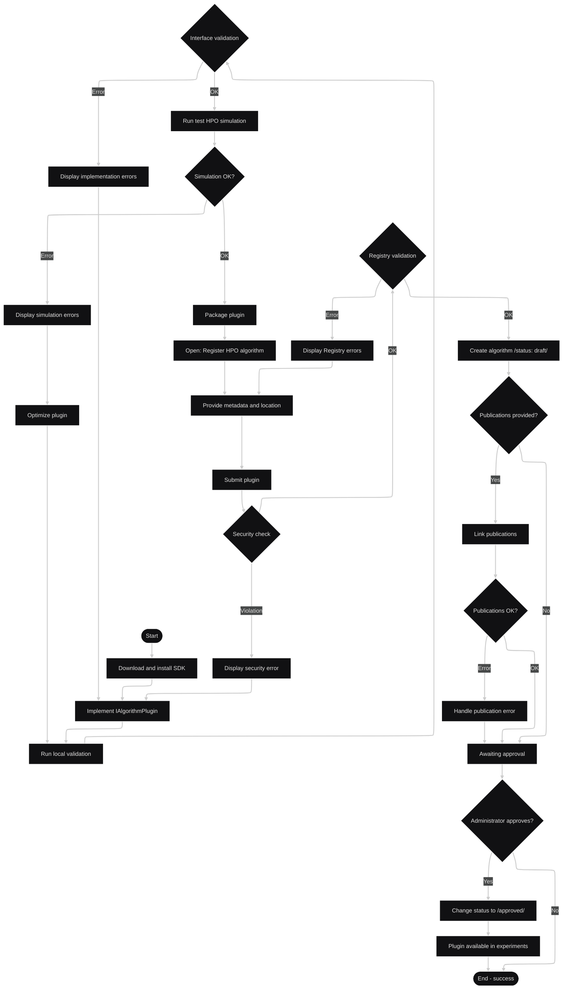
```mermaid
---
config:
  layout: elk
  theme: redux-dark
---
flowchart TB
    Start(["Start"]) --> InstallSDK["Download and install SDK"]
    InstallSDK --> ImplementPlugin["Implement IAlgorithmPlugin"]
    ImplementPlugin --> RunValidation["Run local validation"]
    RunValidation --> ValidateInterface{"Interface validation"}
    ValidateInterface -- Error --> ShowValidationErrors["Display implementation errors"]
    ShowValidationErrors --> ImplementPlugin
    ValidateInterface -- OK --> RunSimulation["Run test HPO simulation"]
    RunSimulation --> SimulationOK{"Simulation OK?"}
    SimulationOK -- Error --> ShowSimErrors["Display simulation errors"]
    ShowSimErrors --> OptimizePlugin["Optimize plugin"]
    OptimizePlugin --> RunValidation
    SimulationOK -- OK --> PackagePlugin["Package plugin"]
    PackagePlugin --> OpenRegistry["Open: Register HPO algorithm"]
    OpenRegistry --> FillMetadata["Provide metadata and location"]
    FillMetadata --> SubmitPlugin["Submit plugin"]
    SubmitPlugin --> CheckSecurity{"Security check"}
    CheckSecurity -- Violation --> ShowSecurityError["Display security error"]
    ShowSecurityError --> ImplementPlugin
    CheckSecurity -- OK --> ValidateRegistry{"Registry validation"}
    ValidateRegistry -- Error --> ShowRegistryErrors["Display Registry errors"]
    ShowRegistryErrors --> FillMetadata
    ValidateRegistry -- OK --> CreateDraft["Create algorithm /status: draft/"]
    CreateDraft --> CheckDOI{"Publications provided?"}
    CheckDOI -- Yes --> LinkPubs["Link publications"]
    LinkPubs --> PubsOK{"Publications OK?"}
    PubsOK -- Error --> HandlePubError["Handle publication error"]
    HandlePubError --> ApprovalPending["Awaiting approval"]
    PubsOK -- OK --> ApprovalPending
    CheckDOI -- No --> ApprovalPending
    ApprovalPending --> AdminApproval{"Administrator approves?"}
    AdminApproval -- Yes --> ChangeStatus["Change status to /approved/"]
    AdminApproval -- No --> End(["End - success"])
    ChangeStatus --> Available["Plugin available in experiments"]
    Available --> End
```

#### Sequence Diagram - Main Scenario

```mermaid
---
config:
  theme: redux-dark-color
---
sequenceDiagram
    participant A2 as HPO Algorithm Creator
    participant SDK as SDK/PluginValidator
    participant UI as Web UI
    participant API as API Gateway
    participant AR as Algorithm Registry
    participant PS as Publication Service
    participant A3 as Administrator
    A2->>SDK: pip install hpo-sdk
    A2->>A2: Implement IAlgorithmPlugin
    A2->>SDK: hpo-sdk validate
    SDK->>SDK: Check interface compatibility
    SDK->>SDK: Run test simulation
    SDK-->>A2: Validation report (SUCCESS)
    A2->>A2: Package plugin (wheel/docker)
    A2->>UI: Open "Register HPO algorithm"
    UI-->>A2: Registration form
    A2->>UI: Provide metadata + plugin location
    A2->>UI: Submit plugin
    UI->>API: registerPlugin(metadata, location, pubIds)
    API->>AR: Validate and save plugin
    AR->>AR: Check metadata, download package
    AR->>AR: Create Algorithm + AlgorithmVersion (draft)
    opt Publications provided
    AR->>PS: Link publications
    PS-->>AR: Related publications
    end
    AR-->>API: Plugin registered (draft)
    API-->>UI: Registration success
    UI-->>A2: "Plugin registered, awaiting approval"
    Note over A3: Administrator reviews plugin
    A3->>AR: Approve plugin
    AR->>AR: Change status to "approved"
    AR-->>A2: Approval notification
```

#### Sequence diagram - Alternative scenario - Local validation error
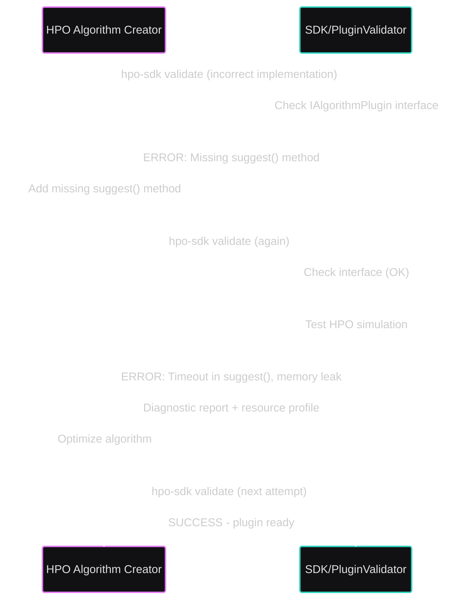
```mermaid
---
config:
  theme: redux-dark-color
---
sequenceDiagram
    participant A2 as HPO Algorithm Creator
    participant SDK as SDK/PluginValidator
    A2->>SDK: hpo-sdk validate (incorrect implementation)
    SDK->>SDK: Check IAlgorithmPlugin interface
    SDK-->>A2: ERROR: Missing suggest() method
    A2->>A2: Add missing suggest() method
    A2->>SDK: hpo-sdk validate (again)
    SDK->>SDK: Check interface (OK)
    SDK->>SDK: Test HPO simulation
    SDK-->>A2: ERROR: Timeout in suggest(), memory leak
    SDK-->>A2: Diagnostic report + resource profile
    A2->>A2: Optimize algorithm
    A2->>SDK: hpo-sdk validate (next attempt)
    SDK-->>A2: SUCCESS - plugin ready
```

#### Sequence Diagram - Alternative Scenario - Security Violation
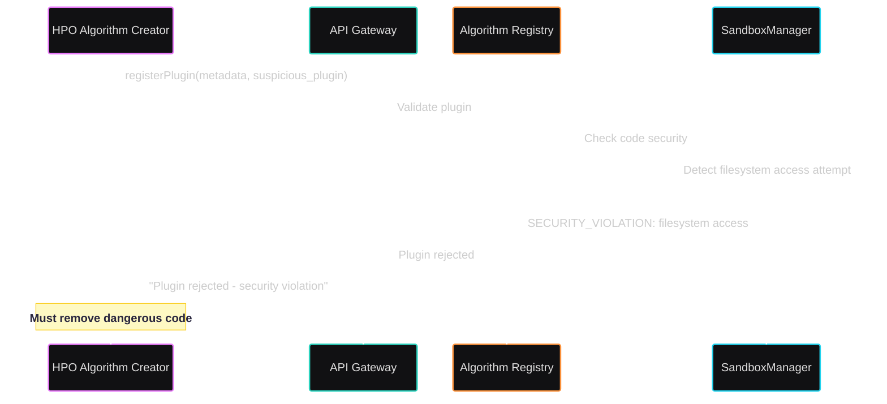
```mermaid
---
config:
  theme: redux-dark-color
---
sequenceDiagram
    participant A2 as HPO Algorithm Creator
    participant API as API Gateway
    participant AR as Algorithm Registry
    participant SM as SandboxManager
    A2->>API: registerPlugin(metadata, suspicious_plugin)
    API->>AR: Validate plugin
    AR->>SM: Check code security
    SM->>SM: Detect filesystem access attempt
    SM-->>AR: SECURITY_VIOLATION: filesystem access
    AR-->>API: Plugin rejected
    API-->>A2: "Plugin rejected - security violation"
    Note over A2: Must remove dangerous code
```

---

## UC4: Compare Algorithm Results

### Basic Information

| Property | Value |
|----------|-------|
| **Primary actors** | Researcher / ML Engineer |
| **Goal** | Comparison of performance of different HPO algorithms |
| **Level** | User goal |

### Main Scenario

1. **Experiment selection**
   - Researcher selects experiments for comparison
   - System loads data from Experiment Tracking Service

2. **Comparison configuration**
   - Selection of metrics for comparison
   - Visualization settings (charts, tables)

3. **Statistical analysis**
   - System performs statistical tests
   - Generates rankings and significance levels

4. **Visualization**
   - Display of comparative charts
   - Tables with results and statistics

---

## UC5: Browse and Filter Experiments

### Basic Information

| Property | Value |
|----------|-------|
| **Primary actors** | Researcher / ML Engineer |
| **Goal** | Browsing experiment history and searching |
| **Level** | User goal |

### Main Scenario

1. **Dashboard access**
   - Researcher opens Tracking Dashboard UI
   - System displays list of experiments

2. **Filtering**
   - Application of filters: status, tags, dates, algorithms
   - System updates result list

3. **Experiment details**
   - Selection of experiment from list
   - Display of details: runs, metrics, logs

### Diagrams

#### Activity Diagram

```mermaid
---
config:
  layout: elk
  theme: redux-dark
---
flowchart TB
    Start(["Start"]) --> OpenPanel["Open tracking panel"]
    OpenPanel --> LoadExperiments["Load experiment list"]
    LoadExperiments --> CheckCount{"Many experiments?"}
    CheckCount -- Yes --> EnablePagination["Enable pagination and lazy loading"]
    CheckCount -- No --> ShowAll["Display all"]
    EnablePagination --> ShowFiltered["Display experiment list"]
    ShowAll --> ShowFiltered
    ShowFiltered --> ApplyFilters{"Apply filters?"}
    ApplyFilters -- Yes --> SelectFilters["Select filters"]
    SelectFilters --> FilterByTags["Filter by tags"]
    FilterByTags --> FilterByTime["Filter by time"]
    FilterByTime --> FilterByBenchmark["Filter by benchmarks"]
    FilterByBenchmark --> FilterByAlgorithm["Filter by algorithms"]
    FilterByAlgorithm --> FilterByStatus["Filter by status"]
    FilterByStatus --> UpdateView["Update view"]
    ApplyFilters -- No --> SelectExperiment{"Select experiment?"}
    UpdateView --> SelectExperiment
    SelectExperiment -- Yes --> ShowDetails["Display experiment details"]
    SelectExperiment -- No --> End(["End"])
    ShowDetails --> ExpandRuns["Expand runs list"]
    ExpandRuns --> SelectRun{"Select run?"}
    SelectRun -- Yes --> ShowRunDetails["Display run details"]
    SelectRun -- No --> End
    ShowRunDetails --> ViewMetrics["Browse metrics"]
    ViewMetrics --> ViewLogs["Browse logs"]
    ViewLogs --> ViewConfig["Browse configuration"]
    ViewConfig --> ViewArtifacts["Browse artifacts"]
    ViewArtifacts --> End
```

#### Sequence Diagram - Main Scenario
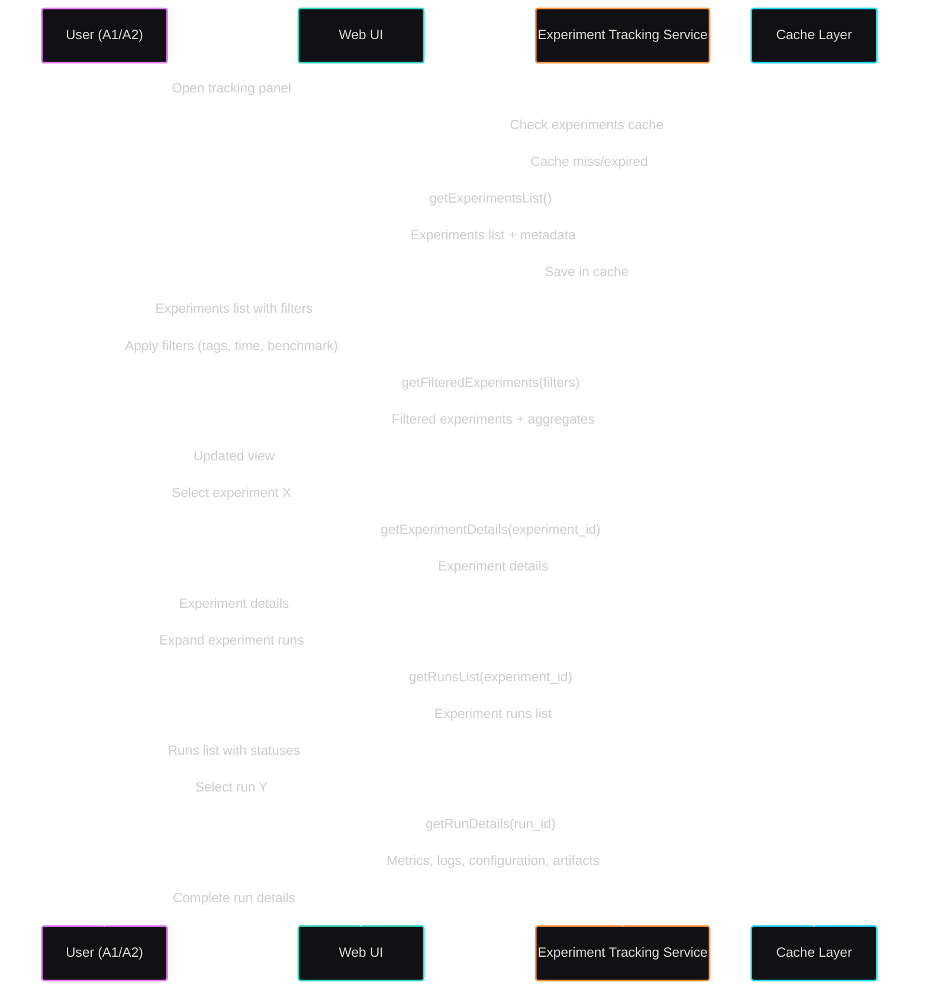
```mermaid
---
config:
  theme: redux-dark-color
---
sequenceDiagram
    participant User as User (A1/A2)
    participant UI as Web UI
    participant ETS as Experiment Tracking Service
    participant Cache as Cache Layer
    User->>UI: Open tracking panel
    UI->>Cache: Check experiments cache
    Cache-->>UI: Cache miss/expired
    UI->>ETS: getExperimentsList()
    ETS-->>UI: Experiments list + metadata
    UI->>Cache: Save in cache
    UI-->>User: Experiments list with filters
    User->>UI: Apply filters (tags, time, benchmark)
    UI->>ETS: getFilteredExperiments(filters)
    ETS-->>UI: Filtered experiments + aggregates
    UI-->>User: Updated view
    User->>UI: Select experiment X
    UI->>ETS: getExperimentDetails(experiment_id)
    ETS-->>UI: Experiment details
    UI-->>User: Experiment details
    User->>UI: Expand experiment runs
    UI->>ETS: getRunsList(experiment_id)
    ETS-->>UI: Experiment runs list
    UI-->>User: Runs list with statuses
    User->>UI: Select run Y
    UI->>ETS: getRunDetails(run_id)
    ETS-->>UI: Metrics, logs, configuration, artifacts
    UI-->>User: Complete run details
```

#### Sequence Diagram - Scenario with Pagination (Large Number of Experiments)

```mermaid
---
config:
  theme: redux-dark-color
---
sequenceDiagram
    participant User as User
    participant UI as Web UI
    participant ETS as Experiment Tracking Service
    User->>UI: Open tracking panel
    UI->>ETS: getExperimentsCount()
    ETS-->>UI: count = 5000 experiments
    UI->>UI: Enable pagination (page_size=50)
    UI->>ETS: getExperimentsList(page=1, size=50)
    ETS-->>UI: First 50 experiments
    UI-->>User: Page 1/100 experiments
    User->>UI: Go to page 3
    UI->>ETS: getExperimentsList(page=3, size=50)
    ETS-->>UI: Experiments 101-150
    UI-->>User: Page 3/100 experiments
    User->>UI: Apply filters
    UI->>ETS: getFilteredExperiments(filters, page=1, size=50)
    ETS-->>UI: Filtered experiments (page 1)
    UI-->>User: Filtering results with pagination
```

#### Activity diagram - Lazy loading run details
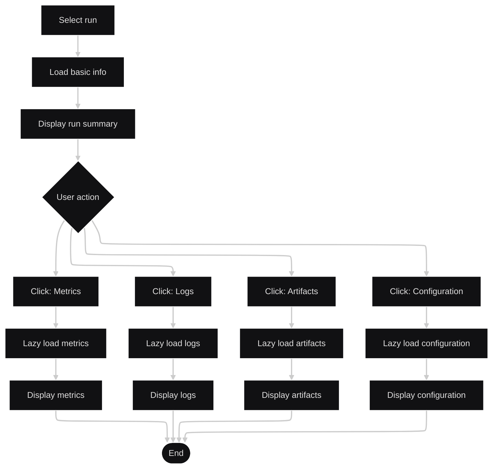
```mermaid
---
config:
  theme: redux-dark
  layout: elk
---
flowchart TB
    SelectRun["Select run"] --> LoadBasic["Load basic info"]
    LoadBasic --> ShowRunSummary["Display run summary"]
    ShowRunSummary --> UserAction{"User action"}
    UserAction --> ViewMetrics["Click: Metrics"] & ViewLogs["Click: Logs"] & ViewArtifacts["Click: Artifacts"] & ViewConfig["Click: Configuration"]
    ViewMetrics --> LazyLoadMetrics["Lazy load metrics"]
    ViewLogs --> LazyLoadLogs["Lazy load logs"]
    ViewArtifacts --> LazyLoadArtifacts["Lazy load artifacts"]
    ViewConfig --> LazyLoadConfig["Lazy load configuration"]
    LazyLoadMetrics --> ShowMetrics["Display metrics"]
    LazyLoadLogs --> ShowLogs["Display logs"]
    LazyLoadArtifacts --> ShowArtifacts["Display artifacts"]
    LazyLoadConfig --> ShowConfig["Display configuration"]
    ShowMetrics --> End(["End"])
    ShowLogs --> End
    ShowArtifacts --> End
    ShowConfig --> End
```

---# Sequence diagram - Alternative scenario - Incomplete data
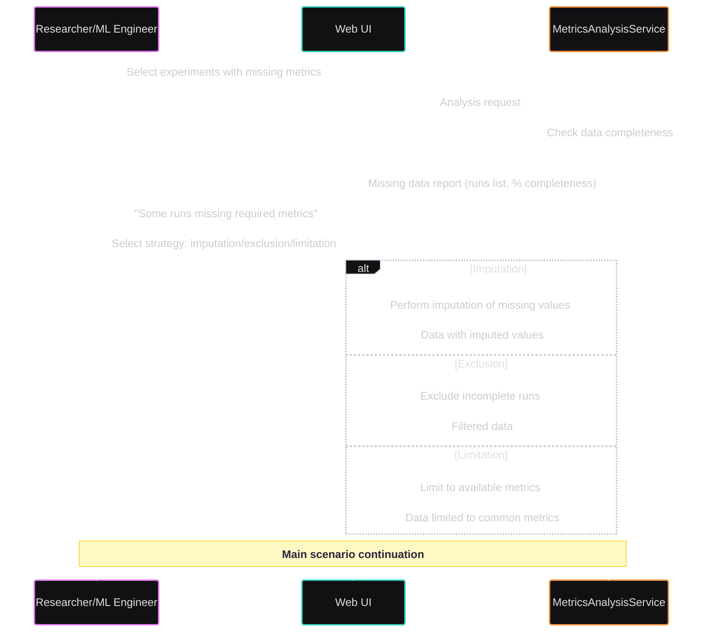
```mermaid
---
config:
  theme: redux-dark-color
---
sequenceDiagram
    participant A1 as Researcher/ML Engineer
    participant UI as Web UI
    participant MAS as MetricsAnalysisService
    A1->>UI: Select experiments with missing metrics
    UI->>MAS: Analysis request
    MAS->>MAS: Check data completeness
    MAS-->>UI: Missing data report (runs list, % completeness)
    UI-->>A1: "Some runs missing required metrics"
    A1->>UI: Select strategy: imputation/exclusion/limitation
    alt Imputation
    UI->>MAS: Perform imputation of missing values
    MAS-->>UI: Data with imputed values
    else Exclusion
    UI->>MAS: Exclude incomplete runs
    MAS-->>UI: Filtered data
    else Limitation
    UI->>MAS: Limit to available metrics
    MAS-->>UI: Data limited to common metrics
    end
    Note over A1,MAS: Main scenario continuation
```

#### Activity diagram - Computational error handling
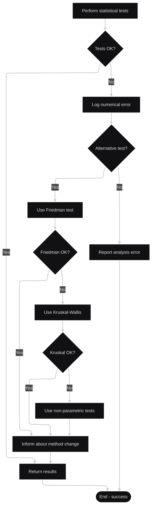
```mermaid
---
config:
  theme: redux-dark
  layout: elk
---
flowchart TB
    PerformTests["Perform statistical tests"] --> TestsOK{"Tests OK?"}
    TestsOK -- Yes --> ReturnResults["Return results"]
    TestsOK -- No --> LogError["Log numerical error"]
    LogError --> TryAlternative{"Alternative test?"}
    TryAlternative -- Yes --> UseFriedman["Use Friedman test"]
    UseFriedman --> FriedmanOK{"Friedman OK?"}
    FriedmanOK -- No --> UseKruskal["Use Kruskal-Wallis"]
    UseKruskal --> KruskalOK{"Kruskal OK?"}
    KruskalOK -- No --> UseNonParametric["Use non-parametric tests"]
    UseNonParametric --> InformUser["Inform about method change"]
    FriedmanOK -- Yes --> InformUser
    KruskalOK -- Yes --> InformUser
    TryAlternative -- No --> ReportError["Report analysis error"]
    InformUser --> ReturnResults
    ReportError --> End(["End - success"])
    ReturnResults --> End
```

---

## UC6: Manage paper references

### Basic Information

| Property | Value |
|----------|-------|
| **Primary actors** | Researcher / Administrator |
| **Goal** | Adding and linking scientific publications with algorithms/benchmarks |
| **Level** | User goal |

### Main Scenario

1. **Publication addition**
   - User enters publication metadata (DOI, BibTeX)
   - System enriches data from external sources (CrossRef, arXiv)

2. **Linking with elements**
   - Linking publications with algorithms or benchmarks
   - Metadata update in Registry Services

3. **Bibliography management**
   - Editing and updating existing entries
   - Citation generation in various formats

### Diagrams

#### Activity Diagram
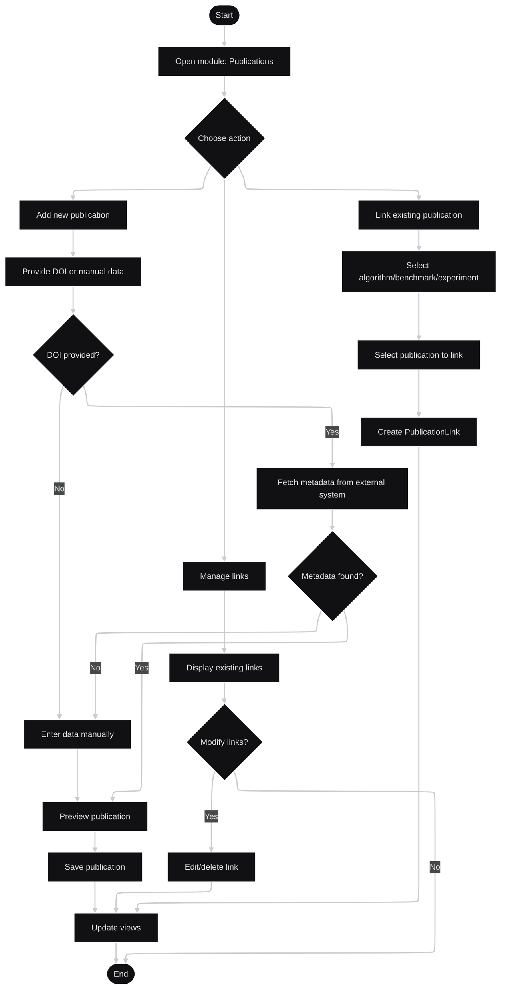
```mermaid
---
config:
  layout: elk
  theme: redux-dark
---
flowchart TB
    Start(["Start"]) --> OpenPublications["Open module: Publications"]
    OpenPublications --> ChooseAction{"Choose action"}
    ChooseAction --> AddPublication["Add new publication"] & LinkExisting["Link existing publication"] & ManageLinks["Manage links"]
    AddPublication --> EnterData["Provide DOI or manual data"]
    EnterData --> CheckDOI{"DOI provided?"}
    CheckDOI -- Yes --> FetchMetadata["Fetch metadata from external system"]
    CheckDOI -- No --> ManualEntry["Enter data manually"]
    FetchMetadata --> MetadataFound{"Metadata found?"}
    MetadataFound -- No --> ManualEntry
    MetadataFound -- Yes --> PreviewPublication["Preview publication"]
    ManualEntry --> PreviewPublication
    PreviewPublication --> SavePublication["Save publication"]
    LinkExisting --> SelectTarget["Select algorithm/benchmark/experiment"]
    SelectTarget --> SelectPublication["Select publication to link"]
    SelectPublication --> CreateLink["Create PublicationLink"]
    ManageLinks --> ViewLinks["Display existing links"]
    ViewLinks --> ModifyLinks{"Modify links?"}
    ModifyLinks -- Yes --> EditLink["Edit/delete link"]
    ModifyLinks -- No --> End(["End"])
    SavePublication --> UpdateViews["Update views"]
    CreateLink --> UpdateViews
    EditLink --> UpdateViews
    UpdateViews --> End
```

#### Sequence Diagram - Main Scenario
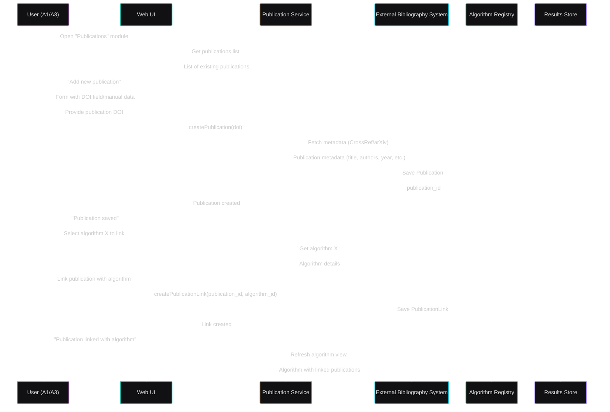
```mermaid
---
config:
  theme: redux-dark-color
---
sequenceDiagram
    participant User as User (A1/A3)
    participant UI as Web UI
    participant PS as Publication Service
    participant EXT as External Bibliography System
    participant AR as Algorithm Registry
    participant RS as Results Store
    User->>UI: Open "Publications" module
    UI->>PS: Get publications list
    PS-->>UI: List of existing publications
    User->>UI: "Add new publication"
    UI-->>User: Form with DOI field/manual data
    User->>UI: Provide publication DOI
    UI->>PS: createPublication(doi)
    PS->>EXT: Fetch metadata (CrossRef/arXiv)
    EXT-->>PS: Publication metadata (title, authors, year, etc.)
    PS->>RS: Save Publication
    RS-->>PS: publication_id
    PS-->>UI: Publication created
    UI-->>User: "Publication saved"
    User->>UI: Select algorithm X to link
    UI->>AR: Get algorithm X
    AR-->>UI: Algorithm details
    User->>UI: Link publication with algorithm
    UI->>PS: createPublicationLink(publication_id, algorithm_id)
    PS->>RS: Save PublicationLink
    PS-->>UI: Link created
    UI-->>User: "Publication linked with algorithm"
    UI->>AR: Refresh algorithm view
    AR-->>UI: Algorithm with linked publications
```

#### Sequence Diagram - Alternative Scenario - DOI Not Found
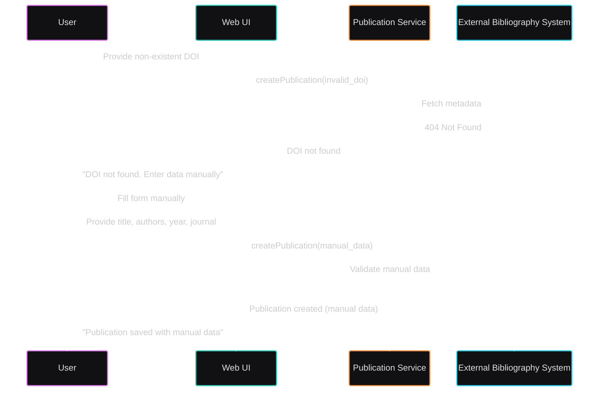
```mermaid
---
config:
  theme: redux-dark-color
---
sequenceDiagram
    participant User as User
    participant UI as Web UI
    participant PS as Publication Service
    participant EXT as External Bibliography System
    User->>UI: Provide non-existent DOI
    UI->>PS: createPublication(invalid_doi)
    PS->>EXT: Fetch metadata
    EXT-->>PS: 404 Not Found
    PS-->>UI: DOI not found
    UI-->>User: "DOI not found. Enter data manually"
    User->>UI: Fill form manually
    User->>UI: Provide title, authors, year, journal
    UI->>PS: createPublication(manual_data)
    PS->>PS: Validate manual data
    PS-->>UI: Publication created (manual data)
    UI-->>User: "Publication saved with manual data"
```

#### Activity Diagram - Link Management
```mermaid
---
config:
  theme: redux-dark
  layout: elk
---
flowchart TB
    ViewLinks["Display links"] --> FilterLinks{"Filter links?"}
    FilterLinks -- Yes --> ApplyFilter["Apply filters"]
    FilterLinks -- No --> ShowAllLinks["Show all links"]
    ApplyFilter --> ShowFilteredLinks["Show filtered"]
    ShowAllLinks --> SelectLink{"Select link?"}
    ShowFilteredLinks --> SelectLink
    SelectLink -- No --> End(["End"])
    SelectLink -- Yes --> ChooseLinkAction{"Choose action"}
    ChooseLinkAction --> EditLink["Edit link"] & DeleteLink["Delete link"] & ViewDetails["View details"]
    EditLink --> UpdateLink["Update link"]
    DeleteLink --> ConfirmDelete{"Confirm deletion?"}
    ConfirmDelete -- Yes --> RemoveLink["Remove link"]
    ConfirmDelete -- No --> SelectLink
    ViewDetails --> SelectLink
    UpdateLink --> RefreshView["Refresh view"]
    RemoveLink --> RefreshView
    RefreshView --> End
```

---

## UC7: Run system locally on PC

### Basic Information

| Property | Value |
|------------|---------|
| **Primary actors** | Administrator |
| **Goal** | System deployment in PC/laboratory environment |
| **Level** | System goal |

### Main Scenario

1. **Environment preparation**
   - Docker and docker-compose installation
   - Clone repository with configuration

2. **Configuration**
   - Configuration files editing
   - Environment variables setup

3. **Startup**
   - Execute `docker-compose up`
   - Verify all services operation

4. **Data initialization**
   - Import sample benchmarks
   - Configure built-in algorithms

### Diagrams

#### Activity Diagram
```mermaid
---
config:
  layout: elk
  theme: redux-dark
---
flowchart TB
    Start(["Start"]) --> CheckDocker{"Docker installed?"}
    CheckDocker -- No --> InstallDocker["Install Docker"]
    CheckDocker -- Yes --> CloneRepo["Clone configuration repository"]
    InstallDocker --> CloneRepo
    CloneRepo --> ConfigureEnv["Configure .env file"]
    ConfigureEnv --> CheckPorts{"Ports available?"}
    CheckPorts -- No --> ModifyPorts["Modify ports in docker-compose.yml"]
    CheckPorts -- Yes --> StartContainers["docker-compose up -d"]
    ModifyPorts --> StartContainers
    StartContainers --> WaitInit["Wait for container initialization"]
    WaitInit --> CheckDB{"DB ready?"}
    CheckDB -- No --> FixDBIssues["Fix DB issues"]
    CheckDB -- Yes --> CheckBroker{"Message Broker ready?"}
    FixDBIssues --> CheckDB
    CheckBroker -- No --> FixBrokerIssues["Fix Broker issues"]
    CheckBroker -- Yes --> CheckAPI{"API Gateway ready?"}
    FixBrokerIssues --> CheckBroker
    CheckAPI -- No --> FixAPIIssues["Fix API issues"]
    CheckAPI -- Yes --> CheckWorkers{"Workers ready?"}
    FixAPIIssues --> CheckAPI
    CheckWorkers -- No --> FixWorkerIssues["Fix Worker issues"]
    CheckWorkers -- Yes --> CheckUI{"Web UI available?"}
    FixWorkerIssues --> CheckWorkers
    CheckUI -- No --> FixUIIssues["Fix UI issues"]
    CheckUI -- Yes --> VerifyHealth["Check health-check endpoints"]
    FixUIIssues --> CheckUI
    VerifyHealth --> HealthOK{"All services OK?"}
    HealthOK -- No --> DiagnoseIssues["Diagnose issues from logs"]
    HealthOK -- Yes --> OpenBrowser["Open Web UI in browser"]
    DiagnoseIssues --> FixIssues["Fix identified issues"]
    FixIssues --> VerifyHealth
    OpenBrowser --> SystemReady["System ready for use"]
    SystemReady --> End(["End - success"])
```

#### Sequence Diagram - Main Scenario
```mermaid
---
config:
  theme: redux-dark-color
---
sequenceDiagram
    participant A3 as Administrator
    participant Docker as Docker Engine
    participant DB as Results Store (DB)
    participant MB as Message Broker
    participant API as API Gateway
    participant ETS as Experiment Tracking
    participant WR as Worker Runtime
    participant UI as Web UI
    participant MON as Monitoring
    A3->>A3: Clone repo, configure .env
    A3->>Docker: docker-compose up -d
    Docker->>DB: Start PostgreSQL container
    Docker->>MB: Start RabbitMQ container
    Docker->>API: Start API Gateway container
    Docker->>ETS: Start Tracking Service container
    Docker->>WR: Start Worker Runtime container(s)
    Docker->>UI: Start Web UI container
    Docker->>MON: Start Monitoring container (optional)
    DB->>DB: Initialize database
    MB->>MB: Create queues (RunJob, etc.)
    API->>DB: Connect to database
    API->>MB: Connect to Message Broker
    ETS->>DB: Execute schema migrations
    WR->>MB: Subscribe to RunJob queue
    UI->>API: Check API connection
    A3->>Docker: docker ps (check statuses)
    Docker-->>A3: All containers running
    A3->>API: curl http://localhost:8080/healthz
    API-->>A3: HTTP 200 OK
    A3->>UI: Open http://localhost:3000
    UI-->>A3: Login/main page displayed
```

#### Sequence Diagram - Alternative Scenario - Port Conflict
```mermaid
---
config:
  theme: redux-dark-color
---
sequenceDiagram
    participant A3 as Administrator
    participant Docker as Docker Engine
    participant System as System (port already in use)
    A3->>Docker: docker-compose up -d
    Docker->>System: Attempt to bind port 8080
    System-->>Docker: Error: Port 8080 already in use
    Docker-->>A3: Startup error - port conflict
    A3->>A3: Edit docker-compose.yml (8080 → 8081)
    A3->>A3: Update .env (UI_PORT=8081)
    A3->>Docker: docker-compose up -d
    Docker->>System: Attempt to bind port 8081
    System-->>Docker: Port 8081 available
    Docker-->>A3: Containers started correctly
```

#### Activity Diagram - Troubleshooting
```mermaid
---
config:
  theme: redux-dark
  layout: elk
---
flowchart TB
    ContainerFail["Container fails to start"] --> CheckLogs["Check container logs"]
    CheckLogs --> LogType{"Error type"}
    LogType --> PermissionError["Volume permission error"] & ConfigError["Configuration error"] & ResourceError["Resource shortage"] & NetworkError["Network/connection error"]
    PermissionError --> FixPermissions["Fix directory permissions"]
    ConfigError --> FixConfig["Fix configuration in .env"]
    ResourceError --> FreeResources["Free resources or increase limits"]
    NetworkError --> CheckNetwork["Check Docker networks"]
    FixPermissions --> RestartContainer["Restart container"]
    FixConfig --> RestartContainer
    FreeResources --> RestartContainer
    CheckNetwork --> FixNetworkIssue["Fix network issues"]
    FixNetworkIssue --> RestartContainer
    RestartContainer --> TestAgain["Test again"]
    TestAgain --> Success{"Success?"}
    Success -- Yes --> End(["Problem resolved"])
    Success -- No --> CheckLogs
```

---

## UC8: Run system in cloud / scale workers

### Basic Information

| Property | Value |
|------------|---------|
| **Primary actors** | DevOps/SRE Administrator |
| **Goal** | System deployment and scaling in cloud environment |
| **Level** | System goal |

### Main Scenario

1. **Infrastructure preparation**
   - Kubernetes cluster configuration
   - Managed services setup (DB, Storage, Message Broker)

2. **Application deployment**
   - Apply Kubernetes manifests
   - Load balancers and ingress configuration

3. **Scaling**
   - HPA (Horizontal Pod Autoscaler) configuration
   - Load monitoring and automatic worker scaling

4. **Monitoring and alerting**
   - Monitoring stack deployment
   - Alerts and dashboards configuration

### Diagrams

#### Activity Diagram
```mermaid
---
config:
  layout: elk
  theme: redux-dark
---
flowchart TB
    Start(["Start"]) --> PrepareConfig["Prepare cloud configuration"]
    PrepareConfig --> CommitChanges["Commit changes to repository"]
    CommitChanges --> TriggerPipeline["CI/CD detects changes"]
    TriggerPipeline --> RunPipeline["Run deployment pipeline"]
    RunPipeline --> ValidateManifests{"Manifesty poprawne?"}
    ValidateManifests -- No --> FixManifests["Fix manifests/configuration"]
    FixManifests --> CommitChanges
    ValidateManifests -- Yes --> DeployToK8s["Deploy to Kubernetes"]
    DeployToK8s --> CheckResources{"Sufficient resources?"}
    CheckResources -- No --> ScaleCluster["Increase cluster resources"]
    CheckResources -- Yes --> CreatePods["Create/update pods"]
    ScaleCluster --> CreatePods
    CreatePods --> WaitForPods["Wait for pod startup"]
    WaitForPods --> CheckHealth{"Health checks OK?"}
    CheckHealth -- No --> DiagnosePods["Diagnose pod issues"]
    CheckHealth -- Yes --> SetupMonitoring["Configure monitoring"]
    DiagnosePods --> FixPodIssues["Fix pod issues"]
    FixPodIssues --> CheckHealth
    SetupMonitoring --> ConfigureHPA["Configure HPA for workers"]
    ConfigureHPA --> TestHPA["Test HPA scaling"]
    TestHPA --> HPAWorks{"HPA works correctly?"}
    HPAWorks -- No --> FixHPA["Fix HPA configuration"]
    FixHPA --> TestHPA
    HPAWorks -- Yes --> ExposeServices["Configure Ingress/LoadBalancer"]
    ExposeServices --> TestAccess["Test Web UI access"]
    TestAccess --> AccessOK{"Access OK?"}
    AccessOK -- No --> FixIngress["Fix Ingress configuration"]
    FixIngress --> TestAccess
    AccessOK -- Yes --> SystemReady["System ready in cloud"]
    SystemReady --> MonitorSystem["Monitor system and scaling"]
    MonitorSystem --> End(["End - success"])
```

#### Sequence Diagram - Main Scenario
```mermaid
---
config:
  theme: redux-dark-color
---
sequenceDiagram
    participant A3 as Administrator DevOps
    participant Git as Git Repository
    participant CICD as CI/CD Pipeline
    participant K8s as Kubernetes API
    participant Pods as Application Pods
    participant HPA as HPA Controller
    participant Prom as Prometheus
    participant LB as LoadBalancer
    A3->>A3: Prepare values-cloud.yaml
    A3->>Git: Commit cloud configuration
    Git->>CICD: Trigger webhook
    CICD->>CICD: Run pipeline (helm upgrade)
    CICD->>K8s: Apply manifests/chart
    K8s->>K8s: Create Deployments, Services, ConfigMaps
    K8s->>Pods: Start pods (API, Tracking, Workers, UI)
    loop Pods starting
        Pods->>Pods: API Gateway connects to DB/Broker
        Pods->>Pods: Tracking Service executes migrations
        Pods->>Pods: Workers subscribe to queues
        Pods->>Pods: Web UI starts HTTP server
    end
    Pods-->>K8s: Health checks OK
    K8s->>Prom: Start collecting metrics
    Prom->>HPA: Provide metrics (CPU, queue length)
    K8s->>HPA: Activate HPA for Worker Deployment
    K8s->>LB: Configure Ingress/LoadBalancer
    LB-->>A3: Web UI publicly available
    Note over HPA,Prom: Continuous monitoring and scaling
    HPA->>Prom: Check metrics every 30s
    Prom-->>HPA: CPU 80%, queue_length=100
    HPA->>K8s: Increase Worker replicas (2→5)
    K8s->>Pods: Start 3 additional Worker pods
```

#### Sequence diagram - Alternative scenario - Cluster resource error
```mermaid
---
config:
  theme: redux-dark-color
---
sequenceDiagram
    participant CICD as CI/CD Pipeline
    participant K8s as Kubernetes API
    participant Nodes as Cluster Nodes
    participant A3 as DevOps Administrator
    CICD->>K8s: Apply Deployment with large requests
    K8s->>Nodes: Attempt pod scheduling
    Nodes-->>K8s: Insufficient CPU/Memory
    K8s-->>CICD: Pods in Pending state
    CICD-->>A3: Alert: Deployment failed - resource constraints
    A3->>A3: Check kubectl describe pods
    A3->>A3: Analysis: need more CPU/RAM
    alt Increase cluster resources
        A3->>Nodes: Add nodes or scale up
        Nodes-->>K8s: New resources available
        K8s->>Nodes: Schedule pending pods
    else Reduce requirements
        A3->>A3: Reduce requests in values-cloud.yaml
        A3->>CICD: Commit new configuration
        CICD->>K8s: Update Deployment
        K8s->>Nodes: Schedule with lower requirements
    end
    Nodes-->>K8s: Pods running
    K8s-->>A3: Deployment success
```

#### Activity Diagram - HPA Automatic Scaling
```mermaid
---
config:
  layout: elk
  theme: redux-dark
---
flowchart TB
    MonitorLoad["Monitor load"] --> CheckMetrics{"Check metrics"}
    CheckMetrics --> HighLoad{"High load?"}
    HighLoad -- Yes --> CalculateReplicas["Calculate required replicas"]
    HighLoad -- No --> LowLoad{"Low load?"}
    LowLoad -- Yes --> ScaleDown["Reduce replicas count"]
    LowLoad -- No --> Wait["Wait 30s"]
    CalculateReplicas --> CheckMax{"Below max replicas?"}
    CheckMax -- Yes --> ScaleUp["Increase replicas count"]
    CheckMax -- No --> MaxReached["Maximum reached"]
    ScaleUp --> UpdateDeployment["Update Deployment"]
    ScaleDown --> UpdateDeployment
    UpdateDeployment --> WaitStabilize["Wait for stabilization"]
    WaitStabilize --> MonitorLoad
    MaxReached --> Wait
    Wait --> MonitorLoad
```

---

## UC9: Generate experiment report

### Basic Information

| Property | Value |
|------------|---------|
| **Primary actors** | Researcher / ML Engineer |
| **Goal** | Generate experiment results report for publication |
| **Level** | User goal |

### Main Scenario

1. **Experiment selection**
   - Researcher selects completed experiment
   - System loads complete experiment data

2. **Report configuration**
   - Report template selection (HTML, PDF, LaTeX)
   - Section selection to include

3. **Generation**
   - System aggregates data from multiple sources
   - Create visualizations and results tables

4. **Final report**
   - Generate report file
   - Provide download link

### Diagrams

#### Activity Diagram
```mermaid
---
config:
  layout: elk
  theme: redux-dark
---
flowchart TB
    Start(["Start"]) --> OpenReports["Open reports view"]
    OpenReports --> SelectExperiments["Select experiment(s)"]
    SelectExperiments --> SelectScope["Select report scope"]
    SelectScope --> SelectFormat["Select report format"]
    SelectFormat --> SelectTemplate["Select report template"]
    SelectTemplate --> ValidateSelection{"Selection validation"}
    ValidateSelection -- Error --> ShowValidationError["Display validation errors"]
    ShowValidationError --> SelectExperiments
    ValidateSelection -- OK --> GenerateReport["Click: Generate report"]
    GenerateReport --> CheckDataAvailable{"Data available?"}
    CheckDataAvailable -- No --> ShowDataError["Display data unavailable error"]
    ShowDataError --> End(["End"])
    CheckDataAvailable -- Yes --> ProcessReport["Process report"]
    ProcessReport --> CheckTimeout{"Generation timeout?"}
    CheckTimeout -- Yes --> ShowTimeoutError["Display timeout error"]
    ShowTimeoutError --> End
    CheckTimeout -- No --> SaveToStorage["Save report to Object Storage"]
    SaveToStorage --> ReturnURL["Return report URL"]
    ReturnURL --> ShowDownloadLink["Display download link"]
    ShowDownloadLink --> UserChoice{"User choice"}
    UserChoice --> DownloadReport["Download report"] & ViewInBrowser["Open in browser"] & End
    DownloadReport --> End
    ViewInBrowser --> End
```

#### Sequence Diagram - Main Scenario
```mermaid
---
config:
  theme: redux-dark-color
---
sequenceDiagram
    participant User as User
    participant UI as Web UI
    participant RG as Report Generator Service
    participant ETS as Experiment Tracking Service
    participant MAS as MetricsAnalysisService
    participant PS as Publication Service
    participant OS as Object Storage
    participant RS as Results Store
    User->>UI: Open reports view
    UI->>ETS: Get experiments list
    ETS-->>UI: Experiments list
    User->>UI: Select experiment X + report parameters
    User->>UI: Click "Generate report"
    UI->>RG: generateReport(experiment_id, format, template)
    RG->>ETS: Get experiment metadata
    ETS-->>RG: Experiment details
    RG->>RS: Get results and run metrics
    RS-->>RG: Run data
    RG->>MAS: Get aggregates and analyses
    MAS-->>RG: Analytical data
    RG->>PS: Get related publications
    PS-->>RG: Publication metadata
    RG->>RG: Compose data into report model
    RG->>RG: Render to format (HTML/PDF)
    RG->>OS: Save report
    OS-->>RG: Report URL
    RG-->>UI: Report ready (URL)
    UI-->>User: Link/button "Download report"
    alt User downloads report
        User->>OS: Download report from URL
        OS-->>User: Report file
    else User opens in browser
        User->>OS: Open report in browser
        OS-->>User: Report displayed
    end
```

#### Sequence Diagram - Alternative Scenario - Generation Error
```mermaid
---
config:
  theme: redux-dark-color
---
sequenceDiagram
    participant User as User
    participant UI as Web UI
    participant RG as Report Generator Service
    participant ETS as Experiment Tracking Service
    participant RS as Results Store
    User->>UI: Generate report for experiment Z
    UI->>RG: generateReport(experiment_id_Z, PDF, detailed)
    RG->>ETS: Get experiment Z metadata
    ETS-->>RG: Experiment exists
    RG->>RS: Get run results
    RS-->>RG: ERROR: No data found for experiment Z
    RG->>RG: Log error: Missing experiment data
    RG-->>UI: ReportGenerationError: Missing experiment data
    UI-->>User: "Cannot generate report - no data. Check if experiment has completed."
```

#### Activity Diagram - Different Format Rendering
```mermaid
---
config:
  layout: elk
  theme: redux-dark
---
flowchart TB
    StartRender["Start rendering"] --> CheckFormat{"Report format"}
    CheckFormat --> HTML["HTML"] & PDF["PDF"] & LaTeX["LaTeX"] & JSON["JSON/CSV"]
    HTML --> LoadHTMLTemplate["Load HTML template"]
    PDF --> LoadPDFTemplate["Load PDF template"]
    LaTeX --> LoadLaTeXTemplate["Load LaTeX template"]
    JSON --> PrepareDataExport["Prepare data export"]
    LoadHTMLTemplate --> RenderHTML["Render HTML with data"]
    LoadPDFTemplate --> RenderPDF["Render PDF via LaTeX/WeasyPrint"]
    LoadLaTeXTemplate --> RenderLaTeX["Generate LaTeX code"]
    PrepareDataExport --> ExportJSON["Export JSON/CSV"]
    RenderHTML --> ValidateOutput{"Validation"}
    RenderPDF --> ValidateOutput
    RenderLaTeX --> ValidateOutput
    ExportJSON --> ValidateOutput
    ValidateOutput -- OK --> SaveFile["Save file"]
    ValidateOutput -- Error --> RenderError["Report rendering error"]
    SaveFile --> ReturnURL["Return URL"]
    RenderError --> End(["End - success"])
    ReturnURL --> End
```

---

## Use Cases Summary

| UC | Name | Primary Actor | Frequency | Criticality |
|----|-------|--------------|---------------|-------------|
| UC1 | Configure and run experiment | Researcher | High | Critical |
| UC2 | Add built-in HPO algorithm | Administrator | Low | Medium |
| UC3 | Implement algorithm plugin | Algorithm Creator | Medium | High |
| UC4 | Compare algorithm results | Researcher | High | Critical |
| UC5 | Browse experiments | Researcher | High | Medium |
| UC6 | Manage references | Researcher/Admin | Medium | Low |
| UC7 | Run system locally | Administrator | Low | High |
| UC8 | Run system in cloud | DevOps/SRE | Low | Critical |
| UC9 | Generate report | Researcher | Medium | Medium |

---

## Related Documents

- **Architecture**: [Context (C4-1)](../architecture/c1-context.md)
- **Implementation**: [Containers (C4-2)](../architecture/c2-containers.md), [Components (C4-3)](../architecture/c3-components.md)
- **Workflow**: [Workflows](workflows.md)
- **Deployment**: [Deployment Guide](../operations/deployment-guide.md)
- **Methodology**: [Benchmarking Practices](../methodology/benchmarking-practices.md)
