# Use Cases

> **Usage scenarios for the HPO Benchmarking Platform system**

---

## Use Cases Overview

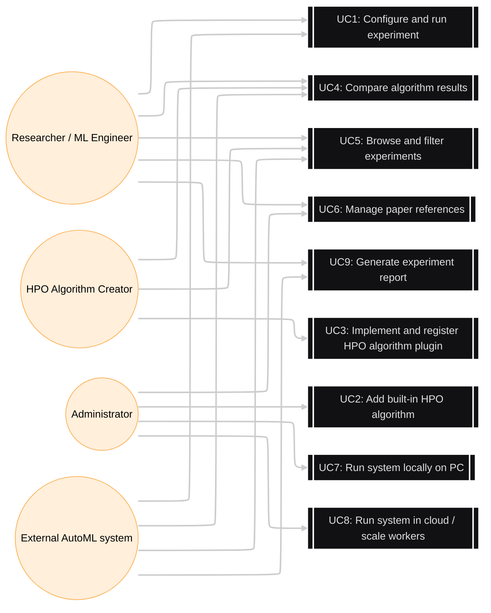
```mermaid
---
config:
  layout: elk
  theme: redux-dark
---
flowchart LR
    A1(("Researcher / ML Engineer")) --> UC1[["UC1: Configure and run experiment"]] & UC4[["UC4: Compare algorithm results"]] & UC5[["UC5: Browse and filter experiments"]] & UC6[["UC6: Manage paper references"]] & UC9[["UC9: Generate experiment report"]]
    A2(("HPO Algorithm Creator")) --> UC3[["UC3: Implement and register HPO algorithm plugin"]] & UC4 & UC5
    A3(("Administrator")) --> UC2[["UC2: Add built-in HPO algorithm"]] & UC6 & UC7[["UC7: Run system locally on PC"]] & UC8[["UC8: Run system in cloud / scale workers"]]
    A4(("External AutoML system")) --> UC1 & UC4 & UC5 & UC9
     A1:::Peach
     A2:::Peach
     A3:::Peach
     A4:::Peach
    classDef Peach stroke-width:1px, stroke-dasharray:none, stroke:#FBB35A, fill:#FFEFDB, color:#8F632D
    style A1 color:#000000
    style A2 color:#000000
    style A3 color:#000000
    style A4 color:#000000
```

---

## UC1: Configure and run benchmark experiment

### 📋 Basic information

| Property | Value |
|----------|-------|
| **Primary actors** | Researcher / ML Engineer |
| **Supporting actors** | System (Orchestrator, Benchmark Definition, Algorithm Registry, Tracking) |
| **Goal** | Create benchmark experiment, define run plan, execute and save results |
| **Level** | User goal |
| **Complexity** | Medium |

### 🎯 Preconditions
- Registered benchmarks and HPO algorithms exist (built-in or plugins)
- User is logged in and has permissions to create experiments
- System is available and operational

### 📝 Main scenario

1. **Experiment initiation**
   - A1 opens Web UI – "New experiment" section
   - System retrieves benchmark list from Benchmark Definition Service

2. **Benchmark configuration**
   - A1 selects one or more benchmarks and problem instances
   - System displays details of selected benchmarks (datasets, metrics)

3. **Algorithm selection**
   - System retrieves list of available algorithms from Algorithm Registry
   - A1 selects algorithms and configures their parameters/HPO budget limits

4. **Goal definition**
   - A1 defines experiment goals (G1–G5) and metrics
   - A1 sets retry policies, timeouts, priorities

5. **Configuration save**
   - A1 saves experiment configuration
   - API Gateway passes configuration to Experiment Orchestrator

6. **Validation**
   - Orchestrator validates configuration (Benchmark Definition, Algorithm Registry)
   - System checks algorithm compatibility with benchmarks

7. **Experiment creation**
   - Orchestrator creates run plan and saves experiment in Experiment Tracking Service
   - Unique experiment_id is generated

8. **Execution**
   - A1 starts experiment ("Run" button)
   - Orchestrator sends run tasks to Message Broker

9. **Processing**
   - Workers retrieve tasks, execute runs
   - Workers report metrics and logs to Tracking Service in real-time

10. **Completion**
    - Orchestrator updates experiment status
    - A1 receives completion notification

### ⚠️ Alternative scenarios

#### 1A. Configuration validation failed
1. In step 6 Orchestrator detects incompatibility (e.g. algorithm requires GPU, but benchmark doesn't support GPU)
2. System returns detailed error report with codes: `INCOMPATIBLE_ALGORITHM`, `INSUFFICIENT_RESOURCES`, `INVALID_PARAMETER_SPACE`
3. Web UI displays errors with suggested fixes
4. A1 corrects configuration and retries from step 5

#### 1B. No available workers
1. In step 8 Message Broker accepts tasks, but no Workers are available
2. Orchestrator detects lack of active queue consumers after timeout (30s)
3. System informs A1: "Experiment scheduled, but no available workers"
4. A1 can: cancel experiment, start additional workers, or wait

#### 1C. Run failed during execution
1. In step 9 Worker encounters error (out of memory, plugin error, timeout)
2. Worker logs detailed error to Tracking Service
3. Orchestrator receives `RunFailed` event and checks retry policy
4. System automatically retries or marks run as failed

### ✅ Postconditions
- Experiment has status `COMPLETED` or `FAILED`
- All runs have metrics and logs saved in Tracking Service
- Data is ready for analysis (UC4)

### 📊 Diagramy

#### Diagram aktywności
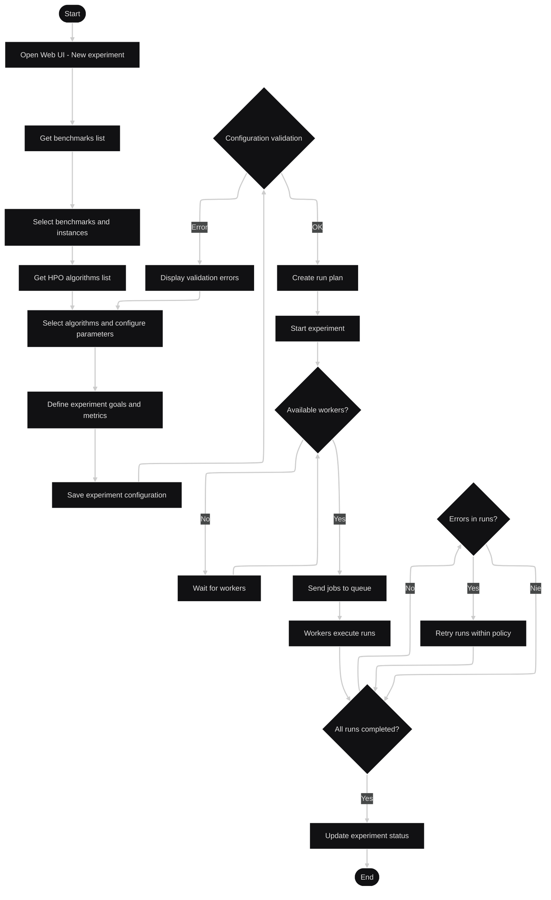
```mermaid
---
config:
  layout: elk
  theme: redux-dark
---
flowchart TB
    Start(["Start"]) --> OpenUI["Open Web UI - New experiment"]
    OpenUI --> GetBenchmarks["Get benchmarks list"]
    GetBenchmarks --> SelectBenchmarks["Select benchmarks and instances"]
    SelectBenchmarks --> GetAlgorithms["Get HPO algorithms list"]
    GetAlgorithms --> SelectAlgorithms["Select algorithms and configure parameters"]
    SelectAlgorithms --> DefineGoals["Define experiment goals and metrics"]
    DefineGoals --> SaveConfig["Save experiment configuration"]
    SaveConfig --> ValidateConfig{"Configuration validation"}
    ValidateConfig -- Error --> ShowErrors["Display validation errors"]
    ShowErrors --> SelectAlgorithms
    ValidateConfig -- OK --> CreatePlan["Create run plan"]
    CreatePlan --> StartExperiment["Start experiment"]
    StartExperiment --> CheckWorkers{"Available workers?"}
    CheckWorkers -- No --> WaitWorkers["Wait for workers"]
    WaitWorkers --> CheckWorkers
    CheckWorkers -- Yes --> SendJobs["Send jobs to queue"]
    SendJobs --> ExecuteRuns["Workers execute runs"]
    ExecuteRuns --> MonitorRuns{"All runs completed?"}
    MonitorRuns -- No --> HandleErrors{"Errors in runs?"}
    HandleErrors -- Yes --> RetryRuns["Retry runs within policy"]
    RetryRuns --> MonitorRuns
    HandleErrors -- Nie --> MonitorRuns
    MonitorRuns -- Yes --> UpdateStatus["Update experiment status"]
    UpdateStatus --> End(["End"])
```

#### Sequence Diagram - Main Scenario
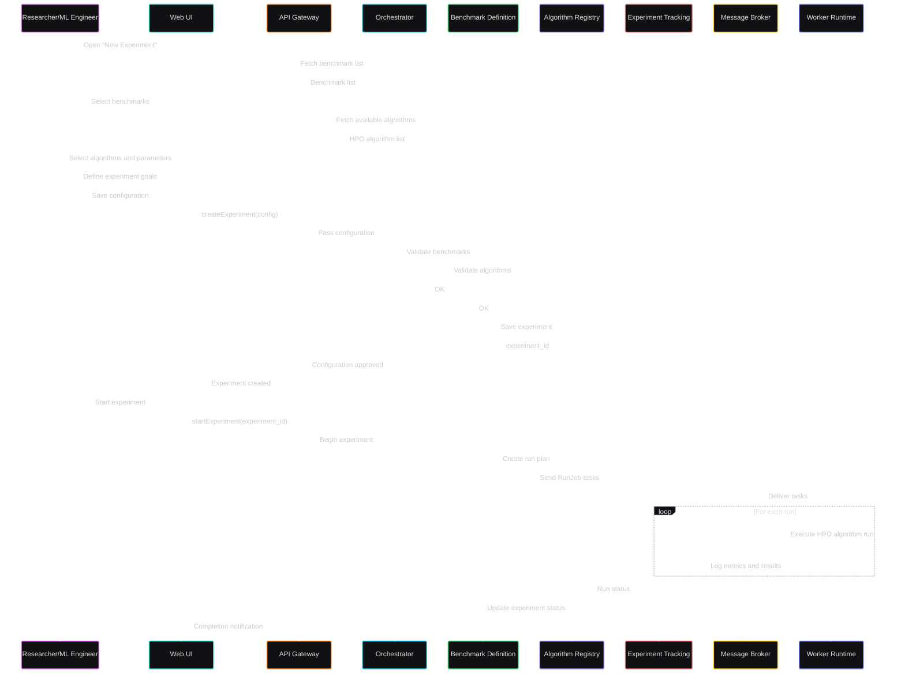
```mermaid
---
config:
  theme: redux-dark-color
---
sequenceDiagram
    participant A1 as Researcher/ML Engineer
    participant UI as Web UI
    participant API as API Gateway
    participant ORC as Orchestrator
    participant BDS as Benchmark Definition
    participant AR as Algorithm Registry
    participant ETS as Experiment Tracking
    participant MB as Message Broker
    participant WR as Worker Runtime
    
    A1->>UI: Open "New Experiment"
    UI->>BDS: Fetch benchmark list
    BDS-->>UI: Benchmark list
    A1->>UI: Select benchmarks
    UI->>AR: Fetch available algorithms
    AR-->>UI: HPO algorithm list
    A1->>UI: Select algorithms and parameters
    A1->>UI: Define experiment goals
    A1->>UI: Save configuration
    UI->>API: createExperiment(config)
    API->>ORC: Pass configuration
    ORC->>BDS: Validate benchmarks
    ORC->>AR: Validate algorithms
    BDS-->>ORC: OK
    AR-->>ORC: OK
    ORC->>ETS: Save experiment
    ETS-->>ORC: experiment_id
    ORC-->>API: Configuration approved
    API-->>UI: Experiment created
    A1->>UI: Start experiment
    UI->>API: startExperiment(experiment_id)
    API->>ORC: Begin experiment
    ORC->>ETS: Create run plan
    ORC->>MB: Send RunJob tasks
    MB-->>WR: Deliver tasks
    loop For each run
        WR->>WR: Execute HPO algorithm run
        WR->>ETS: Log metrics and results
    end
    WR-->>ORC: Run status
    ORC->>ETS: Update experiment status
    ORC-->>A1: Completion notification
```

#### Sequence Diagram - Alternative Scenario - Validation Error
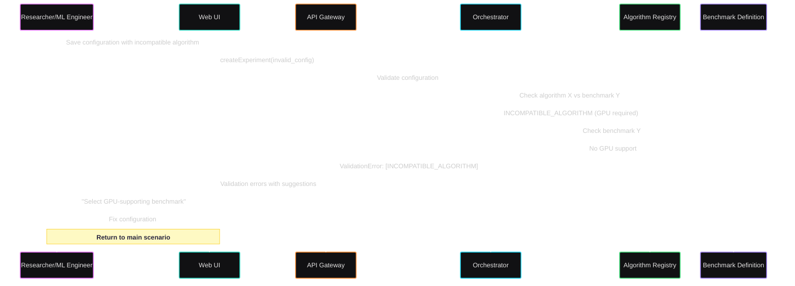
```mermaid
---
config:
  theme: redux-dark-color
---
sequenceDiagram
    participant A1 as Researcher/ML Engineer
    participant UI as Web UI
    participant API as API Gateway
    participant ORC as Orchestrator
    participant AR as Algorithm Registry
    participant BDS as Benchmark Definition
    A1->>UI: Save configuration with incompatible algorithm
    UI->>API: createExperiment(invalid_config)
    API->>ORC: Validate configuration
    ORC->>AR: Check algorithm X vs benchmark Y
    AR-->>ORC: INCOMPATIBLE_ALGORITHM (GPU required)
    ORC->>BDS: Check benchmark Y
    BDS-->>ORC: No GPU support
    ORC-->>API: ValidationError: [INCOMPATIBLE_ALGORITHM]
    API-->>UI: Validation errors with suggestions
    UI-->>A1: "Select GPU-supporting benchmark"
    A1->>UI: Fix configuration
    Note over A1,UI: Return to main scenario
```

---

## UC2: Add Built-in HPO Algorithm

### 📋 Basic Information

| Property | Value |
|----------|-------|
| **Primary actors** | Administrator |
| **Goal** | Adding a new built-in HPO algorithm to the system |
| **Level** | User goal |

### 📝 Main Scenario

1. **Algorithm preparation**
   - Administrator implements algorithm according to IAlgorithmPlugin interface
   - Prepares metadata: name, type, parameters, requirements

2. **System registration**
   - Administrator adds algorithm through Admin Panel
   - System validates implementation and compatibility

4. **Publication**
   - Algorithm receives `APPROVED` status
   - Becomes available to users in the catalog

### 📊 Diagramy

#### Diagram aktywności
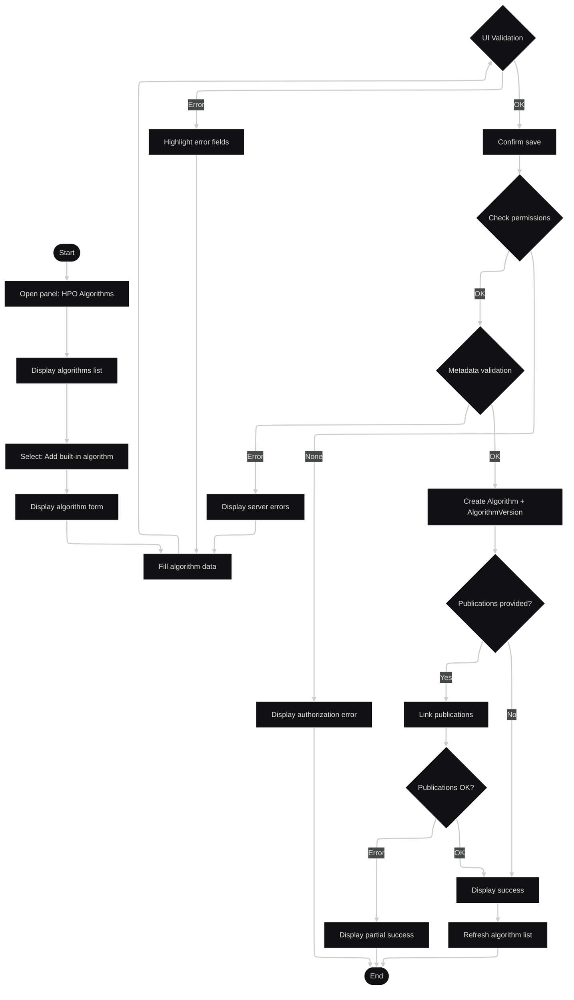
```mermaid
---
config:
  layout: elk
  theme: redux-dark
---
flowchart TB
    Start(["Start"]) --> OpenPanel["Open panel: HPO Algorithms"]
    OpenPanel --> ViewList["Display algorithms list"]
    ViewList --> SelectAdd["Select: Add built-in algorithm"]
    SelectAdd --> ShowForm["Display algorithm form"]
    ShowForm --> FillForm["Fill algorithm data"]
    FillForm --> ValidateUI{"UI Validation"}
    ValidateUI -- Error --> ShowUIErrors["Highlight error fields"]
    ShowUIErrors --> FillForm
    ValidateUI -- OK --> ConfirmSave["Confirm save"]
    ConfirmSave --> CheckPerms{"Check permissions"}
    CheckPerms -- None --> ShowAuthError["Display authorization error"]
    ShowAuthError --> End(["End"])
    CheckPerms -- OK --> ValidateMetadata{"Metadata validation"}
    ValidateMetadata -- Error --> ShowServerErrors["Display server errors"]
    ShowServerErrors --> FillForm
    ValidateMetadata -- OK --> CreateAlgorithm["Create Algorithm + AlgorithmVersion"]
    CreateAlgorithm --> CheckDOI{"Publications provided?"}
    CheckDOI -- No --> SaveSuccess["Display success"]
    CheckDOI -- Yes --> LinkPublications["Link publications"]
    LinkPublications --> PubSuccess{"Publications OK?"}
    PubSuccess -- Error --> PartialSuccess["Display partial success"]
    PubSuccess -- OK --> SaveSuccess
    SaveSuccess --> RefreshList["Refresh algorithm list"]
    RefreshList --> End
    PartialSuccess --> End
```

#### Sequence Diagram - Main Scenario
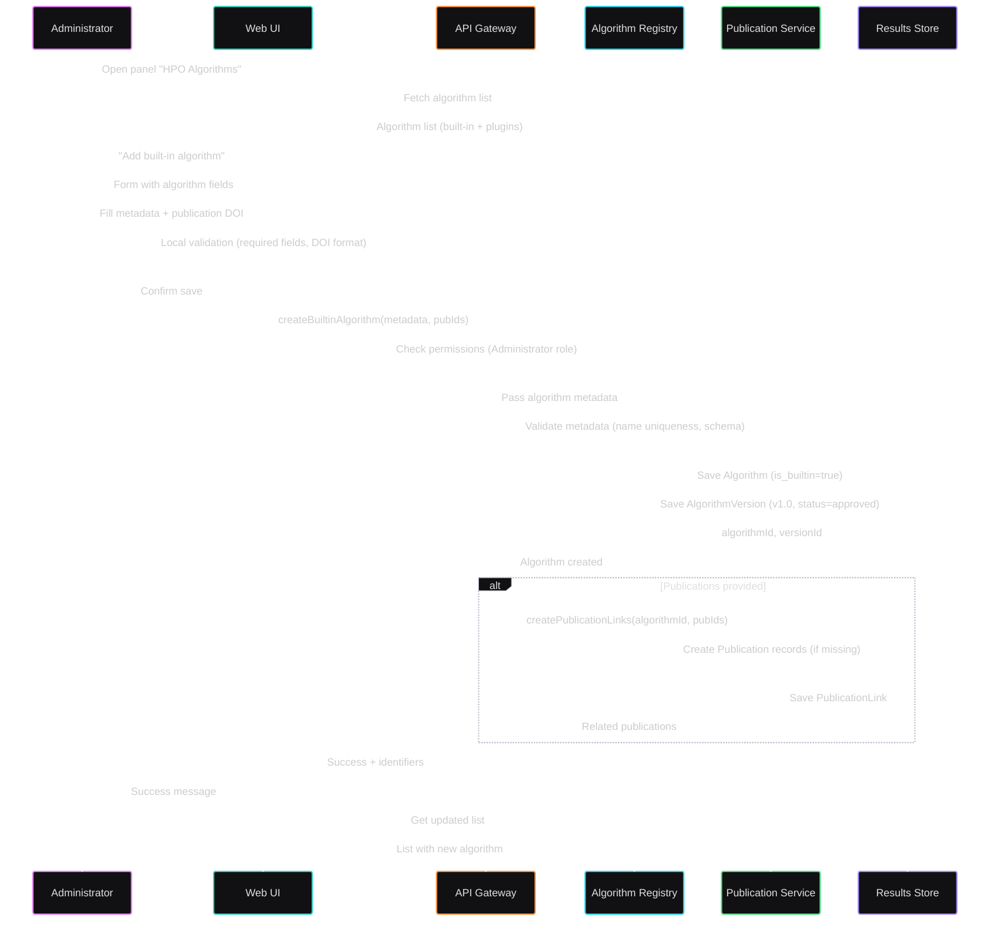
```mermaid
---
config:
  theme: redux-dark-color
---
sequenceDiagram
    participant A3 as Administrator
    participant UI as Web UI
    participant API as API Gateway
    participant AR as Algorithm Registry
    participant PS as Publication Service
    participant RS as Results Store
    A3->>UI: Open panel "HPO Algorithms"
    UI->>AR: Fetch algorithm list
    AR-->>UI: Algorithm list (built-in + plugins)
    A3->>UI: "Add built-in algorithm"
    UI-->>A3: Form with algorithm fields
    A3->>UI: Fill metadata + publication DOI
    UI->>UI: Local validation (required fields, DOI format)
    A3->>UI: Confirm save
    UI->>API: createBuiltinAlgorithm(metadata, pubIds)
    API->>API: Check permissions (Administrator role)
    API->>AR: Pass algorithm metadata
    AR->>AR: Validate metadata (name uniqueness, schema)
    AR->>RS: Save Algorithm (is_builtin=true)
    AR->>RS: Save AlgorithmVersion (v1.0, status=approved)
    RS-->>AR: algorithmId, versionId
    AR-->>API: Algorithm created
    alt Publications provided
        API->>PS: createPublicationLinks(algorithmId, pubIds)
        PS->>PS: Create Publication records (if missing)
        PS->>RS: Save PublicationLink
        PS-->>API: Related publications
    end
    API-->>UI: Success + identifiers
    UI-->>A3: Success message
    UI->>AR: Get updated list
    AR-->>UI: List with new algorithm
```

#### Diagram sekwencji - Scenariusz alternatywny - Błąd walidacji
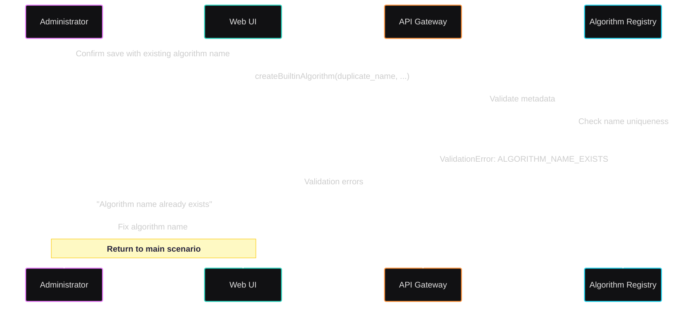
```mermaid
---
config:
  theme: redux-dark-color
---
sequenceDiagram
    participant A3 as Administrator
    participant UI as Web UI
    participant API as API Gateway
    participant AR as Algorithm Registry
    A3->>UI: Confirm save with existing algorithm name
    UI->>API: createBuiltinAlgorithm(duplicate_name, ...)
    API->>AR: Validate metadata
    AR->>AR: Check name uniqueness
    AR-->>API: ValidationError: ALGORITHM_NAME_EXISTS
    API-->>UI: Validation errors
    UI-->>A3: "Algorithm name already exists"
    A3->>UI: Fix algorithm name
    Note over A3,UI: Return to main scenario
```

---

## UC3: Implement and Register HPO Algorithm Plugin

### 📋 Basic Information

| Property | Value |
|----------|-------|
| **Primary actors** | HPO Algorithm Creator |
| **Goal** | Implementation and registration of custom algorithm as plugin |
| **Level** | User goal |

### 📝 Main Scenario

1. **Plugin implementation**
   - Creator uses Algorithm SDK to implement algorithm
   - Implements IAlgorithmPlugin interface

2. **Local testing**
   - Creator tests plugin locally using SDK

3. **Registration**
   - Creator submits plugin to system through Web UI
   - System performs validation and tests

4. **Approval**
   - Administrator reviews and approves plugin
   - Plugin becomes available to community

### 📊 Diagramy

#### Diagram aktywności
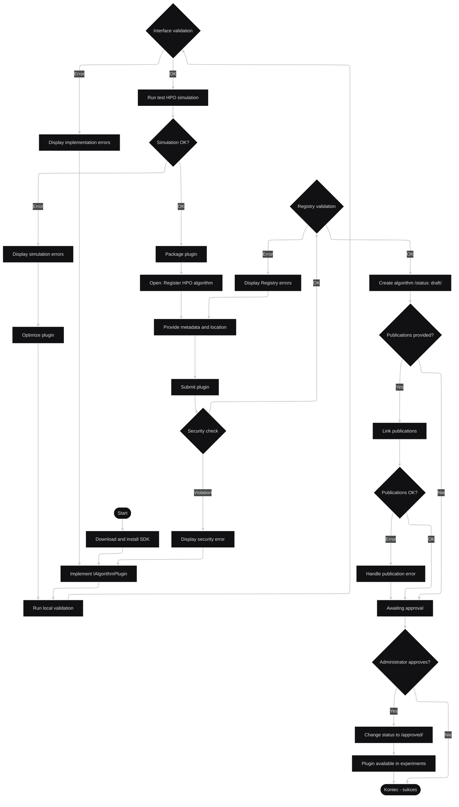
```mermaid
---
config:
  layout: elk
  theme: redux-dark
---
flowchart TB
    Start(["Start"]) --> InstallSDK["Download and install SDK"]
    InstallSDK --> ImplementPlugin["Implement IAlgorithmPlugin"]
    ImplementPlugin --> RunValidation["Run local validation"]
    RunValidation --> ValidateInterface{"Interface validation"}
    ValidateInterface -- Error --> ShowValidationErrors["Display implementation errors"]
    ShowValidationErrors --> ImplementPlugin
    ValidateInterface -- OK --> RunSimulation["Run test HPO simulation"]
    RunSimulation --> SimulationOK{"Simulation OK?"}
    SimulationOK -- Error --> ShowSimErrors["Display simulation errors"]
    ShowSimErrors --> OptimizePlugin["Optimize plugin"]
    OptimizePlugin --> RunValidation
    SimulationOK -- OK --> PackagePlugin["Package plugin"]
    PackagePlugin --> OpenRegistry["Open: Register HPO algorithm"]
    OpenRegistry --> FillMetadata["Provide metadata and location"]
    FillMetadata --> SubmitPlugin["Submit plugin"]
    SubmitPlugin --> CheckSecurity{"Security check"}
    CheckSecurity -- Violation --> ShowSecurityError["Display security error"]
    ShowSecurityError --> ImplementPlugin
    CheckSecurity -- OK --> ValidateRegistry{"Registry validation"}
    ValidateRegistry -- Error --> ShowRegistryErrors["Display Registry errors"]
    ShowRegistryErrors --> FillMetadata
    ValidateRegistry -- OK --> CreateDraft["Create algorithm /status: draft/"]
    CreateDraft --> CheckDOI{"Publications provided?"}
    CheckDOI -- Yes --> LinkPubs["Link publications"]
    LinkPubs --> PubsOK{"Publications OK?"}
    PubsOK -- Error --> HandlePubError["Handle publication error"]
    HandlePubError --> ApprovalPending["Awaiting approval"]
    PubsOK -- OK --> ApprovalPending
    CheckDOI -- Nie --> ApprovalPending
    ApprovalPending --> AdminApproval{"Administrator approves?"}
    AdminApproval -- Yes --> ChangeStatus["Change status to /approved/"]
    AdminApproval -- Nie --> End(["Koniec - sukces"])
    ChangeStatus --> Available["Plugin available in experiments"]
    Available --> End
```

#### Diagram sekwencji - Główny scenariusz
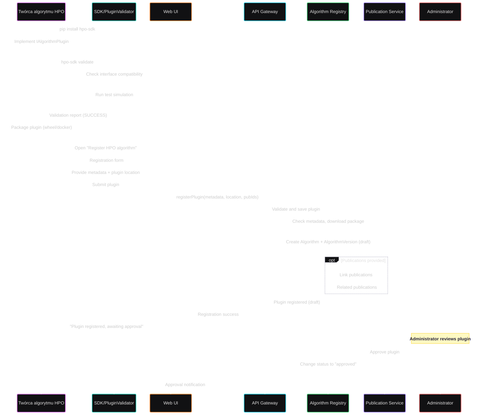
```mermaid
---
config:
  theme: redux-dark-color
---
sequenceDiagram
    participant A2 as Twórca algorytmu HPO
    participant SDK as SDK/PluginValidator
    participant UI as Web UI
    participant API as API Gateway
    participant AR as Algorithm Registry
    participant PS as Publication Service
    participant A3 as Administrator
    A2->>SDK: pip install hpo-sdk
    A2->>A2: Implement IAlgorithmPlugin
    A2->>SDK: hpo-sdk validate
    SDK->>SDK: Check interface compatibility
    SDK->>SDK: Run test simulation
    SDK-->>A2: Validation report (SUCCESS)
    A2->>A2: Package plugin (wheel/docker)
    A2->>UI: Open "Register HPO algorithm"
    UI-->>A2: Registration form
    A2->>UI: Provide metadata + plugin location
    A2->>UI: Submit plugin
    UI->>API: registerPlugin(metadata, location, pubIds)
    API->>AR: Validate and save plugin
    AR->>AR: Check metadata, download package
    AR->>AR: Create Algorithm + AlgorithmVersion (draft)
    opt Publications provided
    AR->>PS: Link publications
    PS-->>AR: Related publications
    end
    AR-->>API: Plugin registered (draft)
    API-->>UI: Registration success
    UI-->>A2: "Plugin registered, awaiting approval"
    Note over A3: Administrator reviews plugin
    A3->>AR: Approve plugin
    AR->>AR: Change status to "approved"
    AR-->>A2: Approval notification
```

#### Sequence diagram - Alternative scenario - Local validation error
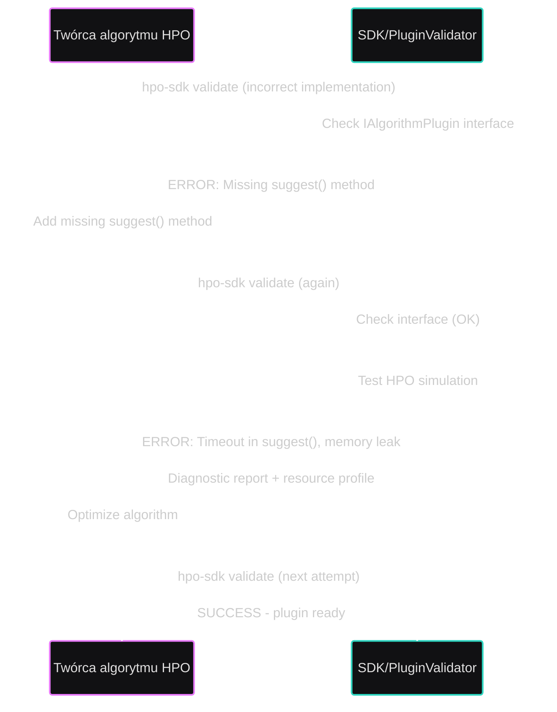
```mermaid
---
config:
  theme: redux-dark-color
---
sequenceDiagram
    participant A2 as Twórca algorytmu HPO
    participant SDK as SDK/PluginValidator
    A2->>SDK: hpo-sdk validate (incorrect implementation)
    SDK->>SDK: Check IAlgorithmPlugin interface
    SDK-->>A2: ERROR: Missing suggest() method
    A2->>A2: Add missing suggest() method
    A2->>SDK: hpo-sdk validate (again)
    SDK->>SDK: Check interface (OK)
    SDK->>SDK: Test HPO simulation
    SDK-->>A2: ERROR: Timeout in suggest(), memory leak
    SDK-->>A2: Diagnostic report + resource profile
    A2->>A2: Optimize algorithm
    A2->>SDK: hpo-sdk validate (next attempt)
    SDK-->>A2: SUCCESS - plugin ready
```

#### Diagram sekwencji - Scenariusz alternatywny - Naruszenie bezpieczeństwa
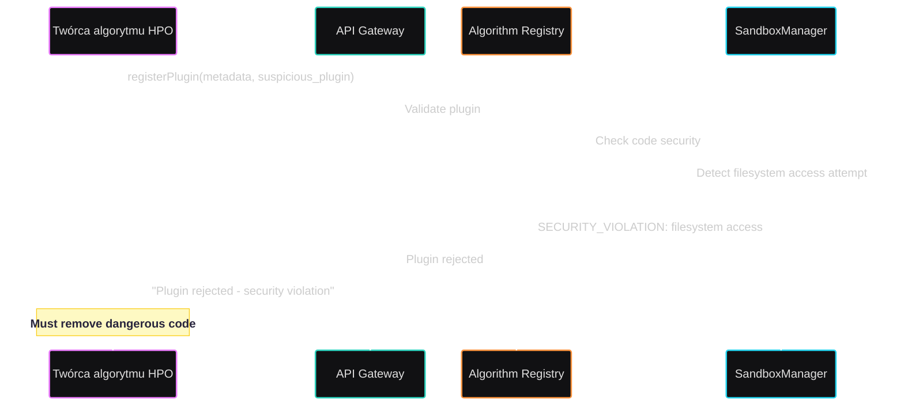
```mermaid
---
config:
  theme: redux-dark-color
---
sequenceDiagram
    participant A2 as Twórca algorytmu HPO
    participant API as API Gateway
    participant AR as Algorithm Registry
    participant SM as SandboxManager
    A2->>API: registerPlugin(metadata, suspicious_plugin)
    API->>AR: Validate plugin
    AR->>SM: Check code security
    SM->>SM: Detect filesystem access attempt
    SM-->>AR: SECURITY_VIOLATION: filesystem access
    AR-->>API: Plugin rejected
    API-->>A2: "Plugin rejected - security violation"
    Note over A2: Must remove dangerous code
```

---

## UC4: Compare Algorithm Results

### 📋 Basic Information

| Property | Value |
|----------|-------|
| **Primary actors** | Researcher / ML Engineer |
| **Goal** | Comparison of performance of different HPO algorithms |
| **Level** | User goal |

### 📝 Main Scenario

1. **Experiment selection**
   - Researcher selects experiments for comparison
   - System loads data from Experiment Tracking Service

2. **Comparison configuration**
   - Selection of metrics for comparison
   - Visualization settings (charts, tables)

3. **Statistical analysis**
   - System performs statistical tests
   - Generates rankings and significance levels

4. **Visualization**
   - Display of comparative charts
   - Tables with results and statistics

---

## UC5: Browse and Filter Experiments

### 📋 Basic Information

| Property | Value |
|----------|-------|
| **Primary actors** | Researcher / ML Engineer |
| **Goal** | Browsing experiment history and searching |
| **Level** | User goal |

### 📝 Main Scenario

1. **Dashboard access**
   - Researcher opens Tracking Dashboard UI
   - System displays list of experiments

2. **Filtering**
   - Application of filters: status, tags, dates, algorithms
   - System updates result list

3. **Experiment details**
   - Selection of experiment from list
   - Display of details: runs, metrics, logs

### 📊 Diagramy

#### Diagram aktywności
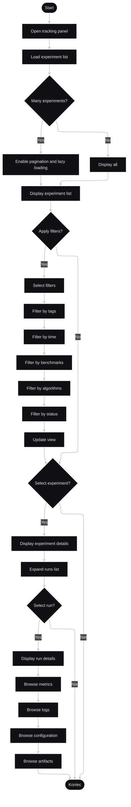
```mermaid
---
config:
  layout: elk
  theme: redux-dark
---
flowchart TB
    Start(["Start"]) --> OpenPanel["Open tracking panel"]
    OpenPanel --> LoadExperiments["Load experiment list"]
    LoadExperiments --> CheckCount{"Many experiments?"}
    CheckCount -- Yes --> EnablePagination["Enable pagination and lazy loading"]
    CheckCount -- No --> ShowAll["Display all"]
    EnablePagination --> ShowFiltered["Display experiment list"]
    ShowAll --> ShowFiltered
    ShowFiltered --> ApplyFilters{"Apply filters?"}
    ApplyFilters -- Yes --> SelectFilters["Select filters"]
    SelectFilters --> FilterByTags["Filter by tags"]
    FilterByTags --> FilterByTime["Filter by time"]
    FilterByTime --> FilterByBenchmark["Filter by benchmarks"]
    FilterByBenchmark --> FilterByAlgorithm["Filter by algorithms"]
    FilterByAlgorithm --> FilterByStatus["Filter by status"]
    FilterByStatus --> UpdateView["Update view"]
    ApplyFilters -- No --> SelectExperiment{"Select experiment?"}
    UpdateView --> SelectExperiment
    SelectExperiment -- Yes --> ShowDetails["Display experiment details"]
    SelectExperiment -- Nie --> End(["Koniec"])
    ShowDetails --> ExpandRuns["Expand runs list"]
    ExpandRuns --> SelectRun{"Select run?"}
    SelectRun -- Yes --> ShowRunDetails["Display run details"]
    SelectRun -- Nie --> End
    ShowRunDetails --> ViewMetrics["Browse metrics"]
    ViewMetrics --> ViewLogs["Browse logs"]
    ViewLogs --> ViewConfig["Browse configuration"]
    ViewConfig --> ViewArtifacts["Browse artifacts"]
    ViewArtifacts --> End
```

#### Diagram sekwencji - Główny scenariusz

```mermaid
---
config:
  theme: redux-dark-color
---
sequenceDiagram
    participant User as User (A1/A2)
    participant UI as Web UI
    participant ETS as Experiment Tracking Service
    participant Cache as Cache Layer
    User->>UI: Otwórz panel śledzenia
    UI->>Cache: Check experiments cache
    Cache-->>UI: Cache miss/expired
    UI->>ETS: getExperimentsList()
    ETS-->>UI: Experiments list + metadata
    UI->>Cache: Save in cache
    UI-->>User: Experiments list with filters
    User->>UI: Apply filters (tags, time, benchmark)
    UI->>ETS: getFilteredExperiments(filters)
    ETS-->>UI: Filtered experiments + aggregates
    UI-->>User: Updated view
    User->>UI: Wybierz eksperyment X
    UI->>ETS: getExperimentDetails(experiment_id)
    ETS-->>UI: Experiment details
    UI-->>User: Experiment details
    User->>UI: Expand experiment runs
    UI->>ETS: getRunsList(experiment_id)
    ETS-->>UI: Experiment runs list
    UI-->>User: Runs list with statuses
    User->>UI: Select run Y
    UI->>ETS: getRunDetails(run_id)
    ETS-->>UI: Metrics, logs, configuration, artifacts
    UI-->>User: Complete run details
```

#### Diagram sekwencji - Scenariusz z paginacją (duża liczba eksperymentów)
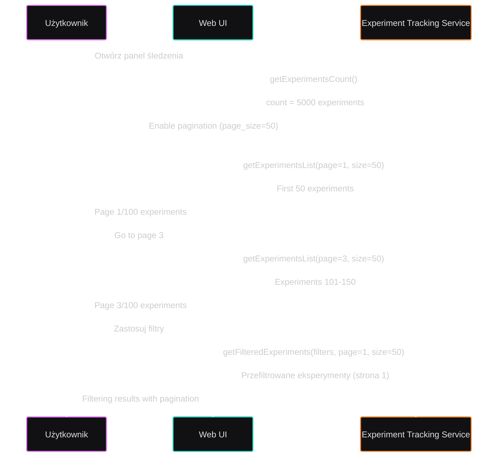
```mermaid
---
config:
  theme: redux-dark-color
---
sequenceDiagram
    participant User as Użytkownik
    participant UI as Web UI
    participant ETS as Experiment Tracking Service
    User->>UI: Otwórz panel śledzenia
    UI->>ETS: getExperimentsCount()
    ETS-->>UI: count = 5000 experiments
    UI->>UI: Enable pagination (page_size=50)
    UI->>ETS: getExperimentsList(page=1, size=50)
    ETS-->>UI: First 50 experiments
    UI-->>User: Page 1/100 experiments
    User->>UI: Go to page 3
    UI->>ETS: getExperimentsList(page=3, size=50)
    ETS-->>UI: Experiments 101-150
    UI-->>User: Page 3/100 experiments
    User->>UI: Zastosuj filtry
    UI->>ETS: getFilteredExperiments(filters, page=1, size=50)
    ETS-->>UI: Przefiltrowane eksperymenty (strona 1)
    UI-->>User: Filtering results with pagination
```

#### Activity diagram - Lazy loading run details
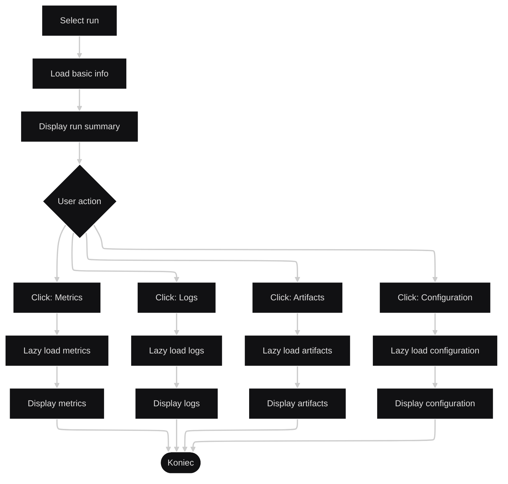
```mermaid
---
config:
  theme: redux-dark
  layout: elk
---
flowchart TB
    SelectRun["Select run"] --> LoadBasic["Load basic info"]
    LoadBasic --> ShowRunSummary["Display run summary"]
    ShowRunSummary --> UserAction{"User action"}
    UserAction --> ViewMetrics["Click: Metrics"] & ViewLogs["Click: Logs"] & ViewArtifacts["Click: Artifacts"] & ViewConfig["Click: Configuration"]
    ViewMetrics --> LazyLoadMetrics["Lazy load metrics"]
    ViewLogs --> LazyLoadLogs["Lazy load logs"]
    ViewArtifacts --> LazyLoadArtifacts["Lazy load artifacts"]
    ViewConfig --> LazyLoadConfig["Lazy load configuration"]
    LazyLoadMetrics --> ShowMetrics["Display metrics"]
    LazyLoadLogs --> ShowLogs["Display logs"]
    LazyLoadArtifacts --> ShowArtifacts["Display artifacts"]
    LazyLoadConfig --> ShowConfig["Display configuration"]
    ShowMetrics --> End(["Koniec"])
    ShowLogs --> End
    ShowArtifacts --> End
    ShowConfig --> End
```

---# Sequence diagram - Alternative scenario - Incomplete data
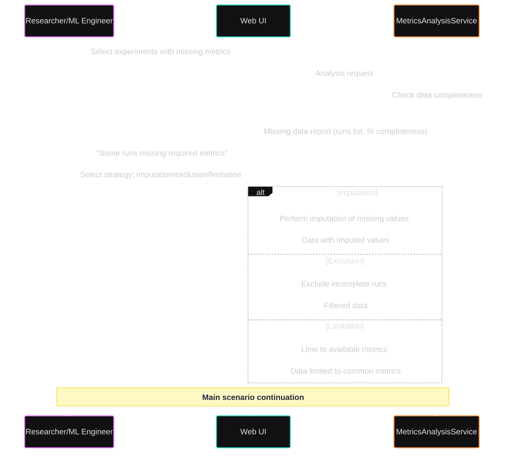
```mermaid
---
config:
  theme: redux-dark-color
---
sequenceDiagram
    participant A1 as Researcher/ML Engineer
    participant UI as Web UI
    participant MAS as MetricsAnalysisService
    A1->>UI: Select experiments with missing metrics
    UI->>MAS: Analysis request
    MAS->>MAS: Check data completeness
    MAS-->>UI: Missing data report (runs list, % completeness)
    UI-->>A1: "Some runs missing required metrics"
    A1->>UI: Select strategy: imputation/exclusion/limitation
    alt Imputation
    UI->>MAS: Perform imputation of missing values
    MAS-->>UI: Data with imputed values
    else Exclusion
    UI->>MAS: Exclude incomplete runs
    MAS-->>UI: Filtered data
    else Limitation
    UI->>MAS: Limit to available metrics
    MAS-->>UI: Data limited to common metrics
    end
    Note over A1,MAS: Main scenario continuation
```

#### Activity diagram - Computational error handling

```mermaid
---
config:
  theme: redux-dark
  layout: elk
---
flowchart TB
    PerformTests["Perform statistical tests"] --> TestsOK{"Tests OK?"}
    TestsOK -- Yes --> ReturnResults["Return results"]
    TestsOK -- No --> LogError["Log numerical error"]
    LogError --> TryAlternative{"Alternative test?"}
    TryAlternative -- Yes --> UseFriedman["Use Friedman test"]
    UseFriedman --> FriedmanOK{"Friedman OK?"}
    FriedmanOK -- No --> UseKruskal["Use Kruskal-Wallis"]
    UseKruskal --> KruskalOK{"Kruskal OK?"}
    KruskalOK -- No --> UseNonParametric["Use non-parametric tests"]
    UseNonParametric --> InformUser["Inform about method change"]
    FriedmanOK -- Yes --> InformUser
    KruskalOK -- Yes --> InformUser
    TryAlternative -- No --> ReportError["Report analysis error"]
    InformUser --> ReturnResults
    ReportError --> End(["End - success"])
    ReturnResults --> End
```

---

## UC6: Manage paper references

### 📋 Podstawowe informacje

| Właściwość | Wartość |
|------------|---------|
| **Primary actors** | Researcher / Administrator |
| **Goal** | Adding and linking scientific publications with algorithms/benchmarks |
| **Poziom** | User goal |

### 📝 Główny scenariusz

1. **Publication addition**
   - User enters publication metadata (DOI, BibTeX)
   - System enriches data from external sources (CrossRef, arXiv)

2. **Linking with elements**
   - Linking publications with algorithms or benchmarks
   - Metadata update in Registry Services

3. **Bibliography management**
   - Editing and updating existing entries
   - Citation generation in various formats

### 📊 Diagramy

#### Diagram aktywności
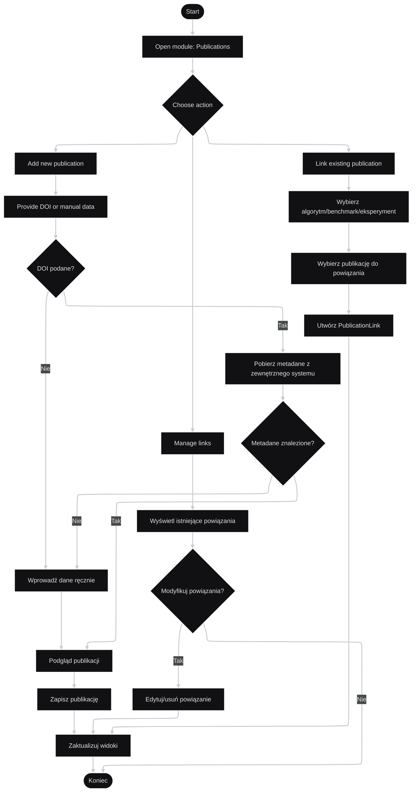
```mermaid
---
config:
  layout: elk
  theme: redux-dark
---
flowchart TB
    Start(["Start"]) --> OpenPublications["Open module: Publications"]
    OpenPublications --> ChooseAction{"Choose action"}
    ChooseAction --> AddPublication["Add new publication"] & LinkExisting["Link existing publication"] & ManageLinks["Manage links"]
    AddPublication --> EnterData["Provide DOI or manual data"]
    EnterData --> CheckDOI{"DOI podane?"}
    CheckDOI -- Tak --> FetchMetadata["Pobierz metadane z zewnętrznego systemu"]
    CheckDOI -- Nie --> ManualEntry["Wprowadź dane ręcznie"]
    FetchMetadata --> MetadataFound{"Metadane znalezione?"}
    MetadataFound -- Nie --> ManualEntry
    MetadataFound -- Tak --> PreviewPublication["Podgląd publikacji"]
    ManualEntry --> PreviewPublication
    PreviewPublication --> SavePublication["Zapisz publikację"]
    LinkExisting --> SelectTarget["Wybierz algorytm/benchmark/eksperyment"]
    SelectTarget --> SelectPublication["Wybierz publikację do powiązania"]
    SelectPublication --> CreateLink["Utwórz PublicationLink"]
    ManageLinks --> ViewLinks["Wyświetl istniejące powiązania"]
    ViewLinks --> ModifyLinks{"Modyfikuj powiązania?"}
    ModifyLinks -- Tak --> EditLink["Edytuj/usuń powiązanie"]
    ModifyLinks -- Nie --> End(["Koniec"])
    SavePublication --> UpdateViews["Zaktualizuj widoki"]
    CreateLink --> UpdateViews
    EditLink --> UpdateViews
    UpdateViews --> End
```

#### Diagram sekwencji - Główny scenariusz
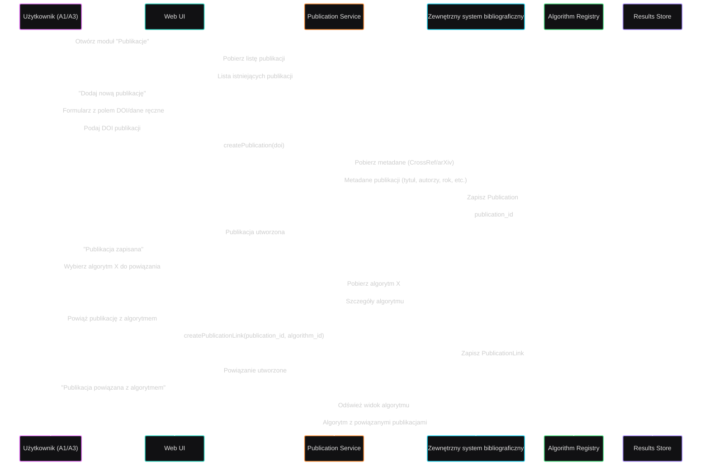
```mermaid
---
config:
  theme: redux-dark-color
---
sequenceDiagram
    participant User as Użytkownik (A1/A3)
    participant UI as Web UI
    participant PS as Publication Service
    participant EXT as Zewnętrzny system bibliograficzny
    participant AR as Algorithm Registry
    participant RS as Results Store
    User->>UI: Otwórz moduł "Publikacje"
    UI->>PS: Pobierz listę publikacji
    PS-->>UI: Lista istniejących publikacji
    User->>UI: "Dodaj nową publikację"
    UI-->>User: Formularz z polem DOI/dane ręczne
    User->>UI: Podaj DOI publikacji
    UI->>PS: createPublication(doi)
    PS->>EXT: Pobierz metadane (CrossRef/arXiv)
    EXT-->>PS: Metadane publikacji (tytuł, autorzy, rok, etc.)
    PS->>RS: Zapisz Publication
    RS-->>PS: publication_id
    PS-->>UI: Publikacja utworzona
    UI-->>User: "Publikacja zapisana"
    User->>UI: Wybierz algorytm X do powiązania
    UI->>AR: Pobierz algorytm X
    AR-->>UI: Szczegóły algorytmu
    User->>UI: Powiąż publikację z algorytmem
    UI->>PS: createPublicationLink(publication_id, algorithm_id)
    PS->>RS: Zapisz PublicationLink
    PS-->>UI: Powiązanie utworzone
    UI-->>User: "Publikacja powiązana z algorytmem"
    UI->>AR: Odśwież widok algorytmu
    AR-->>UI: Algorytm z powiązanymi publikacjami
```

#### Diagram sekwencji - Scenariusz alternatywny - DOI nieznalezione
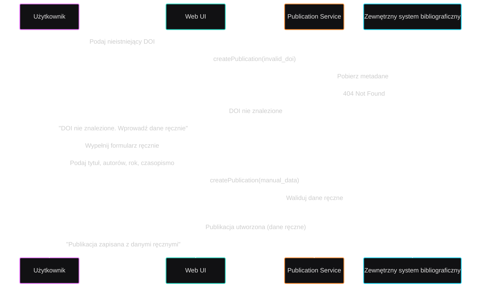
```mermaid
---
config:
  theme: redux-dark-color
---
sequenceDiagram
    participant User as Użytkownik
    participant UI as Web UI
    participant PS as Publication Service
    participant EXT as Zewnętrzny system bibliograficzny
    User->>UI: Podaj nieistniejący DOI
    UI->>PS: createPublication(invalid_doi)
    PS->>EXT: Pobierz metadane
    EXT-->>PS: 404 Not Found
    PS-->>UI: DOI nie znalezione
    UI-->>User: "DOI nie znalezione. Wprowadź dane ręcznie"
    User->>UI: Wypełnij formularz ręcznie
    User->>UI: Podaj tytuł, autorów, rok, czasopismo
    UI->>PS: createPublication(manual_data)
    PS->>PS: Waliduj dane ręczne
    PS-->>UI: Publikacja utworzona (dane ręczne)
    UI-->>User: "Publikacja zapisana z danymi ręcznymi"
```

#### Diagram aktywności - Zarządzanie powiązaniami
```mermaid
---
config:
  theme: redux-dark
  layout: elk
---
flowchart TB
    ViewLinks["Wyświetl powiązania"] --> FilterLinks{"Filtruj powiązania?"}
    FilterLinks -- Tak --> ApplyFilter["Zastosuj filtry"]
    FilterLinks -- Nie --> ShowAllLinks["Pokaż wszystkie powiązania"]
    ApplyFilter --> ShowFilteredLinks["Pokaż przefiltrowane"]
    ShowAllLinks --> SelectLink{"Wybierz powiązanie?"}
    ShowFilteredLinks --> SelectLink
    SelectLink -- Nie --> End(["Koniec"])
    SelectLink -- Tak --> ChooseLinkAction{"Wybierz akcję"}
    ChooseLinkAction --> EditLink["Edytuj powiązanie"] & DeleteLink["Usuń powiązanie"] & ViewDetails["Wyświetl szczegóły"]
    EditLink --> UpdateLink["Zaktualizuj powiązanie"]
    DeleteLink --> ConfirmDelete{"Potwierdź usunięcie?"}
    ConfirmDelete -- Tak --> RemoveLink["Usuń powiązanie"]
    ConfirmDelete -- Nie --> SelectLink
    ViewDetails --> SelectLink
    UpdateLink --> RefreshView["Odśwież widok"]
    RemoveLink --> RefreshView
    RefreshView --> End
```

---

## UC7: Uruchom system lokalnie na PC

### 📋 Podstawowe informacje

| Właściwość | Wartość |
|------------|---------|
| **Aktorzy główni** | Administrator |
| **Cel** | Deployment systemu w środowisku PC/laboratoryjnym |
| **Poziom** | System goal |

### 📝 Główny scenariusz

1. **Przygotowanie środowiska**
   - Instalacja Docker i docker-compose
   - Klonowanie repozytorium z konfiguracją

2. **Konfiguracja**
   - Edycja plików konfiguracyjnych
   - Ustawienie zmiennych środowiskowych

3. **Uruchomienie**
   - Wykonanie `docker-compose up`
   - Weryfikacja działania wszystkich serwisów

4. **Inicjalizacja danych**
   - Import przykładowych benchmarków
   - Konfiguracja wbudowanych algorytmów

### 📊 Diagramy

#### Diagram aktywności
```mermaid
---
config:
  layout: elk
  theme: redux-dark
---
flowchart TB
    Start(["Start"]) --> CheckDocker{"Docker zainstalowany?"}
    CheckDocker -- Nie --> InstallDocker["Zainstaluj Docker"]
    CheckDocker -- Tak --> CloneRepo["Sklonuj repozytorium konfiguracji"]
    InstallDocker --> CloneRepo
    CloneRepo --> ConfigureEnv["Skonfiguruj plik .env"]
    ConfigureEnv --> CheckPorts{"Porty dostępne?"}
    CheckPorts -- Nie --> ModifyPorts["Zmodyfikuj porty w docker-compose.yml"]
    CheckPorts -- Tak --> StartContainers["docker-compose up -d"]
    ModifyPorts --> StartContainers
    StartContainers --> WaitInit["Czekaj na inicjalizację kontenerów"]
    WaitInit --> CheckDB{"DB gotowa?"}
    CheckDB -- Nie --> FixDBIssues["Napraw problemy z DB"]
    CheckDB -- Tak --> CheckBroker{"Message Broker gotowy?"}
    FixDBIssues --> CheckDB
    CheckBroker -- Nie --> FixBrokerIssues["Napraw problemy z Brokerem"]
    CheckBroker -- Tak --> CheckAPI{"API Gateway gotowy?"}
    FixBrokerIssues --> CheckBroker
    CheckAPI -- Nie --> FixAPIIssues["Napraw problemy z API"]
    CheckAPI -- Tak --> CheckWorkers{"Workery gotowe?"}
    FixAPIIssues --> CheckAPI
    CheckWorkers -- Nie --> FixWorkerIssues["Napraw problemy z Workerami"]
    CheckWorkers -- Tak --> CheckUI{"Web UI dostępny?"}
    FixWorkerIssues --> CheckWorkers
    CheckUI -- Nie --> FixUIIssues["Napraw problemy z UI"]
    CheckUI -- Tak --> VerifyHealth["Sprawdź health-check endpoints"]
    FixUIIssues --> CheckUI
    VerifyHealth --> HealthOK{"Wszystkie serwisy OK?"}
    HealthOK -- Nie --> DiagnoseIssues["Diagnozuj problemy z logów"]
    HealthOK -- Tak --> OpenBrowser["Otwórz Web UI w przeglądarce"]
    DiagnoseIssues --> FixIssues["Napraw zidentyfikowane problemy"]
    FixIssues --> VerifyHealth
    OpenBrowser --> SystemReady["System gotowy do użycia"]
    SystemReady --> End(["Koniec - sukces"])
```

#### Diagram sekwencji - Główny scenariusz
```mermaid
---
config:
  theme: redux-dark-color
---
sequenceDiagram
    participant A3 as Administrator
    participant Docker as Docker Engine
    participant DB as Results Store (DB)
    participant MB as Message Broker
    participant API as API Gateway
    participant ETS as Experiment Tracking
    participant WR as Worker Runtime
    participant UI as Web UI
    participant MON as Monitoring
    A3->>A3: Sklonuj repo, skonfiguruj .env
    A3->>Docker: docker-compose up -d
    Docker->>DB: Uruchom kontener PostgreSQL
    Docker->>MB: Uruchom kontener RabbitMQ
    Docker->>API: Uruchom kontener API Gateway
    Docker->>ETS: Uruchom kontener Tracking Service
    Docker->>WR: Uruchom kontener(y) Worker Runtime
    Docker->>UI: Uruchom kontener Web UI
    Docker->>MON: Uruchom kontener Monitoring (opcjonalnie)
    DB->>DB: Inicjalizuj bazę danych
    MB->>MB: Utwórz kolejki (RunJob, etc.)
    API->>DB: Połącz z bazą danych
    API->>MB: Połącz z Message Brokerem
    ETS->>DB: Wykonaj migracje schematu
    WR->>MB: Subskrybuj kolejkę RunJob
    UI->>API: Sprawdź połączenie z API
    A3->>Docker: docker ps (sprawdź statusy)
    Docker-->>A3: Wszystkie kontenery uruchomione
    A3->>API: curl http://localhost:8080/healthz
    API-->>A3: HTTP 200 OK
    A3->>UI: Otwórz http://localhost:3000
    UI-->>A3: Strona logowania/główna wyświetlona
```

#### Diagram sekwencji - Scenariusz alternatywny - Konflikt portów
```mermaid
---
config:
  theme: redux-dark-color
---
sequenceDiagram
    participant A3 as Administrator
    participant Docker as Docker Engine
    participant System as System (port already in use)
    A3->>Docker: docker-compose up -d
    Docker->>System: Próba bindowania portu 8080
    System-->>Docker: Error: Port 8080 already in use
    Docker-->>A3: Startup error - port conflict
    A3->>A3: Edytuj docker-compose.yml (8080 → 8081)
    A3->>A3: Aktualizuj .env (UI_PORT=8081)
    A3->>Docker: docker-compose up -d
    Docker->>System: Próba bindowania portu 8081
    System-->>Docker: Port 8081 available
    Docker-->>A3: Kontenery uruchomione poprawnie
```

#### Diagram aktywności - Diagnoza problemów
```mermaid
---
config:
  theme: redux-dark
  layout: elk
---
flowchart TB
    ContainerFail["Kontener się nie uruchamia"] --> CheckLogs["Sprawdź logi kontenera"]
    CheckLogs --> LogType{"Typ błędu"}
    LogType --> PermissionError["Volume permission error"] & ConfigError["Configuration error"] & ResourceError["Resource shortage"] & NetworkError["Network/connection error"]
    PermissionError --> FixPermissions["Popraw uprawnienia do katalogów"]
    ConfigError --> FixConfig["Popraw konfigurację w .env"]
    ResourceError --> FreeResources["Zwolnij zasoby lub zwiększ limity"]
    NetworkError --> CheckNetwork["Sprawdź sieci Docker"]
    FixPermissions --> RestartContainer["Restartuj kontener"]
    FixConfig --> RestartContainer
    FreeResources --> RestartContainer
    CheckNetwork --> FixNetworkIssue["Napraw problemy sieci"]
    FixNetworkIssue --> RestartContainer
    RestartContainer --> TestAgain["Przetestuj ponownie"]
    TestAgain --> Success{"Sukces?"}
    Success -- Tak --> End(["Problem rozwiązany"])
    Success -- Nie --> CheckLogs
```

---

## UC8: Uruchom system w chmurze / skaluj workerów

### 📋 Podstawowe informacje

| Właściwość | Wartość |
|------------|---------|
| **Aktorzy główni** | Administrator DevOps/SRE |
| **Cel** | Deployment i skalowanie systemu w środowisku chmurowym |
| **Poziom** | System goal |

### 📝 Główny scenariusz

1. **Przygotowanie infrastruktury**
   - Konfiguracja klastra Kubernetes
   - Ustawienie zarządzanych usług (DB, Storage, Message Broker)

2. **Deployment aplikacji**
   - Zastosowanie manifestów Kubernetes
   - Konfiguracja load balancerów i ingress

3. **Skalowanie**
   - Konfiguracja HPA (Horizontal Pod Autoscaler)
   - Monitoring obciążenia i automatyczne skalowanie workerów

4. **Monitoring i alerting**
   - Deployment stacku monitorującego
   - Konfiguracja alertów i dashboardów

### 📊 Diagramy

#### Diagram aktywności
```mermaid
---
config:
  layout: elk
  theme: redux-dark
---
flowchart TB
    Start(["Start"]) --> PrepareConfig["Przygotuj konfigurację chmurową"]
    PrepareConfig --> CommitChanges["Commit zmiany do repozytorium"]
    CommitChanges --> TriggerPipeline["CI/CD wykrywa zmiany"]
    TriggerPipeline --> RunPipeline["Uruchom pipeline wdrożeniowy"]
    RunPipeline --> ValidateManifests{"Manifesty poprawne?"}
    ValidateManifests -- Nie --> FixManifests["Popraw manifesty/konfigurację"]
    FixManifests --> CommitChanges
    ValidateManifests -- Tak --> DeployToK8s["Wdróż do Kubernetes"]
    DeployToK8s --> CheckResources{"Wystarczające zasoby?"}
    CheckResources -- Nie --> ScaleCluster["Zwiększ zasoby klastra"]
    CheckResources -- Tak --> CreatePods["Utwórz/zaktualizuj pody"]
    ScaleCluster --> CreatePods
    CreatePods --> WaitForPods["Czekaj na uruchomienie podów"]
    WaitForPods --> CheckHealth{"Health checks OK?"}
    CheckHealth -- Nie --> DiagnosePods["Diagnozuj problemy podów"]
    CheckHealth -- Tak --> SetupMonitoring["Skonfiguruj monitoring"]
    DiagnosePods --> FixPodIssues["Napraw problemy podów"]
    FixPodIssues --> CheckHealth
    SetupMonitoring --> ConfigureHPA["Skonfiguruj HPA dla workerów"]
    ConfigureHPA --> TestHPA["Przetestuj skalowanie HPA"]
    TestHPA --> HPAWorks{"HPA działa poprawnie?"}
    HPAWorks -- Nie --> FixHPA["Napraw konfigurację HPA"]
    FixHPA --> TestHPA
    HPAWorks -- Tak --> ExposeServices["Skonfiguruj Ingress/LoadBalancer"]
    ExposeServices --> TestAccess["Przetestuj dostęp do Web UI"]
    TestAccess --> AccessOK{"Dostęp OK?"}
    AccessOK -- Nie --> FixIngress["Napraw konfigurację Ingress"]
    FixIngress --> TestAccess
    AccessOK -- Tak --> SystemReady["System gotowy w chmurze"]
    SystemReady --> MonitorSystem["Monitoruj system i skalowanie"]
    MonitorSystem --> End(["Koniec - sukces"])
```

#### Diagram sekwencji - Główny scenariusz
```mermaid
---
config:
  theme: redux-dark-color
---
sequenceDiagram
    participant A3 as Administrator DevOps
    participant Git as Git Repository
    participant CICD as CI/CD Pipeline
    participant K8s as Kubernetes API
    participant Pods as Pody aplikacji
    participant HPA as HPA Controller
    participant Prom as Prometheus
    participant LB as LoadBalancer
    A3->>A3: Przygotuj values-cloud.yaml
    A3->>Git: Commit konfiguracji chmurowej
    Git->>CICD: Trigger webhook
    CICD->>CICD: Uruchom pipeline (helm upgrade)
    CICD->>K8s: Aplikuj manifesty/chart
    K8s->>K8s: Utwórz Deployments, Services, ConfigMaps
    K8s->>Pods: Uruchom pody (API, Tracking, Workers, UI)
    loop Pody startują
        Pods->>Pods: API Gateway łączy się z DB/Broker
        Pods->>Pods: Tracking Service wykonuje migracje
        Pods->>Pods: Workers subskrybują kolejki
        Pods->>Pods: Web UI startuje serwer HTTP
    end
    Pods-->>K8s: Health checks OK
    K8s->>Prom: Rozpocznij zbieranie metryk
    Prom->>HPA: Udostępnij metryki (CPU, queue length)
    K8s->>HPA: Aktywuj HPA dla Worker Deployment
    K8s->>LB: Skonfiguruj Ingress/LoadBalancer
    LB-->>A3: Web UI dostępny publicznie
    Note over HPA,Prom: Continuous monitoring i skalowanie
    HPA->>Prom: Sprawdź metryki co 30s
    Prom-->>HPA: CPU 80%, queue_length=100
    HPA->>K8s: Zwiększ repliki Workers (2→5)
    K8s->>Pods: Uruchom 3 dodatkowe Worker pody
```

#### Sequence diagram - Alternative scenario - Cluster resource error
```mermaid
---
config:
  theme: redux-dark-color
---
sequenceDiagram
    participant CICD as CI/CD Pipeline
    participant K8s as Kubernetes API
    participant Nodes as Węzły klastra
    participant A3 as Administrator DevOps
    CICD->>K8s: Aplikuj Deployment z dużymi request'ami
    K8s->>Nodes: Próba schedulowania podów
    Nodes-->>K8s: Insufficient CPU/Memory
    K8s-->>CICD: Pody w stanie Pending
    CICD-->>A3: Alert: Deployment failed - resource constraints
    A3->>A3: Sprawdź kubectl describe pods
    A3->>A3: Analiza: need more CPU/RAM
    alt Zwiększ zasoby klastra
        A3->>Nodes: Add nody lub scale up
        Nodes-->>K8s: Nowe zasoby dostępne
        K8s->>Nodes: Schedule pending pods
    else Zmniejsz requirements
        A3->>A3: Zmniejsz requests w values-cloud.yaml
        A3->>CICD: Commit nowej konfiguracji
        CICD->>K8s: Update Deployment
        K8s->>Nodes: Schedule z mniejszymi wymaganiami
    end
    Nodes-->>K8s: Pody uruchomione
    K8s-->>A3: Deployment sukces
```

#### Diagram aktywności - Automatyczne skalowanie HPA
```mermaid
---
config:
  layout: elk
  theme: redux-dark
---
flowchart TB
    MonitorLoad["Monitor obciążenia"] --> CheckMetrics{"Sprawdź metryki"}
    CheckMetrics --> HighLoad{"Wysokie obciążenie?"}
    HighLoad -- Tak --> CalculateReplicas["Oblicz potrzebną liczbę replik"]
    HighLoad -- Nie --> LowLoad{"Niskie obciążenie?"}
    LowLoad -- Tak --> ScaleDown["Zmniejsz liczbę replik"]
    LowLoad -- Nie --> Wait["Czekaj 30s"]
    CalculateReplicas --> CheckMax{"Poniżej max replik?"}
    CheckMax -- Tak --> ScaleUp["Zwiększ liczbę replik"]
    CheckMax -- Nie --> MaxReached["Osiągnięto maksimum"]
    ScaleUp --> UpdateDeployment["Zaktualizuj Deployment"]
    ScaleDown --> UpdateDeployment
    UpdateDeployment --> WaitStabilize["Czekaj na stabilizację"]
    WaitStabilize --> MonitorLoad
    MaxReached --> Wait
    Wait --> MonitorLoad
```

---

## UC9: Wygeneruj raport z eksperymentu

### 📋 Podstawowe informacje

| Właściwość | Wartość |
|------------|---------|
| **Aktorzy główni** | Badacz / Inżynier ML |
| **Cel** | Generowanie raportu z wyników eksperymentu do publikacji |
| **Poziom** | User goal |

### 📝 Główny scenariusz

1. **Wybór eksperymentu**
   - Badacz wybiera zakończony eksperyment
   - System ładuje pełne dane eksperymentu

2. **Konfiguracja raportu**
   - Wybór szablonu raportu (HTML, PDF, LaTeX)
   - Selekcja sekcji do uwzględnienia

3. **Generowanie**
   - System agreguje dane z wielu źródeł
   - Tworzenie wizualizacji i tabel wyników

4. **Finalny raport**
   - Wygenerowanie pliku raportu
   - Udostępnienie linku do pobrania

### 📊 Diagramy

#### Diagram aktywności
```mermaid
---
config:
  layout: elk
  theme: redux-dark
---
flowchart TB
    Start(["Start"]) --> OpenReports["Otwórz widok raportów"]
    OpenReports --> SelectExperiments["Wybierz eksperyment/y/"]
    SelectExperiments --> SelectScope["Wybierz zakres raportu"]
    SelectScope --> SelectFormat["Wybierz format raportu"]
    SelectFormat --> SelectTemplate["Wybierz szablon raportu"]
    SelectTemplate --> ValidateSelection{"Walidacja wyboru"}
    ValidateSelection -- Error --> ShowValidationError["Display validation errors"]
    ShowValidationError --> SelectExperiments
    ValidateSelection -- OK --> GenerateReport["Kliknij: Generuj raport"]
    GenerateReport --> CheckDataAvailable{"Dane dostępne?"}
    CheckDataAvailable -- No --> ShowDataError["Display data unavailable error"]
    ShowDataError --> End(["Koniec"])
    CheckDataAvailable -- Tak --> ProcessReport["Przetwórz raport"]
    ProcessReport --> CheckTimeout{"Timeout generowania?"}
    CheckTimeout -- Yes --> ShowTimeoutError["Display timeout error"]
    ShowTimeoutError --> End
    CheckTimeout -- Nie --> SaveToStorage["Zapisz raport do Object Storage"]
    SaveToStorage --> ReturnURL["Return report URL"]
    ReturnURL --> ShowDownloadLink["Wyświetl link do pobrania"]
    ShowDownloadLink --> UserChoice{"Wybór użytkownika"}
    UserChoice --> DownloadReport["Pobierz raport"] & ViewInBrowser["Otwórz w przeglądarce"] & End
    DownloadReport --> End
    ViewInBrowser --> End
```

#### Diagram sekwencji - Główny scenariusz
```mermaid
---
config:
  theme: redux-dark-color
---
sequenceDiagram
    participant User as Użytkownik
    participant UI as Web UI
    participant RG as Report Generator Service
    participant ETS as Experiment Tracking Service
    participant MAS as MetricsAnalysisService
    participant PS as Publication Service
    participant OS as Object Storage
    participant RS as Results Store
    User->>UI: Otwórz widok raportów
    UI->>ETS: Pobierz listę eksperymentów
    ETS-->>UI: Lista eksperymentów
    User->>UI: Wybierz eksperyment X + parametry raportu
    User->>UI: Kliknij "Generuj raport"
    UI->>RG: generateReport(experiment_id, format, template)
    RG->>ETS: Pobierz metadane eksperymentu
    ETS-->>RG: Szczegóły eksperymentu
    RG->>RS: Pobierz wyniki i metryki runów
    RS-->>RG: Dane runów
    RG->>MAS: Pobierz agregaty i analizy
    MAS-->>RG: Dane analityczne
    RG->>PS: Pobierz powiązane publikacje
    PS-->>RG: Metadane publikacji
    RG->>RG: Składanie danych w model raportu
    RG->>RG: Renderowanie do formatu (HTML/PDF)
    RG->>OS: Zapisz raport
    OS-->>RG: URL raportu
    RG-->>UI: Raport gotowy (URL)
    UI-->>User: Link/przycisk "Pobierz raport"
    alt Użytkownik pobiera raport
        User->>OS: Pobierz raport z URL
        OS-->>User: Plik raportu
    else Użytkownik otwiera w przeglądarce
        User->>OS: Otwórz raport w przeglądarce
        OS-->>User: Raport wyświetlony
    end
```

#### Diagram sekwencji - Scenariusz alternatywny - Błąd generowania
```mermaid
---
config:
  theme: redux-dark-color
---
sequenceDiagram
    participant User as Użytkownik
    participant UI as Web UI
    participant RG as Report Generator Service
    participant ETS as Experiment Tracking Service
    participant RS as Results Store
    User->>UI: Generuj raport dla eksperymentu Z
    UI->>RG: generateReport(experiment_id_Z, PDF, detailed)
    RG->>ETS: Pobierz metadane eksperymentu Z
    ETS-->>RG: Eksperyment istnieje
    RG->>RS: Pobierz wyniki runów
    RS-->>RG: ERROR: No data found for experiment Z
    RG->>RG: Loguj błąd: Missing experiment data
    RG-->>UI: ReportGenerationError: Brak danych eksperymentu
    UI-->>User: "Cannot generate report - no data. Check if experiment has completed."
```

#### Diagram aktywności - Renderowanie różnych formatów
```mermaid
---
config:
  layout: elk
  theme: redux-dark
---
flowchart TB
    StartRender["Rozpocznij renderowanie"] --> CheckFormat{"Format raportu"}
    CheckFormat --> HTML["HTML"] & PDF["PDF"] & LaTeX["LaTeX"] & JSON["JSON/CSV"]
    HTML --> LoadHTMLTemplate["Załaduj szablon HTML"]
    PDF --> LoadPDFTemplate["Załaduj szablon PDF"]
    LaTeX --> LoadLaTeXTemplate["Załaduj szablon LaTeX"]
    JSON --> PrepareDataExport["Przygotuj eksport danych"]
    LoadHTMLTemplate --> RenderHTML["Renderuj HTML z danymi"]
    LoadPDFTemplate --> RenderPDF["Renderuj PDF przez LaTeX/WeasyPrint"]
    LoadLaTeXTemplate --> RenderLaTeX["Generuj kod LaTeX"]
    PrepareDataExport --> ExportJSON["Eksportuj JSON/CSV"]
    RenderHTML --> ValidateOutput{"Walidacja"}
    RenderPDF --> ValidateOutput
    RenderLaTeX --> ValidateOutput
    ExportJSON --> ValidateOutput
    ValidateOutput -- OK --> SaveFile["Zapisz plik"]
    ValidateOutput -- Błąd --> RenderError["Zgłoś błąd renderowania"]
    SaveFile --> ReturnURL["Return URL"]
    RenderError --> End(["Koniec - sukces"])
    ReturnURL --> End
```

---

## Podsumowanie przypadków użycia

| UC | Name | Primary Actor | Frequency | Criticality |
|----|-------|--------------|---------------|-------------|
| UC1 | Skonfiguruj i uruchom eksperyment | Badacz | Wysoka | Krytyczna |
| UC2 | Dodaj wbudowany algorytm HPO | Administrator | Niska | Średnia |
| UC3 | Zaimplementuj algorytm plugin | Twórca algorytmu | Średnia | Wysoka |
| UC4 | Porównaj wyniki algorytmów | Badacz | Wysoka | Krytyczna |
| UC5 | Przeglądaj eksperymenty | Badacz | Wysoka | Średnia |
| UC6 | Zarządzaj referencjami | Badacz/Admin | Średnia | Niska |
| UC7 | Uruchom system lokalnie | Administrator | Niska | Wysoka |
| UC8 | Uruchom system w chmurze | DevOps/SRE | Niska | Krytyczna |
| UC9 | Wygeneruj raport | Badacz | Średnia | Średnia |

---

## Powiązane dokumenty

- **Architektura**: [Kontekst (C4-1)](../architecture/c1-context.md)
- **Implementacja**: [Kontenery (C4-2)](../architecture/c2-containers.md), [Komponenty (C4-3)](../architecture/c3-components.md)
- **Przepływ pracy**: [Workflows](workflows.md)
- **Wdrożenie**: [Deployment Guide](../operations/deployment-guide.md)
- **Methodology**: [Benchmarking Practices](../methodology/benchmarking-practices.md)
