# Przypadki użycia - Corvus Corone

> **Scenariusze użytkowania systemu HPO Benchmarking Platform**

---

## Przegląd przypadków użycia

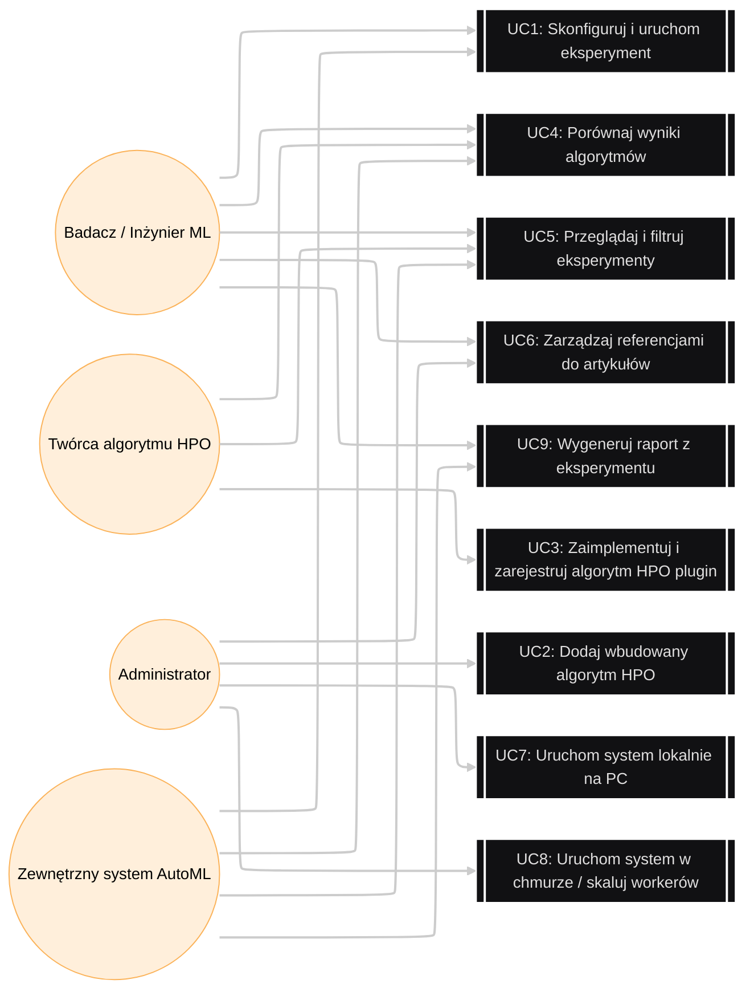
```mermaid
---
config:
  layout: elk
  theme: redux-dark
---
flowchart LR
    A1(("Badacz / Inżynier ML")) --> UC1[["UC1: Skonfiguruj i uruchom eksperyment"]] & UC4[["UC4: Porównaj wyniki algorytmów"]] & UC5[["UC5: Przeglądaj i filtruj eksperymenty"]] & UC6[["UC6: Zarządzaj referencjami do artykułów"]] & UC9[["UC9: Wygeneruj raport z eksperymentu"]]
    A2(("Twórca algorytmu HPO")) --> UC3[["UC3: Zaimplementuj i zarejestruj algorytm HPO plugin"]] & UC4 & UC5
    A3(("Administrator")) --> UC2[["UC2: Dodaj wbudowany algorytm HPO"]] & UC6 & UC7[["UC7: Uruchom system lokalnie na PC"]] & UC8[["UC8: Uruchom system w chmurze / skaluj workerów"]]
    A4(("Zewnętrzny system AutoML")) --> UC1 & UC4 & UC5 & UC9
     A1:::Peach
     A2:::Peach
     A3:::Peach
     A4:::Peach
    classDef Peach stroke-width:1px, stroke-dasharray:none, stroke:#FBB35A, fill:#FFEFDB, color:#8F632D
    style A1 color:#000000
    style A2 color:#000000
    style A3 color:#000000
    style A4 color:#000000
```

---

## UC1: Skonfiguruj i uruchom eksperyment benchmarkowy

### 📋 Podstawowe informacje

| Właściwość | Wartość |
|------------|---------|
| **Aktorzy główni** | Badacz / Inżynier ML |
| **Aktorzy współuczestniczący** | System (Orchestrator, Benchmark Definition, Algorithm Registry, Tracking) |
| **Cel** | Utworzenie eksperymentu benchmarkowego, zdefiniowanie planu runów, uruchomienie i zapis wyników |
| **Poziom** | User goal |
| **Kompleksowość** | Średnia |

### 🎯 Warunki początkowe
- Istnieją zarejestrowane benchmarki i algorytmy HPO (wbudowane lub pluginy)
- Użytkownik jest zalogowany i posiada uprawnienia do tworzenia eksperymentów
- System jest dostępny i operacyjny

### 📝 Główny scenariusz

1. **Inicjacja eksperymentu**
   - A1 otwiera Web UI – sekcję „Nowy eksperyment"
   - System pobiera listę benchmarków z Benchmark Definition Service

2. **Konfiguracja benchmarków**
   - A1 wybiera jeden lub więcej benchmarków oraz instancje problemów
   - System wyświetla szczegóły wybranych benchmarków (datasety, metryki)

3. **Wybór algorytmów**
   - System pobiera listę dostępnych algorytmów z Algorithm Registry
   - A1 wybiera algorytmy i konfiguruje ich parametry/limity budżetu HPO

4. **Definicja celów**
   - A1 definiuje cele eksperymentu (G1–G5) i metryki
   - A1 ustawia polityki retry, timeouty, priorytety

5. **Zapis konfiguracji**
   - A1 zapisuje konfigurację eksperymentu
   - API Gateway przekazuje konfigurację do Experiment Orchestrator

6. **Walidacja**
   - Orchestrator waliduje konfigurację (Benchmark Definition, Algorithm Registry)
   - System sprawdza kompatybilność algorytmów z benchmarkami

7. **Utworzenie eksperymentu**
   - Orchestrator tworzy plan runów i zapisuje eksperyment w Experiment Tracking Service
   - Generowany jest unikalny experiment_id

8. **Uruchomienie**
   - A1 uruchamia eksperyment (przycisk „Run")
   - Orchestrator wysyła zadania runów do Message Broker

9. **Wykonanie**
   - Workery pobierają zadania, wykonują runy
   - Workery raportują metryki i logi do Tracking Service w czasie rzeczywistym

10. **Zakończenie**
    - Orchestrator aktualizuje status eksperymentu
    - A1 otrzymuje powiadomienie o zakończeniu

### ⚠️ Scenariusze alternatywne

#### 1A. Walidacja konfiguracji nie powiodła się
1. W kroku 6 Orchestrator wykrywa niezgodność (np. algorytm wymaga GPU, ale benchmark nie wspiera GPU)
2. System zwraca szczegółowy raport błędów z kodami: `INCOMPATIBLE_ALGORITHM`, `INSUFFICIENT_RESOURCES`, `INVALID_PARAMETER_SPACE`
3. Web UI wyświetla błędy z sugestiami poprawek
4. A1 poprawia konfigurację i ponawia próbę od kroku 5

#### 1B. Brak dostępnych workerów
1. W kroku 8 Message Broker przyjmuje zadania, ale żaden Worker nie jest dostępny
2. Orchestrator wykrywa brak aktywnych konsumentów kolejki po timeout (30s)
3. System informuje A1: "Eksperyment zaplanowany, ale brak dostępnych workerów"
4. A1 może: anulować eksperyment, uruchomić dodatkowe workery, lub czekać

#### 1C. Run zakończony błędem podczas wykonania
1. W kroku 9 Worker napotyka błąd (brak pamięci, błąd pluginu, timeout)
2. Worker loguje szczegółowy błąd do Tracking Service
3. Orchestrator otrzymuje zdarzenie `RunFailed` i sprawdza politykę retry
4. System automatycznie ponawia lub oznacza run jako failed

### ✅ Warunki końcowe
- Eksperyment ma status `COMPLETED` lub `FAILED`
- Wszystkie runy mają metryki i logi zapisane w Tracking Service
- Dane są gotowe do analizy (UC4)

### 📊 Diagramy

#### Diagram aktywności
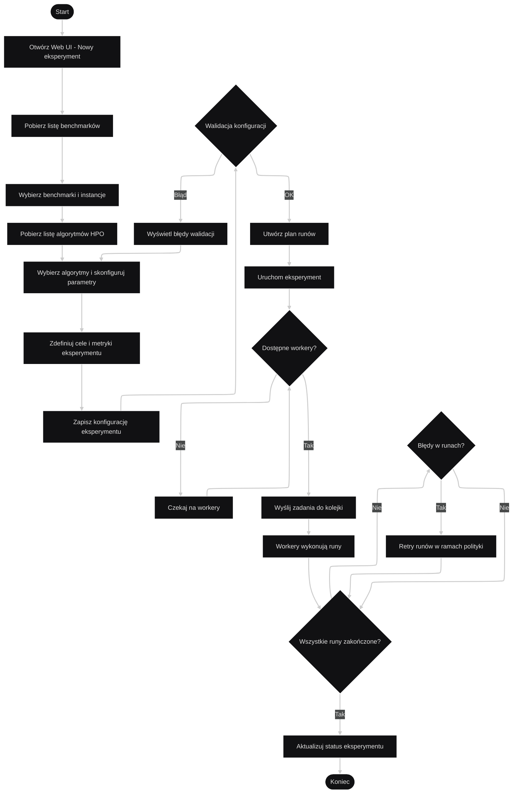
```mermaid
---
config:
  layout: elk
  theme: redux-dark
---
flowchart TB
    Start(["Start"]) --> OpenUI["Otwórz Web UI - Nowy eksperyment"]
    OpenUI --> GetBenchmarks["Pobierz listę benchmarków"]
    GetBenchmarks --> SelectBenchmarks["Wybierz benchmarki i instancje"]
    SelectBenchmarks --> GetAlgorithms["Pobierz listę algorytmów HPO"]
    GetAlgorithms --> SelectAlgorithms["Wybierz algorytmy i skonfiguruj parametry"]
    SelectAlgorithms --> DefineGoals["Zdefiniuj cele i metryki eksperymentu"]
    DefineGoals --> SaveConfig["Zapisz konfigurację eksperymentu"]
    SaveConfig --> ValidateConfig{"Walidacja konfiguracji"}
    ValidateConfig -- Błąd --> ShowErrors["Wyświetl błędy walidacji"]
    ShowErrors --> SelectAlgorithms
    ValidateConfig -- OK --> CreatePlan["Utwórz plan runów"]
    CreatePlan --> StartExperiment["Uruchom eksperyment"]
    StartExperiment --> CheckWorkers{"Dostępne workery?"}
    CheckWorkers -- Nie --> WaitWorkers["Czekaj na workery"]
    WaitWorkers --> CheckWorkers
    CheckWorkers -- Tak --> SendJobs["Wyślij zadania do kolejki"]
    SendJobs --> ExecuteRuns["Workery wykonują runy"]
    ExecuteRuns --> MonitorRuns{"Wszystkie runy zakończone?"}
    MonitorRuns -- Nie --> HandleErrors{"Błędy w runach?"}
    HandleErrors -- Tak --> RetryRuns["Retry runów w ramach polityki"]
    RetryRuns --> MonitorRuns
    HandleErrors -- Nie --> MonitorRuns
    MonitorRuns -- Tak --> UpdateStatus["Aktualizuj status eksperymentu"]
    UpdateStatus --> End(["Koniec"])
```

#### Diagram sekwencji - Główny scenariusz
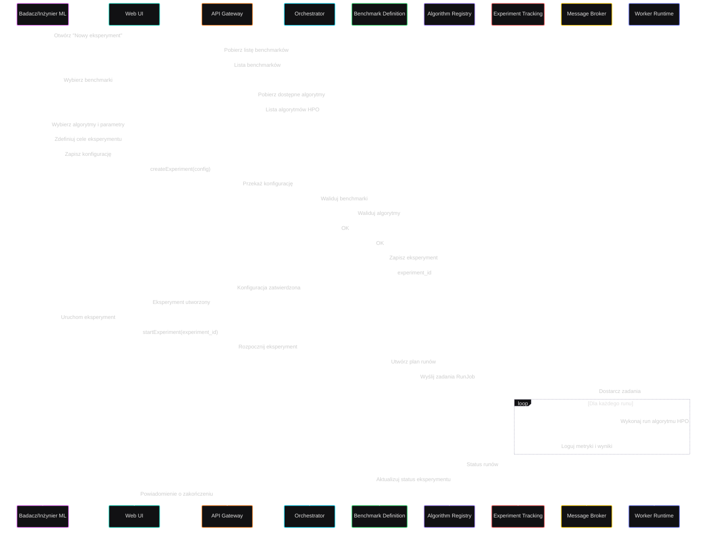
```mermaid
---
config:
  theme: redux-dark-color
---
sequenceDiagram
    participant A1 as Badacz/Inżynier ML
    participant UI as Web UI
    participant API as API Gateway
    participant ORC as Orchestrator
    participant BDS as Benchmark Definition
    participant AR as Algorithm Registry
    participant ETS as Experiment Tracking
    participant MB as Message Broker
    participant WR as Worker Runtime
    
    A1->>UI: Otwórz "Nowy eksperyment"
    UI->>BDS: Pobierz listę benchmarków
    BDS-->>UI: Lista benchmarków
    A1->>UI: Wybierz benchmarki
    UI->>AR: Pobierz dostępne algorytmy
    AR-->>UI: Lista algorytmów HPO
    A1->>UI: Wybierz algorytmy i parametry
    A1->>UI: Zdefiniuj cele eksperymentu
    A1->>UI: Zapisz konfigurację
    UI->>API: createExperiment(config)
    API->>ORC: Przekaż konfigurację
    ORC->>BDS: Waliduj benchmarki
    ORC->>AR: Waliduj algorytmy
    BDS-->>ORC: OK
    AR-->>ORC: OK
    ORC->>ETS: Zapisz eksperyment
    ETS-->>ORC: experiment_id
    ORC-->>API: Konfiguracja zatwierdzona
    API-->>UI: Eksperyment utworzony
    A1->>UI: Uruchom eksperyment
    UI->>API: startExperiment(experiment_id)
    API->>ORC: Rozpocznij eksperyment
    ORC->>ETS: Utwórz plan runów
    ORC->>MB: Wyślij zadania RunJob
    MB-->>WR: Dostarcz zadania
    loop Dla każdego runu
        WR->>WR: Wykonaj run algorytmu HPO
        WR->>ETS: Loguj metryki i wyniki
    end
    WR-->>ORC: Status runów
    ORC->>ETS: Aktualizuj status eksperymentu
    ORC-->>A1: Powiadomienie o zakończeniu
```

#### Diagram sekwencji - Scenariusz alternatywny - Błąd walidacji
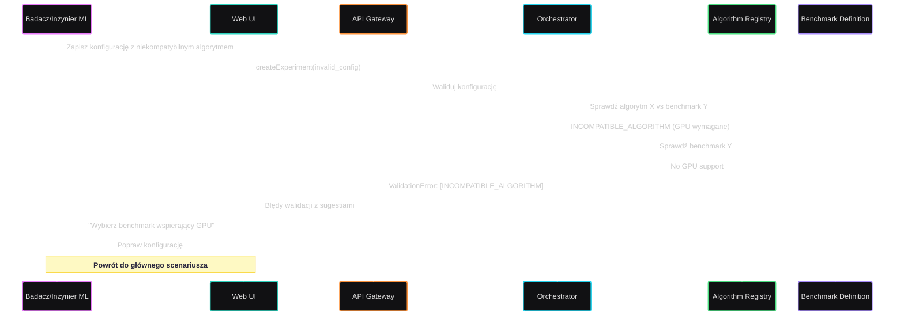
```mermaid
---
config:
  theme: redux-dark-color
---
sequenceDiagram
    participant A1 as Badacz/Inżynier ML
    participant UI as Web UI
    participant API as API Gateway
    participant ORC as Orchestrator
    participant AR as Algorithm Registry
    participant BDS as Benchmark Definition
    A1->>UI: Zapisz konfigurację z niekompatybilnym algorytmem
    UI->>API: createExperiment(invalid_config)
    API->>ORC: Waliduj konfigurację
    ORC->>AR: Sprawdź algorytm X vs benchmark Y
    AR-->>ORC: INCOMPATIBLE_ALGORITHM (GPU wymagane)
    ORC->>BDS: Sprawdź benchmark Y
    BDS-->>ORC: No GPU support
    ORC-->>API: ValidationError: [INCOMPATIBLE_ALGORITHM]
    API-->>UI: Błędy walidacji z sugestiami
    UI-->>A1: "Wybierz benchmark wspierający GPU"
    A1->>UI: Popraw konfigurację
    Note over A1,UI: Powrót do głównego scenariusza
```

---

## UC2: Dodaj wbudowany algorytm HPO

### 📋 Podstawowe informacje

| Właściwość | Wartość |
|------------|---------|
| **Aktorzy główni** | Administrator |
| **Cel** | Dodanie nowego wbudowanego algorytmu HPO do systemu |
| **Poziom** | User goal |

### 📝 Główny scenariusz

1. **Przygotowanie algorytmu**
   - Administrator implementuje algorytm zgodnie z interfejsem IAlgorithmPlugin
   - Przygotowuje metadane: nazwa, typ, parametry, wymagania

2. **Rejestracja w systemie**
   - Administrator dodaje algorytm przez Admin Panel
   - System waliduje implementację i kompatybilność

4. **Publikacja**
   - Algorytm otrzymuje status `APPROVED`
   - Staje się dostępny dla użytkowników w katalogu

### 📊 Diagramy

#### Diagram aktywności
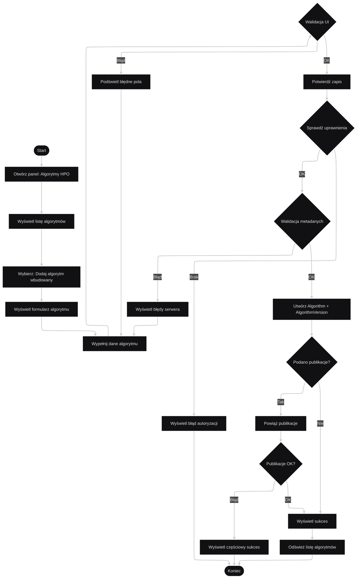
```mermaid
---
config:
  layout: elk
  theme: redux-dark
---
flowchart TB
    Start(["Start"]) --> OpenPanel["Otwórz panel: Algorytmy HPO"]
    OpenPanel --> ViewList["Wyświetl listę algorytmów"]
    ViewList --> SelectAdd["Wybierz: Dodaj algorytm wbudowany"]
    SelectAdd --> ShowForm["Wyświetl formularz algorytmu"]
    ShowForm --> FillForm["Wypełnij dane algorytmu"]
    FillForm --> ValidateUI{"Walidacja UI"}
    ValidateUI -- Błąd --> ShowUIErrors["Podświetl błędne pola"]
    ShowUIErrors --> FillForm
    ValidateUI -- OK --> ConfirmSave["Potwierdź zapis"]
    ConfirmSave --> CheckPerms{"Sprawdź uprawnienia"}
    CheckPerms -- Brak --> ShowAuthError["Wyświetl błąd autoryzacji"]
    ShowAuthError --> End(["Koniec"])
    CheckPerms -- OK --> ValidateMetadata{"Walidacja metadanych"}
    ValidateMetadata -- Błąd --> ShowServerErrors["Wyświetl błędy serwera"]
    ShowServerErrors --> FillForm
    ValidateMetadata -- OK --> CreateAlgorithm["Utwórz Algorithm + AlgorithmVersion"]
    CreateAlgorithm --> CheckDOI{"Podano publikacje?"}
    CheckDOI -- Nie --> SaveSuccess["Wyświetl sukces"]
    CheckDOI -- Tak --> LinkPublications["Powiąż publikacje"]
    LinkPublications --> PubSuccess{"Publikacje OK?"}
    PubSuccess -- Błąd --> PartialSuccess["Wyświetl częściowy sukces"]
    PubSuccess -- OK --> SaveSuccess
    SaveSuccess --> RefreshList["Odśwież listę algorytmów"]
    RefreshList --> End
    PartialSuccess --> End
```

#### Diagram sekwencji - Główny scenariusz
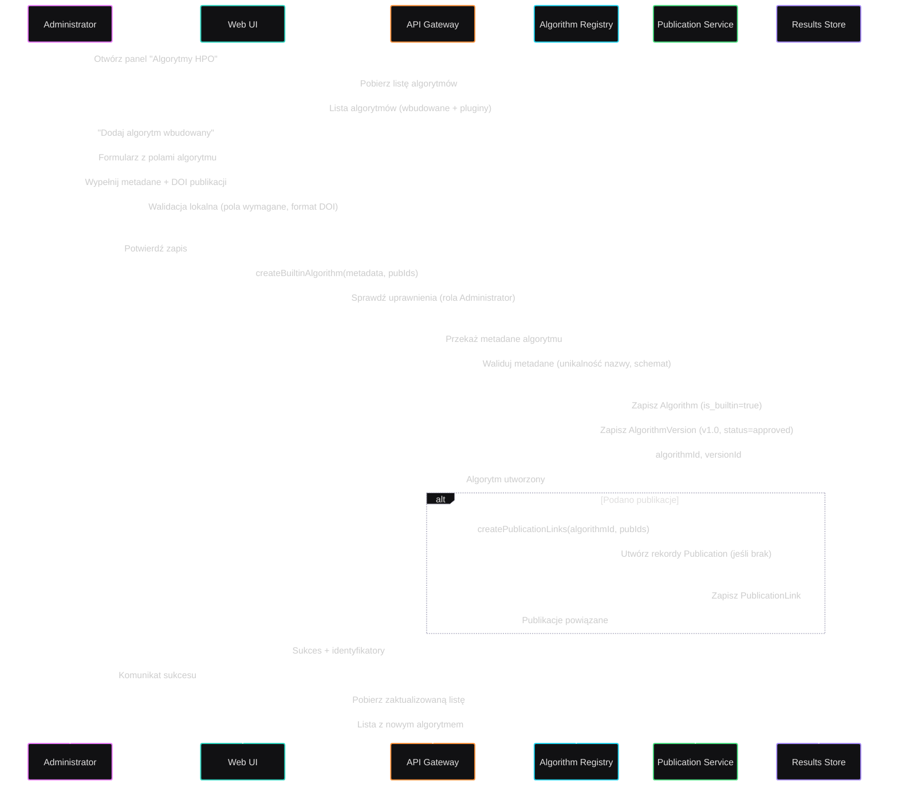
```mermaid
---
config:
  theme: redux-dark-color
---
sequenceDiagram
    participant A3 as Administrator
    participant UI as Web UI
    participant API as API Gateway
    participant AR as Algorithm Registry
    participant PS as Publication Service
    participant RS as Results Store
    A3->>UI: Otwórz panel "Algorytmy HPO"
    UI->>AR: Pobierz listę algorytmów
    AR-->>UI: Lista algorytmów (wbudowane + pluginy)
    A3->>UI: "Dodaj algorytm wbudowany"
    UI-->>A3: Formularz z polami algorytmu
    A3->>UI: Wypełnij metadane + DOI publikacji
    UI->>UI: Walidacja lokalna (pola wymagane, format DOI)
    A3->>UI: Potwierdź zapis
    UI->>API: createBuiltinAlgorithm(metadata, pubIds)
    API->>API: Sprawdź uprawnienia (rola Administrator)
    API->>AR: Przekaż metadane algorytmu
    AR->>AR: Waliduj metadane (unikalność nazwy, schemat)
    AR->>RS: Zapisz Algorithm (is_builtin=true)
    AR->>RS: Zapisz AlgorithmVersion (v1.0, status=approved)
    RS-->>AR: algorithmId, versionId
    AR-->>API: Algorytm utworzony
    alt Podano publikacje
        API->>PS: createPublicationLinks(algorithmId, pubIds)
        PS->>PS: Utwórz rekordy Publication (jeśli brak)
        PS->>RS: Zapisz PublicationLink
        PS-->>API: Publikacje powiązane
    end
    API-->>UI: Sukces + identyfikatory
    UI-->>A3: Komunikat sukcesu
    UI->>AR: Pobierz zaktualizowaną listę
    AR-->>UI: Lista z nowym algorytmem
```

#### Diagram sekwencji - Scenariusz alternatywny - Błąd walidacji
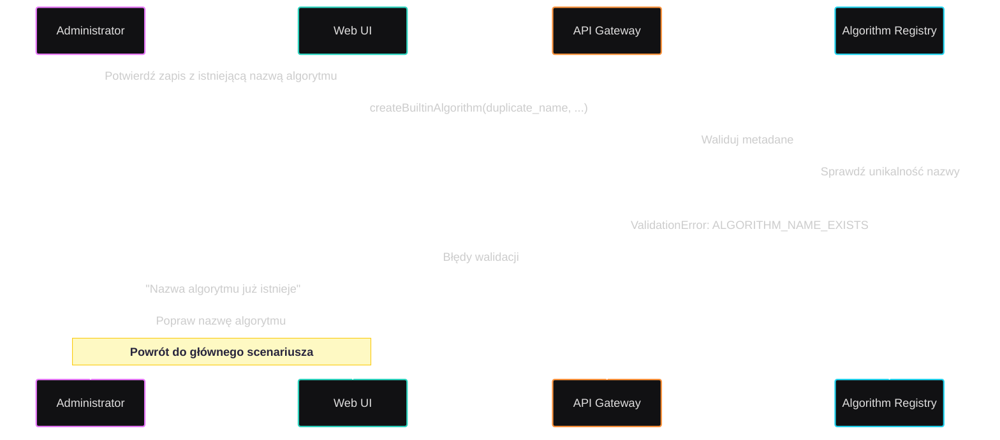
```mermaid
---
config:
  theme: redux-dark-color
---
sequenceDiagram
    participant A3 as Administrator
    participant UI as Web UI
    participant API as API Gateway
    participant AR as Algorithm Registry
    A3->>UI: Potwierdź zapis z istniejącą nazwą algorytmu
    UI->>API: createBuiltinAlgorithm(duplicate_name, ...)
    API->>AR: Waliduj metadane
    AR->>AR: Sprawdź unikalność nazwy
    AR-->>API: ValidationError: ALGORITHM_NAME_EXISTS
    API-->>UI: Błędy walidacji
    UI-->>A3: "Nazwa algorytmu już istnieje"
    A3->>UI: Popraw nazwę algorytmu
    Note over A3,UI: Powrót do głównego scenariusza
```

---

## UC3: Zaimplementuj i zarejestruj algorytm HPO plugin

### 📋 Podstawowe informacje

| Właściwość | Wartość |
|------------|---------|
| **Aktorzy główni** | Twórca algorytmu HPO |
| **Cel** | Implementacja i rejestracja własnego algorytmu jako pluginu |
| **Poziom** | User goal |

### 📝 Główny scenariusz

1. **Implementacja pluginu**
   - Twórca używa Algorithm SDK do implementacji algorytmu
   - Implementuje interfejs IAlgorithmPlugin

2. **Testowanie lokalne**
   - Twórca testuje plugin lokalnie używając SDK

3. **Rejestracja**
   - Twórca wysyła plugin do systemu przez Web UI
   - System przeprowadza walidację i testy

4. **Zatwierdzenie**
   - Administrator sprawdza i zatwierdza plugin
   - Plugin staje się dostępny dla społeczności

### 📊 Diagramy

#### Diagram aktywności
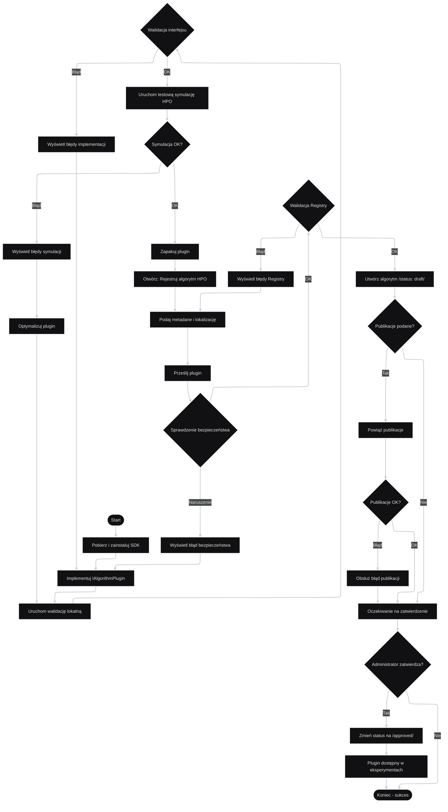
```mermaid
---
config:
  layout: elk
  theme: redux-dark
---
flowchart TB
    Start(["Start"]) --> InstallSDK["Pobierz i zainstaluj SDK"]
    InstallSDK --> ImplementPlugin["Implementuj IAlgorithmPlugin"]
    ImplementPlugin --> RunValidation["Uruchom walidację lokalną"]
    RunValidation --> ValidateInterface{"Walidacja interfejsu"}
    ValidateInterface -- Błąd --> ShowValidationErrors["Wyświetl błędy implementacji"]
    ShowValidationErrors --> ImplementPlugin
    ValidateInterface -- OK --> RunSimulation["Uruchom testową symulację HPO"]
    RunSimulation --> SimulationOK{"Symulacja OK?"}
    SimulationOK -- Błąd --> ShowSimErrors["Wyświetl błędy symulacji"]
    ShowSimErrors --> OptimizePlugin["Optymalizuj plugin"]
    OptimizePlugin --> RunValidation
    SimulationOK -- OK --> PackagePlugin["Zapakuj plugin"]
    PackagePlugin --> OpenRegistry["Otwórz: Rejestruj algorytm HPO"]
    OpenRegistry --> FillMetadata["Podaj metadane i lokalizację"]
    FillMetadata --> SubmitPlugin["Prześlij plugin"]
    SubmitPlugin --> CheckSecurity{"Sprawdzenie bezpieczeństwa"}
    CheckSecurity -- Naruszenie --> ShowSecurityError["Wyświetl błąd bezpieczeństwa"]
    ShowSecurityError --> ImplementPlugin
    CheckSecurity -- OK --> ValidateRegistry{"Walidacja Registry"}
    ValidateRegistry -- Błąd --> ShowRegistryErrors["Wyświetl błędy Registry"]
    ShowRegistryErrors --> FillMetadata
    ValidateRegistry -- OK --> CreateDraft["Utwórz algorytm /status: draft/"]
    CreateDraft --> CheckDOI{"Publikacje podane?"}
    CheckDOI -- Tak --> LinkPubs["Powiąż publikacje"]
    LinkPubs --> PubsOK{"Publikacje OK?"}
    PubsOK -- Błąd --> HandlePubError["Obsłuż błąd publikacji"]
    HandlePubError --> ApprovalPending["Oczekiwanie na zatwierdzenie"]
    PubsOK -- OK --> ApprovalPending
    CheckDOI -- Nie --> ApprovalPending
    ApprovalPending --> AdminApproval{"Administrator zatwierdza?"}
    AdminApproval -- Tak --> ChangeStatus["Zmień status na /approved/"]
    AdminApproval -- Nie --> End(["Koniec - sukces"])
    ChangeStatus --> Available["Plugin dostępny w eksperymentach"]
    Available --> End
```

#### Diagram sekwencji - Główny scenariusz
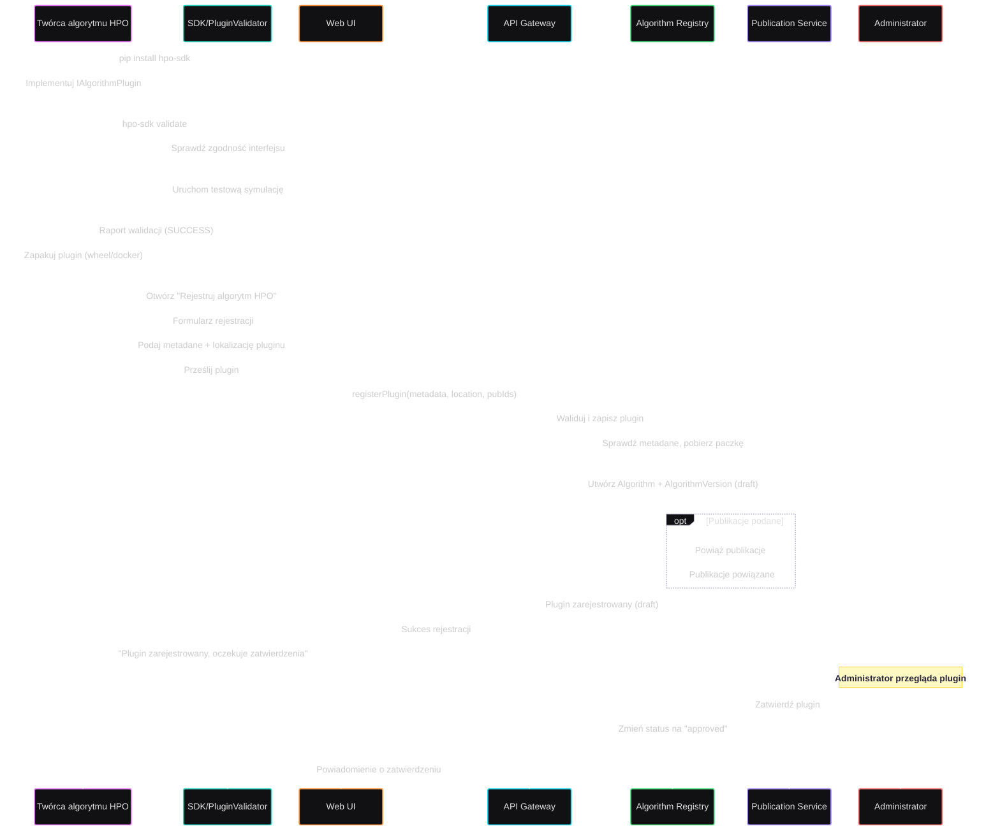
```mermaid
---
config:
  theme: redux-dark-color
---
sequenceDiagram
    participant A2 as Twórca algorytmu HPO
    participant SDK as SDK/PluginValidator
    participant UI as Web UI
    participant API as API Gateway
    participant AR as Algorithm Registry
    participant PS as Publication Service
    participant A3 as Administrator
    A2->>SDK: pip install hpo-sdk
    A2->>A2: Implementuj IAlgorithmPlugin
    A2->>SDK: hpo-sdk validate
    SDK->>SDK: Sprawdź zgodność interfejsu
    SDK->>SDK: Uruchom testową symulację
    SDK-->>A2: Raport walidacji (SUCCESS)
    A2->>A2: Zapakuj plugin (wheel/docker)
    A2->>UI: Otwórz "Rejestruj algorytm HPO"
    UI-->>A2: Formularz rejestracji
    A2->>UI: Podaj metadane + lokalizację pluginu
    A2->>UI: Prześlij plugin
    UI->>API: registerPlugin(metadata, location, pubIds)
    API->>AR: Waliduj i zapisz plugin
    AR->>AR: Sprawdź metadane, pobierz paczkę
    AR->>AR: Utwórz Algorithm + AlgorithmVersion (draft)
    opt Publikacje podane
    AR->>PS: Powiąż publikacje
    PS-->>AR: Publikacje powiązane
    end
    AR-->>API: Plugin zarejestrowany (draft)
    API-->>UI: Sukces rejestracji
    UI-->>A2: "Plugin zarejestrowany, oczekuje zatwierdzenia"
    Note over A3: Administrator przegląda plugin
    A3->>AR: Zatwierdź plugin
    AR->>AR: Zmień status na "approved"
    AR-->>A2: Powiadomienie o zatwierdzeniu
```

#### Diagram sekwencji - Scenariusz alternatywny - Błąd walidacji lokalnej
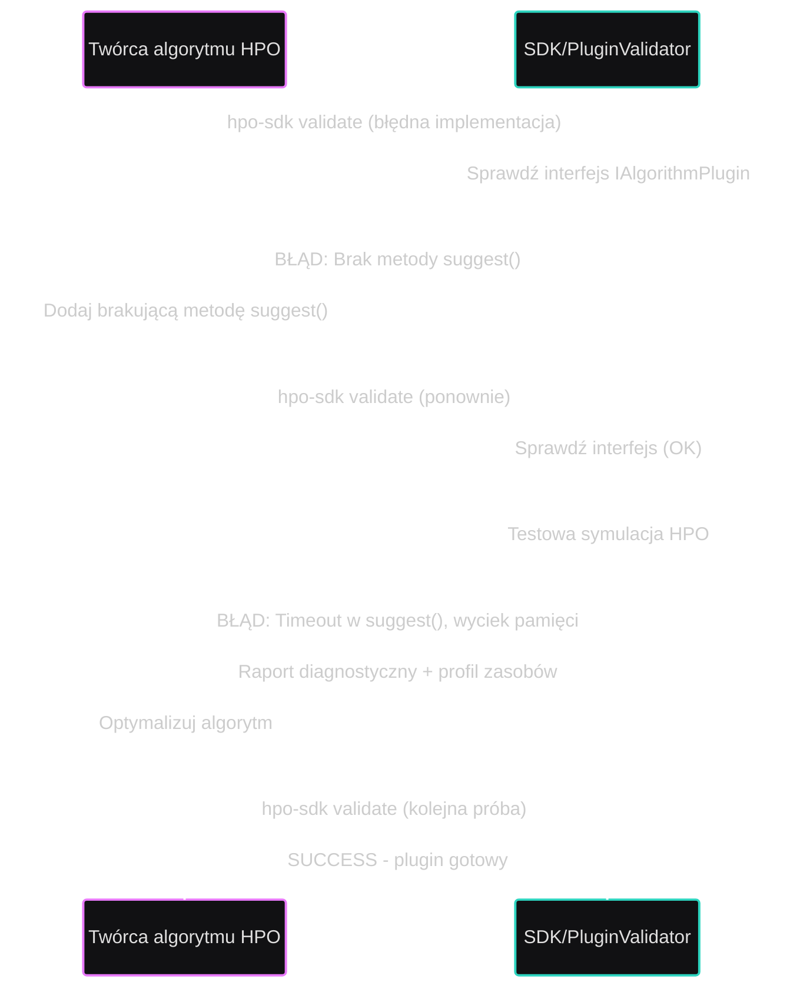
```mermaid
---
config:
  theme: redux-dark-color
---
sequenceDiagram
    participant A2 as Twórca algorytmu HPO
    participant SDK as SDK/PluginValidator
    A2->>SDK: hpo-sdk validate (błędna implementacja)
    SDK->>SDK: Sprawdź interfejs IAlgorithmPlugin
    SDK-->>A2: BŁĄD: Brak metody suggest()
    A2->>A2: Dodaj brakującą metodę suggest()
    A2->>SDK: hpo-sdk validate (ponownie)
    SDK->>SDK: Sprawdź interfejs (OK)
    SDK->>SDK: Testowa symulacja HPO
    SDK-->>A2: BŁĄD: Timeout w suggest(), wyciek pamięci
    SDK-->>A2: Raport diagnostyczny + profil zasobów
    A2->>A2: Optymalizuj algorytm
    A2->>SDK: hpo-sdk validate (kolejna próba)
    SDK-->>A2: SUCCESS - plugin gotowy
```

#### Diagram sekwencji - Scenariusz alternatywny - Naruszenie bezpieczeństwa
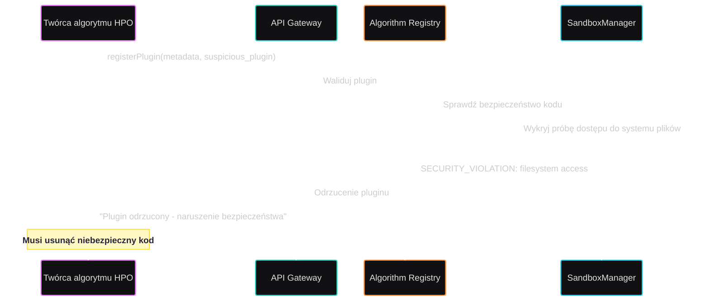
```mermaid
---
config:
  theme: redux-dark-color
---
sequenceDiagram
    participant A2 as Twórca algorytmu HPO
    participant API as API Gateway
    participant AR as Algorithm Registry
    participant SM as SandboxManager
    A2->>API: registerPlugin(metadata, suspicious_plugin)
    API->>AR: Waliduj plugin
    AR->>SM: Sprawdź bezpieczeństwo kodu
    SM->>SM: Wykryj próbę dostępu do systemu plików
    SM-->>AR: SECURITY_VIOLATION: filesystem access
    AR-->>API: Odrzucenie pluginu
    API-->>A2: "Plugin odrzucony - naruszenie bezpieczeństwa"
    Note over A2: Musi usunąć niebezpieczny kod
```

---

## UC4: Porównaj wyniki algorytmów

### 📋 Podstawowe informacje

| Właściwość | Wartość |
|------------|---------|
| **Aktorzy główni** | Badacz / Inżynier ML |
| **Cel** | Porównanie wydajności różnych algorytmów HPO |
| **Poziom** | User goal |

### 📝 Główny scenariusz

1. **Wybór eksperymentów**
   - Badacz wybiera eksperymenty do porównania
   - System ładuje dane z Experiment Tracking Service

2. **Konfiguracja porównania**
   - Wybór metryk do porównania
   - Ustawienia wizualizacji (wykresy, tabele)

3. **Analiza statystyczna**
   - System przeprowadza testy statystyczne
   - Generuje rankingi i poziomy istotności

4. **Wizualizacja**
   - Wyświetlenie wykresów porównawczych
   - Tabele z wynikami i statystykami

---

## UC5: Przeglądaj i filtruj eksperymenty

### 📋 Podstawowe informacje

| Właściwość | Wartość |
|------------|---------|
| **Aktorzy główni** | Badacz / Inżynier ML |
| **Cel** | Przeglądanie historii eksperymentów i wyszukiwanie |
| **Poziom** | User goal |

### 📝 Główny scenariusz

1. **Dostęp do dashboardu**
   - Badacz otwiera Tracking Dashboard UI
   - System wyświetla listę eksperymentów

2. **Filtrowanie**
   - Zastosowanie filtrów: status, tagi, daty, algorytmy
   - System aktualizuje listę wyników

3. **Szczegóły eksperymentu**
   - Wybór eksperymentu z listy
   - Wyświetlenie szczegółów: runów, metryk, logów

### 📊 Diagramy

#### Diagram aktywności
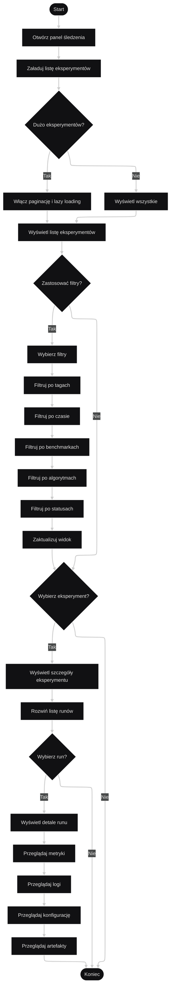
```mermaid
---
config:
  layout: elk
  theme: redux-dark
---
flowchart TB
    Start(["Start"]) --> OpenPanel["Otwórz panel śledzenia"]
    OpenPanel --> LoadExperiments["Załaduj listę eksperymentów"]
    LoadExperiments --> CheckCount{"Dużo eksperymentów?"}
    CheckCount -- Tak --> EnablePagination["Włącz paginację i lazy loading"]
    CheckCount -- Nie --> ShowAll["Wyświetl wszystkie"]
    EnablePagination --> ShowFiltered["Wyświetl listę eksperymentów"]
    ShowAll --> ShowFiltered
    ShowFiltered --> ApplyFilters{"Zastosować filtry?"}
    ApplyFilters -- Tak --> SelectFilters["Wybierz filtry"]
    SelectFilters --> FilterByTags["Filtruj po tagach"]
    FilterByTags --> FilterByTime["Filtruj po czasie"]
    FilterByTime --> FilterByBenchmark["Filtruj po benchmarkach"]
    FilterByBenchmark --> FilterByAlgorithm["Filtruj po algorytmach"]
    FilterByAlgorithm --> FilterByStatus["Filtruj po statusach"]
    FilterByStatus --> UpdateView["Zaktualizuj widok"]
    ApplyFilters -- Nie --> SelectExperiment{"Wybierz eksperyment?"}
    UpdateView --> SelectExperiment
    SelectExperiment -- Tak --> ShowDetails["Wyświetl szczegóły eksperymentu"]
    SelectExperiment -- Nie --> End(["Koniec"])
    ShowDetails --> ExpandRuns["Rozwiń listę runów"]
    ExpandRuns --> SelectRun{"Wybierz run?"}
    SelectRun -- Tak --> ShowRunDetails["Wyświetl detale runu"]
    SelectRun -- Nie --> End
    ShowRunDetails --> ViewMetrics["Przeglądaj metryki"]
    ViewMetrics --> ViewLogs["Przeglądaj logi"]
    ViewLogs --> ViewConfig["Przeglądaj konfigurację"]
    ViewConfig --> ViewArtifacts["Przeglądaj artefakty"]
    ViewArtifacts --> End
```

#### Diagram sekwencji - Główny scenariusz
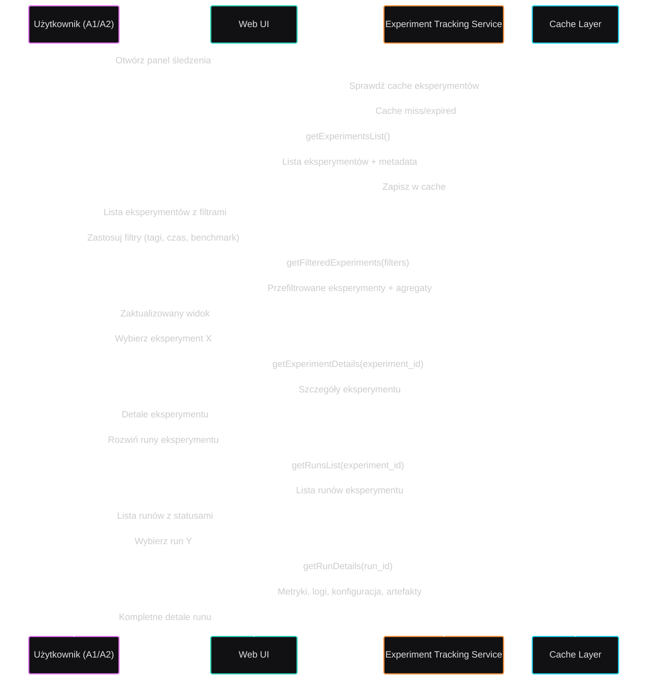
```mermaid
---
config:
  theme: redux-dark-color
---
sequenceDiagram
    participant User as Użytkownik (A1/A2)
    participant UI as Web UI
    participant ETS as Experiment Tracking Service
    participant Cache as Cache Layer
    User->>UI: Otwórz panel śledzenia
    UI->>Cache: Sprawdź cache eksperymentów
    Cache-->>UI: Cache miss/expired
    UI->>ETS: getExperimentsList()
    ETS-->>UI: Lista eksperymentów + metadata
    UI->>Cache: Zapisz w cache
    UI-->>User: Lista eksperymentów z filtrami
    User->>UI: Zastosuj filtry (tagi, czas, benchmark)
    UI->>ETS: getFilteredExperiments(filters)
    ETS-->>UI: Przefiltrowane eksperymenty + agregaty
    UI-->>User: Zaktualizowany widok
    User->>UI: Wybierz eksperyment X
    UI->>ETS: getExperimentDetails(experiment_id)
    ETS-->>UI: Szczegóły eksperymentu
    UI-->>User: Detale eksperymentu
    User->>UI: Rozwiń runy eksperymentu
    UI->>ETS: getRunsList(experiment_id)
    ETS-->>UI: Lista runów eksperymentu
    UI-->>User: Lista runów z statusami
    User->>UI: Wybierz run Y
    UI->>ETS: getRunDetails(run_id)
    ETS-->>UI: Metryki, logi, konfiguracja, artefakty
    UI-->>User: Kompletne detale runu
```

#### Diagram sekwencji - Scenariusz z paginacją (duża liczba eksperymentów)
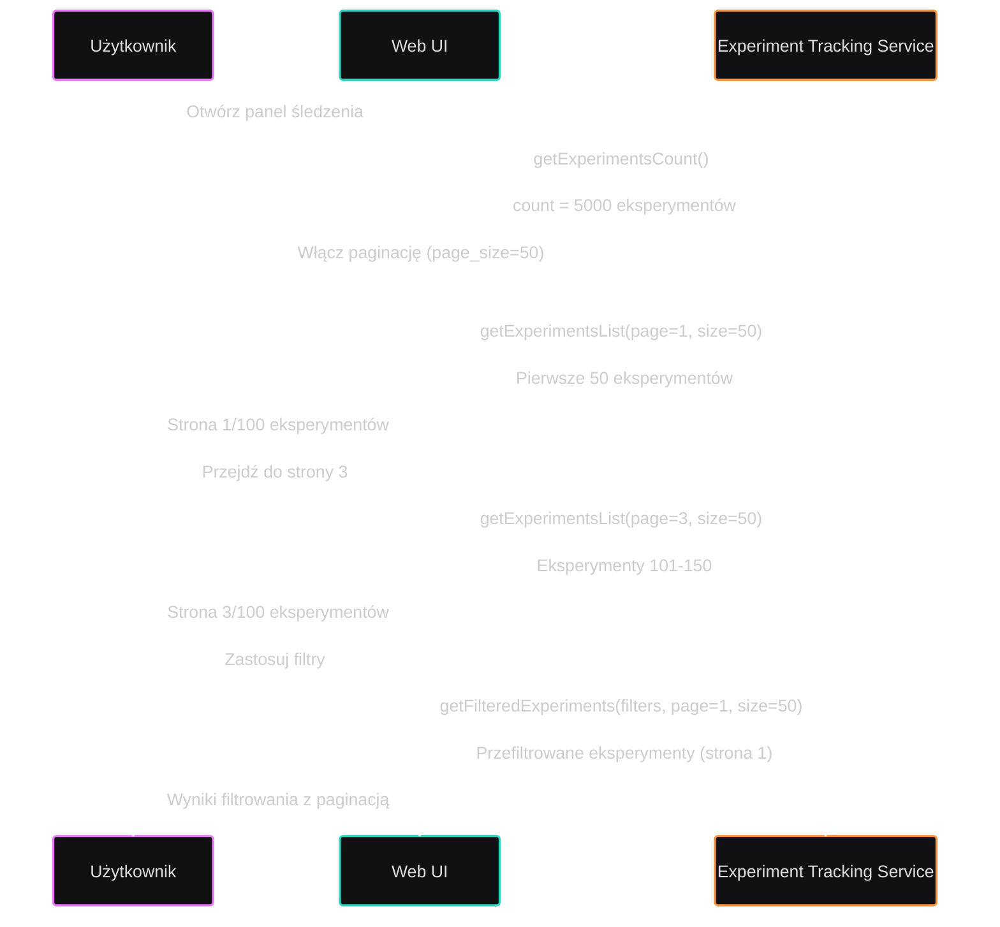
```mermaid
---
config:
  theme: redux-dark-color
---
sequenceDiagram
    participant User as Użytkownik
    participant UI as Web UI
    participant ETS as Experiment Tracking Service
    User->>UI: Otwórz panel śledzenia
    UI->>ETS: getExperimentsCount()
    ETS-->>UI: count = 5000 eksperymentów
    UI->>UI: Włącz paginację (page_size=50)
    UI->>ETS: getExperimentsList(page=1, size=50)
    ETS-->>UI: Pierwsze 50 eksperymentów
    UI-->>User: Strona 1/100 eksperymentów
    User->>UI: Przejdź do strony 3
    UI->>ETS: getExperimentsList(page=3, size=50)
    ETS-->>UI: Eksperymenty 101-150
    UI-->>User: Strona 3/100 eksperymentów
    User->>UI: Zastosuj filtry
    UI->>ETS: getFilteredExperiments(filters, page=1, size=50)
    ETS-->>UI: Przefiltrowane eksperymenty (strona 1)
    UI-->>User: Wyniki filtrowania z paginacją
```

#### Diagram aktywności - Lazy loading szczegółów runu
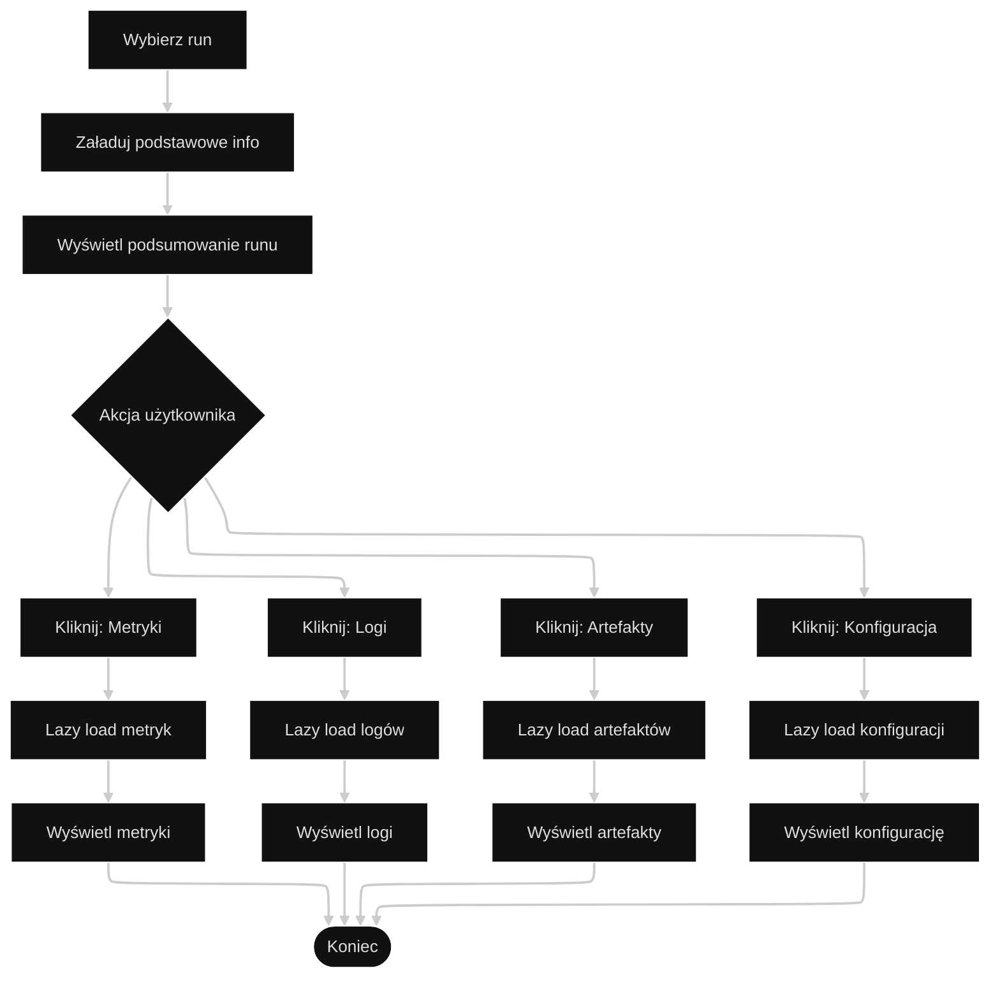
```mermaid
---
config:
  theme: redux-dark
  layout: elk
---
flowchart TB
    SelectRun["Wybierz run"] --> LoadBasic["Załaduj podstawowe info"]
    LoadBasic --> ShowRunSummary["Wyświetl podsumowanie runu"]
    ShowRunSummary --> UserAction{"Akcja użytkownika"}
    UserAction --> ViewMetrics["Kliknij: Metryki"] & ViewLogs["Kliknij: Logi"] & ViewArtifacts["Kliknij: Artefakty"] & ViewConfig["Kliknij: Konfiguracja"]
    ViewMetrics --> LazyLoadMetrics["Lazy load metryk"]
    ViewLogs --> LazyLoadLogs["Lazy load logów"]
    ViewArtifacts --> LazyLoadArtifacts["Lazy load artefaktów"]
    ViewConfig --> LazyLoadConfig["Lazy load konfiguracji"]
    LazyLoadMetrics --> ShowMetrics["Wyświetl metryki"]
    LazyLoadLogs --> ShowLogs["Wyświetl logi"]
    LazyLoadArtifacts --> ShowArtifacts["Wyświetl artefakty"]
    LazyLoadConfig --> ShowConfig["Wyświetl konfigurację"]
    ShowMetrics --> End(["Koniec"])
    ShowLogs --> End
    ShowArtifacts --> End
    ShowConfig --> End
```

---# Diagram sekwencji - Scenariusz alternatywny - Niekompletne dane
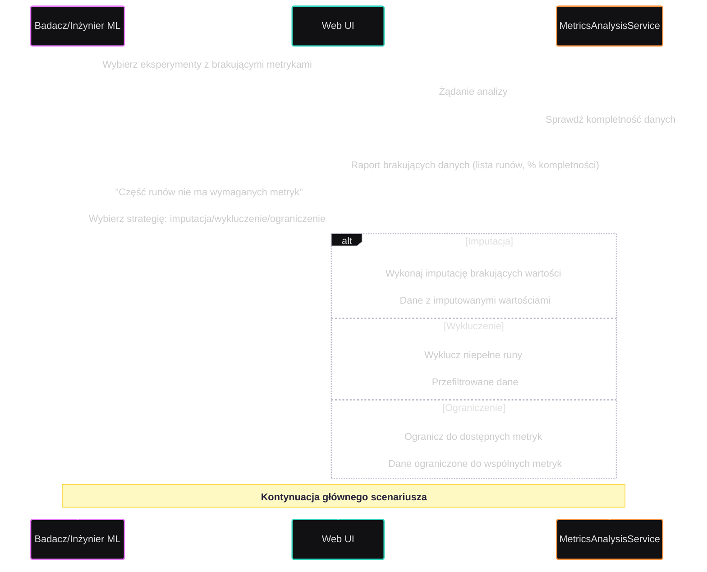
```mermaid
---
config:
  theme: redux-dark-color
---
sequenceDiagram
    participant A1 as Badacz/Inżynier ML
    participant UI as Web UI
    participant MAS as MetricsAnalysisService
    A1->>UI: Wybierz eksperymenty z brakującymi metrykami
    UI->>MAS: Żądanie analizy
    MAS->>MAS: Sprawdź kompletność danych
    MAS-->>UI: Raport brakujących danych (lista runów, % kompletności)
    UI-->>A1: "Część runów nie ma wymaganych metryk"
    A1->>UI: Wybierz strategię: imputacja/wykluczenie/ograniczenie
    alt Imputacja
    UI->>MAS: Wykonaj imputację brakujących wartości
    MAS-->>UI: Dane z imputowanymi wartościami
    else Wykluczenie
    UI->>MAS: Wyklucz niepełne runy
    MAS-->>UI: Przefiltrowane dane
    else Ograniczenie
    UI->>MAS: Ogranicz do dostępnych metryk
    MAS-->>UI: Dane ograniczone do wspólnych metryk
    end
    Note over A1,MAS: Kontynuacja głównego scenariusza
```

#### Diagram aktywności - Obsługa błędów obliczeniowych
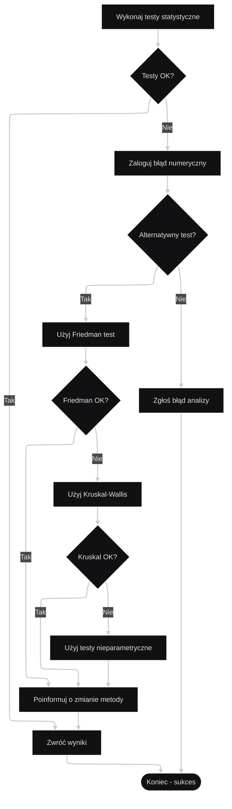
```mermaid
---
config:
  theme: redux-dark
  layout: elk
---
flowchart TB
    PerformTests["Wykonaj testy statystyczne"] --> TestsOK{"Testy OK?"}
    TestsOK -- Tak --> ReturnResults["Zwróć wyniki"]
    TestsOK -- Nie --> LogError["Zaloguj błąd numeryczny"]
    LogError --> TryAlternative{"Alternatywny test?"}
    TryAlternative -- Tak --> UseFriedman["Użyj Friedman test"]
    UseFriedman --> FriedmanOK{"Friedman OK?"}
    FriedmanOK -- Nie --> UseKruskal["Użyj Kruskal-Wallis"]
    UseKruskal --> KruskalOK{"Kruskal OK?"}
    KruskalOK -- Nie --> UseNonParametric["Użyj testy nieparametryczne"]
    UseNonParametric --> InformUser["Poinformuj o zmianie metody"]
    FriedmanOK -- Tak --> InformUser
    KruskalOK -- Tak --> InformUser
    TryAlternative -- Nie --> ReportError["Zgłoś błąd analizy"]
    InformUser --> ReturnResults
    ReportError --> End(["Koniec - sukces"])
    ReturnResults --> End
```

---

## UC6: Zarządzaj referencjami do artykułów

### 📋 Podstawowe informacje

| Właściwość | Wartość |
|------------|---------|
| **Aktorzy główni** | Badacz / Administrator |
| **Cel** | Dodawanie i łączenie publikacji naukowych z algorytmami/benchmarkami |
| **Poziom** | User goal |

### 📝 Główny scenariusz

1. **Dodanie publikacji**
   - Użytkownik wprowadza metadane publikacji (DOI, BibTeX)
   - System wzbogaca dane z zewnętrznych źródeł (CrossRef, arXiv)

2. **Łączenie z elementami**
   - Powiązanie publikacji z algorytmami lub benchmarkami
   - Aktualizacja metadanych w Registry Services

3. **Zarządzanie bibliografią**
   - Edycja i aktualizacja istniejących pozycji
   - Generowanie cytowań w różnych formatach

### 📊 Diagramy

#### Diagram aktywności
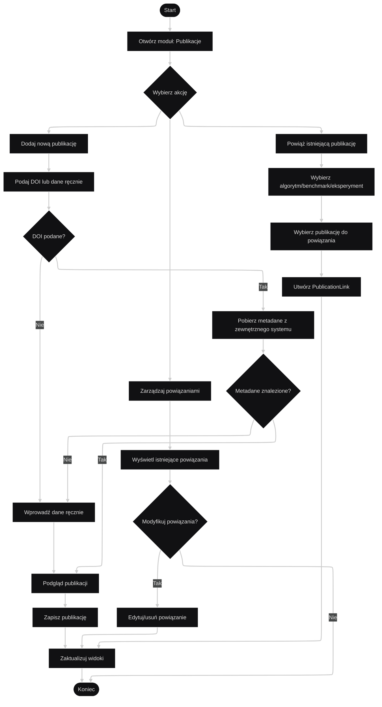
```mermaid
---
config:
  layout: elk
  theme: redux-dark
---
flowchart TB
    Start(["Start"]) --> OpenPublications["Otwórz moduł: Publikacje"]
    OpenPublications --> ChooseAction{"Wybierz akcję"}
    ChooseAction --> AddPublication["Dodaj nową publikację"] & LinkExisting["Powiąż istniejącą publikację"] & ManageLinks["Zarządzaj powiązaniami"]
    AddPublication --> EnterData["Podaj DOI lub dane ręcznie"]
    EnterData --> CheckDOI{"DOI podane?"}
    CheckDOI -- Tak --> FetchMetadata["Pobierz metadane z zewnętrznego systemu"]
    CheckDOI -- Nie --> ManualEntry["Wprowadź dane ręcznie"]
    FetchMetadata --> MetadataFound{"Metadane znalezione?"}
    MetadataFound -- Nie --> ManualEntry
    MetadataFound -- Tak --> PreviewPublication["Podgląd publikacji"]
    ManualEntry --> PreviewPublication
    PreviewPublication --> SavePublication["Zapisz publikację"]
    LinkExisting --> SelectTarget["Wybierz algorytm/benchmark/eksperyment"]
    SelectTarget --> SelectPublication["Wybierz publikację do powiązania"]
    SelectPublication --> CreateLink["Utwórz PublicationLink"]
    ManageLinks --> ViewLinks["Wyświetl istniejące powiązania"]
    ViewLinks --> ModifyLinks{"Modyfikuj powiązania?"}
    ModifyLinks -- Tak --> EditLink["Edytuj/usuń powiązanie"]
    ModifyLinks -- Nie --> End(["Koniec"])
    SavePublication --> UpdateViews["Zaktualizuj widoki"]
    CreateLink --> UpdateViews
    EditLink --> UpdateViews
    UpdateViews --> End
```

#### Diagram sekwencji - Główny scenariusz
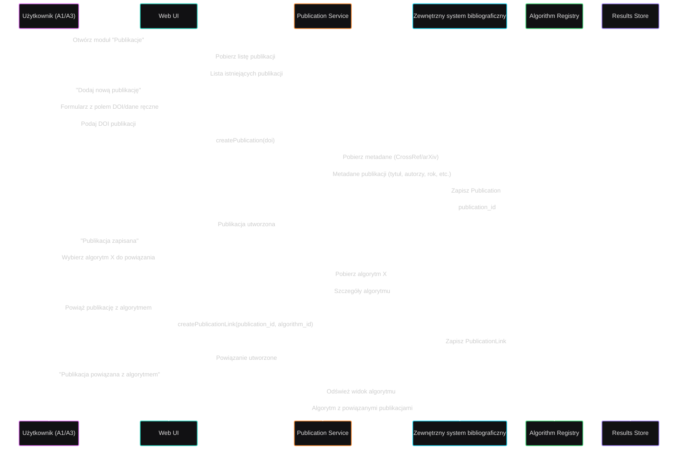
```mermaid
---
config:
  theme: redux-dark-color
---
sequenceDiagram
    participant User as Użytkownik (A1/A3)
    participant UI as Web UI
    participant PS as Publication Service
    participant EXT as Zewnętrzny system bibliograficzny
    participant AR as Algorithm Registry
    participant RS as Results Store
    User->>UI: Otwórz moduł "Publikacje"
    UI->>PS: Pobierz listę publikacji
    PS-->>UI: Lista istniejących publikacji
    User->>UI: "Dodaj nową publikację"
    UI-->>User: Formularz z polem DOI/dane ręczne
    User->>UI: Podaj DOI publikacji
    UI->>PS: createPublication(doi)
    PS->>EXT: Pobierz metadane (CrossRef/arXiv)
    EXT-->>PS: Metadane publikacji (tytuł, autorzy, rok, etc.)
    PS->>RS: Zapisz Publication
    RS-->>PS: publication_id
    PS-->>UI: Publikacja utworzona
    UI-->>User: "Publikacja zapisana"
    User->>UI: Wybierz algorytm X do powiązania
    UI->>AR: Pobierz algorytm X
    AR-->>UI: Szczegóły algorytmu
    User->>UI: Powiąż publikację z algorytmem
    UI->>PS: createPublicationLink(publication_id, algorithm_id)
    PS->>RS: Zapisz PublicationLink
    PS-->>UI: Powiązanie utworzone
    UI-->>User: "Publikacja powiązana z algorytmem"
    UI->>AR: Odśwież widok algorytmu
    AR-->>UI: Algorytm z powiązanymi publikacjami
```

#### Diagram sekwencji - Scenariusz alternatywny - DOI nieznalezione
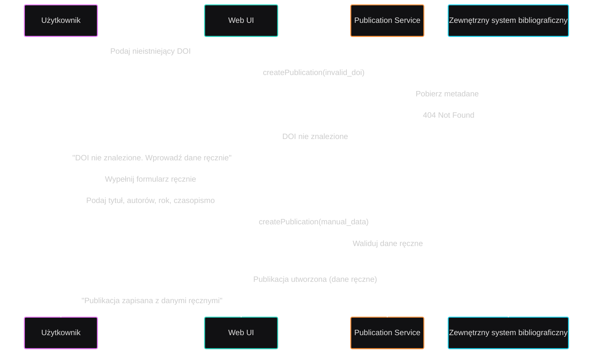
```mermaid
---
config:
  theme: redux-dark-color
---
sequenceDiagram
    participant User as Użytkownik
    participant UI as Web UI
    participant PS as Publication Service
    participant EXT as Zewnętrzny system bibliograficzny
    User->>UI: Podaj nieistniejący DOI
    UI->>PS: createPublication(invalid_doi)
    PS->>EXT: Pobierz metadane
    EXT-->>PS: 404 Not Found
    PS-->>UI: DOI nie znalezione
    UI-->>User: "DOI nie znalezione. Wprowadź dane ręcznie"
    User->>UI: Wypełnij formularz ręcznie
    User->>UI: Podaj tytuł, autorów, rok, czasopismo
    UI->>PS: createPublication(manual_data)
    PS->>PS: Waliduj dane ręczne
    PS-->>UI: Publikacja utworzona (dane ręczne)
    UI-->>User: "Publikacja zapisana z danymi ręcznymi"
```

#### Diagram aktywności - Zarządzanie powiązaniami
```mermaid
---
config:
  theme: redux-dark
  layout: elk
---
flowchart TB
    ViewLinks["Wyświetl powiązania"] --> FilterLinks{"Filtruj powiązania?"}
    FilterLinks -- Tak --> ApplyFilter["Zastosuj filtry"]
    FilterLinks -- Nie --> ShowAllLinks["Pokaż wszystkie powiązania"]
    ApplyFilter --> ShowFilteredLinks["Pokaż przefiltrowane"]
    ShowAllLinks --> SelectLink{"Wybierz powiązanie?"}
    ShowFilteredLinks --> SelectLink
    SelectLink -- Nie --> End(["Koniec"])
    SelectLink -- Tak --> ChooseLinkAction{"Wybierz akcję"}
    ChooseLinkAction --> EditLink["Edytuj powiązanie"] & DeleteLink["Usuń powiązanie"] & ViewDetails["Wyświetl szczegóły"]
    EditLink --> UpdateLink["Zaktualizuj powiązanie"]
    DeleteLink --> ConfirmDelete{"Potwierdź usunięcie?"}
    ConfirmDelete -- Tak --> RemoveLink["Usuń powiązanie"]
    ConfirmDelete -- Nie --> SelectLink
    ViewDetails --> SelectLink
    UpdateLink --> RefreshView["Odśwież widok"]
    RemoveLink --> RefreshView
    RefreshView --> End
```

---

## UC7: Uruchom system lokalnie na PC

### 📋 Podstawowe informacje

| Właściwość | Wartość |
|------------|---------|
| **Aktorzy główni** | Administrator |
| **Cel** | Deployment systemu w środowisku PC/laboratoryjnym |
| **Poziom** | System goal |

### 📝 Główny scenariusz

1. **Przygotowanie środowiska**
   - Instalacja Docker i docker-compose
   - Klonowanie repozytorium z konfiguracją

2. **Konfiguracja**
   - Edycja plików konfiguracyjnych
   - Ustawienie zmiennych środowiskowych

3. **Uruchomienie**
   - Wykonanie `docker-compose up`
   - Weryfikacja działania wszystkich serwisów

4. **Inicjalizacja danych**
   - Import przykładowych benchmarków
   - Konfiguracja wbudowanych algorytmów

### 📊 Diagramy

#### Diagram aktywności
```mermaid
---
config:
  layout: elk
  theme: redux-dark
---
flowchart TB
    Start(["Start"]) --> CheckDocker{"Docker zainstalowany?"}
    CheckDocker -- Nie --> InstallDocker["Zainstaluj Docker"]
    CheckDocker -- Tak --> CloneRepo["Sklonuj repozytorium konfiguracji"]
    InstallDocker --> CloneRepo
    CloneRepo --> ConfigureEnv["Skonfiguruj plik .env"]
    ConfigureEnv --> CheckPorts{"Porty dostępne?"}
    CheckPorts -- Nie --> ModifyPorts["Zmodyfikuj porty w docker-compose.yml"]
    CheckPorts -- Tak --> StartContainers["docker-compose up -d"]
    ModifyPorts --> StartContainers
    StartContainers --> WaitInit["Czekaj na inicjalizację kontenerów"]
    WaitInit --> CheckDB{"DB gotowa?"}
    CheckDB -- Nie --> FixDBIssues["Napraw problemy z DB"]
    CheckDB -- Tak --> CheckBroker{"Message Broker gotowy?"}
    FixDBIssues --> CheckDB
    CheckBroker -- Nie --> FixBrokerIssues["Napraw problemy z Brokerem"]
    CheckBroker -- Tak --> CheckAPI{"API Gateway gotowy?"}
    FixBrokerIssues --> CheckBroker
    CheckAPI -- Nie --> FixAPIIssues["Napraw problemy z API"]
    CheckAPI -- Tak --> CheckWorkers{"Workery gotowe?"}
    FixAPIIssues --> CheckAPI
    CheckWorkers -- Nie --> FixWorkerIssues["Napraw problemy z Workerami"]
    CheckWorkers -- Tak --> CheckUI{"Web UI dostępny?"}
    FixWorkerIssues --> CheckWorkers
    CheckUI -- Nie --> FixUIIssues["Napraw problemy z UI"]
    CheckUI -- Tak --> VerifyHealth["Sprawdź health-check endpoints"]
    FixUIIssues --> CheckUI
    VerifyHealth --> HealthOK{"Wszystkie serwisy OK?"}
    HealthOK -- Nie --> DiagnoseIssues["Diagnozuj problemy z logów"]
    HealthOK -- Tak --> OpenBrowser["Otwórz Web UI w przeglądarce"]
    DiagnoseIssues --> FixIssues["Napraw zidentyfikowane problemy"]
    FixIssues --> VerifyHealth
    OpenBrowser --> SystemReady["System gotowy do użycia"]
    SystemReady --> End(["Koniec - sukces"])
```

#### Diagram sekwencji - Główny scenariusz
```mermaid
---
config:
  theme: redux-dark-color
---
sequenceDiagram
    participant A3 as Administrator
    participant Docker as Docker Engine
    participant DB as Results Store (DB)
    participant MB as Message Broker
    participant API as API Gateway
    participant ETS as Experiment Tracking
    participant WR as Worker Runtime
    participant UI as Web UI
    participant MON as Monitoring
    A3->>A3: Sklonuj repo, skonfiguruj .env
    A3->>Docker: docker-compose up -d
    Docker->>DB: Uruchom kontener PostgreSQL
    Docker->>MB: Uruchom kontener RabbitMQ
    Docker->>API: Uruchom kontener API Gateway
    Docker->>ETS: Uruchom kontener Tracking Service
    Docker->>WR: Uruchom kontener(y) Worker Runtime
    Docker->>UI: Uruchom kontener Web UI
    Docker->>MON: Uruchom kontener Monitoring (opcjonalnie)
    DB->>DB: Inicjalizuj bazę danych
    MB->>MB: Utwórz kolejki (RunJob, etc.)
    API->>DB: Połącz z bazą danych
    API->>MB: Połącz z Message Brokerem
    ETS->>DB: Wykonaj migracje schematu
    WR->>MB: Subskrybuj kolejkę RunJob
    UI->>API: Sprawdź połączenie z API
    A3->>Docker: docker ps (sprawdź statusy)
    Docker-->>A3: Wszystkie kontenery uruchomione
    A3->>API: curl http://localhost:8080/healthz
    API-->>A3: HTTP 200 OK
    A3->>UI: Otwórz http://localhost:3000
    UI-->>A3: Strona logowania/główna wyświetlona
```

#### Diagram sekwencji - Scenariusz alternatywny - Konflikt portów
```mermaid
---
config:
  theme: redux-dark-color
---
sequenceDiagram
    participant A3 as Administrator
    participant Docker as Docker Engine
    participant System as System (port already in use)
    A3->>Docker: docker-compose up -d
    Docker->>System: Próba bindowania portu 8080
    System-->>Docker: Error: Port 8080 already in use
    Docker-->>A3: Błąd startu - konflikt portów
    A3->>A3: Edytuj docker-compose.yml (8080 → 8081)
    A3->>A3: Aktualizuj .env (UI_PORT=8081)
    A3->>Docker: docker-compose up -d
    Docker->>System: Próba bindowania portu 8081
    System-->>Docker: Port 8081 available
    Docker-->>A3: Kontenery uruchomione poprawnie
```

#### Diagram aktywności - Diagnoza problemów
```mermaid
---
config:
  theme: redux-dark
  layout: elk
---
flowchart TB
    ContainerFail["Kontener się nie uruchamia"] --> CheckLogs["Sprawdź logi kontenera"]
    CheckLogs --> LogType{"Typ błędu"}
    LogType --> PermissionError["Błąd uprawnień do wolumenu"] & ConfigError["Błąd konfiguracji"] & ResourceError["Brak zasobów"] & NetworkError["Błąd sieci/połączenia"]
    PermissionError --> FixPermissions["Popraw uprawnienia do katalogów"]
    ConfigError --> FixConfig["Popraw konfigurację w .env"]
    ResourceError --> FreeResources["Zwolnij zasoby lub zwiększ limity"]
    NetworkError --> CheckNetwork["Sprawdź sieci Docker"]
    FixPermissions --> RestartContainer["Restartuj kontener"]
    FixConfig --> RestartContainer
    FreeResources --> RestartContainer
    CheckNetwork --> FixNetworkIssue["Napraw problemy sieci"]
    FixNetworkIssue --> RestartContainer
    RestartContainer --> TestAgain["Przetestuj ponownie"]
    TestAgain --> Success{"Sukces?"}
    Success -- Tak --> End(["Problem rozwiązany"])
    Success -- Nie --> CheckLogs
```

---

## UC8: Uruchom system w chmurze / skaluj workerów

### 📋 Podstawowe informacje

| Właściwość | Wartość |
|------------|---------|
| **Aktorzy główni** | Administrator DevOps/SRE |
| **Cel** | Deployment i skalowanie systemu w środowisku chmurowym |
| **Poziom** | System goal |

### 📝 Główny scenariusz

1. **Przygotowanie infrastruktury**
   - Konfiguracja klastra Kubernetes
   - Ustawienie zarządzanych usług (DB, Storage, Message Broker)

2. **Deployment aplikacji**
   - Zastosowanie manifestów Kubernetes
   - Konfiguracja load balancerów i ingress

3. **Skalowanie**
   - Konfiguracja HPA (Horizontal Pod Autoscaler)
   - Monitoring obciążenia i automatyczne skalowanie workerów

4. **Monitoring i alerting**
   - Deployment stacku monitorującego
   - Konfiguracja alertów i dashboardów

### 📊 Diagramy

#### Diagram aktywności
```mermaid
---
config:
  layout: elk
  theme: redux-dark
---
flowchart TB
    Start(["Start"]) --> PrepareConfig["Przygotuj konfigurację chmurową"]
    PrepareConfig --> CommitChanges["Commit zmiany do repozytorium"]
    CommitChanges --> TriggerPipeline["CI/CD wykrywa zmiany"]
    TriggerPipeline --> RunPipeline["Uruchom pipeline wdrożeniowy"]
    RunPipeline --> ValidateManifests{"Manifesty poprawne?"}
    ValidateManifests -- Nie --> FixManifests["Popraw manifesty/konfigurację"]
    FixManifests --> CommitChanges
    ValidateManifests -- Tak --> DeployToK8s["Wdróż do Kubernetes"]
    DeployToK8s --> CheckResources{"Wystarczające zasoby?"}
    CheckResources -- Nie --> ScaleCluster["Zwiększ zasoby klastra"]
    CheckResources -- Tak --> CreatePods["Utwórz/zaktualizuj pody"]
    ScaleCluster --> CreatePods
    CreatePods --> WaitForPods["Czekaj na uruchomienie podów"]
    WaitForPods --> CheckHealth{"Health checks OK?"}
    CheckHealth -- Nie --> DiagnosePods["Diagnozuj problemy podów"]
    CheckHealth -- Tak --> SetupMonitoring["Skonfiguruj monitoring"]
    DiagnosePods --> FixPodIssues["Napraw problemy podów"]
    FixPodIssues --> CheckHealth
    SetupMonitoring --> ConfigureHPA["Skonfiguruj HPA dla workerów"]
    ConfigureHPA --> TestHPA["Przetestuj skalowanie HPA"]
    TestHPA --> HPAWorks{"HPA działa poprawnie?"}
    HPAWorks -- Nie --> FixHPA["Napraw konfigurację HPA"]
    FixHPA --> TestHPA
    HPAWorks -- Tak --> ExposeServices["Skonfiguruj Ingress/LoadBalancer"]
    ExposeServices --> TestAccess["Przetestuj dostęp do Web UI"]
    TestAccess --> AccessOK{"Dostęp OK?"}
    AccessOK -- Nie --> FixIngress["Napraw konfigurację Ingress"]
    FixIngress --> TestAccess
    AccessOK -- Tak --> SystemReady["System gotowy w chmurze"]
    SystemReady --> MonitorSystem["Monitoruj system i skalowanie"]
    MonitorSystem --> End(["Koniec - sukces"])
```

#### Diagram sekwencji - Główny scenariusz
```mermaid
---
config:
  theme: redux-dark-color
---
sequenceDiagram
    participant A3 as Administrator DevOps
    participant Git as Git Repository
    participant CICD as CI/CD Pipeline
    participant K8s as Kubernetes API
    participant Pods as Pody aplikacji
    participant HPA as HPA Controller
    participant Prom as Prometheus
    participant LB as LoadBalancer
    A3->>A3: Przygotuj values-cloud.yaml
    A3->>Git: Commit konfiguracji chmurowej
    Git->>CICD: Trigger webhook
    CICD->>CICD: Uruchom pipeline (helm upgrade)
    CICD->>K8s: Aplikuj manifesty/chart
    K8s->>K8s: Utwórz Deployments, Services, ConfigMaps
    K8s->>Pods: Uruchom pody (API, Tracking, Workers, UI)
    loop Pody startują
        Pods->>Pods: API Gateway łączy się z DB/Broker
        Pods->>Pods: Tracking Service wykonuje migracje
        Pods->>Pods: Workers subskrybują kolejki
        Pods->>Pods: Web UI startuje serwer HTTP
    end
    Pods-->>K8s: Health checks OK
    K8s->>Prom: Rozpocznij zbieranie metryk
    Prom->>HPA: Udostępnij metryki (CPU, queue length)
    K8s->>HPA: Aktywuj HPA dla Worker Deployment
    K8s->>LB: Skonfiguruj Ingress/LoadBalancer
    LB-->>A3: Web UI dostępny publicznie
    Note over HPA,Prom: Continuous monitoring i skalowanie
    HPA->>Prom: Sprawdź metryki co 30s
    Prom-->>HPA: CPU 80%, queue_length=100
    HPA->>K8s: Zwiększ repliki Workers (2→5)
    K8s->>Pods: Uruchom 3 dodatkowe Worker pody
```

#### Diagram sekwencji - Scenariusz alternatywny - Błąd zasobów klastra
```mermaid
---
config:
  theme: redux-dark-color
---
sequenceDiagram
    participant CICD as CI/CD Pipeline
    participant K8s as Kubernetes API
    participant Nodes as Węzły klastra
    participant A3 as Administrator DevOps
    CICD->>K8s: Aplikuj Deployment z dużymi request'ami
    K8s->>Nodes: Próba schedulowania podów
    Nodes-->>K8s: Insufficient CPU/Memory
    K8s-->>CICD: Pody w stanie Pending
    CICD-->>A3: Alert: Deployment failed - resource constraints
    A3->>A3: Sprawdź kubectl describe pods
    A3->>A3: Analiza: need more CPU/RAM
    alt Zwiększ zasoby klastra
        A3->>Nodes: Add nody lub scale up
        Nodes-->>K8s: Nowe zasoby dostępne
        K8s->>Nodes: Schedule pending pods
    else Zmniejsz requirements
        A3->>A3: Zmniejsz requests w values-cloud.yaml
        A3->>CICD: Commit nowej konfiguracji
        CICD->>K8s: Update Deployment
        K8s->>Nodes: Schedule z mniejszymi wymaganiami
    end
    Nodes-->>K8s: Pody uruchomione
    K8s-->>A3: Deployment sukces
```

#### Diagram aktywności - Automatyczne skalowanie HPA
```mermaid
---
config:
  layout: elk
  theme: redux-dark
---
flowchart TB
    MonitorLoad["Monitor obciążenia"] --> CheckMetrics{"Sprawdź metryki"}
    CheckMetrics --> HighLoad{"Wysokie obciążenie?"}
    HighLoad -- Tak --> CalculateReplicas["Oblicz potrzebną liczbę replik"]
    HighLoad -- Nie --> LowLoad{"Niskie obciążenie?"}
    LowLoad -- Tak --> ScaleDown["Zmniejsz liczbę replik"]
    LowLoad -- Nie --> Wait["Czekaj 30s"]
    CalculateReplicas --> CheckMax{"Poniżej max replik?"}
    CheckMax -- Tak --> ScaleUp["Zwiększ liczbę replik"]
    CheckMax -- Nie --> MaxReached["Osiągnięto maksimum"]
    ScaleUp --> UpdateDeployment["Zaktualizuj Deployment"]
    ScaleDown --> UpdateDeployment
    UpdateDeployment --> WaitStabilize["Czekaj na stabilizację"]
    WaitStabilize --> MonitorLoad
    MaxReached --> Wait
    Wait --> MonitorLoad
```

---

## UC9: Wygeneruj raport z eksperymentu

### 📋 Podstawowe informacje

| Właściwość | Wartość |
|------------|---------|
| **Aktorzy główni** | Badacz / Inżynier ML |
| **Cel** | Generowanie raportu z wyników eksperymentu do publikacji |
| **Poziom** | User goal |

### 📝 Główny scenariusz

1. **Wybór eksperymentu**
   - Badacz wybiera zakończony eksperyment
   - System ładuje pełne dane eksperymentu

2. **Konfiguracja raportu**
   - Wybór szablonu raportu (HTML, PDF, LaTeX)
   - Selekcja sekcji do uwzględnienia

3. **Generowanie**
   - System agreguje dane z wielu źródeł
   - Tworzenie wizualizacji i tabel wyników

4. **Finalny raport**
   - Wygenerowanie pliku raportu
   - Udostępnienie linku do pobrania

### 📊 Diagramy

#### Diagram aktywności
```mermaid
---
config:
  layout: elk
  theme: redux-dark
---
flowchart TB
    Start(["Start"]) --> OpenReports["Otwórz widok raportów"]
    OpenReports --> SelectExperiments["Wybierz eksperyment/y/"]
    SelectExperiments --> SelectScope["Wybierz zakres raportu"]
    SelectScope --> SelectFormat["Wybierz format raportu"]
    SelectFormat --> SelectTemplate["Wybierz szablon raportu"]
    SelectTemplate --> ValidateSelection{"Walidacja wyboru"}
    ValidateSelection -- Błąd --> ShowValidationError["Wyświetl błędy walidacji"]
    ShowValidationError --> SelectExperiments
    ValidateSelection -- OK --> GenerateReport["Kliknij: Generuj raport"]
    GenerateReport --> CheckDataAvailable{"Dane dostępne?"}
    CheckDataAvailable -- Nie --> ShowDataError["Wyświetl błąd braku danych"]
    ShowDataError --> End(["Koniec"])
    CheckDataAvailable -- Tak --> ProcessReport["Przetwórz raport"]
    ProcessReport --> CheckTimeout{"Timeout generowania?"}
    CheckTimeout -- Tak --> ShowTimeoutError["Wyświetl błąd timeout"]
    ShowTimeoutError --> End
    CheckTimeout -- Nie --> SaveToStorage["Zapisz raport do Object Storage"]
    SaveToStorage --> ReturnURL["Zwróć URL raportu"]
    ReturnURL --> ShowDownloadLink["Wyświetl link do pobrania"]
    ShowDownloadLink --> UserChoice{"Wybór użytkownika"}
    UserChoice --> DownloadReport["Pobierz raport"] & ViewInBrowser["Otwórz w przeglądarce"] & End
    DownloadReport --> End
    ViewInBrowser --> End
```

#### Diagram sekwencji - Główny scenariusz
```mermaid
---
config:
  theme: redux-dark-color
---
sequenceDiagram
    participant User as Użytkownik
    participant UI as Web UI
    participant RG as Report Generator Service
    participant ETS as Experiment Tracking Service
    participant MAS as MetricsAnalysisService
    participant PS as Publication Service
    participant OS as Object Storage
    participant RS as Results Store
    User->>UI: Otwórz widok raportów
    UI->>ETS: Pobierz listę eksperymentów
    ETS-->>UI: Lista eksperymentów
    User->>UI: Wybierz eksperyment X + parametry raportu
    User->>UI: Kliknij "Generuj raport"
    UI->>RG: generateReport(experiment_id, format, template)
    RG->>ETS: Pobierz metadane eksperymentu
    ETS-->>RG: Szczegóły eksperymentu
    RG->>RS: Pobierz wyniki i metryki runów
    RS-->>RG: Dane runów
    RG->>MAS: Pobierz agregaty i analizy
    MAS-->>RG: Dane analityczne
    RG->>PS: Pobierz powiązane publikacje
    PS-->>RG: Metadane publikacji
    RG->>RG: Składanie danych w model raportu
    RG->>RG: Renderowanie do formatu (HTML/PDF)
    RG->>OS: Zapisz raport
    OS-->>RG: URL raportu
    RG-->>UI: Raport gotowy (URL)
    UI-->>User: Link/przycisk "Pobierz raport"
    alt Użytkownik pobiera raport
        User->>OS: Pobierz raport z URL
        OS-->>User: Plik raportu
    else Użytkownik otwiera w przeglądarce
        User->>OS: Otwórz raport w przeglądarce
        OS-->>User: Raport wyświetlony
    end
```

#### Diagram sekwencji - Scenariusz alternatywny - Błąd generowania
```mermaid
---
config:
  theme: redux-dark-color
---
sequenceDiagram
    participant User as Użytkownik
    participant UI as Web UI
    participant RG as Report Generator Service
    participant ETS as Experiment Tracking Service
    participant RS as Results Store
    User->>UI: Generuj raport dla eksperymentu Z
    UI->>RG: generateReport(experiment_id_Z, PDF, detailed)
    RG->>ETS: Pobierz metadane eksperymentu Z
    ETS-->>RG: Eksperyment istnieje
    RG->>RS: Pobierz wyniki runów
    RS-->>RG: ERROR: No data found for experiment Z
    RG->>RG: Loguj błąd: Missing experiment data
    RG-->>UI: ReportGenerationError: Brak danych eksperymentu
    UI-->>User: "Nie można wygenerować raportu - brak danych. Sprawdź czy eksperyment został zakończony."
```

#### Diagram aktywności - Renderowanie różnych formatów
```mermaid
---
config:
  layout: elk
  theme: redux-dark
---
flowchart TB
    StartRender["Rozpocznij renderowanie"] --> CheckFormat{"Format raportu"}
    CheckFormat --> HTML["HTML"] & PDF["PDF"] & LaTeX["LaTeX"] & JSON["JSON/CSV"]
    HTML --> LoadHTMLTemplate["Załaduj szablon HTML"]
    PDF --> LoadPDFTemplate["Załaduj szablon PDF"]
    LaTeX --> LoadLaTeXTemplate["Załaduj szablon LaTeX"]
    JSON --> PrepareDataExport["Przygotuj eksport danych"]
    LoadHTMLTemplate --> RenderHTML["Renderuj HTML z danymi"]
    LoadPDFTemplate --> RenderPDF["Renderuj PDF przez LaTeX/WeasyPrint"]
    LoadLaTeXTemplate --> RenderLaTeX["Generuj kod LaTeX"]
    PrepareDataExport --> ExportJSON["Eksportuj JSON/CSV"]
    RenderHTML --> ValidateOutput{"Walidacja"}
    RenderPDF --> ValidateOutput
    RenderLaTeX --> ValidateOutput
    ExportJSON --> ValidateOutput
    ValidateOutput -- OK --> SaveFile["Zapisz plik"]
    ValidateOutput -- Błąd --> RenderError["Zgłoś błąd renderowania"]
    SaveFile --> ReturnURL["Zwróć URL"]
    RenderError --> End(["Koniec - sukces"])
    ReturnURL --> End
```

---

## Podsumowanie przypadków użycia

| UC | Nazwa | Główny aktor | Częstotliwość | Krytyczność |
|----|-------|--------------|---------------|-------------|
| UC1 | Skonfiguruj i uruchom eksperyment | Badacz | Wysoka | Krytyczna |
| UC2 | Dodaj wbudowany algorytm HPO | Administrator | Niska | Średnia |
| UC3 | Zaimplementuj algorytm plugin | Twórca algorytmu | Średnia | Wysoka |
| UC4 | Porównaj wyniki algorytmów | Badacz | Wysoka | Krytyczna |
| UC5 | Przeglądaj eksperymenty | Badacz | Wysoka | Średnia |
| UC6 | Zarządzaj referencjami | Badacz/Admin | Średnia | Niska |
| UC7 | Uruchom system lokalnie | Administrator | Niska | Wysoka |
| UC8 | Uruchom system w chmurze | DevOps/SRE | Niska | Krytyczna |
| UC9 | Wygeneruj raport | Badacz | Średnia | Średnia |

---

## Powiązane dokumenty

- **Architektura**: [Kontekst (C4-1)](../architecture/c1-context.md)
- **Implementacja**: [Kontenery (C4-2)](../architecture/c2-containers.md), [Komponenty (C4-3)](../architecture/c3-components.md)
- **Przepływ pracy**: [Workflows](workflows.md)
- **Wdrożenie**: [Deployment Guide](../operations/deployment-guide.md)
- **Methodology**: [Benchmarking Practices](../methodology/benchmarking-practices.md)
