# Architektura systemu benchmarkowego HPO – Corvus Corone (WIP)

> **Założenia ogólne / świadome uproszczenia**
>
> - Docelowa skala: pojedynczy zespół badawczy / małe laboratorium (kilku–kilkunastu użytkowników równoległych), ale z możliwością rozrostu do większego klastra.
> - Dominujący stack ML: Python (scikit-learn, PyTorch, TensorFlow, XGBoost itd.), ale architektura nie jest do niego twardo przywiązana.
> - Główny deployment: **PC-first (docker-compose, single-node)** z prostą ścieżką do **cloud / K8s**.
> - Autoryzacja: klasyczne role **Badacz / Twórca pluginu / Administrator**, integracja z zewnętrznym IdP w przyszłości.
> - Benchmarki dotyczą głównie trenowania modeli ML, ale architektura nie zakłada konkretnej domeny – można ją rozszerzyć na inne typy zadań optymalizacyjnych.

---

## 1. Kontekst systemu (C4-1)

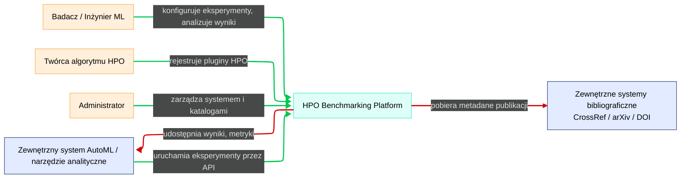

### 1.1. Użytkownicy / aktorzy biznesowi

- **Badacz / Inżynier ML**
  - Definiuje benchmarki, konfiguruje eksperymenty.
  - Uruchamia eksperymenty lokalnie / w chmurze.
  - Analizuje wyniki, porównuje algorytmy HPO.
  - Eksportuje dane do zewnętrznych narzędzi analitycznych.
- **Twórca algorytmu HPO (Plugin Author)**
  - Implementuje algorytmy HPO jako pluginy w oparciu o SDK.
  - Rejestruje i wersjonuje własne algorytmy.
  - Testuje je na istniejących benchmarkach.
- **Administrator systemu**
  - Zarządza deploymentem (PC / chmura).
  - Konfiguruje zasoby, uprawnienia, integracje (IdP, monitoring).
  - Dodaje / zatwierdza wbudowane algorytmy HPO i benchmarki „kanoniczne”.
- **Zewnętrzny system AutoML / narzędzie analityczne**
  - Wywołuje API w celu uruchamiania eksperymentów.
  - Pobiera wyniki benchmarków do dalszej analizy (np. BI, Jupyter, AutoML pipeline).
- **Źródła bibliograficzne (zewnętrzne systemy)**
  - np. CrossRef, arXiv, DOI resolver.
  - Umożliwiają walidację i uzupełnianie metadanych publikacji.

### 1.2. System w centrum – „HPO Benchmarking Platform”

**System (S): „HPO Benchmarking Platform”**  
Główny system wspierający:

- projektowanie benchmarków,
- uruchamianie eksperymentów HPO,
- śledzenie eksperymentów i runów,
- analizę wyników i raportowanie,
- zarządzanie algorytmami HPO (wbudowane + pluginy),
- zarządzanie referencjami do publikacji.

### 1.3. Wymagania funkcjonalne (R1–R15)

**Katalog funkcjonalny:**

- **R1.** Katalog algorytmów HPO (wbudowanych).  
- **R2.** Wsparcie dla algorytmów HPO jako pluginów (autorskie, zewnętrzne).
- **R3.** Wersjonowanie algorytmów HPO (wbudowanych i pluginów).
- **R4.** Katalog benchmarków (zbiory danych, definicje problemów, znane optimum / best-known).  
- **R5.** Konfiguracja eksperymentu benchmarkowego (dobór algorytmów, instancji, limitów zasobów, budżetów HPO itd.).
- **R6.** Orkiestracja eksperymentów (planowanie, kolejkowanie, uruchamianie runów, retry).  
- **R7.** Panel śledzenia eksperymentów (lista eksperymentów/runów, statusy, metryki, logi, parametry).  
- **R8.** Porównywanie wyników algorytmów (wykresy, statystyki, testy statystyczne, filtry, tagowanie).  
- **R9.** Rejestrowanie i przegląd logów oraz artefaktów (modele, wykresy, pliki konfiguracyjne).  
- **R10.** Zarządzanie referencjami do publikacji (dodawanie, edycja, powiązanie z algorytmami / eksperymentami / benchmarkami).  
- **R11.** Generowanie raportów (w tym sekcja bibliografii, cytowania, opis konfiguracji eksperymentów).  
- **R12.** API do integracji ze światem zewnętrznym (uruchamianie eksperymentów, fetch wyników, integracja z AutoML).  
- **R13.** API / SDK do tworzenia własnych algorytmów HPO (plugin API).  
- **R14.** Eksport danych (wyniki, metryki, konfiguracje) do formatów zewnętrznych (CSV/JSON/Parquet) dla narzędzi analitycznych.  
- **R15.** Uruchamianie systemu w trybie **PC-local** i **cloud / K8s** (w tym skalowanie workerów).  

### 1.4. Wymagania niefunkcjonalne (RNF1–RNF8)

- **RNF1 – Skalowalność:**  
  - Możliwość uruchamiania wielu workerów równolegle, zarówno lokalnie (wiele procesów / kontenerów), jak i w chmurze (K8s, autoscaling).  
- **RNF2 – Niezawodność:**  
  - Retry i wznawianie runów, transakcyjna rejestracja wyników, odporność Orchestratora na restart.  
- **RNF3 – Bezpieczeństwo:**  
  - Autoryzacja i uwierzytelnianie (role), izolacja pluginów (sandboxing), bezpieczne zarządzanie sekretami (np. w chmurze).  
- **RNF4 – Obserwowalność:**  
  - Kompletny logging, metryki systemowe (prometheus-like), śledzenie przepływu runów (trace IDs).  
- **RNF5 – Rozszerzalność (pluginy):**  
  - Stabilne, dobrze udokumentowane interfejsy SDK / API, brak zmian łamiących kontrakt.  
- **RNF6 – Cloud-ready, PC-first:**  
  - Możliwość uruchomienia wszystkich kontenerów lokalnie (docker-compose), ale z jasnymi granicami usług umożliwiającymi ich „wyniesienie” do chmury.  
- **RNF7 – Reprodukowalność:**  
  - Zapisywanie pełnej konfiguracji, wersji datasetów, kodu, obrazów kontenerów i losowych seedów.  
- **RNF8 – Użyteczność:**  
  - Intuicyjny Web UI, czytelne dashboardy, możliwość tagowania, filtrowania, quick-search.

---

## 2. Kontenery (C4-2)

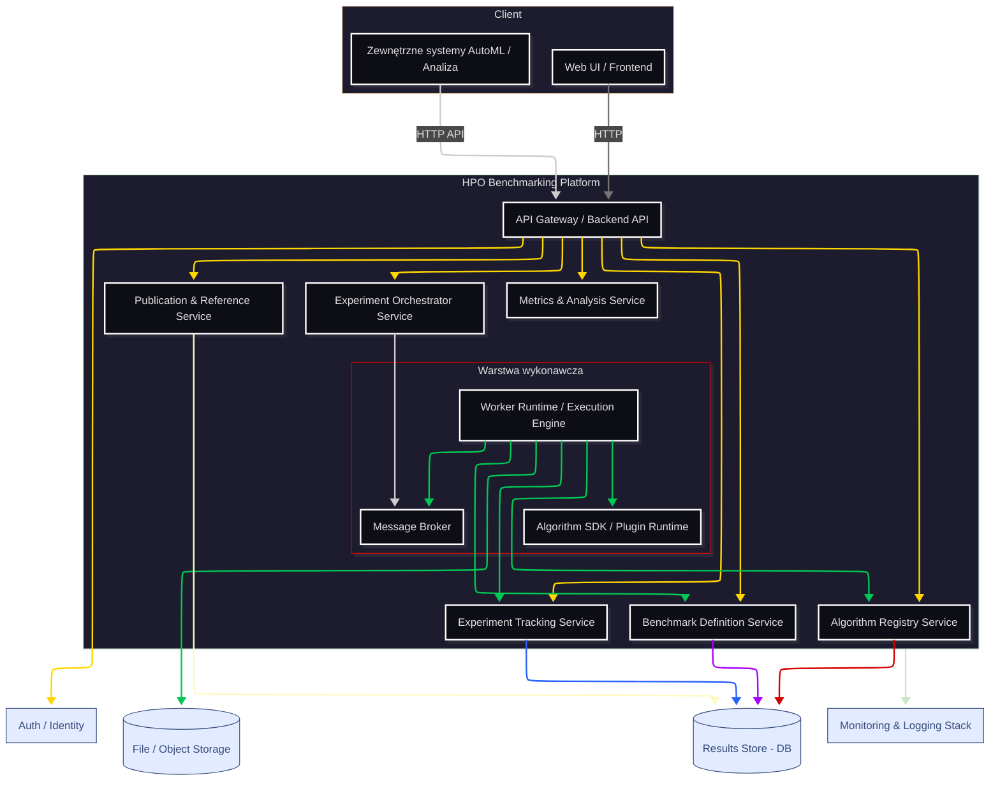

### 2.1. Lista kontenerów

1. **Web UI (Frontend)**  
2. **API Gateway / Backend API**  
3. **Experiment Orchestrator Service**  
4. **Worker Runtime / Execution Engine**  
5. **Benchmark Definition Service**  
6. **Algorithm Registry Service**  
7. **Algorithm SDK / Plugin Runtime**  
8. **Experiment Tracking Service**  
9. **Metrics & Analysis Service**  
10. **Publication & Reference Service**  
11. **Results Store (Relacyjna baza danych)**  
12. **File / Object Storage**  
13. **Message Broker (kolejka zdarzeń)**  
14. **Monitoring & Logging Stack**  
15. **Auth / Identity Integration (opcjonalny kontener / proxy)**

### 2.2. Opis kontenerów i komunikacji

Dla każdego kontenera: odpowiedzialności, komunikacja (sync/async), rola w PC vs chmura, związek z dobrymi praktykami benchmarkingu.

| ID    | Komponent                      | Odpowiedzialności | Komunikacja | PC vs chmura | Związek z benchmarkingiem |
|-------|--------------------------------|--------------------|-------------|-------------|---------------------------|
| 2.2.1 | Web UI (Frontend)              | Interfejs użytkownika do: definicji benchmarków i eksperymentów, podglądu katalogu algorytmów HPO, panelu śledzenia eksperymentów, porównania wyników, zarządzania publikacjami i generowania raportów, podstawowej administracji. | REST/GraphQL/WebSocket z **API Gateway** (sync). | **PC:** serwowany z lokalnego kontenera lub plików statycznych. <br> **Chmura:** standardowy frontend (np. CDN / storage). | Umożliwia jasne prezentowanie celów eksperymentu, konfiguracji, wyników i statystyk. |
| 2.2.2 | API Gateway / Backend API      | Pojedynczy punkt wejścia dla Web UI i systemów zewnętrznych. Routing żądań do usług: Orchestrator, Benchmark Definition, Algorithm Registry, Experiment Tracking, Publication & Reference, Metrics & Analysis. Autoryzacja / uwierzytelnianie. | Z Web UI / systemami zewn.: HTTP REST/GraphQL (sync). <br> Z usługami wewn.: HTTP/gRPC (sync) + publikacja zdarzeń do Message Broker (async). | **PC:** jeden kontener, monolityczny backend lub prosty gateway. <br> **Chmura:** gateway (np. API Gateway + microservices). | Centralny punkt integracji warstw benchmarkingu i udostępniania funkcji na zewnątrz. |
| 2.2.3 | Experiment Orchestrator Service | Przyjmowanie definicji eksperymentów, walidacja planu (dobór algorytmów, instancji). Tworzenie planu runów (algorytm × instancja × seed × budżet). Zlecanie runów Workerom przez Message Broker. Zarządzanie stanem eksperymentu. Kontrola powtarzalności (seedy, snapshoty konfiguracji). | Sync: z API Gateway (definicje eksperymentów). <br> Async: do Worker Runtime (kolejka runów przez Message Broker), odbiór zdarzeń „RunCompleted/RunFailed”. | **PC:** jedna instancja, pojedynczy proces/kontener. <br> **Chmura:** skalowalny microservice, możliwe HA. | Implementuje **plan eksperymentu**, kontrolę budżetu i coverage instancji – kluczowe dobre praktyki benchmarkingu. |
| 2.2.4 | Worker Runtime / Execution Engine | Wykonywanie pojedynczych runów: ładowanie benchmarku i instancji (dataset), ładowanie i uruchamianie algorytmu HPO (plugin/wbudowany), raportowanie metryk do Experiment Tracking Service. | Async: odbiór zadań z Message Broker. <br> Sync/Async: zapisy do Experiment Tracking Service (REST/gRPC, batch/stream), logi do Logging Stack. <br> Dostęp do File/Object Storage. | **PC:** 1–N workerów jako procesy/kontenery (docker-compose). <br> **Chmura:** worker pods w K8s, autoscaling wg kolejki. | Wymusza jednolite środowisko uruchomieniowe (konteneryzacja) → reprodukowalność i porównywalność runów. |
| 2.2.5 | Benchmark Definition Service    | Przechowywanie i wersjonowanie definicji benchmarków: listy datasetów, definicji problemów (klasyfikacja, regresja, …), dostępnych metryk, znanych optimum / best-known values. | Sync: API dla Orchestratora i Web UI (GET/POST/PUT). | Jeden kontener, brak szczególnych wymagań skalowalności (PC i chmura tak samo). | Realizuje dobór i opis instancji problemowych (zróżnicowanie, reprezentatywność). |
| 2.2.6 | Algorithm Registry Service      | Rejestr i wersjonowanie algorytmów HPO (wbudowane + pluginy). Przechowywanie metadanych: nazwa, typ, parametry, wymagania środowiskowe, powiązane publikacje. Walidacja kompatybilności z benchmarkami. | Sync: API dla Web UI, Orchestratora i Plugin Runtime. | Jeden kontener / usługa (PC i chmura, skalowanie wg potrzeb). | Ułatwia świadomy dobór algorytmów i ich konfiguracji; wspiera cele G1–G5 benchmarkingu. |
| 2.2.7 | Algorithm SDK / Plugin Runtime  | Dostarczenie standardowego interfejsu pluginu (**IAlgorithmPlugin**). Ładowanie pluginów (np. Python packages, gRPC services) w sposób izolowany. Walidacja zgodności pluginu z interfejsem. | Używany lokalnie przez Worker Runtime (biblioteka / sidecar). Może rozmawiać z Workerem przez lokalne API lub wywołania językowe. | Ten sam kod dla PC i chmury, różnice tylko w środowisku (docker image). | Umożliwia łatwe dodawanie nowych algorytmów w ujednoliconym środowisku, co ułatwia porównywanie HPO. |
| 2.2.8 | Experiment Tracking Service     | API do rejestrowania runów, metryk, parametrów, tagów i logów. Przechowywanie powiązań: eksperyment–run–algorytm–benchmark–publikacja. | Sync: API używane przez Worker Runtime, Orchestrator, Web UI. | Usługa korzystająca z relacyjnej bazy danych (PC: 1 kontener; chmura: skalowalny microservice). | Centralny panel śledzenia, wspiera analizę wyników i reprodukowalność eksperymentów. |
| 2.2.9 | Metrics & Analysis Service      | Agregowanie wyników (średnie, wariancje, rankingi). Obliczanie złożonych metryk (np. czas do osiągnięcia poziomu błędu). Testy statystyczne, wykresy porównawcze (serie czasowe, boxplot, ranking). | Sync: API używane przez Web UI (porównania), opcjonalnie Orchestrator (walidacje). <br> Async: może słuchać zdarzeń „RunCompleted” do preagregacji. | Elastyczna usługa analityczna (PC: 1 kontener; chmura: skalowalny microservice). | Bezpośrednio implementuje **analizę i prezentację wyników** benchmarków. |
| 2.2.10 | Publication & Reference Service | Katalog publikacji (DOI, BibTeX, linki). Powiązania publikacji z algorytmami, benchmarkami, eksperymentami. Generowanie sekcji bibliografii w raportach. Integracja z zewnętrznymi usługami bibliograficznymi. | Sync: API dla Web UI, Algorithm Registry, Experiment Tracking, raportowania. <br> Sync/Async: wywołania do zewnętrznych systemów bibliograficznych. | Usługa integracyjna (PC i chmura – podobny model, różne skale). | Łączy wyniki z literaturą i teoretycznym uzasadnieniem algorytmów, wspiera interpretację benchmarków. |
| 2.2.11 | Results Store (Relacyjna baza danych) | Przechowywanie danych domenowych: Experiments, Runs, Metrics, Algorithms, Benchmarks, Publications, linkowania, konfiguracje. | Internal: używana przez Experiment Tracking, Benchmark Definition, Algorithm Registry, Publication & Reference. | np. PostgreSQL / inny RDBMS, z migracjami schematu; może być lokalny (PC) lub zarządzany (chmura). | Centralne repozytorium danych do analizy i zapewnienia reprodukowalności benchmarków. |
| 2.2.12 | File / Object Storage          | Przechowywanie dużych artefaktów: datasety, modele, logi w plikach, wygenerowane raporty. | Dostęp z Workerów, Web UI / backendu i innych usług (protokół zależny od wdrożenia – S3/API plikowe). | **PC:** lokalny dysk / MinIO. <br> **Chmura:** S3 / GCS / Azure Blob. | Zapewnia odtwarzalne przechowywanie datasetów i wyników (artefaktów) benchmarków. |
| 2.2.13 | Message Broker                 | Kolejka zadań runów. Kanał zdarzeń systemowych (RunStarted, RunCompleted, RunFailed, ExperimentCompleted). | Async: wymiana komunikatów między Orchestrator, Worker Runtime, Metrics & Analysis itd. | **PC:** pojedyncza instancja (np. RabbitMQ/Redis/Kafka w kontenerze). <br> **Chmura:** zarządzany lub skalowany klaster brokera. | Umożliwia elastyczny plan eksperymentu i skalowanie warstwy wykonawczej → efektywny benchmarking na dużą skalę. |
| 2.2.14 | Monitoring & Logging Stack     | Zbieranie logów z kontenerów. Zbieranie metryk (czas trwania runów, obciążenie workerów, błędy). | Integracje z usługami (agenty, eksportery, log shippers). Odczyt przez dashboardy / alerting. | **PC:** uproszczony stack (np. 1–2 kontenery). <br> **Chmura:** pełny, skalowalny stack obserwowalności. | Wspiera obserwowalność i analizę wydajności algorytmów oraz systemu benchmarkującego. |
| 2.2.15 | Auth / Identity Integration    | Integracja z IdP (OIDC/SAML). Mapowanie użytkowników na role (Badacz, Twórca pluginu, Admin). | Sync: wywołania do IdP w toku uwierzytelniania / autoryzacji; przekazywanie tokenów/claimów do usług. | W PC może być prostsza (lokalne konta / lightweight IdP); w chmurze – pełna integracja z firmowym/uczelniowym IdP. | Pozwala kontrolować, kto może modyfikować benchmarki, zatwierdzać algorytmy itp., co jest ważne dla jakości i wiarygodności benchmarków. |

---

## 3. Komponenty (C4-3)

Ogólny:
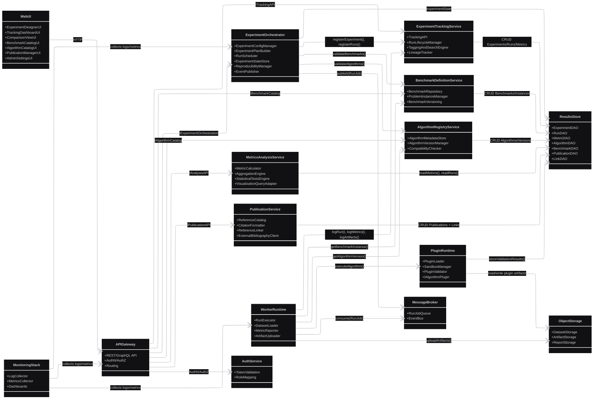

Control plane, ten widok pokazuje komponenty, które „sterują” systemem i przechowują stan:
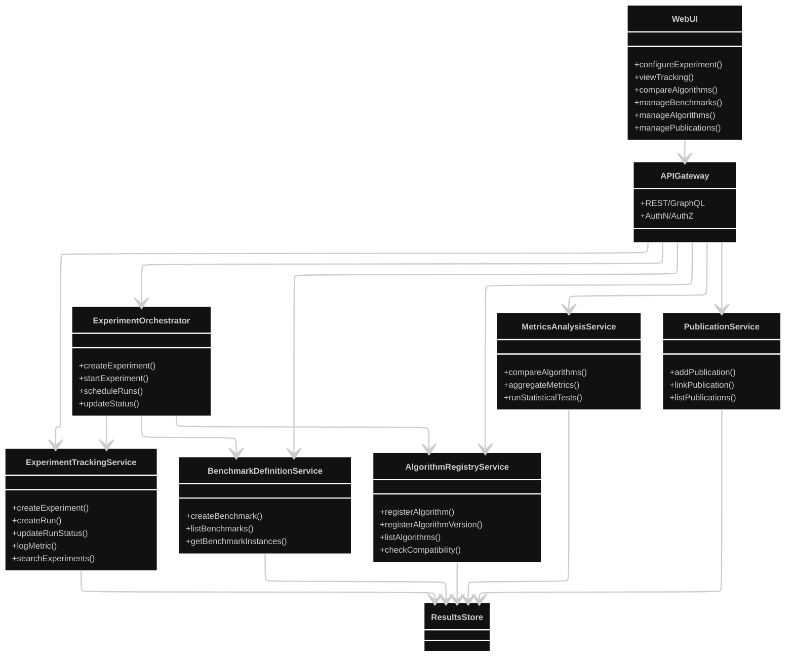

Execution plane, tu mamy czystą „ścieżkę runów”, orkiestrator, kolejka, workery, pluginy
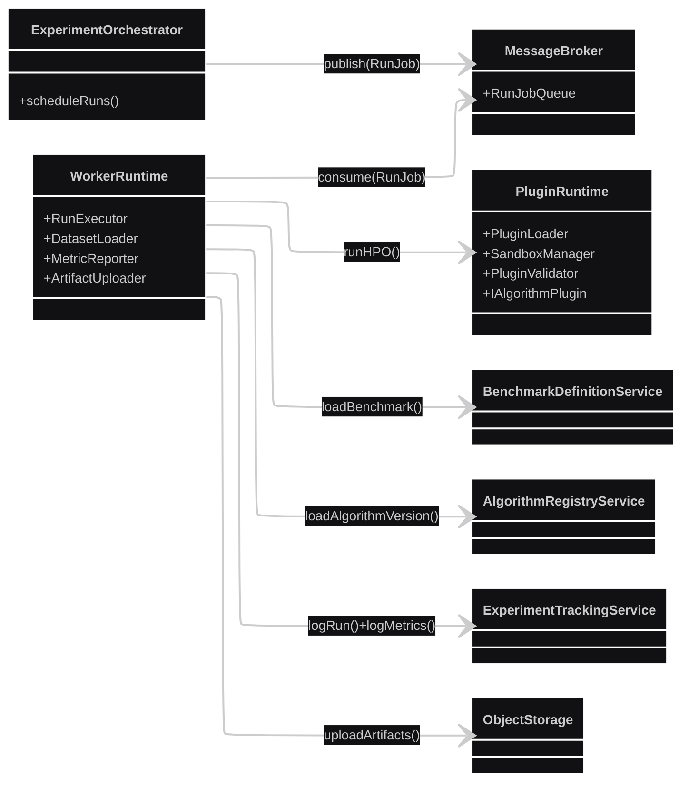

Publikacje, raportowanie, porównania, osobny diagram dla referencji do publikacji, analytics i generatora raportów:
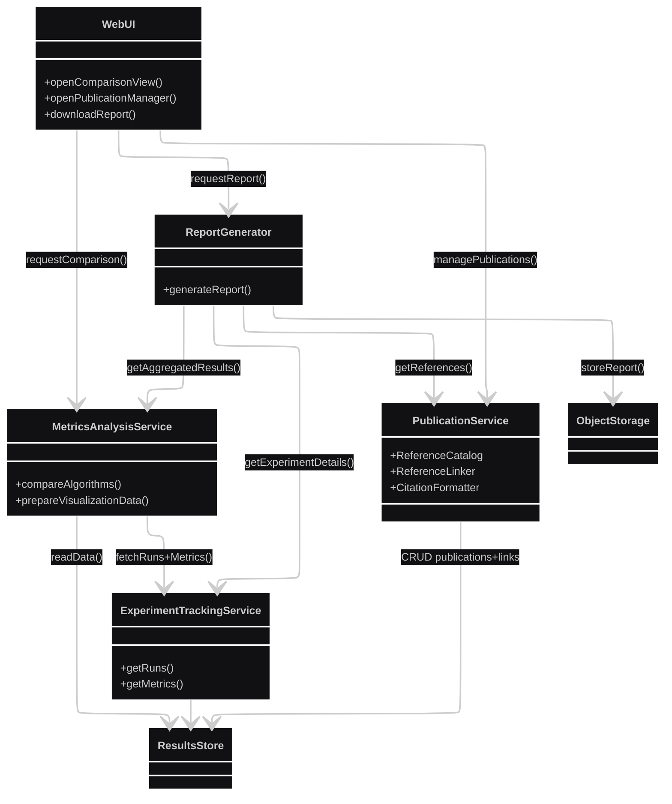

Poniżej wewnętrzna struktura najważniejszych kontenerów.

### 3.1. Experiment Orchestrator Service – komponenty

- **ExperimentConfigManager**
  - Waliduje konfigurację eksperymentu (z Benchmark Definition i Algorithm Registry).  
- **ExperimentPlanBuilder**
  - Tworzy plan runów (macierz konfiguracji).  
- **RunScheduler**
  - Przekłada plan na zadania w kolejce Message Broker (RunJob).  
- **ExperimentStateStore (komponent logiczny nad DB)**
  - Utrzymuje stan eksperymentu, runów, retry.  
- **ReproducibilityManager**
  - Odpowiada za seed, wersje obrazów, snapshoty konfiguracji.  
- **EventPublisher**
  - Publikuje zdarzenia systemowe (ExperimentStarted/Completed/Failed).  

**Interakcje:**
- ExperimentConfigManager ↔ Benchmark Definition Service, Algorithm Registry.
- RunScheduler → Message Broker.
- ReproducibilityManager ↔ Results Store, Experiment Tracking.

### 3.2. Benchmark Definition Service – komponenty

- **BenchmarkRepository**
  - CRUD benchmarków.  
- **ProblemInstanceManager**
  - Zarządza instancjami (dataset + konfiguracja tasku).  
- **BenchmarkVersioning**
  - Wersjonowanie benchmarków, oznaczanie „kanonicznych” wersji.  

### 3.3. Algorithm Registry Service – komponenty

- **AlgorithmMetadataStore**
  - Opis algorytmu: nazwa, typ, parametry, powiązania.  
- **AlgorithmVersionManager**
  - Wersjonowanie implementacji, status (draft, approved).  
- **CompatibilityChecker**
  - Sprawdza kompatybilność algorytmu z typami benchmarków.  

### 3.4. Algorithm SDK / Plugin Runtime – komponenty

- **IAlgorithmPlugin (interfejs)**
  - Metody np.:
    - `suggest(config_space, history)`
    - `observe(config, result)`
    - `init(seed, resources)`
  - Kontrakt input/output jasno zdefiniowany.  
- **PluginLoader**
  - Ładuje pluginy (np. z plików wheel, modułów Python, serwisów gRPC).  
- **SandboxManager**
  - Izoluje pluginy (np. przez subprocess lub kontener).  
- **PluginValidator**
  - Sprawdza implementację względem interfejsu (testowy run).  

### 3.5. Experiment Tracking Service – komponenty

- **TrackingAPI**
  - Publiczne API do logowania runów, metryk, artefaktów, tagów.  
- **RunLifecycleManager**
  - Tworzy runy, aktualizuje statusy.  
- **TaggingAndSearchEngine**
  - Filtrowanie i tagowanie eksperymentów/runów.  
- **LineageTracker**
  - Zapisuje powiązania: eksperyment → run → algorytm → benchmark → publikacja.  

### 3.6. Metrics & Analysis Service – komponenty

- **MetricCalculator**
  - Oblicza metryki z surowych wyników (np. accuracy, regret).  
- **AggregationEngine**
  - Agreguje po benchmarkach/algorytmach.  
- **StatisticalTestsEngine**
  - Testy parowane, rankingi (np. Friedman/Nemenyi – nazwy ogólne).  
- **VisualizationQueryAdapter**
  - Przygotowuje dane do wykresów dla Web UI.  

### 3.7. Publication & Reference Service – komponenty

- **ReferenceCatalog**
  - Baza publikacji.  
- **CitationFormatter**
  - Generuje cytowania i BibTeX.  
- **ReferenceLinker**
  - Łączy publikacje z algorytmami, benchmarkami i eksperymentami.  
- **ExternalBibliographyClient**
  - Klient do CrossRef/arXiv/DOI.  

### 3.8. Results Store – komponenty logiczne

- **ExperimentDAO**, **RunDAO**, **MetricDAO**, **AlgorithmDAO**, **BenchmarkDAO**, **PublicationDAO**, **LinkDAO**  
  - Komponenty dostępu do danych, wykorzystywane przez powyższe usługi.  

### 3.9. Web UI – komponenty

- **ExperimentDesignerUI**
  - Kreator konfiguracji eksperymentów.  
- **TrackingDashboardUI**
  - Panel eksperymentów/runów.  
- **ComparisonViewUI**
  - Wykresy i porównania algorytmów.  
- **BenchmarkCatalogUI**  
- **AlgorithmCatalogUI**  
- **PublicationManagerUI**  
- **AdminSettingsUI**  

**Wsparcie wymagań:**
- Tworzenie i porównywanie algorytmów: AlgorithmCatalogUI + ComparisonViewUI + Metrics & Analysis.
- Panel śledzenia: TrackingDashboardUI + TrackingAPI + RunLifecycleManager.
- Referencje: PublicationManagerUI + ReferenceCatalog + ReferenceLinker.
- Reprodukowalność: ReproducibilityManager + LineageTracker + Results Store.

---

## 4. Szczegóły techniczne / Code (C4-4)

### 4.1. Wzorce architektoniczne i technologie (przykładowe)

- **Styl:** mikroserwisy z możliwością spakowania w monolit modułowy na PC.
- **Komunikacja:** REST/GraphQL + gRPC między usługami; Message Broker (RabbitMQ/Kafka) dla runów.
- **Bazy danych:**
  - Relacyjna (PostgreSQL) – Results Store.
  - Object Storage (S3/MinIO) – artefakty, dataset.
- **Konteneryzacja:** Docker; deployment:
  - PC: `docker-compose`.
  - Cloud: K8s (Deployment + StatefulSet dla DB).  
- **Pluginy:**
  - SDK: biblioteka Python (i potencjalnie inne języki).
  - Interfejs pluginu: IAlgorithmPlugin, rejestrowany w Algorithm Registry.

### 4.2. Strategia reprodukowalności

- Wymuszenie zapisu:
  - pełnej konfiguracji eksperymentu (JSON),
  - wersji datasetu, algorytmu, pluginu,
  - wersji obrazu kontenera workerów,
  - seedów losowych,
  - referencji do publikacji (np. artykuł definiujący algorytm).  
- Każdy run ma:
  - `environment_snapshot_id`: opis środowiska,
  - `code_ref`: commit hash / tag repozytorium lub wersja pluginu.  
- Możliwość odtworzenia runu przez „Re-run with same config/environment”.

### 4.3. Model danych – kluczowe encje

Przykładowy model (w skrócie):

- **Experiment**
  - `id`
  - `name`
  - `description`
  - `goal_type` (G1–G5 / wielokrotny)
  - `benchmark_ids[]`
  - `algorithm_ids[]`
  - `created_by_user`
  - `created_at`
  - `config_json`
  - `tags[]`
- **Run**
  - `id`
  - `experiment_id`
  - `algorithm_version_id`
  - `benchmark_instance_id`
  - `seed`
  - `status` (pending/running/completed/failed)
  - `start_time`, `end_time`
  - `resource_usage_json`
  - `environment_snapshot_id`
- **Metric**
  - `id`
  - `run_id`
  - `name`
  - `value`
  - `step` / `epoch` (opcjonalne)
  - `timestamp`
- **Algorithm**
  - `id`
  - `name`
  - `type` (bayes, TPE, random, grid, evo, other)
  - `is_builtin`
  - `primary_publication_id` (FK)  
- **AlgorithmVersion**
  - `id`
  - `algorithm_id`
  - `version`
  - `plugin_location` (np. URL, ścieżka pakietu)
  - `sdk_version`
  - `status` (draft/approved/deprecated)
- **Benchmark**
  - `id`
  - `name`
  - `description`
  - `problem_type`
  - `canonical_version`
- **BenchmarkInstance**
  - `id`
  - `benchmark_id`
  - `dataset_ref`
  - `config_json`
  - `best_known_value` (opcjonalnie)
- **Publication**
  - `id`
  - `title`
  - `authors`
  - `year`
  - `venue`
  - `doi`
  - `bibtex`
  - `url`
- **PublicationLink**
  - `id`
  - `publication_id`
  - `entity_type` (Algorithm, Benchmark, Experiment)
  - `entity_id`

---

## 5. Przypadki użycia


### 5.1. Lista przypadków użycia

- **UC1:** Skonfiguruj i uruchom eksperyment benchmarkowy.  
- **UC2:** Dodaj nowy wbudowany algorytm HPO.  
- **UC3:** Zaimplementuj i zarejestruj własny algorytm HPO (plugin).  
- **UC4:** Porównaj wyniki algorytmów (w tym autorskich).  
- **UC5:** Przeglądaj i filtruj eksperymenty w panelu śledzenia.  
- **UC6:** Zarządzaj referencjami do artykułów i powiąż je z algorytmami / eksperymentami.  
- **UC7:** Uruchom system lokalnie na PC.  
- **UC8:** Uruchom system w chmurze / skaluj workerów.  
- **UC9:** Eksportuj dane do analizy zewnętrznej.  

### 5.2. Opisy przypadków użycia

#### UC1: Skonfiguruj i uruchom eksperyment benchmarkowy

- **Aktorzy:**  
  - Główny: Badacz / Inżynier ML (A1)  
  - Współuczestniczący: System (Orchestrator, Benchmark Definition, Algorithm Registry, Tracking)  
- **Cel:**  
  - Utworzenie eksperymentu benchmarkowego, zdefiniowanie planu runów, uruchomienie i zapis wyników.  
- **Warunki początkowe:**  
  - Istnieją zarejestrowane benchmarki i algorytmy HPO (wbudowane lub pluginy).  
  - Użytkownik jest zalogowany i posiada uprawnienia do tworzenia eksperymentów.  
- **Główny scenariusz:**
  1. A1 otwiera Web UI – sekcję „Nowy eksperyment”.
  2. System pobiera listę benchmarków z Benchmark Definition Service.
  3. A1 wybiera jeden lub więcej benchmarków oraz instancje problemów.
  4. System pobiera listę dostępnych algorytmów z Algorithm Registry.
  5. A1 wybiera algorytmy i konfiguruje ich parametry/limity budżetu HPO.
  6. A1 definiuje cele eksperymentu (G1–G5) i metryki.
  7. A1 zapisuje konfigurację eksperymentu.
  8. API Gateway przekazuje konfigurację do Experiment Orchestrator.
  9. Orchestrator waliduje konfigurację (Benchmark Definition, Algorithm Registry).
  10. Orchestrator tworzy plan runów i zapisuje eksperyment w Experiment Tracking Service.
  11. A1 uruchamia eksperyment (przycisk „Run”).
  12. Orchestrator wysyła zadania runów do Message Broker.
  13. Workery pobierają zadania, wykonują runy, raportują metryki i logi do Tracking Service.
  14. Orchestrator aktualizuje status eksperymentu, dopóki wszystkie runy nie zostaną zakończone.
- **Scenariusze alternatywne / błędy:**
  - 9a. Walidacja nie powiodła się (niekompatybilny algorytm → benchmark)
    - System informuje A1 o błędach konfiguracji; eksperyment nie jest tworzony.
  - 12a. Brak dostępnych workerów
    - Runy pozostają w stanie „pending”; A1 jest informowany o opóźnieniu.
  - 13a. Run zakończony błędem
    - Workery raportują błąd; Orchestrator może spróbować ponownego uruchomienia (wg polityki retry).  
- **Warunki końcowe:**  
  - Eksperyment ma status completed/failed.
  - Wszystkie runy mają metryki i logi zapisane w Tracking Service.
  - Dane są gotowe do analizy (UC4).

```mermaid
---
config:
  layout: elk
  theme: redux-dark
---
flowchart LR
 subgraph subGraph0["Przepływ danych"]
        UI["Web UI\n(Kreator eksperymentu)"]
        U["Badacz / Inżynier ML"]
        API["API Gateway"]
        ORCH["Experiment Orchestrator"]
        BENCH["Benchmark Definition Service"]
        ALG["Algorithm Registry Service"]
        TRK["Experiment Tracking Service"]
        MB["Message Broker\nRunJob queue"]
        W["Worker Runtime"]
        OBJ["Object Storage\n(artefakty, modele)"]
        DB[("Results Store\n(Experiments, Runs, Metrics)")]
  end
    U --> UI
    UI --> API
    API --> ORCH
    ORCH --> BENCH & ALG & TRK & MB
    MB --> W
    W --> TRK & OBJ
    TRK --> DB
    U -- konfiguracja eksperymentu\n(benchmarki, algorytmy, budżety) --> UI
    UI -- config JSON --> API
    API -- createExperiment(config) --> ORCH
    ORCH -- pobierz definicje instancji --> BENCH
    ORCH -- pobierz definicje algorytmów --> ALG
    ORCH -- registerExperiment, registerRuns --> TRK
    ORCH -- RunJob --> MB
    W -- logRun, logMetrics, logArtifacts --> TRK
    W -- modele, logi, artefakty --> OBJ
    TRK -- INSERT Experiments/Runs/Metrics --> DB
    UI <-- status eksperymentu, wyniki --> API
    linkStyle 3 stroke:#FFD600,fill:none
    linkStyle 4 stroke:#FFD600,fill:none
    linkStyle 5 stroke:#FFD600,fill:none
    linkStyle 6 stroke:#FFD600,fill:none
    linkStyle 8 stroke:#00C853,fill:none
    linkStyle 9 stroke:#00C853,fill:none
    linkStyle 14 stroke:#FFD600,fill:none
    linkStyle 15 stroke:#FFD600,fill:none
    linkStyle 16 stroke:#FFD600,fill:none
    linkStyle 17 stroke:#FFD600,fill:none
    linkStyle 18 stroke:#00C853,fill:none
    linkStyle 19 stroke:#00C853
```

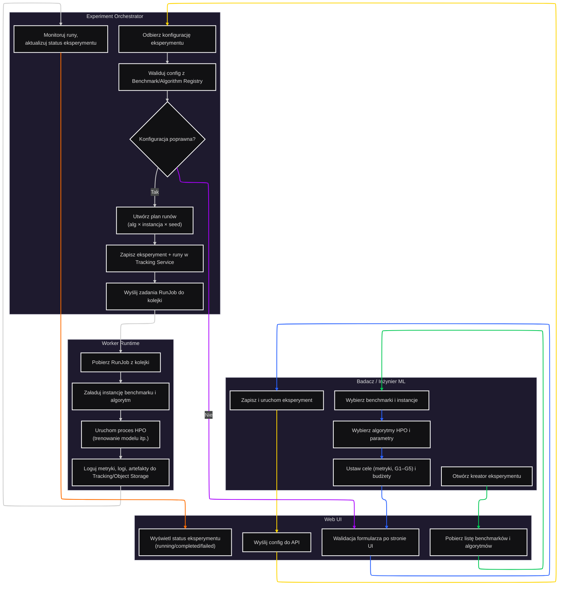

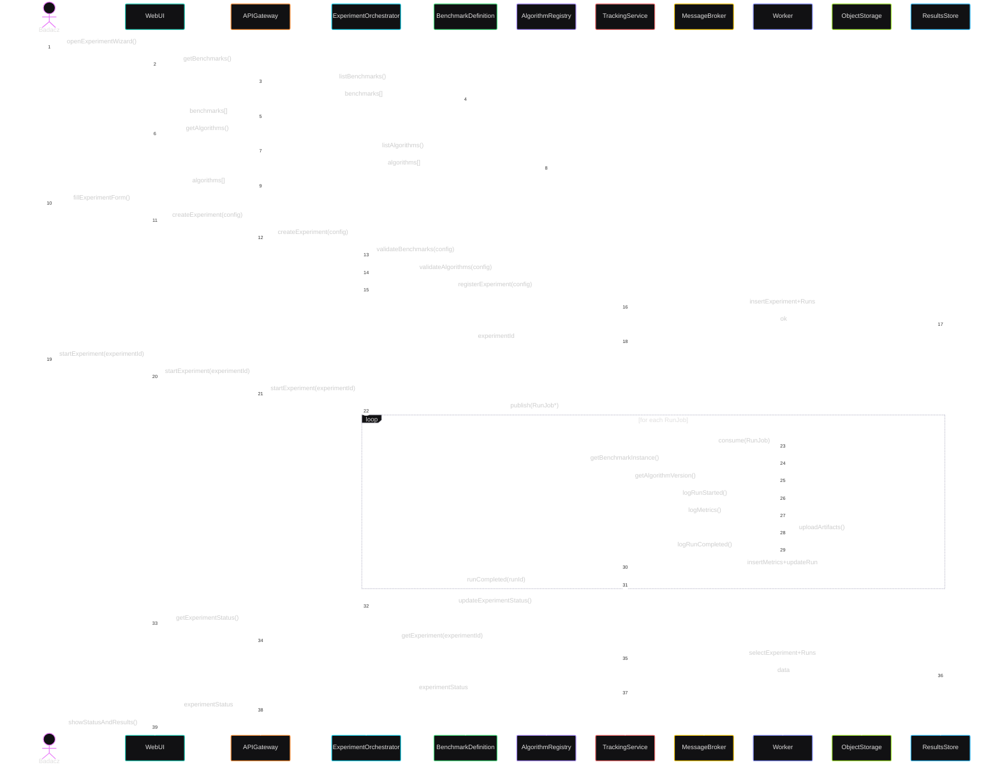

---

#### UC2: Dodaj nowy wbudowany algorytm HPO

**Aktorzy główni:**
- Administrator (Primary)

**Aktorzy poboczni:**
- Algorithm Registry Service
- Publication & Reference Service

**Cel:**
Dodanie do systemu nowego *wbudowanego* algorytmu HPO, który będzie dostępny w katalogu algorytmów dla wszystkich użytkowników oraz – opcjonalnie – powiązany z publikacjami naukowymi.

**Warunki początkowe:**
- Administrator jest uwierzytelniony i posiada uprawnienia administracyjne (rola Administrator).
- System jest uruchomiony w trybie lokalnym lub chmurowym (Web UI, API Gateway, Algorithm Registry, Publication Service, Results Store dostępne).
- Administrator zna podstawowe informacje o algorytmie:
  - Nazwa, opis, typ algorytmu (np. Bayesian, TPE, random search),
  - Definicja przestrzeni hiperparametrów,
  - Informacja o implementacji (np. moduł w repozytorium kodu),
  - Opcjonalnie: DOI lub inne identyfikatory publikacji.

**Główny scenariusz:**
1. Administrator otwiera w Web UI panel **„Algorytmy HPO”**.
2. System wyświetla listę zarejestrowanych algorytmów (wbudowanych oraz pluginów).
3. Administrator wybiera akcję **„Dodaj algorytm wbudowany”**.
4. System wyświetla formularz z polami:
   - Nazwa algorytmu, krótki opis,
   - Typ algorytmu (klasa/rodzina HPO),
   - Przestrzeń hiperparametrów (schemat),
   - Domyślne parametry,
   - Flaga `is_builtin`,
   - Informacja o implementacji (np. nazwa klasy, modułu),
   - Opcjonalne powiązane DOI / identyfikatory publikacji.
5. Administrator wypełnia formularz danymi algorytmu.
6. Web UI wykonuje wstępną walidację (pola wymagane, format DOI, poprawność schematu przestrzeni hiperparametrów).
7. Administrator potwierdza zapis algorytmu.
8. Web UI wysyła do API Gateway żądanie `createBuiltinAlgorithm(metadata, pubIds?)`.
9. API Gateway:
   - 9.1. Sprawdza uprawnienia użytkownika (rola Administrator),
   - 9.2. W przypadku braku uprawnień odrzuca żądanie (patrz scenariusz alternatywny).
10. API przekazuje metadane do **Algorithm Registry Service**.
11. Algorithm Registry:
    - 11.1. Waliduje metadane algorytmu (np. unikalność nazwy, poprawność przestrzeni hiperparametrów),
    - 11.2. Tworzy rekord **Algorithm** z flagą `is_builtin = true`,
    - 11.3. Tworzy rekord **AlgorithmVersion** (np. `v1.0`, status `approved` lub `draft` wg polityki).
12. Algorithm Registry zapisuje dane w Results Store.
13. API otrzymuje informację o utworzeniu algorytmu (`algorithmId`, `versionId`).
14. Jeżeli w żądaniu podano listę DOI / identyfikatorów publikacji:
    - 14.1. API wywołuje **Publication & Reference Service** z żądaniem `createPublicationLinks(algorithmId, pubIds)`,
    - 14.2. Publication Service tworzy brakujące rekordy `Publication` na podstawie DOI (w razie potrzeby),
    - 14.3. Publication Service tworzy rekordy `PublicationLink` łączące algorytm z publikacjami.
15. API zwraca do Web UI informację o sukcesie oraz identyfikatory nowego algorytmu i wersji.
16. Web UI:
    - 16.1. Wyświetla komunikat sukcesu,
    - 16.2. Odświeża listę algorytmów, pokazując nowy algorytm w katalogu.

**Scenariusze alternatywne / błędy:**

- **2A. Brak uprawnień administratora**
  1. W kroku 9.1 API stwierdza, że użytkownik nie ma roli Administrator.
  2. API zwraca błąd autoryzacji (np. 403 Forbidden).
  3. Web UI wyświetla komunikat o braku uprawnień i nie zapisuje algorytmu.

- **2B. Błędy walidacji po stronie UI**
  1. W kroku 6 Web UI wykrywa błędy (np. brak nazwy algorytmu, niepoprawny format DOI).
  2. System podświetla błędne pola i wyświetla komunikaty walidacyjne.
  3. Administrator poprawia dane i wraca do kroku 7.

- **2C. Błąd walidacji po stronie Algorithm Registry**
  1. W kroku 11 walidacja metadanych nie przechodzi (np. nazwa algorytmu już istnieje, schemat parametrów jest niepoprawny).
  2. Algorithm Registry zwraca błąd walidacji do API.
  3. API przekazuje szczegóły błędów do Web UI.
  4. Web UI wyświetla komunikat o błędzie z informacją, które pola należy poprawić.
  5. Administrator poprawia dane i ponawia próbę od kroku 7.

- **2D. Błąd komunikacji z Publication Service**
  1. W kroku 14 Publication Service nie jest dostępny lub zwraca błąd.
  2. API może:
     - 2D.1. Zwrócić częściowy sukces (algorytm zapisany, ale publikacje niepowiązane),
     - 2D.2. Lub przerwać operację w całości (w zależności od przyjętej polityki).
  3. Web UI wyświetla odpowiedni komunikat:
     - a) „Algorytm zapisany, ale publikacje nie zostały powiązane”,
     - b) lub „Nie udało się zapisać algorytmu – spróbuj ponownie”.

**Warunki końcowe:**
- W przypadku sukcesu:
  - Nowy wbudowany algorytm HPO jest zapisany w Results Store (Algorithm + AlgorithmVersion),
  - Jest widoczny w katalogu algorytmów i może być używany w eksperymentach benchmarkowych,
  - Jeżeli podano DOI – algorytm jest powiązany z odpowiednimi publikacjami.
- W przypadku błędu:
  - System pozostaje w stanie spójnym – albo nie powstał żaden nowy algorytm, albo algorytm powstał, ale brak jest częściowo powiązań z publikacjami (w zależności od scenariusza).

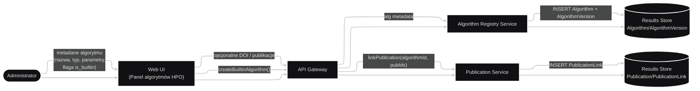

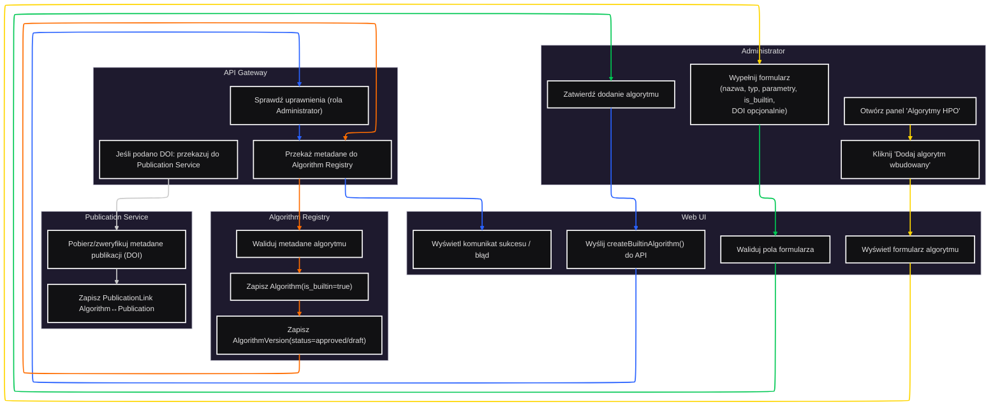

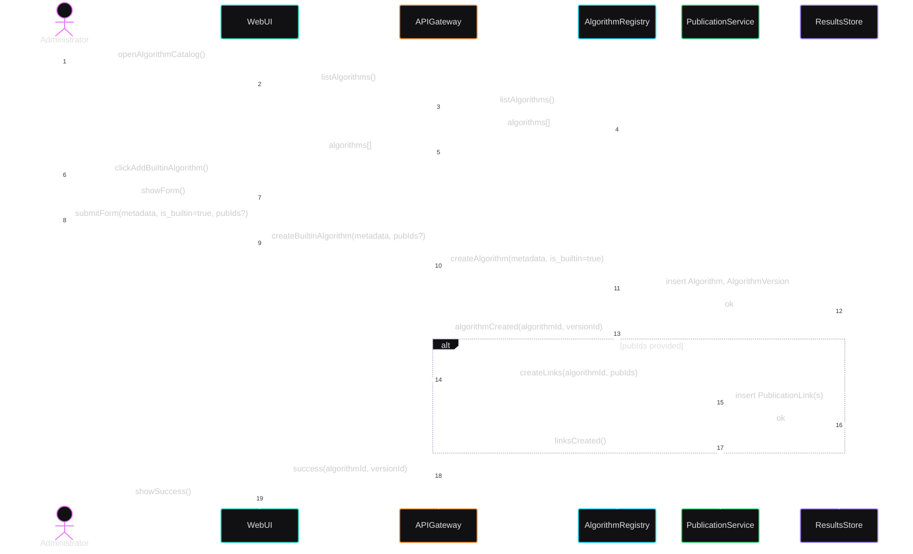

---

#### UC3: Zaimplementuj i zarejestruj własny algorytm HPO (plugin)

- **Aktorzy:**  
  - Główny: Twórca algorytmu HPO (A2)  
  - Współuczestniczący: Algorithm SDK/Plugin Runtime, Algorithm Registry, Publication & Reference Service  
- **Cel:**  
  - Udostępnienie nowego algorytmu HPO jako pluginu, kompatybilnego z platformą benchmarkową.  
- **Warunki początkowe:**  
  - A2 ma dostęp do SDK i repozytorium pluginów.
  - Użytkownik jest zalogowany i ma uprawnienia do rejestracji pluginów.  
- **Główny scenariusz:**
  1. A2 pobiera SDK (np. pip install).
  2. A2 implementuje klasę/serwis IAlgorithmPlugin (metody init/suggest/observe).
  3. A2 uruchamia lokalne testy (komenda SDK, np. `hpo-sdk validate`), które odpalają PluginValidator.
  4. PluginValidator sprawdza zgodność API, uruchamia krótką symulację.
  5. A2 pakuje plugin (np. wheel lub obraz kontenera).
  6. A2 w Web UI otwiera widok „Rejestruj algorytm HPO”.  
  7. A2 podaje metadane (nazwa, opis, typ, parametry, publikacje) oraz wskazuje lokalizację pluginu (URL, plik).  
  8. API przekazuje dane do Algorithm Registry.
  9. Algorithm Registry zapisuje Algorithm i AlgorithmVersion ze statusem „draft”.
  10. System (lub A3 – administrator) zatwierdza algorytm (status „approved”).  
- **Scenariusze alternatywne / błędy:**
  - 3a. Walidacja lokalna się nie powiedzie
    - SDK raportuje błędy implementacji; algorytm nie jest rejestrowany.
  - 9a. Rejestracja w Registry się nie powiedzie (np. brak dostępu do storage)
    - System informuje A2; algorytm pozostaje lokalny.
- **Warunki końcowe:**  
  - Nowy algorytm HPO jest dostępny w Algorithm Registry i może być użyty w UC1.

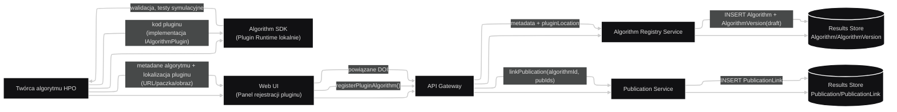

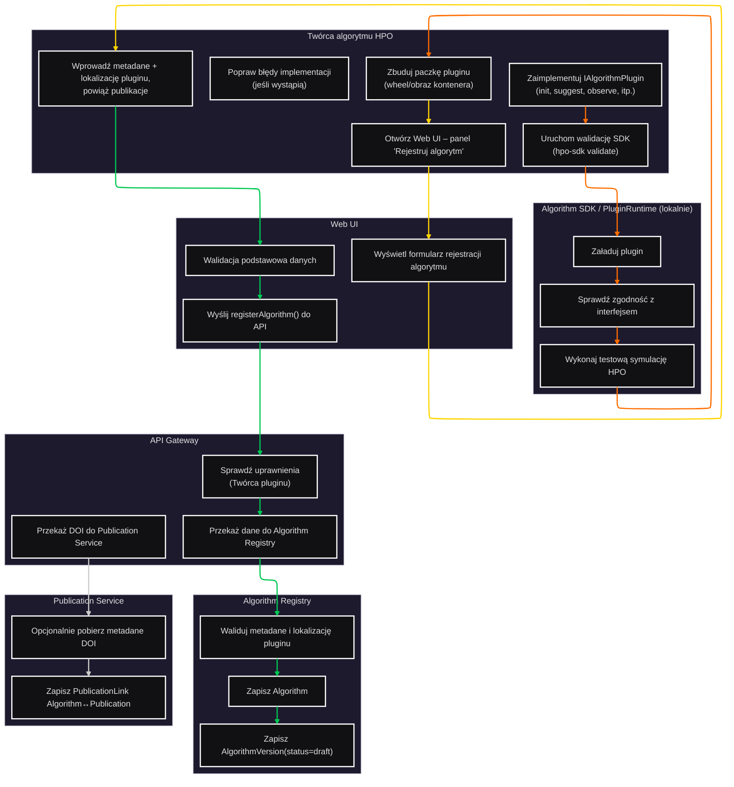

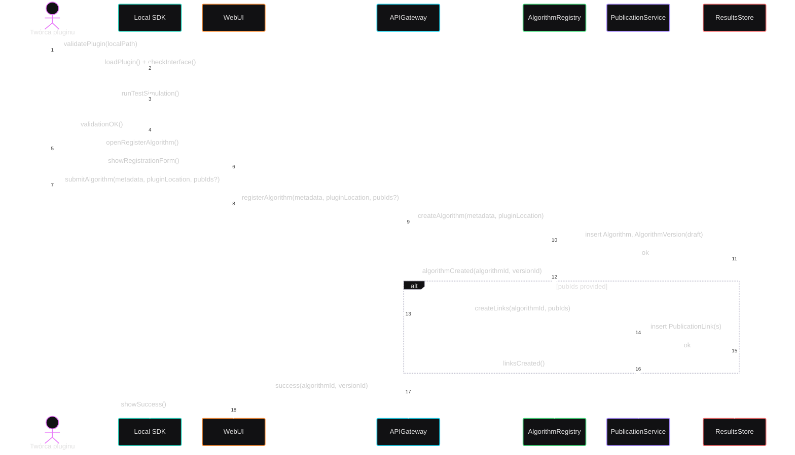

---

#### UC4: Porównaj wyniki algorytmów (w tym autorskich)

- **Aktorzy:**  
  - Główny: Badacz / Inżynier ML (A1)  
  - Współuczestniczący: Metrics & Analysis Service, Experiment Tracking Service  
- **Cel:**  
  - Wizualne i statystyczne porównanie algorytmów HPO na zestawie benchmarków.  
- **Warunki początkowe:**  
  - Istnieją zakończone eksperymenty z runami dla co najmniej dwóch algorytmów.  
- **Główny scenariusz:**
  1. A1 otwiera Web UI – sekcję „Porównaj algorytmy”.
  2. A1 wybiera eksperymenty lub zestaw runów do porównania (np. filtr po algorytmie, benchmarku, tagach).
  3. Web UI pobiera listę runów i metryk z Experiment Tracking Service.
  4. Web UI wysyła zapytanie do Metrics & Analysis Service z wybranymi runami.
  5. Metrics & Analysis agreguje metryki per algorytm/benchmark, wykonuje testy statystyczne.
  6. Metrics & Analysis zwraca dane do wizualizacji (np. tablica wyników, rankingi, wartości p).
  7. Web UI prezentuje wykresy i tabele.
  8. A1 może zapisać „widok porównania” lub wygenerować raport.  
- **Scenariusze alternatywne / błędy:**
  - 2a. Zbyt mała liczba runów
    - System ostrzega, że porównanie jest statystycznie słabe.
  - 5a. Błąd obliczeń (np. brak metryk)
    - System informuje A1 o niekompletnych danych.
- **Warunki końcowe:**  
  - A1 uzyskuje porównanie algorytmów, może podjąć decyzję badawczą i ewentualnie opublikować wyniki.

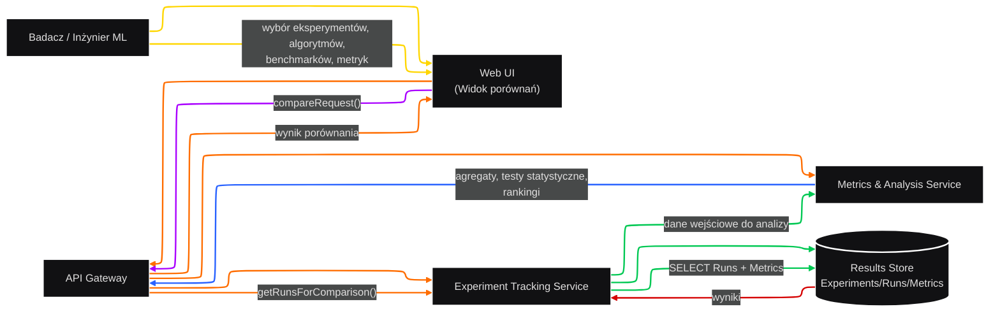


```mermaid
---
config:
  theme: redux-dark-color
---
sequenceDiagram
    autonumber
    actor User as Badacz
    participant UI as WebUI
    participant API as APIGateway
    participant TRK as TrackingService
    participant DB as ResultsStore
    participant ANAL as MetricsAnalysis
    User->>UI: openComparisonView()
    UI->>API: listExperiments(filters)
    API->>TRK: listExperiments(filters)
    TRK->>DB: select Experiments
    DB-->>TRK: experiments[]
    TRK-->>API: experiments[]
    API-->>UI: experiments[]
    User->>UI: selectExperimentsAndAlgorithms()
    UI->>API: compare(experimentIds, algorithmIds, metricNames)
    API->>TRK: getRunsForComparison(...)
    TRK->>DB: select Runs+Metrics
    DB-->>TRK: runs+metrics
    TRK-->>API: runs+metrics
    API->>ANAL: compare(runs+metrics)
    ANAL->>ANAL: computeAggregates()
    ANAL->>ANAL: runStatTests()
    ANAL-->>API: comparisonResult
    API-->>UI: comparisonResult
    UI-->>User: showPlotsAndTables()
```

---

#### UC5: Przeglądaj i filtruj eksperymenty w panelu śledzenia

- **Aktorzy:**  
  - Główny: Badacz / Inżynier ML (A1), Twórca algorytmu HPO (A2)  
  - Współuczestniczący: Experiment Tracking Service  
- **Cel:**  
  - Szybkie znalezienie eksperymentów, runów, ich statusów, metryk i logów.  
- **Warunki początkowe:**  
  - Istnieją zarejestrowane eksperymenty i runy.  
- **Główny scenariusz:**
  1. Użytkownik otwiera panel śledzenia w Web UI.
  2. Web UI wysyła zapytanie do Tracking Service (lista eksperymentów).
  3. Użytkownik filtruje po tagach, czasie, benchmarkach, algorytmach, statusach.
  4. Tracking Service zwraca przefiltrowane eksperymenty i agregaty (np. liczba runów).
  5. Użytkownik wybiera konkretny eksperyment i rozwija listę runów.
  6. Użytkownik ogląda detale runu (metryki, logi, konfiguracja, linki do artefaktów).  
- **Scenariusze alternatywne / błędy:**
  - 2a. Duża liczba eksperymentów – paginacja, cache, lazy loading.
- **Warunki końcowe:**  
  - Użytkownik może efektywnie nawigować po historii eksperymentów.

```mermaid
---
config:
  theme: redux-dark
  layout: elk
---
flowchart LR
    U["Badacz / Twórca pluginu"] --> UI["Web UI\n(Panel śledzenia)"]
    UI --> API["API Gateway"] & OBJ["Object Storage\n(logi, artefakty)\n*pobieranie po linkach*"]
    API --> TRK["Experiment Tracking Service"]
    TRK --> DB[("Results Store\nExperiments/Runs/Metrics")]
    U -- filtry: tagi, status, algorytmy,\nbenchmarki, daty --> UI
    UI -- listExperiments(filters) --> API
    API -- listExperiments(filters) --> TRK
    TRK -- SELECT Experiments --> DB
    DB -- lista eksperymentów --> TRK
    TRK -- "experiments[] + agregaty (liczba runów itp.)" --> API
    API -- experiments[] --> UI
    U -- kliknięcie w eksperyment/run --> UI
    UI -- getRunDetails(runId) --> API
    API -- getRunDetails(runId) --> TRK
    TRK -- SELECT Run, Metrics --> DB
    DB -- Run + Metrics --> TRK
    TRK -- Run + Metrics + links do artefaktów --> API
    API -- dane runu --> UI
    UI -- pobranie logów/artefaktów\npo URL --> OBJ
    linkStyle 1 stroke:#FF6D00,fill:none
    linkStyle 2 stroke:#FF6D00,fill:none
    linkStyle 3 stroke:#FFD600,fill:none
    linkStyle 4 stroke:#AA00FF,fill:none
    linkStyle 6 stroke:#FF6D00,fill:none
    linkStyle 7 stroke:#FFD600,fill:none
    linkStyle 8 stroke:#AA00FF,fill:none
    linkStyle 9 stroke:#D50000
    linkStyle 10 stroke:#2962FF,fill:none
    linkStyle 11 stroke:#00C853,fill:none
    linkStyle 13 stroke:#FF6D00,fill:none
    linkStyle 14 stroke:#FFD600,fill:none
    linkStyle 15 stroke:#AA00FF,fill:none
    linkStyle 16 stroke:#D50000,fill:none
    linkStyle 17 stroke:#2962FF,fill:none
    linkStyle 18 stroke:#00C853,fill:none
    linkStyle 19 stroke:#FF6D00,fill:none
```

```mermaid
---
config:
  layout: elk
  theme: redux-dark
---
flowchart TB
 subgraph Swim_User["Badacz / Twórca pluginu"]
        U1["Otwórz panel śledzenia"]
        U2["Ustaw filtry (status, tagi,\nalgorytmy, benchmarki)"]
        U3["Przeglądaj listę eksperymentów"]
        U4["Wejdź w szczegóły konkretnego eksperymentu"]
        U5["Wejdź w szczegóły wybranego runu"]
        U6["Otwórz logi / modele / artefakty"]
  end
 subgraph Swim_UI["Web UI"]
        W1["Wyslij listExperiments(filters) do API"]
        W2["Wyświetl tabelę eksperymentów + paginacja"]
        W3["Wyslij getExperimentDetails(experimentId)"]
        W4["Wyświetl listę runów dla eksperymentu"]
        W5["Wyslij getRunDetails(runId)"]
        W6["Wyświetl metryki, logi, linki do artefaktów"]
  end
 subgraph Swim_API["API Gateway"]
        A1["Przekaż zapytania do Tracking Service"]
  end
 subgraph Swim_TRK["Tracking Service"]
        T1["SELECT Experiments/Runs/Metrics z DB"]
  end
 subgraph Swim_OBJ["Object Storage"]
        O1["Serwowanie plików logów, modeli,\nartefaktów po URL"]
  end
    U1 --> W1
    W1 --> A1
    A1 --> T1 & T1 & T1
    T1 --> W2 & W4 & W6
    W2 --> U2
    U2 --> U3
    U3 --> U4
    U4 --> W3
    W3 --> A1
    W4 --> U5
    U5 --> W5
    W5 --> A1
    W6 --> U6
    U6 --> O1
    linkStyle 0 stroke:#2962FF,fill:none
    linkStyle 1 stroke:#2962FF,fill:none
    linkStyle 5 stroke:#D50000,fill:none
    linkStyle 6 stroke:#D50000,fill:none
    linkStyle 7 stroke:#D50000,fill:none
    linkStyle 8 stroke:#FF6D00,fill:none
    linkStyle 9 stroke:#FF6D00,fill:none
    linkStyle 10 stroke:#FF6D00,fill:none
    linkStyle 11 stroke:#FF6D00,fill:none
    linkStyle 12 stroke:#FFD600,fill:none
    linkStyle 13 stroke:#00C853,fill:none
    linkStyle 14 stroke:#00C853,fill:none
    linkStyle 15 stroke:#00C853
```

```mermaid
---
config:
  theme: redux-dark-color
---
sequenceDiagram
    autonumber
    actor User as Badacz/Twórca
    participant UI as WebUI
    participant API as APIGateway
    participant TRK as TrackingService
    participant DB as ResultsStore
    participant OBJ as ObjectStorage
    User->>UI: openTrackingDashboard()
    UI->>API: listExperiments(defaultFilters)
    API->>TRK: listExperiments(defaultFilters)
    TRK->>DB: select Experiments
    DB-->>TRK: experiments[]
    TRK-->>API: experiments[]
    API-->>UI: experiments[]
    UI-->>User: showExperimentsTable()
    User->>UI: applyFilters(...)
    UI->>API: listExperiments(newFilters)
    API->>TRK: listExperiments(newFilters)
    TRK->>DB: select Experiments
    DB-->>TRK: experiments[]
    TRK-->>API: experiments[]
    API-->>UI: experiments[]
    UI-->>User: showFilteredExperiments()
    User->>UI: openExperimentDetails(experimentId)
    UI->>API: getExperimentDetails(experimentId)
    API->>TRK: getExperimentDetails(experimentId)
    TRK->>DB: select Runs+Metrics
    DB-->>TRK: runs+metrics
    TRK-->>API: runs+metrics
    API-->>UI: runs+metrics
    UI-->>User: showRunsList()
    User->>UI: openRunDetails(runId)
    UI->>API: getRunDetails(runId)
    API->>TRK: getRunDetails(runId)
    TRK->>DB: select Run, Metrics
    DB-->>TRK: run+metrics
    TRK-->>API: run+metrics+artifactLinks
    API-->>UI: run+metrics+artifactLinks
    UI-->>User: showRunDetails()
    User->>OBJ: downloadArtifact(log/model)  
    OBJ-->>User: file
```

---

#### UC6: Zarządzaj referencjami do artykułów i powiąż je z algorytmami / eksperymentami

- **Aktorzy:**  
  - Główny: Badacz / Inżynier ML (A1), Administrator (A3)  
  - Współuczestniczący: Publication & Reference Service, Algorithm Registry, Experiment Tracking  
- **Cel:**  
  - Utrzymywanie bazy publikacji oraz powiązań z obiektami systemu (algorytmy, benchmarki, eksperymenty).  
- **Warunki początkowe:**  
  - Użytkownik jest zalogowany, ma odpowiednie uprawnienia.  
- **Główny scenariusz:**
  1. Użytkownik otwiera moduł „Publikacje” w Web UI.
  2. Użytkownik dodaje nową publikację, podając DOI lub dane ręcznie.
  3. Publication Service, jeśli jest DOI, pobiera metadane z zewnętrznego systemu.
  4. Użytkownik zapisuje publikację.
  5. Użytkownik wybiera algorytm/benchmark/eksperyment i dodaje do niego referencję (link PublicationLink).
  6. System zapisuje powiązanie i aktualizuje widoki (np. w katalogu algorytmów pokazuje „powiązane publikacje”).  
- **Scenariusze alternatywne / błędy:**
  - 3a. DOI nie zostaje odnalezione – użytkownik uzupełnia dane ręcznie.
- **Warunki końcowe:**  
  - Publikacje są dostępne w systemie i poprawnie powiązane z artefaktami benchmarku.

```mermaid
---
config:
  theme: redux-dark
  layout: elk
---
flowchart LR
    U["Badacz / Administrator"] --> UI@{ label: "Web UI\\n(Moduł 'Publikacje')" }
    UI --> API["API Gateway"]
    API --> PUB["Publication & Reference Service"] & REG["Algorithm Registry"] & TRK["Tracking Service"]
    PUB --> DBPUB[("Results Store\nPublication/PublicationLink")] & BIB["Zewnętrzne systemy bibliograficzne\n(CrossRef / arXiv / DOI)"]
    U -- DOI / dane publikacji --> UI
    UI -- "addPublication(doi/...)" --> API
    API -- addPublication() --> PUB
    PUB -- fetch metadata --> BIB
    BIB -- metadata --> PUB
    PUB -- INSERT Publication --> DBPUB
    U -- powiąż publikację z algorytmem,\nbenchmarkiem, eksperymentem --> UI
    UI -- linkPublication(entityType, entityId, pubId) --> API
    API -- "linkPublication(...)" --> PUB
    PUB -- INSERT PublicationLink --> DBPUB
    REG -. odczyt linków publikacji\nprzy widoku algorytmów .-> DBPUB
    TRK -. odczyt linków publikacji\nprzy widoku eksperymentów .-> DBPUB
    UI@{ shape: rect}
    linkStyle 5 stroke:#FF6D00,fill:none
    linkStyle 6 stroke:#FF6D00,fill:none
    linkStyle 10 stroke:#FF6D00,fill:none
    linkStyle 11 stroke:#00C853
    linkStyle 12 stroke:#FF6D00,fill:none
    linkStyle 16 stroke:#FF6D00,fill:none
```

```mermaid
---
config:
  layout: elk
  theme: redux-dark
---
flowchart TB
 subgraph Swim_User["Badacz / Administrator"]
        U1@{ label: "Otwórz moduł 'Publikacje'" }
        U2["Wprowadź DOI lub dane publikacji"]
        U3["Zatwierdź dodanie publikacji"]
        U4["Wybierz algorytm / benchmark / eksperyment"]
        U5["Dodaj powiązanie z wybraną publikacją"]
  end
 subgraph Swim_UI["Web UI"]
        W1["Wyświetl listę publikacji"]
        W2["Wyświetl formularz dodawania publikacji"]
        W3["Wyślij addPublication() do API"]
        W4["Wyświetl listę obiektów do powiązania\n(algorytmy, benchmarki, eksperymenty)"]
        W5["Wyślij linkPublication() do API"]
  end
 subgraph Swim_API["API Gateway"]
        A1["Przekaż żądania do Publication Service"]
  end
 subgraph Swim_PUB["Publication Service"]
        P1["Jeśli jest DOI: pobierz metadane\nz systemu bibliograficznego"]
        P2["Zapisz Publication w DB"]
        P3["Zapisz PublicationLink(entityType, entityId, pubId)"]
  end
 subgraph Swim_BIB["Zewnętrzne systemy bibliograficzne"]
        B1["Zapytanie o publikację po DOI"]
  end
    U1 --> W1
    W1 --> U2
    U2 --> W2
    W2 --> U3
    U3 --> W3
    W3 --> A1
    A1 --> P1 & P3
    P1 --> B1
    B1 --> P2
    P2 --> W1
    U4 --> W4
    W4 --> U5
    U5 --> W5
    W5 --> A1
    P3 --> W4
    U1@{ shape: rect}
    linkStyle 1 stroke:#2962FF,fill:none
    linkStyle 2 stroke:#2962FF,fill:none
    linkStyle 3 stroke:#2962FF,fill:none
    linkStyle 4 stroke:#2962FF,fill:none
    linkStyle 5 stroke:#2962FF,fill:none
    linkStyle 6 stroke:#FF6D00,fill:none
    linkStyle 7 stroke:#00C853,fill:none
    linkStyle 8 stroke:#FF6D00,fill:none
    linkStyle 9 stroke:#FF6D00,fill:none
    linkStyle 10 stroke:#FF6D00,fill:none
    linkStyle 11 stroke:#AA00FF
    linkStyle 12 stroke:#FFD600,fill:none
    linkStyle 13 stroke:#FFD600,fill:none
    linkStyle 14 stroke:#FFD600,fill:none
    linkStyle 15 stroke:#00C853,fill:none
```

```mermaid
---
config:
  theme: redux-dark-color
---
sequenceDiagram
    autonumber
    actor User as Badacz/Admin
    participant UI as WebUI
    participant API as APIGateway
    participant PUB as PublicationService
    participant BIB as ExternalBibliography
    participant DB as ResultsStore
    User->>UI: openPublicationsModule()
    UI->>API: listPublications()
    API->>PUB: listPublications()
    PUB->>DB: select Publications
    DB-->>PUB: publications[]
    PUB-->>API: publications[]
    API-->>UI: publications[]
    UI-->>User: showPublications()
    User->>UI: addPublication(doi)
    UI->>API: addPublication(doi)
    API->>PUB: addPublication(doi)
    PUB->>BIB: fetchMetadata(doi)
    BIB-->>PUB: metadata
    PUB->>DB: insert Publication
    DB-->>PUB: ok
    PUB-->>API: publicationCreated(pubId)
    API-->>UI: publicationCreated(pubId)
    UI-->>User: showNewPublication()
    User->>UI: linkPublicationToAlgorithm(pubId, algorithmId)
    UI->>API: linkPublication(entityType="Algorithm", entityId=algorithmId, pubId)
    API->>PUB: createPublicationLink(...)
    PUB->>DB: insert PublicationLink
    DB-->>PUB: ok
    PUB-->>API: linkCreated()
    API-->>UI: linkCreated()
    UI-->>User: showLinkedPublication()
```

--- 

#### UC7: Uruchom system lokalnie na PC

**Aktorzy główni:**
- Administrator (Primary)

**Aktorzy poboczni:**
- Docker Engine / środowisko kontenerowe
- Komponenty systemu (DB, Message Broker, API/Orchestrator, Tracking Service, Worker Runtime, Web UI, Monitoring)

**Cel:**
Uruchomienie kompletnego systemu benchmarkowego HPO na pojedynczym komputerze (tryb „local deployment”), w konfiguracji opartej na `docker-compose` lub równoważnej, tak aby wszystkie funkcjonalności (eksperymenty, tracking, raporty) były dostępne na jednym hoście.

**Warunki początkowe:**
- Na PC zainstalowany jest Docker / Docker Desktop lub kompatybilne środowisko kontenerowe.
- Administrator ma dostęp do repozytorium z konfiguracją systemu (np. git) lub paczki zawierającej pliki `docker-compose.yml`, `.env` itp.
- Porty lokalne wymagane przez system (UI, API, DB) są wolne lub odpowiednio skonfigurowane.

**Główny scenariusz:**
1. Administrator klonuje repozytorium / pobiera paczkę z konfiguracją systemu na PC.
2. Administrator otwiera plik `.env` i konfiguruje podstawowe parametry:
   - Porty publikowane (np. 8080 dla UI),
   - Ścieżki do wolumenów (np. katalog na dane DB),
   - Dane dostępowe (hasła do DB itp.).
3. Administrator uruchamia w terminalu polecenie `docker-compose up -d` (lub równoważne skryptem).
4. Docker Engine:
   - 4.1. Wczytuje plik `docker-compose.yml` i `.env`,
   - 4.2. Tworzy potrzebne sieci i wolumeny,
   - 4.3. Uruchamia kontenery systemu:
     - bazę danych (Results Store),
     - message broker,
     - API Gateway + Orchestrator,
     - Experiment Tracking Service,
     - jednego lub więcej Worker Runtime,
     - Web UI,
     - Monitoring / Logging (opcjonalnie).
5. Po starcie kontenerów:
   - 5.1. Kontener DB inicjalizuje się i nasłuchuje na połączenia,
   - 5.2. Message Broker uruchamia kolejki (np. RunJob),
   - 5.3. API/Orchestrator łączy się z DB i Brokerem,
   - 5.4. Tracking Service wykonuje migracje schematu bazy danych,
   - 5.5. Workery rejestrują się (subskrybują kolejkę RunJob),
   - 5.6. Web UI uruchamia serwer HTTP i jest dostępny pod adresem `http://localhost:<PORT>`.
6. Administrator sprawdza status kontenerów poprzez:
   - 6.1. `docker ps` / logi kontenerów,
   - 6.2. ewentualnie endpointy health-check (np. `/healthz` dla API).
7. Administrator otwiera Web UI w przeglądarce (`http://localhost:<PORT>`).
8. System wyświetla stronę logowania / ekran główny, sygnalizując gotowość do pracy.

**Scenariusze alternatywne / błędy:**

- **7A. Brak Dockera lub błędna instalacja**
  1. W kroku 3 wywołanie `docker-compose` kończy się błędem (komenda nieznana lub brak uprawnień).
  2. Administrator instaluję lub naprawia Dockera (poza zakresem systemu HPO).
  3. Po naprawie wraca do kroku 3.

- **7B. Konflikt portów**
  1. W kroku 4 Docker zgłasza błąd, że port UI/API jest już w użyciu.
  2. Administrator modyfikuje plik `.env` / `docker-compose.yml`, zmieniając porty.
  3. Ponownie uruchamia `docker-compose up -d` (wraca do kroku 3/4).

- **7C. Błąd startu jednego z kontenerów (np. DB)**
  1. W kroku 5 logi kontenera wskazują na błąd (np. brak uprawnień do katalogu danych).
  2. Administrator analizuje logi, poprawia konfigurację (np. prawa do katalogu, zmiana ścieżki wolumenu).
  3. Restartuje konkretny kontener lub cały stos (wraca do kroku 3–4).

**Warunki końcowe:**
- W przypadku sukcesu:
  - Na PC działa pełny zestaw kontenerów systemu HPO.
  - Web UI jest dostępny lokalnie i umożliwia tworzenie eksperymentów, śledzenie runów, analizę wyników.
- W przypadku błędu:
  - System nie jest w pełni dostępny, ale konfiguracja nie jest trwale uszkodzona – po poprawkach (porty, wolumeny, Docker) można powtórzyć procedurę startu.

```mermaid
---
config:
  theme: redux-dark
  layout: elk
---
flowchart LR
    Admin["Administrator"] --> Repo["Repozytorium / paczka\n(konfiguracja docker-compose, .env)"] & Shell["Shell / Terminal"]
    Repo --> FS["System plików PC"]
    Shell --> Docker["Docker Engine / docker-compose"]
    Docker --> C_DB["Kontener DB\n(Results Store)"] & C_MB["Kontener Message Broker"] & C_API["Kontener API Gateway + Orchestrator"] & C_TRK["Kontener Tracking Service"] & C_W["Kontener(y) Worker Runtime"] & C_UI["Kontener Web UI"] & C_MON["Kontener Monitoring / Logging"]
    C_API --> C_DB
    C_TRK --> C_DB
    C_W --> C_MB & C_TRK
    C_MON --> C_DB
    Admin -- git clone / pobranie archiwum --> Repo
    Admin -- "docker-compose up -d" --> Shell
    Shell -- tworzenie sieci, wolumenów,\nuruchamianie kontenerów --> Docker
```

```mermaid
---
config:
  theme: redux-dark
  layout: elk
---
flowchart TB
 subgraph Swim_Admin["Administrator (na PC)"]
        A1["Sklonuj repozytorium / pobierz paczkę\nz konfiguracją (docker-compose, .env)"]
        A2["Skonfiguruj plik .env\n(porty, ścieżki, hasła lokalne)"]
        A3@{ label: "Uruchom 'docker-compose up -d'" }
        A4["Sprawdź status kontenerów\n(docker ps / logi)"]
        A5["Otwórz Web UI w przeglądarce"]
  end
 subgraph Swim_Host["Host PC / Docker"]
        H1["Odczytaj docker-compose.yml i .env"]
        H2["Utwórz sieci i wolumeny Dockera"]
        H3["Uruchom kontenery:\nDB, Broker, API/Orch, Tracking, Workers, UI, Monitoring"]
        H4["Wykonaj healthchecki\n(API /healthz, DB ready itp.)"]
  end
 subgraph Swim_System["Kontenery systemu HPO"]
        S1["DB startuje i jest gotowa na połączenia"]
        S2["Message Broker startuje\n(kolejka RunJob)"]
        S3["API/Orchestrator startuje\n(łączenie z DB i Brokerem)"]
        S4["Tracking Service uruchamia migracje schematu"]
        S5["Workers startują i rejestrują się\n(subskrypcja kolejki)"]
        S6["Web UI startuje i jest dostępne\nna localhost:port"]
  end
    A1 --> A2
    A2 --> A3
    A3 --> H1
    H1 --> H2
    H2 --> H3
    H3 --> H4 & S1
    H4 --> A4
    A4 --> A5
    S1 --> S2
    S2 --> S3
    S3 --> S4
    S4 --> S5
    S5 --> S6
    A3@{ shape: rect}
    linkStyle 0 stroke:#FF6D00,fill:none
    linkStyle 1 stroke:#FF6D00,fill:none
    linkStyle 2 stroke:#FF6D00,fill:none
    linkStyle 3 stroke:#FF6D00,fill:none
    linkStyle 4 stroke:#FF6D00,fill:none
    linkStyle 5 stroke:#FFD600,fill:none
    linkStyle 7 stroke:#FFD600,fill:none
    linkStyle 8 stroke:#FFD600
```

```mermaid
---
config:
  theme: redux-dark-color
---
sequenceDiagram
    autonumber
    actor Admin as Administrator
    participant Repo as Repo (config)
    participant FS as FileSystem
    participant Shell as Shell / CLI
    participant Docker as Docker Engine
    participant DB as DB Container
    participant MB as Broker Container
    participant API as API/Orchestrator Container
    participant TRK as Tracking Container
    participant W as Worker Container
    participant UI as WebUI Container
    Admin->>Repo: cloneConfigRepo()
    Repo-->>Admin: docker-compose.yml, .env
    Admin->>FS: edit(.env)
    FS-->>Admin: saved .env
    Admin->>Shell: docker-compose up -d
    Shell->>Docker: start(stack)
    Docker->>DB: start()
    Docker->>MB: start()
    Docker->>API: start()
    Docker->>TRK: start()
    Docker->>W: start()
    Docker->>UI: start()
    API->>DB: connect()
    TRK->>DB: migrateSchema()
    W->>MB: subscribe(runJobQueue)
    Admin->>Shell: docker ps / docker logs
    Shell-->>Admin: status containers
    Admin->>UI: open http://localhost:PORT
    UI-->>Admin: render login / main page
```

--- 

#### UC8: Uruchom system w chmurze / skaluj workerów

**Aktorzy główni:**
- Administrator DevOps (Primary)

**Aktorzy poboczni:**
- CI/CD / GitOps (np. GitHub Actions, ArgoCD)
- Kubernetes (API, Scheduler, HPA)
- Monitoring / Metrics (Prometheus, itp.)

**Cel:**
Uruchomienie systemu HPO Benchmarking w środowisku chmurowym (np. klaster Kubernetes) w sposób skalowalny – z możliwością automatycznego poziomego skalowania workerów w zależności od obciążenia (np. długości kolejki RunJob, użycia CPU).

**Warunki początkowe:**
- Istnieje klaster Kubernetes (managed lub self-hosted).
- Repozytorium z manifestami / chartami Helm systemu HPO jest dostępne.
- Administrator DevOps ma dostęp do klastra (kubeconfig) i/lub skonfigurowany pipeline CI/CD / GitOps.
- Monitoring i metryki są dostępne (np. Prometheus, Metrics Server) lub przewidziane w manifestach.

**Główny scenariusz:**
1. Administrator DevOps przygotowuje konfigurację chmurową (np. plik `values-cloud.yaml` dla Helma):
   - Informacje o adresach usług zarządzanych (DB, Message Broker, Object Storage),
   - Limity zasobów dla podów (CPU, RAM),
   - Konfigurację HPA dla Workerów (min/max replik, metryki).
2. Administrator commit’uje zmiany konfiguracji do repozytorium.
3. CI/CD / GitOps:
   - 3.1. Wykrywa zmiany w repozytorium,
   - 3.2. Uruchamia pipeline wdrożeniowy (np. `helm upgrade` / `kubectl apply`).
4. Pipeline wysyła manifesty / chart do Kubernetes API.
5. Kubernetes:
   - 5.1. Tworzy / aktualizuje Deploymenty i Service’y dla:
     - API Gateway + Orchestrator,
     - Experiment Tracking Service,
     - Worker Runtime (Deployment Workerów),
     - Web UI,
     - ewentualnie Monitoring / Logging.
   - 5.2. Upewnia się, że konfiguracja (ConfigMap, Secrets) jest wstrzyknięta do podów.
6. Pody startują:
   - 6.1. API/Orchestrator łączy się z zarządzaną DB i Brokerem,
   - 6.2. Tracking Service wykonuje migracje,
   - 6.3. Worker Runtime rejestruje się i subskrybuje kolejkę zadań,
   - 6.4. Web UI jest wystawiony przez Ingress / LoadBalancer.
7. Monitoring / Prometheus:
   - 7.1. Zbiera metryki z podów (API, Tracking, Worker),
   - 7.2. Udostępnia je dla HPA.
8. Kontroler HPA:
   - 8.1. Okresowo odczytuje metryki (np. CPU, length of RunJob queue),
   - 8.2. W razie potrzeby zwiększa liczbę replik Deploymentu Workerów,
   - 8.3. Gdy obciążenie spada – zmniejsza liczbę replik w granicach `min/max`.
9. Administrator DevOps monitoruje stan klastra (np. `kubectl get pods`, dashboardy) i potwierdza, że system działa poprawnie.

**Scenariusze alternatywne / błędy:**

- **8A. Błąd w konfiguracji chmurowej (values-cloud.yaml / manifesty)**
  1. W kroku 3 pipeline CI/CD kończy się błędem (np. niepoprawny YAML).
  2. Administrator analizuje logi pipeline’u, poprawia konfigurację.
  3. Ponownie commit’uje zmiany i wraca do kroku 3.

- **8B. Problemy z zasobami klastra**
  1. W kroku 5 Kubernetes nie może uruchomić części podów (brak CPU/RAM).
  2. Pody pozostają w stanie `Pending`.
  3. Administrator powiększa zasoby klastra lub zmniejsza wymagania podów.
  4. Po zmianach pody startują poprawnie.

- **8C. HPA nie skaluje Workerów**
  1. W kroku 7–8 HPA nie podejmuje akcji, bo nie widzi metryk (np. brak Prometheusa / Metrics Server).
  2. Administrator konfiguruje / naprawia monitoring (wdrożenie Prometheusa/adaptera).
  3. Po naprawie HPA zaczyna reagować na obciążenie.

**Warunki końcowe:**
- W przypadku sukcesu:
  - System HPO działa w klastrze Kubernetes, dostępny przez Web UI/Ingress,
  - Worker Runtime’y są automatycznie skalowane na podstawie metryk,
  - System jest gotowy do uruchamiania eksperymentów w skali.
- W przypadku błędów:
  - Wdrożenie może być częściowe (np. część usług nie działa),
  - Zespół DevOps ma logi i manifesty do korekty, po której można powtórzyć procedurę.

```mermaid
---
config:
  layout: elk
  theme: redux-dark
---
flowchart LR
    Admin["Administrator DevOps"] --> Repo["Repozytorium\n(Helm charts / manifesty K8s)"]
    Repo --> CI["CI/CD / GitOps"]
    CI --> K8SAPI["Kubernetes API"]
    K8SAPI --> NS["Namespace: hpo-benchmark"]
    NS --> DEP_API["Deployment API/Orchestrator"] & DEP_TRK["Deployment Tracking Service"] & DEP_W["Deployment Workers"] & DEP_UI["Deployment WebUI"] & ST_DB[("Managed DB\n(Results Store)")] & ST_OBJ[("Object Storage\n(S3/GCS/MinIO)")] & ST_MB[("Managed Message Broker")] & MON["Monitoring / Prometheus / Grafana"]
    HPA["Horizontal Pod Autoscaler"] --> DEP_W
    Admin -- "helm install/upgrade\nvalues-cloud.yaml" --> CI
    CI -- apply manifests / helm upgrade --> K8SAPI
    DEP_API --> ST_DB
    DEP_TRK --> ST_DB
    DEP_W --> ST_MB & ST_OBJ
```

```mermaid
---
config:
  theme: redux-dark
  layout: elk
---
flowchart TB
 subgraph DevOps["Administrator DevOps"]
        A1["Przygotuj konfigurację chmurową\n(values-cloud.yaml / manifests)"]
        A2["Zacommituj zmiany do repo"]
        A3@{ label: "Uruchom 'helm install/upgrade'\\nlub poczekaj na GitOps" }
        A4["Skonfiguruj HPA dla Workerów\n(np. min=1, max=50)"]
        A5["Monitoruj metryki obciążenia\n(kolejka, CPU, czas oczekiwania runów)"]
  end
 subgraph CI["CI/CD / GitOps"]
        C1["Wykryj zmianę w repo"]
        C2["Zastosuj zmiany do klastra\n(kubectl apply / helm upgrade)"]
  end
 subgraph K8s["Kubernetes"]
        K1["Tworzenie / aktualizacja Deploymentów,\nService, Ingress, ConfigMap, Secret"]
        K2["Uruchamianie podów\n(API, Tracking, Workers, WebUI, Broker)"]
        K3["HPA pobiera metryki z Prometheus\nlub Metrics Server"]
        K4["HPA skaluje Deployment Workers\n(liczba replik)"]
  end
 subgraph Monitoring["Monitoring / Prometheus"]
        M1["Zbieranie metryk z podów\n(API, Tracking, Workers)"]
  end
    A1 --> A2
    A2 --> C1
    C1 --> C2
    C2 --> K1
    K1 --> K2
    A3 --> C2
    K2 --> M1
    M1 --> K3
    K3 --> K4
    K4 --> A4
    A4 --> A5
    A3@{ shape: rect}
    linkStyle 0 stroke:#FF6D00,fill:none
    linkStyle 1 stroke:#FF6D00,fill:none
    linkStyle 2 stroke:#FF6D00,fill:none
    linkStyle 3 stroke:#FFD600,fill:none
    linkStyle 4 stroke:#FFD600,fill:none
    linkStyle 5 stroke:#00C853
    linkStyle 6 stroke:#FFD600,fill:none
    linkStyle 7 stroke:#FFD600,fill:none
    linkStyle 8 stroke:#FFD600,fill:none
    linkStyle 9 stroke:#FFD600,fill:none
    linkStyle 10 stroke:#FFD600,fill:none
```

```mermaid
---
config:
  theme: redux-dark-color
---
sequenceDiagram
    autonumber
    actor DevOps as Admin DevOps
    participant Repo as Git Repo
    participant CI as CI/GitOps
    participant K8s as KubernetesAPI
    participant DEP_API as Deployment API/Orch
    participant DEP_TRK as Deployment Tracking
    participant DEP_W as Deployment Workers
    participant HPA as HPA Controller
    participant METRICS as Monitoring/Prometheus
    DevOps->>Repo: push(config changes)
    Repo-->>CI: webhook / trigger
    CI->>K8s: apply/helm upgrade (API, TRK, Workers, WebUI)
    K8s-->>DEP_API: create/update pods
    K8s-->>DEP_TRK: create/update pods
    K8s-->>DEP_W: create/update worker pods
    DEP_API->>METRICS: expose metrics
    DEP_TRK->>METRICS: expose metrics
    DEP_W->>METRICS: expose metrics
    loop continuous
        HPA->>METRICS: getMetrics(CPU, queue length)
        METRICS-->>HPA: metrics
        HPA->>K8s: scale(DEP_W, replicasN)
    end
    DevOps->>K8s: kubectl get pods
    K8s-->>DevOps: statusRunning()
```

--- 

#### UC9: Eksportuj dane do analizy zewnętrznej

**Aktorzy główni:**
- Badacz / Inżynier ML (Primary)

**Aktorzy poboczni:**
- Experiment Tracking Service
- Export / ReportGenerator Service
- Object Storage

**Cel:**
Eksport danych eksperymentów (konfiguracje, runy, metryki) w formacie nadającym się do dalszej analizy w zewnętrznych narzędziach (np. Python/Notebooks, R, narzędzia BI) – z zachowaniem spójności i reprodukowalności.

**Warunki początkowe:**
- Użytkownik jest zalogowany do systemu.
- Posiada uprawnienia dostępu do danych eksperymentów, które chce eksportować.
- Eksperymenty, runy i metryki są zapisane w Results Store (co najmniej jeden eksperyment z runami).

**Główny scenariusz:**
1. Użytkownik otwiera w Web UI moduł **„Eksport danych”**.
2. System wyświetla formularz:
   - Zakres eksportu (poziom: eksperyment, run, metryka),
   - Filtry (daty, benchmarki, algorytmy, tagi, statusy),
   - Format pliku (np. CSV, JSON, Parquet).
3. Użytkownik wybiera zakres eksportu, ustawia filtry i wybiera format.
4. Web UI wykonuje walidację formularza (np. sprawdza, czy wybrano co najmniej jeden eksperyment / filtr).
5. Użytkownik uruchamia eksport, klikając **„Generuj eksport”**.
6. Web UI wysyła do API Gateway żądanie `exportData(scope, filters, format)`.
7. API:
   - 7.1. Tworzy zadanie eksportu (ewentualnie asynchroniczne),
   - 7.2. Przekazuje żądanie do **Export / ReportGenerator Service**.
8. ExportService:
   - 8.1. Wywołuje **Tracking Service** w celu pobrania danych zgodnie z zakresem i filtrami (np. `getExperimentsRunsMetrics`),
   - 8.2. Tracking Service wykonuje zapytania do Results Store i zwraca znormalizowany zestaw danych.
9. ExportService:
   - 9.1. Przetwarza dane (filtrowanie, agregacja, normalizacja do wybranego formatu),
   - 9.2. Generuje plik eksportu (CSV/JSON/Parquet),
   - 9.3. Zapisuje plik w Object Storage.
10. Object Storage zwraca URL / ścieżkę do wygenerowanego pliku.
11. ExportService przekazuje URL pliku do API.
12. API zwraca do Web UI informację, że eksport jest gotowy, wraz z linkiem do pliku.
13. Web UI wyświetla użytkownikowi link do pobrania pliku.
14. Użytkownik pobiera plik i wykorzystuje go w zewnętrznych narzędziach (np. notebook, R, BI).

**Scenariusze alternatywne / błędy:**

- **9A. Brak danych do eksportu (puste wyniki filtrów)**
  1. W kroku 8.2 Tracking Service stwierdza, że zapytanie nie zwraca żadnych eksperymentów/runów.
  2. ExportService zgłasza do API pusty wynik.
  3. API przekazuje do Web UI informację: „Brak danych spełniających podane kryteria”.
  4. Użytkownik może zmienić filtry i wrócić do kroku 3.

- **9B. Błąd w generowaniu pliku (problem z Object Storage)**
  1. W kroku 9.3 zapis pliku do Object Storage kończy się błędem (np. brak uprawnień, błąd sieci).
  2. ExportService zgłasza błąd do API.
  3. API przekazuje błąd do Web UI.
  4. Web UI informuje użytkownika o niepowodzeniu eksportu i sugeruje ponowną próbę lub kontakt z administratorem.

- **9C. Zbyt duży zakres danych (limit rozmiaru / timeout)**
  1. W kroku 8.2 lub 9.1 zapytania do DB / przetwarzanie trwają zbyt długo lub przekraczają limit pamięci.
  2. System może:
     - 2a. Zwrócić błąd „zbyt duży zakres, zawęź filtry”,
     - 2b. Albo przetwarzać zadanie w trybie w pełni asynchronicznym (np. kolejka zadań), a UI pokazuje „Eksport w toku”.
  3. Użytkownik może zawęzić zakres (mniej eksperymentów, węższe daty) i spróbować ponownie.

**Warunki końcowe:**
- W przypadku sukcesu:
  - Użytkownik ma dostęp do pliku z danymi eksperymentów w wybranym formacie,
  - Plik może być wykorzystany do dalszej analizy w zewnętrznych narzędziach,
  - Eksport jest powtarzalny (po tych samych filtrach otrzymamy spójne dane, o ile stan bazy się nie zmieni).
- W przypadku błędu:
  - System nie generuje pliku eksportu,
  - Użytkownik otrzymuje stosowny komunikat i może spróbować ponownie po korekcie filtrów lub po interwencji administratora.

```mermaid
---
config:
  layout: elk
  theme: redux-dark
---
flowchart LR
    U["Badacz / Inżynier ML"] --> UI["Web UI\n(Moduł eksportu)"]
    UI --> API["API Gateway"]
    API --> TRK["Experiment Tracking Service"] & REP["Export / ReportGenerator Service"]
    TRK --> DB[("Results Store\nExperiments / Runs / Metrics")]
    REP --> OBJ[("Object Storage\n(pliki eksportu)")] & DB
    U -- wybór zakresu: eksperymenty,\nruny, metryki, format (CSV/JSON/Parquet) --> UI
    UI -- exportData(scope, filters, format) --> API
    API -- fetchData(scope, filters) --> TRK
    TRK -- zapytania SQL/ORM --> DB
    DB -- zestaw danych --> TRK
    TRK -- zestaw danych --> REP
    REP -- agregacja, transformacja,\nformatowanie --> OBJ
    OBJ -- URL pliku eksportu --> REP
    REP -- fileUrl --> API
    API -- fileUrl --> UI
    UI -- pobieranie pliku --> U
    linkStyle 1 stroke:#2962FF,fill:none
    linkStyle 2 stroke:#FFD600,fill:none
    linkStyle 3 stroke:#FFD600,fill:none
    linkStyle 5 stroke:#FF6D00,fill:none
    linkStyle 6 stroke:#FF6D00,fill:none
    linkStyle 8 stroke:#00C853,fill:none
    linkStyle 9 stroke:#FFD600,fill:none
    linkStyle 11 stroke:#424242
    linkStyle 13 stroke:#FF6D00,fill:none
    linkStyle 15 stroke:#AA00FF,fill:none
    linkStyle 16 stroke:#FFD600,fill:none
```

```mermaid
---
config:
  layout: elk
  theme: redux-dark
---
flowchart TB
 subgraph User["Badacz / Inżynier ML"]
        U1@{ label: "Otwórz moduł 'Eksport danych'" }
        U2["Wybierz zakres eksportu\n(eksperymenty, runy, metryki)"]
        U3["Ustaw filtry (daty, benchmarki,\nalgorytmy, tagi)"]
        U4["Wybierz format (CSV/JSON/Parquet)"]
        U5@{ label: "Kliknij 'Generuj eksport'" }
        U6["Pobierz wygenerowany plik\nlub skopiuj link"]
  end
 subgraph WebUI["Web UI"]
        W1["Załaduj formularz eksportu z możliwymi opcjami"]
        W2["Waliduj dane wejściowe użytkownika"]
        W3["Wyślij exportData(scope, filters, format) do API"]
        W4["Prezentuj status (oczekuje / gotowy)"]
        W5["Wyświetl link do pliku eksportu"]
  end
 subgraph API["API Gateway / Export API"]
        A1["Przyjmij żądanie eksportu"]
        A2["Przekaż zadanie do ExportService / ReportGenerator"]
  end
 subgraph TRK["Tracking Service / DB"]
        T1["Pobierz eksperymenty, runy, metryki\nzgodnie z filtrami"]
  end
 subgraph REP["Export / ReportGenerator"]
        R1["Przetwórz dane (agregacja, filtrowanie,\nmapowanie do formatu)"]
        R2["Zapisz plik do Object Storage"]
        R3["Zwróć URL pliku do API"]
  end
 subgraph OBJ["Object Storage"]
        O1["Przechowuj plik eksportu\n(późniejsze pobranie)"]
  end
    U1 --> W1
    W1 --> U2
    U2 --> U3
    U3 --> U4
    U4 --> U5
    U5 --> W2
    W2 --> W3
    W3 --> A1
    A1 --> A2
    A2 --> T1
    T1 --> R1
    R1 --> R2
    R2 --> O1
    O1 --> R3
    R3 --> W4
    W4 --> W5
    W5 --> U6
    U1@{ shape: rect}
    U5@{ shape: rect}
    linkStyle 0 stroke:#D50000,fill:none
    linkStyle 1 stroke:#FF6D00,fill:none
    linkStyle 2 stroke:#FF6D00,fill:none
    linkStyle 3 stroke:#FF6D00,fill:none
    linkStyle 4 stroke:#FF6D00,fill:none
    linkStyle 5 stroke:#FF6D00,fill:none
    linkStyle 6 stroke:#FFD600,fill:none
    linkStyle 7 stroke:#FFD600,fill:none
    linkStyle 8 stroke:#FFD600,fill:none
    linkStyle 9 stroke:#FFD600,fill:none
    linkStyle 10 stroke:#FFD600,fill:none
    linkStyle 11 stroke:#FFD600,fill:none
    linkStyle 12 stroke:#FFD600,fill:none
    linkStyle 13 stroke:#FFD600,fill:none
    linkStyle 14 stroke:#FFD600,fill:none
    linkStyle 15 stroke:#FFD600,fill:none
    linkStyle 16 stroke:#FFD600
```

```mermaid
---
config:
  theme: redux-dark-color
---
sequenceDiagram
    autonumber
    actor User as Badacz
    participant UI as WebUI
    participant API as APIGateway
    participant TRK as TrackingService
    participant DB as ResultsStore
    participant REP as ExportService
    participant OBJ as ObjectStorage
    User->>UI: openExportView()
    UI->>API: getExportOptions()
    API-->>UI: options()
    UI-->>User: showOptions()
    User->>UI: selectScopeAndFilters()
    UI->>API: exportData(scope, filters, format)
    API->>REP: createExportJob(scope, filters, format)
    REP->>TRK: fetchData(scope, filters)
    TRK->>DB: SELECT Experiments/Runs/Metrics
    DB-->>TRK: dataSet
    TRK-->>REP: dataSet
    REP->>REP: aggregateAndFormat(dataSet, format)
    REP->>OBJ: uploadFile(exportFile)
    OBJ-->>REP: fileUrl
    REP-->>API: exportReady(fileUrl)
    API-->>UI: exportReady(fileUrl)
    UI-->>User: showDownloadLink(fileUrl)
    User->>OBJ: downloadFile(fileUrl)
    OBJ-->>User: file
```

--- 

Na diagramie UML komponenty są prostokątami z nazwą; interfejsy reprezentowane lollipopami. Strzałki pokazują zależności „używa”.

---


### 5.3 Pokrycie wymagań przez UC (traceability)

#### 5.3.1 Lista wymagań

- **R1** – katalog algorytmów wbudowanych  
- **R2** – pluginy algorytmów HPO  
- **R3** – wersjonowanie algorytmów  
- **R4** – katalog benchmarków  
- **R5** – konfiguracja eksperymentów  
- **R6** – orkiestracja eksperymentów  
- **R7** – panel śledzenia  
- **R8** – porównywanie wyników  
- **R9** – logi i artefakty  
- **R10** – zarządzanie publikacjami  
- **R11** – generowanie raportów  
- **R12** – API integracyjne (AutoML)  
- **R13** – API/SDK pluginów  
- **R14** – eksport danych  
- **R15** – PC-local + cloud/K8s deployment  

Niefunkcjonalne (RNF1–RNF8) powiązane są raczej z architekturą niż pojedynczym UC, ale wskażemy główne powiązania.

### 5.3.2 Macierz pokrycia (tabela tekstowa)

Legenda: `X` – UC realizuje istotnie wymaganie, `(x)` – częściowo / pomocniczo.

| Wymaganie | UC1 | UC2 | UC3 | UC4 | UC5 | UC6 | UC7 | UC8 | UC9 |
|-----------|-----|-----|-----|-----|-----|-----|-----|-----|-----|
| R1        | (x) | X   |     |     | (x) |     |     |     |     |
| R2        |     |     | X   |     | (x) |     |     |     |     |
| R3        |     | X   | X   |     | (x) |     |     |     |     |
| R4        | X   |     |     | (x) | (x) |     |     |     |     |
| R5        | X   |     |     |     |     |     |     |     |     |
| R6        | X   |     |     |     |     |     |     |     |     |
| R7        | (x) |     |     |     | X   |     |     |     |     |
| R8        |     |     |     | X   |     |     |     |     |     |
| R9        | X   |     |     | (x) | X   |     |     |     |     |
| R10       |     |     | (x) |     |     | X   |     |     |     |
| R11       | (x) |     |     | (x) | (x) | (x) |     |     | X   |
| R12       | (x) |     |     | (x) | (x) |     |     |     | X   |
| R13       |     |     | X   |     |     |     |     |     |     |
| R14       |     |     |     | (x) | (x) |     |     |     | X   |
| R15       |     |     |     |     |     |     | X   | X   |     |

**RNF – przykładowe powiązania:**

- **RNF1 (skalowalność):** mocno dotknięte przez UC1, UC8 (runy, skalowanie workerów).  
- **RNF2 (niezawodność):** UC1 (retry, idempotencja), UC5 (odporność panelu).  
- **RNF3 (bezpieczeństwo):** wszystkie UC, ale krytyczne UC2, UC3, UC7, UC8.  
- **RNF4 (obserwowalność):** UC1, UC4, UC5 (metryki, logi).  
- **RNF5 (pluginy):** UC3 przede wszystkim.  
- **RNF6 (cloud-ready, PC-first):** UC7, UC8.  
- **RNF7 (reprodukowalność):** UC1, UC4, UC9.  

---

## 6. Dodatkowe kluczowe aktywności

### 6.1. Cykl życia pluginu algorytmu HPO

```mermaid
---
config:
  layout: elk
  theme: redux-dark
---
flowchart TB
 subgraph DEV["Twórca algorytmu HPO"]
        D1["Implementacja pluginu\n(IAlgorithmPlugin – init/suggest/observe/cleanup)"]
        D2["Uruchom walidację lokalną\n(np. hpo-sdk validate)"]
        D3["Popraw błędy w kodzie pluginu"]
        D4["Zbuduj paczkę pluginu\n(wheel/zip/obraz kontenera)"]
        D5["Zarejestruj plugin w systemie\n(Web UI / API – status draft)"]
        D6["(opcjonalnie) Zainicjuj proces zatwierdzenia\n(plugin gotowy do użycia)"]
        D7["(opcjonalnie) Zgłoś plugin do wycofania\n(status deprecated)"]
  end
 subgraph SDK["SDK / PluginRuntime (lokalnie)"]
        S1["Załaduj plugin\n(sprawdź import)"]
        S2["Sprawdź zgodność z IAlgorithmPlugin\n(obecność metod, sygnatury)"]
        S3["Wykonaj testowe wywołania\n(np. symulacja kilku iteracji HPO)"]
        S4{"Walidacja OK?"}
  end
 subgraph REG["Algorithm Registry"]
        R1["Przyjmij metadane pluginu\n(registerAlgorithm)"]
        R2["Zapamiętaj plugin jako Algorithm\n+ AlgorithmVersion(status = draft)"]
        R3["Zatwierdź wersję pluginu\n(status = approved)"]
        R4["Zmień status pluginu na deprecated\n(nowe eksperymenty nie używają wersji)"]
  end
 subgraph WRT["WorkerRuntime"]
        W1["Otrzymaj RunJob z algorytmem pluginowym\n(AlgorithmVersion = approved)"]
        W2["Załaduj plugin przez PluginRuntime\nna podstawie AlgorithmVersion"]
        W3["Wywołuj metody pluginu w trakcie eksperymentu\n(init/suggest/observe/...)"]
        W4["Loguj wyniki i metryki runu\n(Tracking Service)"]
  end
    D1 --> D2
    D2 --> S1
    S1 --> S2
    S2 --> S3
    S3 --> S4
    S4 -- Nie --> D3
    D3 --> D2
    S4 -- Tak --> D4
    D4 --> D5
    D5 --> R1
    R1 --> R2
    D6 --> R3
    R3 --> W1
    W1 --> W2
    W2 --> W3
    W3 --> W4
    D7 --> R4
```

### 6.2. Pipeline generowania raportu

```mermaid
---
config:
  layout: elk
  theme: redux-dark
---
flowchart TB
 subgraph USER["Użytkownik (Badacz / Inżynier ML)"]
        U1["Otwórz widok raportów / podsumowań"]
        U2["Wybierz eksperyment / eksperymenty\ndo uwzględnienia w raporcie"]
        U3["Wybrań zakres raportu\n(metryki, algorytmy, benchmarki, zakres czasu)"]
        U4@{ label: "Kliknij 'Generuj raport'" }
        U5["Pobierz wygenerowany raport\n(lub otwórz link)"]
  end
 subgraph UI["Web UI"]
        W1["Wyświetl listę eksperymentów i opcji raportu"]
        W2["Waliduj wybór użytkownika\n(co najmniej 1 eksperyment, poprawne kryteria)"]
        W3["Wyślij żądanie generateReport(experiments, options)\ndo ReportGenerator"]
        W4["Odbierz informację o gotowym raporcie\n(URL z Object Storage)"]
        W5@{ label: "Wyświetl link / przycisk 'Pobierz raport'" }
  end
 subgraph REP["ReportGenerator / Report Service"]
        R1["Przyjmij żądanie generacji raportu"]
        R2["Pobierz szczegóły eksperymentów i runów\nz Tracking Service"]
        R3["Pobierz agregaty i porównania\nz Metrics & Analysis"]
        R4["Pobierz powiązane publikacje\nz Publication Service"]
        R5["Złóż raport\n(np. Markdown/HTML/PDF)"]
        R6["Zapisz raport do Object Storage"]
        R7["Zwróć URL raportu do Web UI / API"]
  end
 subgraph TRK["Tracking Service"]
        T1["Pobierz eksperymenty, runy, metryki\n(SELECT z Results Store)"]
  end
 subgraph MNA["Metrics & Analysis Service"]
        M1["Oblicz agregaty\n(średnie, odchylenia, rankingi)"]
        M2["Przygotuj dane do wykresów\n(np. przebiegi metryk vs. iteracje)"]
  end
 subgraph PUB["Publication & Reference Service"]
        P1["Pobierz metadane publikacji\npowiązanych z eksperymentami / algorytmami"]
        P2@{ label: "Przygotuj listę referencji\\n(do sekcji 'Bibliografia' raportu)" }
  end
 subgraph OBJ["Object Storage"]
        O1["Przyjmij plik raportu\n(i nadaj URL / ścieżkę)"]
  end
    U1 --> W1
    W1 --> U2
    U2 --> U3
    U3 --> U4
    U4 --> W2
    W2 --> W3
    W3 --> R1
    R1 --> R2 & R3 & R4
    R2 --> T1
    R3 --> M1
    M1 --> M2
    R4 --> P1 & R5
    P1 --> P2
    T1 --> R2
    M2 --> R3
    P2 --> R4
    R5 --> R6
    R6 --> O1
    O1 --> R7
    R7 --> W4
    W4 --> W5
    W5 --> U5
    U4@{ shape: rect}
    W5@{ shape: rect}
    P2@{ shape: rect}
```

### 6.3. Migracja deploymentu z PC do chmury

```mermaid
---
config:
  layout: elk
  theme: redux-dark
---
flowchart TB
 subgraph ADMIN["Administrator / DevOps"]
        A1["Zidentyfikuj aktualną konfigurację lokalną\n(docker-compose, .env, wolumeny)"]
        A2["Wyeksportuj konfigurację\n(env, secrets, ścieżki danych, porty)"]
        A3["Uruchom skrypty migracyjne\n(do wygenerowania manifestów K8s / Helm values)"]
        A4["Zweryfikuj i ewentualnie popraw\nwygenerowane manifesty / values"]
        A5["Wykonaj deployment w chmurze\n(helm install/upgrade / kubectl apply)"]
        A6["Skonfiguruj połączenia do\nDB, Object Storage, Message Broker\n(cloud lub zmigrowane)"]
        A7["Uruchom testowy eksperyment\nw nowym środowisku"]
        A8["Porównaj wyniki i spójność danych\n(lokalne vs chmura)"]
  end
 subgraph TOOL["DeploymentTooling\n(Helm / Terraform / skrypty)"]
        T1["Wczytaj konfigurację z docker-compose/.env"]
        T2["Zmapuj usługi lokalne na zasoby chmurowe\n(Deployment, Service, Ingress, PVC itp.)"]
        T3["Wygeneruj manifesty K8s /\nwartości dla Helm chartów"]
        T4["Zastosuj manifesty do klastra\n(Kubernetes API)"]
  end
 subgraph SYS["System (Deployment w chmurze)"]
        S1["Utworzenie zasobów:\nDB (managed lub migrowana),\nObject Storage, Message Broker"]
        S2["Utworzenie Deploymentów:\nAPI/Orchestrator, Tracking, Workers, Web UI, Monitoring"]
        S3["Połączenie usług ze sobą\n(Services/Ingress/Secrets)"]
        S4["Wskazanie na istniejące lub zmigrowane dane\n(Results Store / Object Storage)"]
        S5["Wykonanie testowego eksperymentu\n(z użyciem nowej infrastruktury)"]
        S6["Logowanie i monitoring\n(ocena poprawności działania)"]
  end
    A1 --> A2
    A2 --> A3
    A3 --> T1
    T1 --> T2
    T2 --> T3
    T3 --> A4
    A4 --> A5
    A5 --> T4
    T4 --> S1
    S1 --> S2
    S2 --> S3
    S3 --> S4
    S4 --> A6
    A6 --> A7
    A7 --> S5
    S5 --> S6
    S6 --> A8
```  

---

## 7. Jak architektura wspiera dobre praktyki benchmarkingu

### 7.1. Cele G1–G5 a architektura

Przypomnienie (w skrócie):

- **G1** – Ocena wydajności algorytmu  
- **G2** – Porównanie algorytmów między sobą  
- **G3** – Analiza wrażliwości / robustności  
- **G4** – Ekstrapolacja / generalizacja wyników  
- **G5** – Wsparcie teorii i rozwoju algorytmów  

**Mapowanie:**

| Cel benchmarku | Opis / rola w systemie                                                                                                   | Powiązane kontenery / usługi                                                                                             | Powiązane przypadki użycia        | Kluczowe komponenty / mechanizmy                                                                                           |
|----------------|--------------------------------------------------------------------------------------------------------------------------|---------------------------------------------------------------------------------------------------------------------------|------------------------------------|----------------------------------------------------------------------------------------------------------------------------|
| **G1 – Ocena** | Ocena jakości pojedynczych algorytmów HPO na dobrze zdefiniowanych benchmarkach i metrykach.                           | Experiment Orchestrator, WorkerRuntime, Experiment Tracking Service, Metrics & Analysis Service                           | UC1 (Skonfiguruj i uruchom eksperyment), UC5 (Przeglądaj i filtruj eksperymenty) | MetricCalculator, RunLifecycleManager, ExperimentConfigManager, TrackingAPI                                               |
| **G2 – Porównanie** | Porównanie wielu algorytmów HPO (w tym autorskich) na tych samych benchmarkach i metrykach.                       | Metrics & Analysis Service, Web UI (ComparisonView), Experiment Tracking Service                                          | UC4 (Porównaj wyniki algorytmów), UC1 (jako źródło danych eksperymentów)        | AggregationEngine, StatisticalTestsEngine, ComparisonViewUI, queries w TrackingService                                     |
| **G3 – Wrażliwość** | Analiza wrażliwości wyników na zmiany konfiguracji, seedów, instancji benchmarków i parametrów.                   | Experiment Orchestrator, Benchmark Definition Service, Metrics & Analysis Service                                         | UC1 (konfiguracja eksperymentu), UC4 (analiza wyników)                          | PlanBuilder (plany z różnymi seedami/parametrami), BenchmarkRepository, MetricCalculator (wariancja, robustność)          |
| **G4 – Ekstrapolacja** | Badanie, jak algorytmy HPO zachowują się na zróżnicowanych instancjach problemu (skalowalność, trudność, rozmiar). | Benchmark Definition Service, Experiment Orchestrator, WorkerRuntime                                                      | UC1 (eksperymenty na wielu instancjach), UC4 (porównania w różnych skalach)     | ProblemInstanceManager, BenchmarkVersioning, możliwość definiowania familiów instancji, scenariusze w Orchestratorze      |
| **G5 – Teoria i rozwój** | Wsparcie rozwoju nowych algorytmów HPO oraz powiązanie wyników z teorią i literaturą naukową.                | Publication & Reference Service, Algorithm Registry, Plugin SDK / Plugin Runtime, Web UI (moduł publikacji i algorytmów) | UC3 (Zaimplementuj i zarejestruj algorytm HPO – plugin), UC6 (Zarządzaj referencjami), UC1/UC4 (eksperymenty i analiza) | ReferenceCatalog, ReferenceLinker, CitationFormatter, IAlgorithmPlugin / SDK, AlgorithmMetadataStore, AlgorithmVersionManager |


### 7.2. Checklist dobrych praktyk benchmarkingu i ich wsparcie

Poniżej lista praktyk i powiązania z architekturą.

| ID | Cel / dobra praktyka                                          | Powiązane komponenty / kontenery                                                                                       | Powiązane UC                                      |
|----|---------------------------------------------------------------|------------------------------------------------------------------------------------------------------------------------|---------------------------------------------------|
| 1  | Jasno określone cele eksperymentu (G1–G5)                     | Web UI (**ExperimentDesignerUI**), Experiment Orchestrator                                                             | UC1 (konfiguracja celu), UC4 (interpretacja wyników) |
| 2  | Dobrze zdefiniowane problemy / instancje benchmarku           | Benchmark Definition Service, **BenchmarkRepository**, **ProblemInstanceManager**                                      | UC1 (wybór instancji)                             |
| 3  | Świadomy dobór algorytmów / konfiguracji                      | Algorithm Registry, **AlgorithmMetadataStore**, **CompatibilityChecker**                                              | UC1, UC2, UC3                                     |
| 4  | Dobrze zdefiniowane miary wydajności                          | Metrics & Analysis, **MetricCalculator**                                                                               | UC1 (wybór metryk), UC4 (analiza)                 |
| 5  | Plan eksperymentu (design), w tym budżety i powtórzenia       | Experiment Orchestrator, **ExperimentPlanBuilder**, **RunScheduler**                                                   | UC1                                               |
| 6  | Analiza wyników i prezentacja                                 | Metrics & Analysis, Web UI (**ComparisonView**, dashboardy)                                                            | UC4, UC5                                          |
| 7  | Pełna reprodukowalność                                         | **ReproducibilityManager**, **LineageTracker**, Results Store, Object Storage                                          | UC1 (zapisywanie konfiguracji), UC9 (eksport i raport) |
| 8  | Możliwość powiązania wyników z literaturą naukową            | Publication & Reference Service, **ReferenceLinker**                                                                   | UC6, UC3 (przypisanie publikacji do pluginu)      |
| 9  | Iteracyjne projektowanie i testowanie algorytmów HPO          | Algorithm SDK / Plugin Runtime, Algorithm Registry, Experiment Orchestrator                                            | UC3 (dodanie algorytmu), UC1 (kolejne eksperymenty), UC4 (porównania), UC5 (panel śledzenia) |
| 10 | Cloud-ready, PC-first                                         | Warstwa kontrolna: API, Orchestrator, Registry, Benchmark Definition, Publication. <br> Warstwa wykonawcza: Workery. | UC7, UC8 (procedury deploymentu i skalowania)     |
