# Architektura systemu benchmarkowego HPO – Corvus Corone (WIP)

> **Założenia ogólne / świadome uproszczenia**
>
> - Docelowa skala: pojedynczy zespół badawczy / małe laboratorium (kilku–kilkunastu użytkowników równoległych), ale z możliwością rozrostu do większego klastra.
> - Dominujący stack ML: Python (scikit-learn, PyTorch, TensorFlow, XGBoost itd.), ale architektura nie jest do niego twardo przywiązana.
> - Główny deployment: **PC-first (docker-compose, single-node)** z prostą ścieżką do **cloud / K8s**.
> - Autoryzacja: klasyczne role **Badacz / Twórca pluginu / Administrator**, integracja z zewnętrznym IdP w przyszłości.
> - Benchmarki dotyczą głównie trenowania modeli ML, ale architektura nie zakłada konkretnej domeny – można ją rozszerzyć na inne typy zadań optymalizacyjnych.

---

## 1. Kontekst systemu (C4-1)

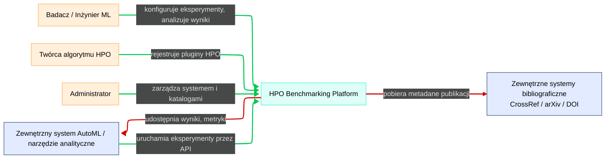
```mermaid
---
config:
  look: neo
  layout: elk
  theme: redux-dark
---
flowchart LR
    A1["Badacz / Inżynier ML"] -- konfiguruje eksperymenty, analizuje wyniki --> S["HPO Benchmarking Platform"]
    A2["Twórca algorytmu HPO"] -- rejestruje pluginy HPO --> S
    A3["Administrator"] -- zarządza systemem i katalogami --> S
    A4["Zewnętrzny system AutoML / narzędzie analityczne"] -- uruchamia eksperymenty przez API --> S
    S -- udostępnia wyniki, metryki --> A4
    S L_S_A5_0@-- pobiera metadane publikacji --> A5["Zewnętrzne systemy bibliograficzne<br>CrossRef / arXiv / DOI"]
     A1:::Peach
     S:::Aqua
     A2:::Peach
     A3:::Peach
     A4:::Sky
     A5:::Sky
    classDef Aqua stroke-width:1px, stroke-dasharray:none, stroke:#46EDC8, fill:#DEFFF8, color:#378E7A
    classDef Ash stroke-width:1px, stroke-dasharray:none, stroke:#999999, fill:#EEEEEE, color:#000000
    classDef Sky stroke-width:1px, stroke-dasharray:none, stroke:#374D7C, fill:#E2EBFF, color:#374D7C
    classDef Rose stroke-width:1px, stroke-dasharray:none, stroke:#FF5978, fill:#FFDFE5, color:#8E2236
    classDef Peach stroke-width:1px, stroke-dasharray:none, stroke:#FBB35A, fill:#FFEFDB, color:#8F632D
    style A1 color:#000000
    style S color:#000000
    style A2 color:#000000
    style A3 color:#000000
    style A4 color:#000000
    style A5 color:#000000
    linkStyle 0 stroke:#00C853,fill:none
    linkStyle 1 stroke:#00C853,fill:none
    linkStyle 2 stroke:#00C853,fill:none
    linkStyle 3 stroke:#00C853,fill:none
    linkStyle 4 stroke:#D50000,fill:none
    linkStyle 5 stroke:#D50000,fill:none
    L_S_A5_0@{ animation: none }
```

### 1.1. Użytkownicy / aktorzy biznesowi

- **Badacz / Inżynier ML**
  - Definiuje benchmarki, konfiguruje eksperymenty.
  - Uruchamia eksperymenty lokalnie / w chmurze.
  - Analizuje wyniki, porównuje algorytmy HPO.
  - Eksportuje dane do zewnętrznych narzędzi analitycznych.
- **Twórca algorytmu HPO (Plugin Author)**
  - Implementuje algorytmy HPO jako pluginy w oparciu o SDK.
  - Rejestruje i wersjonuje własne algorytmy.
  - Testuje je na istniejących benchmarkach.
- **Administrator systemu**
  - Zarządza deploymentem (PC / chmura).
  - Konfiguruje zasoby, uprawnienia, integracje (IdP, monitoring).
  - Dodaje / zatwierdza wbudowane algorytmy HPO i benchmarki „kanoniczne”.
  - W praktyce rola ta obejmuje zarówno Administratora lokalnego (środowisko PC/lab), jak i Administratora DevOps/SRE (środowisko chmurowe/K8s).
- **Zewnętrzny system AutoML / narzędzie analityczne**
  - Wywołuje API w celu uruchamiania eksperymentów.
  - Pobiera wyniki benchmarków do dalszej analizy (np. BI, Jupyter, AutoML pipeline).
- **Źródła bibliograficzne (zewnętrzne systemy)**
  - np. CrossRef, arXiv, DOI resolver.
  - Umożliwiają walidację i uzupełnianie metadanych publikacji.

### 1.2. System w centrum – „HPO Benchmarking Platform”

**System (S): „HPO Benchmarking Platform”**  
Główny system wspierający:

- projektowanie benchmarków,
- uruchamianie eksperymentów HPO,
- śledzenie eksperymentów i runów,
- analizę wyników i raportowanie,
- zarządzanie algorytmami HPO (wbudowane + pluginy),
- zarządzanie referencjami do publikacji.

### 1.3. Wymagania funkcjonalne (R1–R15)

**Katalog funkcjonalny:**

- **R1.** Katalog algorytmów HPO (wbudowanych).  
- **R2.** Wsparcie dla algorytmów HPO jako pluginów (autorskie, zewnętrzne).
- **R3.** Wersjonowanie algorytmów HPO (wbudowanych i pluginów).
- **R4.** Katalog benchmarków (zbiory danych, definicje problemów, znane optimum / best-known).  
- **R5.** Konfiguracja eksperymentu benchmarkowego (dobór algorytmów, instancji, limitów zasobów, budżetów HPO itd.).
- **R6.** Orkiestracja eksperymentów (planowanie, kolejkowanie, uruchamianie runów, retry).  
- **R7.** Panel śledzenia eksperymentów (lista eksperymentów/runów, statusy, metryki, logi, parametry).  
- **R8.** Porównywanie wyników algorytmów (wykresy, statystyki, testy statystyczne, filtry, tagowanie).  
- **R9.** Rejestrowanie i przegląd logów oraz artefaktów (modele, wykresy, pliki konfiguracyjne).  
- **R10.** Zarządzanie referencjami do publikacji (dodawanie, edycja, powiązanie z algorytmami / eksperymentami / benchmarkami).  
- **R11.** Generowanie raportów (w tym sekcja bibliografii, cytowania, opis konfiguracji eksperymentów).  
- **R12.** API do integracji ze światem zewnętrznym (uruchamianie eksperymentów, fetch wyników, integracja z AutoML).  
- **R13.** API / SDK do tworzenia własnych algorytmów HPO (plugin API).  
- **R14.** Eksport danych (wyniki, metryki, konfiguracje) do formatów zewnętrznych (CSV/JSON/Parquet) dla narzędzi analitycznych.  
- **R15.** Uruchamianie systemu w trybie **PC-local** i **cloud / K8s** (w tym skalowanie workerów).  

### 1.4. Wymagania niefunkcjonalne (RNF1–RNF8)

- **RNF1 – Skalowalność:**  
  - Możliwość uruchamiania wielu workerów równolegle, zarówno lokalnie (wiele procesów / kontenerów), jak i w chmurze (K8s, autoscaling).  
- **RNF2 – Niezawodność:**  
  - Retry i wznawianie runów, transakcyjna rejestracja wyników, odporność Orchestratora na restart.  
- **RNF3 – Bezpieczeństwo:**  
  - Autoryzacja i uwierzytelnianie (role), izolacja pluginów (sandboxing), bezpieczne zarządzanie sekretami (np. w chmurze).  
- **RNF4 – Obserwowalność:**  
  - Kompletny logging, metryki systemowe (prometheus-like), śledzenie przepływu runów (trace IDs).  
- **RNF5 – Rozszerzalność (pluginy):**  
  - Stabilne, dobrze udokumentowane interfejsy SDK / API, brak zmian łamiących kontrakt.  
- **RNF6 – Cloud-ready, PC-first:**  
  - Możliwość uruchomienia wszystkich kontenerów lokalnie (docker-compose), ale z jasnymi granicami usług umożliwiającymi ich „wyniesienie” do chmury.  
- **RNF7 – Reprodukowalność:**  
  - Zapisywanie pełnej konfiguracji, wersji datasetów, kodu, obrazów kontenerów i losowych seedów.  
- **RNF8 – Użyteczność:**  
  - Intuicyjny Web UI, czytelne dashboardy, możliwość tagowania, filtrowania, quick-search.

#### 1.4.1. Backup i Disaster Recovery (RNF9)

**Strategia backup:**
- **Results Store (PostgreSQL):**
  - Automatyczne daily snapshots z retention 30 dni
  - Point-in-time recovery (PITR) z WAL archiving
  - Cross-region replication dla środowisk produkcyjnych
- **Object Storage (artefakty, datasety):**
  - Versioning włączone dla wszystkich obiektów
  - Cross-region replication z 99.999999999% durability
  - Lifecycle policies (archiving po 1 roku, deletion po 7 latach)
- **Konfiguracja systemu:**
  - GitOps approach - wszystkie manifesty/charts w git
  - Encrypted backup secrets i konfiguracji w HashiCorp Vault

**Disaster Recovery:**
- **RTO (Recovery Time Objective): 4 godziny** dla pełnego przywrócenia
- **RPO (Recovery Point Objective): 1 godzina** maksymalna utrata danych
- **Multi-region deployment** z automatic failover dla krytycznych usług
- **Runbook** z procedurami odtwarzania dla każdego komponentu

#### 1.4.2. Security Patterns (rozszerzenie RNF3)

**Autoryzacja i uwierzytelnianie:**
- **Zero Trust Architecture** - każde połączenie między serwisami autoryzowane
- **RBAC (Role-Based Access Control)** z granularnymi uprawnieniami:
  - `researcher`: read experiments, create experiments, read algorithms
  - `plugin-author`: researcher + register plugins, manage own algorithms
  - `admin`: wszystkie uprawnienia + manage system, approve plugins
- **JWT tokens** z krótkim TTL (15 min) + refresh tokens
- **mTLS** dla komunikacji service-to-service w K8s

**Plugin Security (Sandboxing):**
- **Container isolation** - każdy plugin w oddzielnym kontenerze
- **Resource limits** - CPU/Memory/Network/Storage quotas per plugin
- **Restricted filesystem** - read-only root, write tylko do /tmp
- **Network policies** - blokada dostępu do internetu, tylko do API systemu
- **Code scanning** - static analysis podczas rejestracji pluginu
- **Runtime monitoring** - wykrywanie podejrzanych operacji (syscalls)

**Data Protection:**
- **Encryption at rest** - wszystkie dane w DB i Object Storage
- **Encryption in transit** - TLS 1.3 dla wszystkich połączeń HTTP
- **PII handling** - osobne szyfrowanie danych użytkowników
- **Audit logging** - kompletny trail wszystkich operacji CRUD
- **Data retention policies** - automatyczne usuwanie po N latach

**Infrastructure Security:**
- **Network segmentation** - oddzielne subnets dla DB, aplikacji, workerów
- **WAF (Web Application Firewall)** przed Web UI
- **DDoS protection** na poziomie load balancera
- **Vulnerability scanning** obrazów kontenerów w CI/CD
- **Security hardening** - minimal base images, non-root users

---

## 2. Kontenery (C4-2)

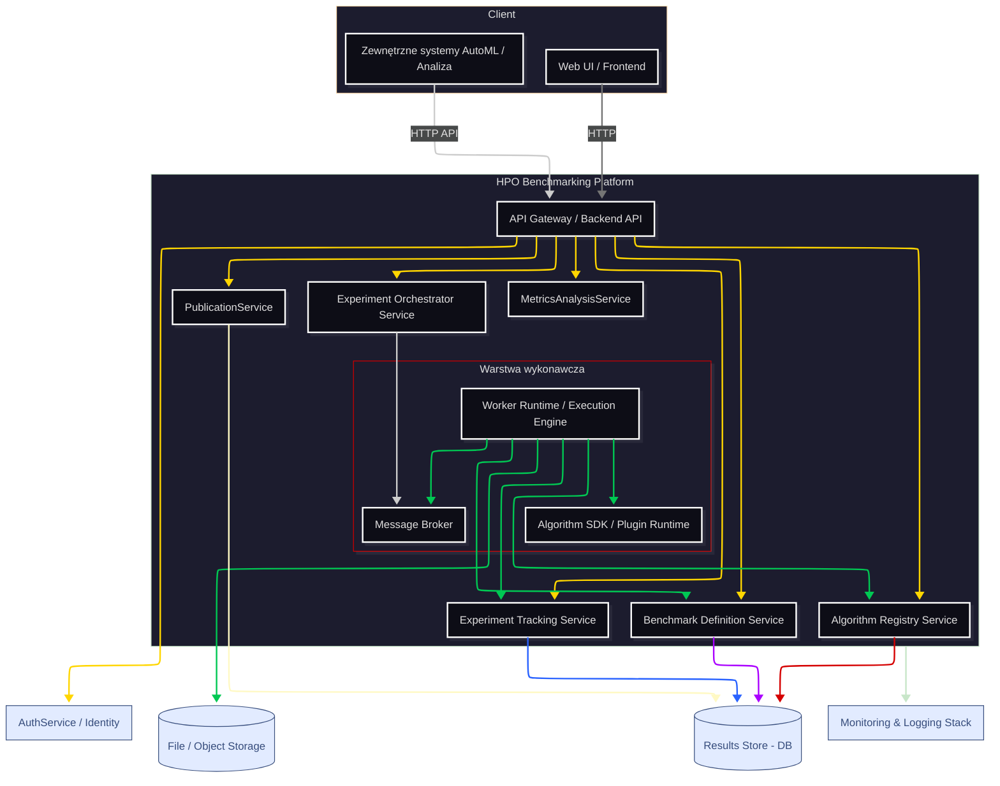
```mermaid
---
config:
  look: neo
  layout: elk
  theme: redux-dark
---
flowchart TB
 subgraph Client["Client"]
        UI["Web UI / Frontend"]
        Ext["Zewnętrzne systemy AutoML / Analiza"]
  end
 subgraph ExecLayer["Warstwa wykonawcza"]
        MB["Message Broker"]
        WORKER["Worker Runtime / Execution Engine"]
        PLUGIN["Algorithm SDK / Plugin Runtime"]
  end
 subgraph Core["HPO Benchmarking Platform"]
        APIGW["API Gateway / Backend API"]
        ORCH["Experiment Orchestrator Service"]
        TRK["Experiment Tracking Service"]
        ANALYTICS["MetricsAnalysisService"]
        BENCH["Benchmark Definition Service"]
        ALGREG["Algorithm Registry Service"]
        PUB["PublicationService"]
        ExecLayer
  end
    UI -- HTTP --> APIGW
    Ext -- HTTP API --> APIGW
    APIGW --> ORCH & TRK & ANALYTICS & BENCH & ALGREG & PUB & AUTH["AuthService / Identity"]
    ORCH --> MB
    WORKER --> MB & TRK & BENCH & ALGREG & OBJ[("File / Object Storage")] & PLUGIN
    TRK --> DB[("Results Store - DB")]
    BENCH --> DB
    ALGREG --> DB
    PUB --> DB
    Core --> MON["Monitoring & Logging Stack"]
     AUTH:::Sky
     OBJ:::Sky
     DB:::Sky
     MON:::Sky
    classDef Sky stroke-width:1px, stroke-dasharray:none, stroke:#374D7C, fill:#E2EBFF, color:#374D7C
    style ExecLayer stroke:#D50000
    style Core stroke:#C8E6C9
    style Client stroke:#FFE0B2
    linkStyle 0 stroke:#757575,fill:none
    linkStyle 2 stroke:#FFD600,fill:none
    linkStyle 3 stroke:#FFD600,fill:none
    linkStyle 4 stroke:#FFD600,fill:none
    linkStyle 5 stroke:#FFD600,fill:none
    linkStyle 6 stroke:#FFD600,fill:none
    linkStyle 7 stroke:#FFD600,fill:none
    linkStyle 8 stroke:#FFD600,fill:none
    linkStyle 10 stroke:#00C853,fill:none
    linkStyle 11 stroke:#00C853,fill:none
    linkStyle 12 stroke:#00C853,fill:none
    linkStyle 13 stroke:#00C853,fill:none
    linkStyle 14 stroke:#00C853,fill:none
    linkStyle 15 stroke:#00C853,fill:none
    linkStyle 16 stroke:#2962FF,fill:none
    linkStyle 17 stroke:#AA00FF,fill:none
    linkStyle 18 stroke:#D50000,fill:none
    linkStyle 19 stroke:#FFF9C4,fill:none
    linkStyle 20 stroke:#C8E6C9
```

| Kontener | Odpowiedzialności | Komunikacja | PC vs chmura | Związek z benchmarkingiem |
| --- | --- | --- | --- | --- |
| Web UI (Frontend) | Interfejs użytkownika do: definicji benchmarków i eksperymentów, podglądu katalogu algorytmów HPO, panelu śledzenia eksperymentów, porównania wyników, zarządzania publikacjami i generowania raportów, podstawowej administracji. | REST/GraphQL/WebSocket z **API Gateway** (sync). | **PC:** serwowany z lokalnego kontenera lub plików statycznych. <br> **Chmura:** standardowy frontend (np. CDN / storage). | Umożliwia jasne prezentowanie celów eksperymentu, konfiguracji, wyników i statystyk. |
| API Gateway / Backend API | Pojedynczy punkt wejścia dla Web UI i systemów zewnętrznych. Routing żądań do usług: Orchestrator, Benchmark Definition, Algorithm Registry, Experiment Tracking, Publication & Reference, MetricsAnalysisService. Autoryzacja / uwierzytelnianie. | Z Web UI / systemami zewn.: HTTP REST/GraphQL (sync). <br> Z usługami wewn.: HTTP/gRPC (sync) + publikacja zdarzeń do Message Broker (async). | **PC:** jeden kontener, monolityczny backend lub prosty gateway. <br> **Chmura:** gateway (np. API Gateway + microservices). | Centralny punkt integracji warstw benchmarkingu i udostępniania funkcji na zewnątrz. |
| Experiment Orchestrator Service | Przyjmowanie definicji eksperymentów, walidacja planu (dobór algorytmów, instancji). Tworzenie planu runów (algorytm × instancja × seed × budżet). Zlecanie runów Workerom przez Message Broker. Zarządzanie stanem eksperymentu. Kontrola powtarzalności (seedy, snapshoty konfiguracji). | Sync: z API Gateway (definicje eksperymentów). <br> Async: do Worker Runtime (kolejka runów przez Message Broker), odbiór zdarzeń „RunCompleted/RunFailed”. | **PC:** jedna instancja, pojedynczy proces/kontener. <br> **Chmura:** skalowalny microservice, możliwe HA. | Implementuje **plan eksperymentu**, kontrolę budżetu i coverage instancji – kluczowe dobre praktyki benchmarkingu. |
| Worker Runtime / Execution Engine | Wykonywanie pojedynczych runów: ładowanie benchmarku i instancji (dataset), ładowanie i uruchamianie algorytmu HPO (plugin/wbudowany), raportowanie metryk do Experiment Tracking Service. | Async: odbiór zadań z Message Broker. <br> Sync/Async: zapisy do Experiment Tracking Service (REST/gRPC, batch/stream), logi do Logging Stack. <br> Dostęp do File/Object Storage. | **PC:** 1–N workerów jako procesy/kontenery (docker-compose). <br> **Chmura:** worker pods w K8s, autoscaling wg kolejki. | Wymusza jednolite środowisko uruchomieniowe (konteneryzacja) → reprodukowalność i porównywalność runów. |
| Benchmark Definition Service | Przechowywanie i wersjonowanie definicji benchmarków: listy datasetów, definicji problemów (klasyfikacja, regresja, …), dostępnych metryk, znanych optimum / best-known values. | Sync: API dla Orchestratora i Web UI (GET/POST/PUT). | Jeden kontener, brak szczególnych wymagań skalowalności (PC i chmura tak samo). | Realizuje dobór i opis instancji problemowych (zróżnicowanie, reprezentatywność). |
| Algorithm Registry Service | Rejestr i wersjonowanie algorytmów HPO (wbudowane + pluginy). Przechowywanie metadanych: nazwa, typ, parametry, wymagania środowiskowe, powiązane publikacje. Walidacja kompatybilności z benchmarkami. | Sync: API dla Web UI, Orchestratora i Plugin Runtime. | Jeden kontener / usługa (PC i chmura, skalowanie wg potrzeb). | Ułatwia świadomy dobór algorytmów i ich konfiguracji; wspiera cele G1–G5 benchmarkingu. |
| Algorithm SDK / Plugin Runtime | Ładowanie i izolowanie kodu pluginów, obsługa kontraktu API pluginu (wejścia/wyjścia, walidacja), raportowanie wyników i metryk do Worker Runtime / Experiment Tracking Service. | Używany lokalnie przez Worker Runtime (biblioteka / sidecar). Może rozmawiać z Workerem przez lokalne API lub wywołania językowe. | Ten sam kod dla PC i chmury, różnice tylko w środowisku (docker image). | Umożliwia łatwe dodawanie nowych algorytmów w ujednoliconym środowisku, co ułatwia porównywanie HPO. |
| Experiment Tracking Service | API do rejestrowania runów, metryk, parametrów, tagów i logów. Przechowywanie powiązań: eksperyment–run–algorytm–benchmark–publikacja. | Sync: API używane przez Worker Runtime, Orchestrator, Web UI. | Usługa korzystająca z relacyjnej bazy danych (PC: 1 kontener; chmura: skalowalny microservice). | Centralny panel śledzenia, wspiera analizę wyników i reprodukowalność eksperymentów. |
| MetricsAnalysisService | Agregowanie wyników (średnie, wariancje, rankingi). Obliczanie złożonych metryk (np. czas do osiągnięcia poziomu błędu). Testy statystyczne, wykresy porównawcze (serie czasowe, boxplot, ranking). | Sync: API używane przez Web UI (porównania), opcjonalnie Orchestrator (walidacje). <br> Async: może słuchać zdarzeń „RunCompleted” do preagregacji. | Elastyczna usługa analityczna (PC: 1 kontener; chmura: skalowalny microservice). | Bezpośrednio implementuje **analizę i prezentację wyników** benchmarków. |
| PublicationService | Katalog publikacji (DOI, BibTeX, linki). Powiązania publikacji z algorytmami, benchmarkami, eksperymentami. Generowanie sekcji bibliografii w raportach. Integracja z zewnętrznymi usługami bibliograficznymi. | Sync: API dla Web UI, Algorithm Registry, Experiment Tracking, raportowania. <br> Sync/Async: wywołania do zewnętrznych systemów bibliograficznych. | Usługa integracyjna (PC i chmura – podobny model, różne skale). | Łączy wyniki z literaturą i teoretycznym uzasadnieniem algorytmów, wspiera interpretację benchmarków. |
| Results Store (Relacyjna baza danych) | Przechowywanie danych domenowych: Experiments, Runs, Metrics, Algorithms, Benchmarks, Publications, linkowania, konfiguracje. | Internal: używana przez Experiment Tracking, Benchmark Definition, Algorithm Registry, Publication & Reference; Experiment Orchestrator korzysta z tych danych wyłącznie pośrednio – przez API usług domenowych (w szczególności Experiment Tracking Service). | np. PostgreSQL / inny RDBMS, z migracjami schematu; może być lokalny (PC) lub zarządzany (chmura). | Centralne repozytorium danych do analizy i zapewnienia reprodukowalności benchmarków. |
| File / Object Storage | Przechowywanie dużych artefaktów: datasety, modele, logi w plikach, wygenerowane raporty. | Dostęp z Workerów, Web UI / backendu i innych usług (protokół zależny od wdrożenia – S3/API plikowe). | **PC:** lokalny dysk / MinIO. <br> **Chmura:** S3 / GCS / Azure Blob. | Zapewnia odtwarzalne przechowywanie datasetów i wyników (artefaktów) benchmarków. |
| Message Broker | Kolejka zadań runów. Kanał zdarzeń systemowych (RunStarted, RunCompleted, RunFailed, ExperimentCompleted). | Async: wymiana komunikatów między Orchestrator, Worker Runtime, MetricsAnalysisService itd. | **PC:** pojedyncza instancja (np. RabbitMQ/Redis/Kafka w kontenerze). <br> **Chmura:** zarządzany lub skalowany klaster brokera. | Umożliwia elastyczny plan eksperymentu i skalowanie warstwy wykonawczej → efektywny benchmarking na dużą skalę. |
| Monitoring & Logging Stack | Zbieranie logów z kontenerów. Zbieranie metryk (czas trwania runów, obciążenie workerów, błędy). | Integracje z usługami (agenty, eksportery, log shippers). Odczyt przez dashboardy / alerting. | **PC:** uproszczony stack (np. 1–2 kontenery). <br> **Chmura:** pełny, skalowalny stack obserwowalności. | Wspiera obserwowalność i analizę wydajności algorytmów oraz systemu benchmarkującego. |
| Auth Service / Identity Integration (AuthService) | Integracja z IdP (OIDC/SAML). Mapowanie użytkowników na role (Badacz, Twórca pluginu, Admin). | Sync: wywołania do IdP w toku uwierzytelniania / autoryzacji; przekazywanie tokenów/claimów do usług. | W PC może być prostsza (lokalne konta / lightweight IdP); w chmurze – pełna integracja z firmowym/uczelniowym IdP. | Pozwala kontrolować, kto może modyfikować benchmarki, zatwierdzać algorytmy itp., co jest ważne dla jakości i wiarygodności benchmarków. |
| ReportGeneratorService | Generowanie raportów (HTML/PDF/LaTeX) na podstawie danych z Tracking, Results Store, MetricsAnalysisService, Lineage. | Sync: API wywoływane z Web UI oraz Orchestratora (po zakończeniu eksperymentu). | Python / Node.js; proces może działać jako osobny serwis lub moduł w backendzie. | Generuje spójne, powtarzalne raporty z wyników benchmarków. |

---

## 3. Komponenty (C4-3)

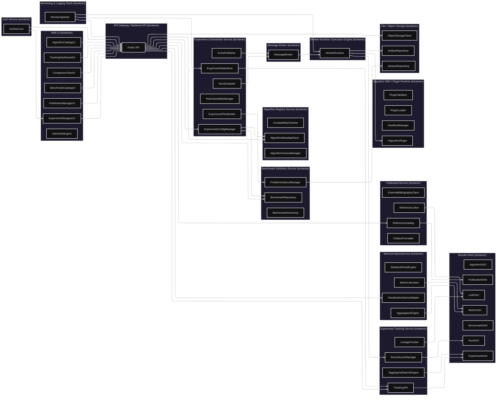
```mermaid
---
config:
  layout: elk
  theme: redux-dark
---
flowchart LR
  subgraph WebUI ["Web UI (kontener)"]
    WebUI_Designer["ExperimentDesignerUI"]
    WebUI_Tracking["TrackingDashboardUI"]
    WebUI_Comparison["ComparisonViewUI"]
    WebUI_BenchCatalog["BenchmarkCatalogUI"]
    WebUI_AlgoCatalog["AlgorithmCatalogUI"]
    WebUI_Publications["PublicationManagerUI"]
    WebUI_Admin["AdminSettingsUI"]
  end
  subgraph APIGateway ["API Gateway / Backend API (kontener)"]
    APIGateway_Public["Public API"]
  end
  subgraph ExperimentOrchestrator ["Experiment Orchestrator Service (kontener)"]
    Orchestrator_Config["ExperimentConfigManager"]
    Orchestrator_Plan["ExperimentPlanBuilder"]
    Orchestrator_Scheduler["RunScheduler"]
    Orchestrator_State["ExperimentStateStore"]
    Orchestrator_Reprod["ReproducibilityManager"]
    Orchestrator_Events["EventPublisher"]
  end
  subgraph BenchmarkDefinitionService ["Benchmark Definition Service (kontener)"]
    Bench_Repo["BenchmarkRepository"]
    Bench_Instances["ProblemInstanceManager"]
    Bench_Versioning["BenchmarkVersioning"]
  end
  subgraph AlgorithmRegistryService ["Algorithm Registry Service (kontener)"]
    Algo_Metadata["AlgorithmMetadataStore"]
    Algo_Versions["AlgorithmVersionManager"]
    Algo_Compat["CompatibilityChecker"]
  end
  subgraph ExperimentTrackingService ["Experiment Tracking Service (kontener)"]
    Track_API["TrackingAPI"]
    Track_Runs["RunLifecycleManager"]
    Track_Search["TaggingAndSearchEngine"]
    Track_Lineage["LineageTracker"]
  end
  subgraph MetricsAnalysisService ["MetricsAnalysisService (kontener)"]
    Metrics_Calc["MetricCalculator"]
    Metrics_Agg["AggregationEngine"]
    Metrics_Stats["StatisticalTestsEngine"]
    Metrics_Query["VisualizationQueryAdapter"]
  end
  subgraph PublicationService ["PublicationService (kontener)"]
    Pub_Catalog["ReferenceCatalog"]
    Pub_Citation["CitationFormatter"]
    Pub_Linker["ReferenceLinker"]
    Pub_External["ExternalBibliographyClient"]
  end
  subgraph PluginRuntime ["Algorithm SDK / Plugin Runtime (kontener)"]
    Plugin_Interface["IAlgorithmPlugin"]
    Plugin_Loader["PluginLoader"]
    Plugin_Sandbox["SandboxManager"]
    Plugin_Validator["PluginValidator"]
  end
  subgraph WorkerRuntime ["Worker Runtime / Execution Engine (kontener)"]
    Worker_Core["WorkerRuntime"]
  end
  subgraph ResultsStore ["Results Store (kontener)"]
    DAO_Experiments["ExperimentDAO"]
    DAO_Runs["RunDAO"]
    DAO_Metrics["MetricDAO"]
    DAO_Algorithms["AlgorithmDAO"]
    DAO_Benchmarks["BenchmarkDAO"]
    DAO_Publications["PublicationDAO"]
    DAO_Links["LinkDAO"]
  end
  subgraph ObjectStorage ["File / Object Storage (kontener)"]
    Storage_Client["ObjectStorageClient"]
    Storage_Artifacts["ArtifactRepository"]
    Storage_Datasets["DatasetRepository"]
  end
  subgraph MessageBroker ["Message Broker (kontener)"]
    Broker_Core["MessageBroker"]
  end
  subgraph MonitoringStack ["Monitoring & Logging Stack (kontener)"]
    Monitoring_Core["MonitoringStack"]
  end
  subgraph AuthServiceC ["Auth Service (kontener)"]
    Auth_Core["AuthService"]
  end
  WebUI_Designer --> APIGateway_Public
  WebUI_Tracking --> APIGateway_Public
  WebUI_Comparison --> APIGateway_Public
  WebUI_BenchCatalog --> APIGateway_Public
  WebUI_AlgoCatalog --> APIGateway_Public
  WebUI_Publications --> APIGateway_Public
  APIGateway_Public --> Orchestrator_Config
  APIGateway_Public --> Track_API
  APIGateway_Public --> Metrics_Query
  APIGateway_Public --> Pub_Catalog
  APIGateway_Public --> Bench_Repo
  APIGateway_Public --> Algo_Metadata
  APIGateway_Public --> Storage_Client
  Orchestrator_Config --> Bench_Repo
  Orchestrator_Config --> Algo_Metadata
  Orchestrator_Plan --> Bench_Instances
  Orchestrator_Scheduler --> Broker_Core
  Broker_Core --> Worker_Core
  Orchestrator_State --> Track_API
  Orchestrator_Events --> Broker_Core
  Worker_Core --> Plugin_Interface
  Worker_Core --> Track_Runs
  Worker_Core --> Storage_Artifacts
  Track_API --> DAO_Experiments
  Track_Runs --> DAO_Runs
  Track_Search --> DAO_Experiments
  Track_Lineage --> DAO_Links
  Metrics_Calc --> DAO_Metrics
  Metrics_Agg --> DAO_Metrics
  Pub_Catalog --> DAO_Publications
  Pub_Linker --> DAO_Links
  Bench_Instances --> Storage_Datasets
  Monitoring_Core --> Worker_Core
  Monitoring_Core --> Orchestrator_State
  Monitoring_Core --> APIGateway_Public
  Auth_Core --> APIGateway_Public
  Auth_Core --> WebUI_Designer
```


| Sekcja | Kontener (C2) / moduł                  | Opis skrócony                                   |
|--------|----------------------------------------|-------------------------------------------------|
| 3.1    | [Experiment Orchestrator Service](#31-experiment-orchestrator-service--komponenty)     | Orkiestracja eksperymentów i runów              |
| 3.2    | [Benchmark Definition Service](#32-benchmark-definition-service--komponenty)           | Definicja i wersjonowanie benchmarków           |
| 3.3    | [Algorithm Registry Service](#33-algorithm-registry-service--komponenty)               | Rejestr algorytmów i ich wersji                 |
| 3.4    | [Algorithm SDK / Plugin Runtime](#34-algorithm-sdk--plugin-runtime--komponenty)        | Uruchamianie pluginów algorytmów                |
| 3.5    | [Experiment Tracking Service](#35-experiment-tracking-service--komponenty)             | Śledzenie runów, metryk i powiązań              |
| 3.6    | [MetricsAnalysisService](#36-metricsanalysisservice--komponenty)                | Agregacja wyników i analizy statystyczne        |
| 3.7    | [PublicationService](#37-publication--reference-service--komponenty)      | Publikacje i referencje naukowe                 |
| 3.8    | [Results Store](#38-results-store--komponenty-logiczne)                                | Warstwa dostępu do danych (DAO)                 |
| 3.9    | [Web UI](#39-web-ui--komponenty)                                                       | Interfejsy użytkownika                          |
| 3.10   | [File / Object Storage](#310-file--object-storage--komponenty-logiczne)                | Artefakty i datasety w Object Storage           |
| 3.11   | [ReportGeneratorService](#311-reportgeneratorservice--komponenty)                                    | Generowanie raportów                            |
| 3.12   | [Message Broker](#312-message-broker--komponenty)                                    | Kolejkowanie zadań runów i zdarzeń systemowych  |
| 3.13   | [Worker Runtime / Execution Engine](#313-worker-runtime--execution-engine--komponenty) | Warstwa wykonawcza pojedynczych runów           |
| 3.14   | [API Gateway / Backend API](#314-api-gateway--backend-api--komponenty)               | Punkt wejścia HTTP/REST/GraphQL do backendu     |
| 3.15   | [Auth Service](#315-auth-service--komponenty)                                        | Autoryzacja i integracja tożsamości             |
| 3.16   | [Monitoring & Logging Stack](#316-monitoring--logging-stack-–komponenty)          | Monitoring, metryki techniczne i alertowanie            |

### 3.1. Experiment Orchestrator Service – komponenty

| Nazwa                     | Opis                                                                                         | Interakcje                                                                                                            |
|---------------------------|----------------------------------------------------------------------------------------------|-----------------------------------------------------------------------------------------------------------------------|
| **ExperimentConfigManager** | Waliduje konfigurację eksperymentu (z Benchmark Definition i Algorithm Registry).          | ↔ Benchmark Definition Service, ↔ Algorithm Registry.                                                                 |
| **ExperimentPlanBuilder**   | Tworzy plan runów (macierz konfiguracji).                                                  | ← ExperimentConfigManager (zwalidowana konfiguracja); → RunScheduler (plan runów).                                   |
| **RunScheduler**            | Przekłada plan na zadania w kolejce Message Broker (RunJob).                               | ← ExperimentPlanBuilder; → Message Broker; ↔ Worker Runtime (konsumuje RunJob).                                      |
| **ExperimentStateStore**    | Logika zarządzania stanem eksperymentów oraz mapowaniem powiązanych artefaktów: utrzymywanie statusów runów: `PENDING`, `RUNNING`, `FAILED`, `COMPLETED`, `CANCELLED`, mapowanie: run → artefakty, metryki, wyniki testów statystycznych, raporty. Założenia architektoniczne: ExperimentStateStore **nie posiada własnej bazy danych**, **nie komunikuje się bezpośrednio z Results Store** wszystkie dane odczytuje i aktualizuje wyłącznie poprzez **API Experiment Tracking Service**, zapewnia spójny model stanu eksperymentu widziany przez: Experiment Orchestrator (planowanie i monitorowanie przebiegu eksperymentów), Web UI (dashboardy, widoki szczegółów eksperymentu), inne usługi (np. Report Generator Service, MetricsAnalysisService). | ↔ Experiment Tracking Service – odczyt metadanych runów, zapis zmian statusu; ↔ Experiment Orchestrator – zgłaszanie zmian stanu (start, sukces, błąd, anulowanie) |
| **ReproducibilityManager** | Zarządza seedami, wersjami obrazów, snapshotami konfiguracji. | ↔ Experiment Tracking Service (metadane reprodukowalności, snapshoty), ↔ Results Store **pośrednio, przez API Experiment Tracking Service**. |
| **EventPublisher**          | Publikuje zdarzenia systemowe (ExperimentStarted/Completed/Failed).                        | → Message Broker/Event Bus; subskrybenci: Monitoring, Web UI, ReportGenerator.                                       |

#### 3.1.1. Interfejsy API Experiment Orchestrator Service

**ExperimentConfigManager API:**
```
POST /api/v1/experiments/validate
{
  "benchmarks": ["benchmark_id_1", "benchmark_id_2"],
  "algorithms": ["algorithm_id_1", "algorithm_id_2"],
  "budget_config": {
    "max_evaluations": 100,
    "time_limit_minutes": 60
  },
  "seeds": [42, 123, 456]
}

Response 200:
{
  "valid": true,
  "validation_report": {
    "benchmark_compatibility": "OK",
    "algorithm_compatibility": "OK",
    "resource_requirements": "OK"
  }
}

Response 400:
{
  "valid": false,
  "errors": [
    {
      "field": "algorithms[0]",
      "message": "Algorithm 'algorithm_id_1' not compatible with benchmark 'benchmark_id_1'",
      "error_code": "INCOMPATIBLE_ALGORITHM"
    }
  ]
}
```

**RunScheduler API:**
```
POST /api/v1/experiments/{experiment_id}/start
{
  "priority": "NORMAL", // NORMAL, HIGH, LOW
  "retry_policy": {
    "max_retries": 3,
    "retry_delay_seconds": 30
  }
}

Response 202:
{
  "experiment_id": "exp_123",
  "total_runs_scheduled": 50,
  "estimated_completion_time": "2025-11-18T16:30:00Z"
}
```

**ExperimentStateStore API:**
```
GET /api/v1/experiments/{experiment_id}/status
Response 200:
{
  "experiment_id": "exp_123",
  "status": "RUNNING",
  "progress": {
    "total_runs": 50,
    "completed_runs": 15,
    "failed_runs": 2,
    "running_runs": 3,
    "pending_runs": 30
  },
  "estimated_completion": "2025-11-18T17:45:00Z"
}
```

### 3.2. Benchmark Definition Service – komponenty

| Nazwa                     | Opis                                                                   | Interakcje                                                                                         |
|---------------------------|------------------------------------------------------------------------|----------------------------------------------------------------------------------------------------|
| **BenchmarkRepository**   | CRUD benchmarków.                                                      | ↔ Results Store (BenchmarkDAO); ↔ Experiment Orchestrator (walidacja konfiguracji).               |
| **ProblemInstanceManager**| Zarządza instancjami (dataset + konfiguracja tasku).                  | ↔ DatasetRepository; ↔ Algorithm Registry (kompatybilność).                                       |
| **BenchmarkVersioning**   | Wersjonowanie benchmarków, oznaczanie wersji kanonicznych.            | ↔ BenchmarkRepository; ↔ ExperimentConfigManager (dobór wersji).                                  |

### 3.3. Algorithm Registry Service – komponenty

| Nazwa                       | Opis                                                                 | Interakcje                                                                                                       |
|-----------------------------|----------------------------------------------------------------------|------------------------------------------------------------------------------------------------------------------|
| **AlgorithmMetadataStore**  | Przechowuje opis algorytmu: nazwa, typ, parametry, powiązania.      | ↔ Results Store (AlgorithmDAO); ↔ Web UI (AlgorithmCatalogUI).                                                   |
| **AlgorithmVersionManager** | Zarządza wersjami implementacji algorytmów, statusem (draft, approved). | ↔ PluginLoader/PluginValidator; ↔ Experiment Orchestrator (dobór wersji).                                   |
| **CompatibilityChecker**    | Sprawdza kompatybilność algorytmu z typami benchmarków.              | ↔ Benchmark Definition Service (ProblemInstanceManager, BenchmarkRepository).                                    |

#### 3.3.1. Interfejsy API Algorithm Registry Service

**AlgorithmMetadataStore API:**
```
POST /api/v1/algorithms
{
  "name": "Custom Bayesian Optimizer",
  "description": "Advanced Bayesian optimization with custom acquisition function",
  "type": "BAYESIAN", // BAYESIAN, EVOLUTIONARY, GRID_SEARCH, RANDOM_SEARCH, GRADIENT_BASED
  "is_builtin": false,
  "parameter_space": {
    "acquisition_function": {
      "type": "categorical",
      "values": ["EI", "UCB", "PI"]
    },
    "exploration_factor": {
      "type": "float",
      "min": 0.0,
      "max": 1.0,
      "default": 0.1
    }
  },
  "compatible_problem_types": ["CLASSIFICATION", "REGRESSION"],
  "resource_requirements": {
    "min_memory_mb": 512,
    "min_cpu_cores": 1,
    "gpu_required": false
  },
  "publication_ids": ["pub_123", "pub_456"]
}

Response 201:
{
  "algorithm_id": "alg_789",
  "version_id": "alg_v1.0.0",
  "status": "DRAFT",
  "created_at": "2025-11-18T14:30:00Z"
}
```

**AlgorithmVersionManager API:**
```
POST /api/v1/algorithms/{algorithm_id}/versions
{
  "version": "1.1.0",
  "plugin_location": "s3://plugins/custom-bayes-opt-v1.1.0.whl",
  "sdk_version": "2.1.0",
  "changelog": "Fixed memory leak, improved convergence",
  "backward_compatible": true
}

Response 201:
{
  "version_id": "alg_v1.1.0",
  "status": "DRAFT",
  "validation_required": true
}

PUT /api/v1/algorithms/{algorithm_id}/versions/{version_id}/status
{
  "status": "APPROVED", // DRAFT, UNDER_REVIEW, APPROVED, DEPRECATED
  "approval_notes": "Passed all validation tests"
}

Response 200:
{
  "version_id": "alg_v1.1.0",
  "status": "APPROVED",
  "approved_at": "2025-11-18T15:00:00Z",
  "approved_by": "admin_user"
}
```

**CompatibilityChecker API:**
```
POST /api/v1/algorithms/{algorithm_id}/compatibility-check
{
  "benchmark_ids": ["bench_1", "bench_2"],
  "problem_types": ["CLASSIFICATION", "REGRESSION"]
}

Response 200:
{
  "compatible": true,
  "compatibility_report": {
    "benchmark_compatibility": {
      "bench_1": {
        "compatible": true,
        "confidence": 0.95
      },
      "bench_2": {
        "compatible": false,
        "issues": ["Requires categorical parameters, but benchmark provides continuous only"]
      }
    },
    "resource_compatibility": {
      "memory_sufficient": true,
      "cpu_sufficient": true,
      "gpu_available": false
    }
  }
}
```

### 3.4. Algorithm SDK / Plugin Runtime – komponenty

| Nazwa              | Opis                                                                                                                                                | Interakcje                                                                                           |
|--------------------|-----------------------------------------------------------------------------------------------------------------------------------------------------|------------------------------------------------------------------------------------------------------|
| **IAlgorithmPlugin** | Interfejs pluginu. Metody m.in.: `suggest(config_space, history)`, `observe(config, result)`, `init(seed, resources)`; jasno zdefiniowany kontrakt input/output. | Implementowany przez pluginy; wywoływany przez SandboxManager/Worker Runtime.                       |
| **PluginLoader**   | Ładuje pluginy (np. z plików wheel, modułów Python, serwisów gRPC).                                                                                | ↔ AlgorithmVersionManager; ↔ ObjectStorageClient / repo pakietów.                                   |
| **SandboxManager** | Izoluje pluginy (np. przez subprocess lub kontener).                                                                                               | ↔ Worker Runtime; ↔ PluginLoader; ↔ TrackingAPI (logi z pluginu).                                   |
| **PluginValidator**| Sprawdza implementację pluginu względem interfejsu (testowy run).                                                                                  | ↔ IAlgorithmPlugin; ↔ Algorithm Registry (aktualizacja statusu wersji).                             |

### 3.5. Experiment Tracking Service – komponenty

| Nazwa                    | Opis                                                                                  | Interakcje                                                                                                                  |
|--------------------------|---------------------------------------------------------------------------------------|-----------------------------------------------------------------------------------------------------------------------------|
| **TrackingAPI**          | Publiczne API do logowania runów, metryk, artefaktów, tagów.                          | ← Worker Runtime/pluginy/Web UI; ↔ RunLifecycleManager, TaggingAndSearchEngine, LineageTracker, DAO-y.                      |
| **RunLifecycleManager**  | Tworzy runy, aktualizuje statusy.                                                     | ↔ Experiment Orchestrator; ↔ Results Store (RunDAO); ↔ EventPublisher.                                                      |
| **TaggingAndSearchEngine** | Filtrowanie i tagowanie eksperymentów/runów.                                       | ↔ Results Store (ExperimentDAO/RunDAO); ↔ Web UI (TrackingDashboardUI, ComparisonViewUI).                                   |
| **LineageTracker**       | Zapisuje powiązania: eksperyment → run → algorytm → benchmark → publikacja.          | ↔ Results Store (LinkDAO); ↔ PublicationService; ↔ ReportGenerator.                                            |

#### 3.5.1. Interfejsy API Experiment Tracking Service

**TrackingAPI - Logowanie runów:**
```
POST /api/v1/runs
{
  "experiment_id": "exp_123",
  "algorithm_version_id": "alg_v1.2.3",
  "benchmark_instance_id": "bench_inst_456",
  "seed": 42,
  "environment_snapshot_id": "env_789",
  "worker_id": "worker_001"
}

Response 201:
{
  "run_id": "run_abc123",
  "status": "RUNNING",
  "start_time": "2025-11-18T14:30:00Z",
  "tracking_url": "/api/v1/runs/run_abc123"
}
```

**TrackingAPI - Logowanie metryk:**
```
POST /api/v1/runs/{run_id}/metrics
{
  "metrics": [
    {
      "name": "best_score",
      "value": 0.9234,
      "step": 10,
      "timestamp": "2025-11-18T14:35:00Z"
    },
    {
      "name": "training_time",
      "value": 120.5,
      "step": 10,
      "timestamp": "2025-11-18T14:35:00Z"
    }
  ]
}

Response 200:
{
  "metrics_logged": 2,
  "run_status": "RUNNING"
}
```

**TrackingAPI - Aktualizacja statusu runu:**
```
PUT /api/v1/runs/{run_id}/status
{
  "status": "COMPLETED", // PENDING, RUNNING, COMPLETED, FAILED, CANCELLED
  "end_time": "2025-11-18T14:45:00Z",
  "final_metrics": {
    "best_score": 0.9456,
    "total_evaluations": 100,
    "convergence_step": 78
  },
  "error_message": null
}

Response 200:
{
  "run_id": "run_abc123",
  "status": "COMPLETED",
  "duration_seconds": 900
}
```

**TaggingAndSearchEngine API:**
```
GET /api/v1/experiments/search?tags=optimization,neural_networks&status=COMPLETED&limit=20
Response 200:
{
  "experiments": [
    {
      "experiment_id": "exp_123",
      "name": "Neural Network HPO Comparison",
      "created_at": "2025-11-18T10:00:00Z",
      "status": "COMPLETED",
      "tags": ["optimization", "neural_networks"],
      "run_count": 50,
      "success_rate": 0.96
    }
  ],
  "total_count": 1,
  "has_more": false
}
```

### 3.6. MetricsAnalysisService – komponenty

| Nazwa                      | Opis                                                                                     | Interakcje                                                                                                      |
|----------------------------|------------------------------------------------------------------------------------------|-----------------------------------------------------------------------------------------------------------------|
| **MetricCalculator**       | Oblicza metryki z surowych wyników (np. accuracy, regret).                              | ↔ TrackingAPI/MetricDAO (dane wejściowe); ↔ AggregationEngine.                                                 |
| **AggregationEngine**      | Agreguje wyniki po benchmarkach/algorytmach/eksperymentach.                             | ↔ MetricCalculator; ↔ StatisticalTestsEngine; ↔ VisualizationQueryAdapter.                                     |
| **StatisticalTestsEngine** | Testy statystyczne (np. Friedman/Nemenyi).                                              | ↔ AggregationEngine; ↔ ReportGenerator; ↔ Web UI (ComparisonViewUI).                                           |
| **VisualizationQueryAdapter** | Przygotowuje dane do wykresów dla Web UI.                                           | ← Web UI; ↔ MetricDAO, AggregationEngine.                                                                      |

### 3.7. PublicationService – komponenty

| Nazwa                       | Opis                                                       | Interakcje                                                                                                   |
|-----------------------------|------------------------------------------------------------|--------------------------------------------------------------------------------------------------------------|
| **ReferenceCatalog**        | Baza publikacji (metadane artykułów, DOIs itp.).          | ↔ Results Store (PublicationDAO); ↔ Web UI (PublicationManagerUI).                                           |
| **CitationFormatter**       | Generuje cytowania i BibTeX.                               | ↔ ReferenceCatalog; ↔ Web UI; ↔ ReportGenerator.                                                             |
| **ReferenceLinker**         | Łączy publikacje z algorytmami, benchmarkami, eksperymentami. | ↔ LineageTracker; ↔ Results Store (LinkDAO); ↔ AlgorithmCatalogUI, BenchmarkCatalogUI, PublicationManagerUI. |
| **ExternalBibliographyClient** | Klient do CrossRef/arXiv/DOI.                           | → serwisy zewnętrzne; ↔ ReferenceCatalog (import/aktualizacja rekordów).                                     |

### 3.8. Results Store – komponenty logiczne

| Nazwa              | Opis                                      | Interakcje                                                                                   |
|--------------------|-------------------------------------------|----------------------------------------------------------------------------------------------|
| **ExperimentDAO**  | Dostęp do danych eksperymentów. | ↔ Experiment Tracking Service (TaggingAndSearchEngine, RunLifecycleManager); ↔ Web UI (pośrednio, przez API usług domenowych). |
| **RunDAO**         | Dostęp do danych runów.                   | ↔ RunLifecycleManager, MetricsAnalysisService, Web UI.                                           |
| **MetricDAO**      | Dostęp do danych metryk.                  | ↔ TrackingAPI, MetricCalculator, VisualizationQueryAdapter.                                  |
| **AlgorithmDAO**   | Dostęp do danych algorytmów.              | ↔ AlgorithmMetadataStore, AlgorithmCatalogUI.                                                |
| **BenchmarkDAO**   | Dostęp do danych benchmarków.             | ↔ BenchmarkRepository, BenchmarkCatalogUI, CompatibilityChecker.                             |
| **PublicationDAO** | Dostęp do danych publikacji.              | ↔ ReferenceCatalog, ReportGenerator, Web UI.                                                 |
| **LinkDAO**        | Powiązania (eksperyment/algorytm/benchmark/publikacja). | ↔ LineageTracker, ReferenceLinker, ReportGenerator.                                         |

### 3.9. Web UI – komponenty

Uwaga: wszystkie wywołania usług backendu z Web UI przechodzą technicznie przez API Gateway / Backend API (REST/GraphQL); poniższa tabela opisuje interakcje logiczne na poziomie usług domenowych.

| Nazwa                   | Opis                                  | Interakcje                                                                                                   |
|-------------------------|---------------------------------------|--------------------------------------------------------------------------------------------------------------|
| **ExperimentDesignerUI**| Kreator konfiguracji eksperymentów.   | ↔ Experiment Orchestrator; ↔ Benchmark Definition Service; ↔ Algorithm Registry.                             |
| **TrackingDashboardUI** | Panel eksperymentów/runów.           | ↔ TrackingAPI, TaggingAndSearchEngine, RunLifecycleManager, ArtifactRepository.                              |
| **ComparisonViewUI**    | Wykresy i porównania algorytmów.     | ↔ MetricsAnalysisService (VisualizationQueryAdapter, StatisticalTestsEngine); ↔ LineageTracker.                  |
| **BenchmarkCatalogUI**  | Katalog benchmarków.                 | ↔ BenchmarkRepository, BenchmarkVersioning, DatasetRepository.                                               |
| **AlgorithmCatalogUI**  | Katalog algorytmów.                  | ↔ AlgorithmMetadataStore, AlgorithmVersionManager, CompatibilityChecker.                                     |
| **PublicationManagerUI**| Zarządzanie publikacjami.            | ↔ ReferenceCatalog, ReferenceLinker, ExternalBibliographyClient.                                             |
| **AdminSettingsUI**     | Panel ustawień administracyjnych.    | ↔ API Gateway/Backend API; ↔ Auth/Identity; konfiguracja Registry, benchmarków, limitów zasobów.            |

### 3.10. File / Object Storage – komponenty (logiczne)

| Nazwa                 | Opis                                                                                      | Interakcje                                                                                                       |
|-----------------------|-------------------------------------------------------------------------------------------|------------------------------------------------------------------------------------------------------------------|
| **ObjectStorageClient** | Niskopoziomowy klient Object Storage (S3/MinIO/GCS/Azure Blob).                        | Używany przez Worker Runtime, Experiment Tracking Service, ReportGenerator, ArtifactRepository, DatasetRepository, API Gateway / Backend API (np. streaming plików do UI). |
| **ArtifactRepository**  | Warstwa logiczna nad ObjectStorageClient; zapis/odczyt artefaktów, konwencje ścieżek.  | ← Worker Runtime; ↔ TrackingAPI (linki do artefaktów); ↔ ReportGenerator; ↔ Web UI (pobieranie artefaktów).      |
| **DatasetRepository**   | Datasety w Object Storage, lokalizacja i wersjonowanie.                                | ↔ ProblemInstanceManager (Benchmark Definition); ↔ Worker Runtime (pobieranie danych).                           |

### 3.11. ReportGeneratorService – komponenty

| Nazwa                  | Opis                                                                                       | Interakcje                                                                                                       |
|------------------------|--------------------------------------------------------------------------------------------|------------------------------------------------------------------------------------------------------------------|
| **ReportTemplateEngine** | Szablony raportów (Markdown/HTML/LaTeX, warianty: skrót, pełny, pod publikację).        | ↔ ReportAssembler; ↔ Web UI (wybór szablonu).                                                                    |
| **ReportAssembler**      | Składa dane z Tracking, MetricsAnalysisService, Publication & Reference w strukturę raportu.| ↔ TrackingAPI/DAO; ↔ MetricsAnalysisService; ↔ ReferenceCatalog, LineageTracker; ↔ ReportTemplateEngine.            |
| **ReportExporter**       | Generuje pliki raportu (PDF/HTML), zapisuje przez ArtifactRepository, zwraca URL.       | ↔ ArtifactRepository; ↔ Web UI (URL raportu); ↔ ReportMetadataStore.                                             |
| **ReportMetadataStore**  | Metadane raportów (powiązane eksperymenty, algorytmy, benchmarki, autor, timestamp).    | ↔ Results Store; ↔ Web UI (lista raportów); ↔ ReportExporter.                                                    |

### 3.12. Message Broker – komponenty

| Nazwa              | Opis                                 | Powiązania główne |
|--------------------|--------------------------------------|-------------------|
| **RunJobQueue**    | Kolejka zadań runów eksperymentów... | ← RunScheduler; → Worker Runtime |
| **EventBus**       | Kanał zdarzeń domenowych (zdarzen... | ← EventPublisher; → Web UI, Monitoring |


### 3.13. Worker Runtime / Execution Engine – komponenty

| Nazwa                | Opis                                 | Powiązania główne |
|----------------------|--------------------------------------|-------------------|
| **RunExecutor**      | Koordynuje przebieg pojedynczego runu: pobiera zadanie RunJob z kolejki, ładuje instancję benchmarku przez DatasetLoader, uruchamia algorytm HPO przez Plugin Runtime (wywołania lokalne lub sidecar), zbiera wyniki i przekazuje do MetricReporter/ArtifactUploader. | ← RunJobQueue; → PluginRuntime (lokalne API), Tracking |
| **DatasetLoader**    | Ładuje datasety / instancje problemowe z Object Storage na podstawie definicji z Benchmark Definition Service. | ← BenchmarkDefinitionService; → RunExecutor |
| **MetricReporter**   | Wysyła metryki i logi z runu do Tracking Service w czasie rzeczywistym lub w batch'ach. | → Experiment Tracking, MetricsAnalysisService |
| **ArtifactUploader** | Odpowiada za upload modeli, logów i innych artefaktów do Object Storage, zwraca URL-e do Tracking Service. | → File / Object Storage |

**Komunikacja Worker Runtime ↔ Plugin Runtime:**
Worker Runtime komunikuje się z Plugin Runtime poprzez:
- **Lokalne wywołania API** - Plugin Runtime jako biblioteka wbudowana w Worker
- **Sidecar pattern** - Plugin Runtime jako oddzielny kontener/proces obok Worker
- **Interfejs IAlgorithmPlugin** - standaryzowany kontrakt: `init()`, `suggest()`, `observe()`, `cleanup()`
- **Sandboxing** - Plugin Runtime izoluje pluginy w osobnych procesach/kontenerach dla bezpieczeństwa


### 3.14. API Gateway / Backend API – komponenty

| Nazwa                | Opis                                 | Powiązania główne |
|----------------------|--------------------------------------|-------------------|
| **REST/GraphQL API** | Publiczne API backendu (HTTP/RES... | ← Web UI, systemy zewnętrzne; → usługi domenowe |
| **AuthN/AuthZ**      | Uwierzytelnianie i autoryzacja z... | ↔ Auth Service; ↔ Web UI |
| **Routing**          | Mapowanie endpointów API na konk... | → Orchestrator, Tracking, Metrics, Catalogi |


### 3.15. Auth Service – komponenty

| Nazwa              | Opis                                 | Powiązania główne |
|--------------------|--------------------------------------|-------------------|
| **TokenValidation**| Walidacja tokenów dostępowych, sp... | ← API Gateway, Web UI |
| **RoleMapping**    | Mapowanie użytkowników na role i... | → wszystkie usługi korzystające z ról / uprawnień |

---

### 3.16. Monitoring & Logging Stack – komponenty

| Nazwa                  | Opis                                                                 | Powiązania główne |
|------------------------|----------------------------------------------------------------------|-------------------|
| **LogCollector**       | Zbiera logi z usług backendu i workerów (stdout/stderr, logi aplikacyjne). | ← wszystkie główne kontenery (Orchestrator, API, Worker Runtime, Tracking, Benchmark Definition, Algorithm Registry itd.) |
| **MetricsCollector**   | Zbiera metryki techniczne (CPU, RAM, czas odpowiedzi) i domenowe (liczba runów, błędy). | ← Orchestrator, Worker Runtime, API Gateway, Results Store, Message Broker |
| **MonitoringDashboard**| UI do przeglądania metryk i logów oraz definiowania dashboardów.    | ↔ Administrator, Badacz (podgląd stabilności systemu i obciążenia) |
| **AlertingEngine**     | Definiowanie reguł alertów i wysyłka powiadomień (np. e-mail / webhook). | ← MetricsCollector, LogCollector; → kanały powiadomień zewnętrznych (np. e-mail, Slack) |

## 4. Kod (C4-4)

### 4.1. Wzorce architektoniczne i technologie (przykładowe)

- **Styl:** mikroserwisy z możliwością spakowania w monolit modułowy na PC.
- **Komunikacja:** REST/GraphQL + gRPC między usługami; Message Broker (RabbitMQ/Kafka) dla runów.
- **Bazy danych:**
  - Relacyjna (PostgreSQL) – Results Store.
  - Object Storage (S3/MinIO) – artefakty, dataset.
- **Konteneryzacja:** Docker; deployment:
  - PC: `docker-compose`.
  - Cloud: K8s (Deployment + StatefulSet dla DB).  
- **Pluginy:**
  - SDK: biblioteka Python (i potencjalnie inne języki).
  - Interfejs pluginu: IAlgorithmPlugin, rejestrowany w Algorithm Registry.

### 4.2. Strategia reprodukowalności

- Wymuszenie zapisu:
  - pełnej konfiguracji eksperymentu (JSON),
  - wersji datasetu, algorytmu, pluginu,
  - wersji obrazu kontenera workerów,
  - seedów losowych,
  - referencji do publikacji (np. artykuł definiujący algorytm).  
- Każdy run ma:
  - `environment_snapshot_id`: opis środowiska,
  - `code_ref`: commit hash / tag repozytorium lub wersja pluginu.  
- Możliwość odtworzenia runu przez „Re-run with same config/environment”.

### 4.3. Model danych
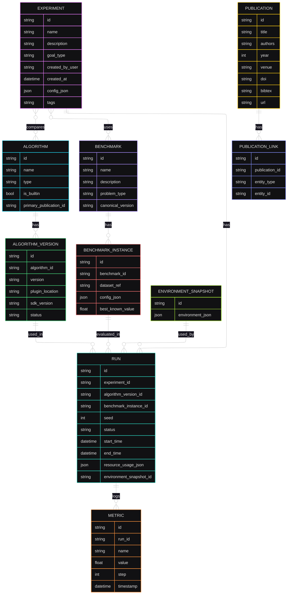
```mermaid
---
config:
  layout: elk
  theme: redux-dark-color
---
erDiagram
    EXPERIMENT {
        string  id
        string  name
        string  description
        string  goal_type
        string  created_by_user
        datetime created_at
        json    config_json
        string  tags
    }
    RUN {
        string  id
        string  experiment_id
        string  algorithm_version_id
        string  benchmark_instance_id
        int     seed
        string  status
        datetime start_time
        datetime end_time
        json    resource_usage_json
        string  environment_snapshot_id
    }
    METRIC {
        string  id
        string  run_id
        string  name
        float   value
        int     step
        datetime timestamp
    }
    ALGORITHM {
        string  id
        string  name
        string  type
        bool    is_builtin
        string  primary_publication_id
    }
    ALGORITHM_VERSION {
        string  id
        string  algorithm_id
        string  version
        string  plugin_location
        string  sdk_version
        string  status
    }
    BENCHMARK {
        string  id
        string  name
        string  description
        string  problem_type
        string  canonical_version
    }
    BENCHMARK_INSTANCE {
        string  id
        string  benchmark_id
        string  dataset_ref
        json    config_json
        float   best_known_value
    }
    PUBLICATION {
        string  id
        string  title
        string  authors
        int     year
        string  venue
        string  doi
        string  bibtex
        string  url
    }
    PUBLICATION_LINK {
        string  id
        string  publication_id
        string  entity_type
        string  entity_id
    }
    ENVIRONMENT_SNAPSHOT {
        string  id
        json    environment_json
    }
    %% environment_json zawiera:
    %% - wersje obrazów kontenerów
    %% - wersje bibliotek Python/R  
    %% - parametry środowiska (env vars)
    %% - konfigurację zasobów (CPU/RAM)
    %% - commit hash kodu systemu
    EXPERIMENT        ||--o{ RUN                : has
    RUN               ||--o{ METRIC             : logs
    EXPERIMENT        }o--o{ BENCHMARK          : uses
    EXPERIMENT        }o--o{ ALGORITHM          : compares
    ALGORITHM         ||--o{ ALGORITHM_VERSION  : has
    BENCHMARK         ||--o{ BENCHMARK_INSTANCE : has
    ALGORITHM_VERSION ||--o{ RUN                : used_in
    BENCHMARK_INSTANCE||--o{ RUN                : evaluated_in
    ENVIRONMENT_SNAPSHOT ||--o{ RUN             : used_by
    PUBLICATION       ||--o{ PUBLICATION_LINK   : has
```

---

## 5. Przypadki użycia

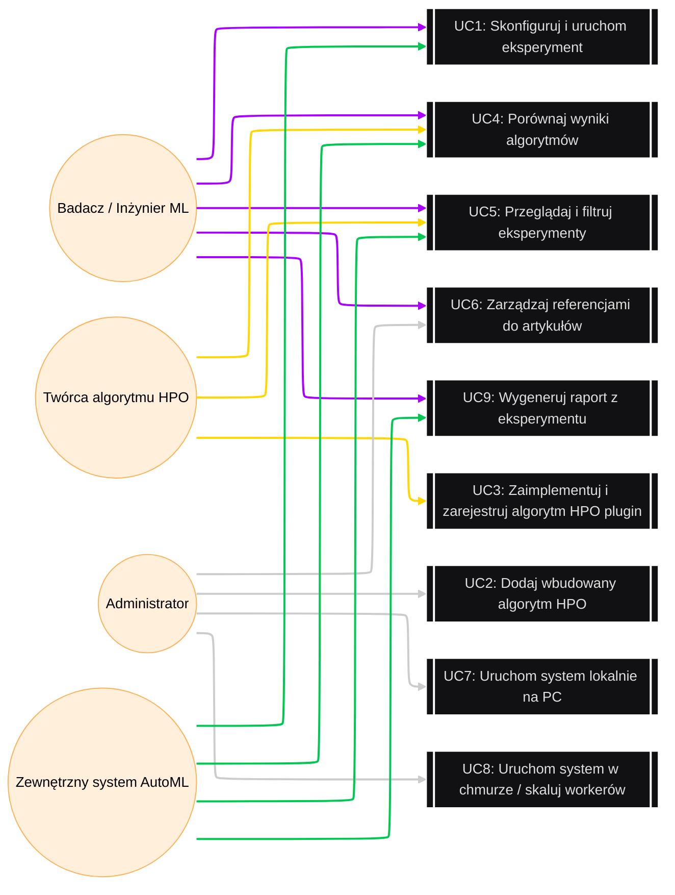
```mermaid
---
config:
  layout: elk
  theme: redux-dark
---
flowchart LR
    A1(("Badacz / Inżynier ML")) --> UC1[["UC1: Skonfiguruj i uruchom eksperyment"]] & UC4[["UC4: Porównaj wyniki algorytmów"]] & UC5[["UC5: Przeglądaj i filtruj eksperymenty"]] & UC6[["UC6: Zarządzaj referencjami do artykułów"]] & UC9[["UC9: Wygeneruj raport z eksperymentu"]]
    A2(("Twórca algorytmu HPO")) --> UC3[["UC3: Zaimplementuj i zarejestruj algorytm HPO plugin"]] & UC4 & UC5
    A3(("Administrator")) --> UC2[["UC2: Dodaj wbudowany algorytm HPO"]] & UC6 & UC7[["UC7: Uruchom system lokalnie na PC"]] & UC8[["UC8: Uruchom system w chmurze / skaluj workerów"]]
    A4(("Zewnętrzny system AutoML")) --> UC1 & UC4 & UC5 & UC9
     A1:::Peach
     A2:::Peach
     A3:::Peach
     A4:::Peach
    classDef Peach stroke-width:1px, stroke-dasharray:none, stroke:#FBB35A, fill:#FFEFDB, color:#8F632D
    style A1 color:#000000
    style A2 color:#000000
    style A3 color:#000000
    style A4 color:#000000
    linkStyle 0 stroke:#AA00FF,fill:none
    linkStyle 1 stroke:#AA00FF,fill:none
    linkStyle 2 stroke:#AA00FF,fill:none
    linkStyle 3 stroke:#AA00FF
    linkStyle 4 stroke:#AA00FF,fill:none
    linkStyle 5 stroke:#FFD600,fill:none
    linkStyle 6 stroke:#FFD600,fill:none
    linkStyle 7 stroke:#FFD600,fill:none
    linkStyle 12 stroke:#00C853,fill:none
    linkStyle 13 stroke:#00C853,fill:none
    linkStyle 14 stroke:#00C853,fill:none
    linkStyle 15 stroke:#00C853,fill:none
```

### 5.1. Opisy przypadków użycia

#### UC1: Skonfiguruj i uruchom eksperyment benchmarkowy

- **Aktorzy:**  
  - Główny: Badacz / Inżynier ML (A1)  
  - Współuczestniczący: System (Orchestrator, Benchmark Definition, Algorithm Registry, Tracking)  
- **Cel:**  
  - Utworzenie eksperymentu benchmarkowego, zdefiniowanie planu runów, uruchomienie i zapis wyników.  
- **Warunki początkowe:**  
  - Istnieją zarejestrowane benchmarki i algorytmy HPO (wbudowane lub pluginy).  
  - Użytkownik jest zalogowany i posiada uprawnienia do tworzenia eksperymentów.  
- **Główny scenariusz:**
  1. A1 otwiera Web UI – sekcję „Nowy eksperyment”.
  2. System pobiera listę benchmarków z Benchmark Definition Service.
  3. A1 wybiera jeden lub więcej benchmarków oraz instancje problemów.
  4. System pobiera listę dostępnych algorytmów z Algorithm Registry.
  5. A1 wybiera algorytmy i konfiguruje ich parametry/limity budżetu HPO.
  6. A1 definiuje cele eksperymentu (G1–G5) i metryki.
  7. A1 zapisuje konfigurację eksperymentu.
  8. API Gateway przekazuje konfigurację do Experiment Orchestrator.
  9. Orchestrator waliduje konfigurację (Benchmark Definition, Algorithm Registry).
  10. Orchestrator tworzy plan runów i zapisuje eksperyment w Experiment Tracking Service.
  11. A1 uruchamia eksperyment (przycisk „Run”).
  12. Orchestrator wysyła zadania runów do Message Broker.
  13. Workery pobierają zadania, wykonują runy, raportują metryki i logi do Tracking Service.
  14. Orchestrator aktualizuje status eksperymentu, dopóki wszystkie runy nie zostaną zakończone.
- **Scenariusze alternatywne / błędy:**
  - 9a. Walidacja nie powiodła się (niekompatybilny algorytm → benchmark)
    - System informuje A1 o błędach konfiguracji; eksperyment nie jest tworzony.
  - 12a. Brak dostępnych workerów
    - Runy pozostają w stanie „pending”; A1 jest informowany o opóźnieniu.
  - **1A. Walidacja konfiguracji nie powiodła się (niekompatybilny algorytm → benchmark)**
    1. W kroku 9 Orchestrator wykrywa niezgodność (np. algorytm wymaga GPU, ale benchmark nie wspiera GPU).
    2. System zwraca szczegółowy raport błędów z kodami: `INCOMPATIBLE_ALGORITHM`, `INSUFFICIENT_RESOURCES`, `INVALID_PARAMETER_SPACE`.
    3. Web UI wyświetla błędy z sugestiami poprawek (np. "Wybierz benchmark wspierający GPU" lub "Użyj algorytmu bez wymagań GPU").
    4. A1 poprawia konfigurację i ponawia próbę od kroku 7.
  - **1B. Brak dostępnych workerów**
    1. W kroku 12 Message Broker przyjmuje zadania, ale żaden Worker nie jest dostępny.
    2. Orchestrator wykrywa brak aktywnych konsumentów kolejki po timeout (np. 30s).
    3. System informuje A1: "Eksperyment zaplanowany, ale brak dostępnych workerów. Szacowany czas oczekiwania: >30 min".
    4. A1 może: anulować eksperyment, uruchomić dodatkowe workery (UC7/UC8), lub czekać.
    5. Po pojawieniu się workerów runy automatycznie się rozpoczynają.
  - **1C. Run zakończony błędem podczas wykonania**
    1. W kroku 13 Worker napotyka błąd (np. brak pamięci, błąd w kodzie pluginu, timeout).
    2. Worker loguje szczegółowy błąd do Tracking Service: typ błędu, stack trace, zużycie zasobów.
    3. Orchestrator otrzymuje zdarzenie `RunFailed` i sprawdza politykę retry.
    4. Jeśli `retry_count < max_retries`: Orchestrator ponownie zleca run z opóźnieniem.
    5. Jeśli przekroczono limit prób: run oznaczany jako `FAILED`, eksperyment kontynuowany bez tego runu.
    6. A1 otrzymuje powiadomienie o błędnych runach z linkami do logów diagnostycznych.
  - **1D. Błąd infrastruktury (DB/Message Broker niedostępny)**
    1. W trakcie eksperymentu Results Store lub Message Broker staje się niedostępny.
    2. Workery nie mogą logować metryk → przechodzą w tryb buforowania lokalnego.
    3. Orchestrator nie może aktualizować statusu → oznacza eksperyment jako `DEGRADED`.
    4. System próbuje reconnect co 30s przez max 10 min.
    5. Po przywróceniu połączenia: workery wysyłają zbufowane dane, eksperyment powraca do stanu `RUNNING`.
    6. Jeśli połączenie nie zostanie przywrócone: eksperyment oznaczany jako `FAILED_INFRASTRUCTURE`.
  - **1E. Przekroczenie budżetu zasobów**
    1. W trakcie runu Worker wykrywa, że algorytm przekracza limity (pamięć/CPU/czas).
    2. Worker wysyła ostrzeżenie do Tracking Service i próbuje graceful shutdown algorytmu.
    3. Jeśli algorytm nie reaguje w timeout (30s): Worker force-kill proces i oznacza run jako `RESOURCE_EXCEEDED`.
    4. Orchestrator może zlecić retry z większymi limitami zasobów (jeśli dostępne) lub oznaczyć run jako failed.
  - **1F. Błąd pluginu algorytmu HPO**
    1. Plugin zgłasza wyjątek podczas `suggest()` lub `observe()`.
    2. Plugin Runtime izoluje błąd i loguje: typ wyjątku, parametry wywołania, stan wewnętrzny pluginu.
    3. Worker oznacza run jako `PLUGIN_ERROR` i nie próbuje retry (błędy pluginu to błędy logiki, nie infrastruktury).
    4. System generuje raport dla autora pluginu z diagnostyką błędu.
- **Warunki końcowe:**  
  - Eksperyment ma status completed/failed.
  - Wszystkie runy mają metryki i logi zapisane w Tracking Service.
  - Dane są gotowe do analizy (UC4).


```mermaid
---
config:
  layout: elk
  theme: redux-dark
---
flowchart LR
 subgraph subGraph0["Przepływ danych"]
        UI["Web UI\n(Kreator eksperymentu)"]
        U["Badacz / Inżynier ML"]
        API["API Gateway"]
        ORCH["Experiment Orchestrator"]
        BENCH["Benchmark Definition Service"]
        ALG["Algorithm Registry Service"]
        TRK["Experiment Tracking Service"]
        MB["Message Broker\nRunJob queue"]
        W["Worker Runtime"]
        OBJ["Object Storage\n(artefakty, modele)"]
        DB[("Results Store\n(Experiments, Runs, Metrics)")]
  end
    U --> UI
    UI --> API
    API --> ORCH
    ORCH --> BENCH & ALG & TRK & MB
    MB --> W
    W --> TRK & OBJ
    TRK --> DB
    U -- konfiguracja eksperymentu\n(benchmarki, algorytmy, budżety) --> UI
    UI -- config JSON --> API
    API -- createExperiment(config) --> ORCH
    ORCH -- pobierz definicje instancji --> BENCH
    ORCH -- pobierz definicje algorytmów --> ALG
    ORCH -- registerExperiment, registerRuns --> TRK
    ORCH -- RunJob --> MB
    W -- logRun, logMetrics, logArtifacts --> TRK
    W -- modele, logi, artefakty --> OBJ
    TRK -- INSERT Experiments/Runs/Metrics --> DB
    UI <-- status eksperymentu, wyniki --> API
    linkStyle 3 stroke:#FFD600,fill:none
    linkStyle 4 stroke:#FFD600,fill:none
    linkStyle 5 stroke:#FFD600,fill:none
    linkStyle 6 stroke:#FFD600,fill:none
    linkStyle 8 stroke:#00C853,fill:none
    linkStyle 9 stroke:#00C853,fill:none
    linkStyle 14 stroke:#FFD600,fill:none
    linkStyle 15 stroke:#FFD600,fill:none
    linkStyle 16 stroke:#FFD600,fill:none
    linkStyle 17 stroke:#FFD600,fill:none
    linkStyle 18 stroke:#00C853,fill:none
    linkStyle 19 stroke:#00C853
```

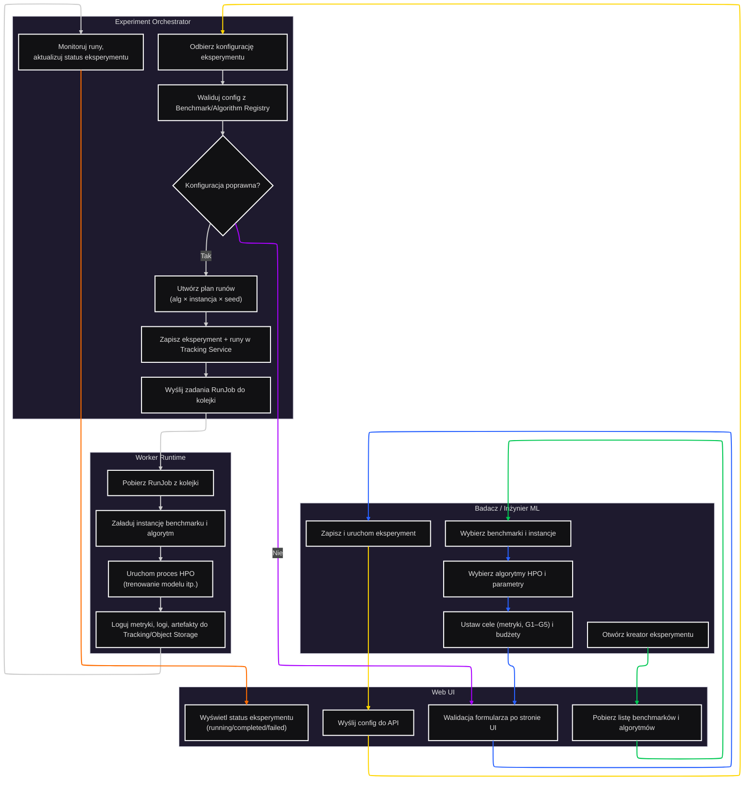
```mermaid
---
config:
  layout: elk
  theme: redux-dark
---
flowchart TB
 subgraph User["Badacz / Inżynier ML"]
        U1["Otwórz kreator eksperymentu"]
        U2["Wybierz benchmarki i instancje"]
        U3["Wybierz algorytmy HPO i parametry"]
        U4["Ustaw cele (metryki, G1–G5) i budżety"]
        U5["Zapisz i uruchom eksperyment"]
  end
 subgraph UI["Web UI"]
        W1["Pobierz listę benchmarków i algorytmów"]
        W2["Walidacja formularza po stronie UI"]
        W3["Wyślij config do API"]
        W4["Wyświetl status eksperymentu\n(running/completed/failed)"]
  end
 subgraph ORCH["Experiment Orchestrator"]
        O1["Odbierz konfigurację eksperymentu"]
        O2["Waliduj config z Benchmark/Algorithm Registry"]
        D1{"Konfiguracja poprawna?"}
        O3["Utwórz plan runów\n(alg × instancja × seed)"]
        O4["Zapisz eksperyment + runy w Tracking Service"]
        O5["Wyślij zadania RunJob do kolejki"]
        O6["Monitoruj runy,\naktualizuj status eksperymentu"]
  end
 subgraph Worker["Worker Runtime"]
        R1["Pobierz RunJob z kolejki"]
        R2["Załaduj instancję benchmarku i algorytm"]
        R3["Uruchom proces HPO\n(trenowanie modelu itp.)"]
        R4["Loguj metryki, logi, artefakty do Tracking/Object Storage"]
  end
    U1 --> W1
    W1 --> U2
    U2 --> U3
    U3 --> U4
    U4 --> W2
    W2 --> U5
    U5 --> W3
    W3 --> O1
    O1 --> O2
    O2 --> D1
    D1 -- Nie --> W2
    D1 -- Tak --> O3
    O3 --> O4
    O4 --> O5
    O5 --> R1
    R1 --> R2
    R2 --> R3
    R3 --> R4
    R4 --> O6
    O6 --> W4
    linkStyle 0 stroke:#00C853,fill:none
    linkStyle 1 stroke:#00C853,fill:none
    linkStyle 2 stroke:#2962FF,fill:none
    linkStyle 3 stroke:#2962FF,fill:none
    linkStyle 4 stroke:#2962FF,fill:none
    linkStyle 5 stroke:#2962FF,fill:none
    linkStyle 6 stroke:#FFD600,fill:none
    linkStyle 7 stroke:#FFD600,fill:none
    linkStyle 10 stroke:#AA00FF,fill:none
    linkStyle 19 stroke:#FF6D00
```

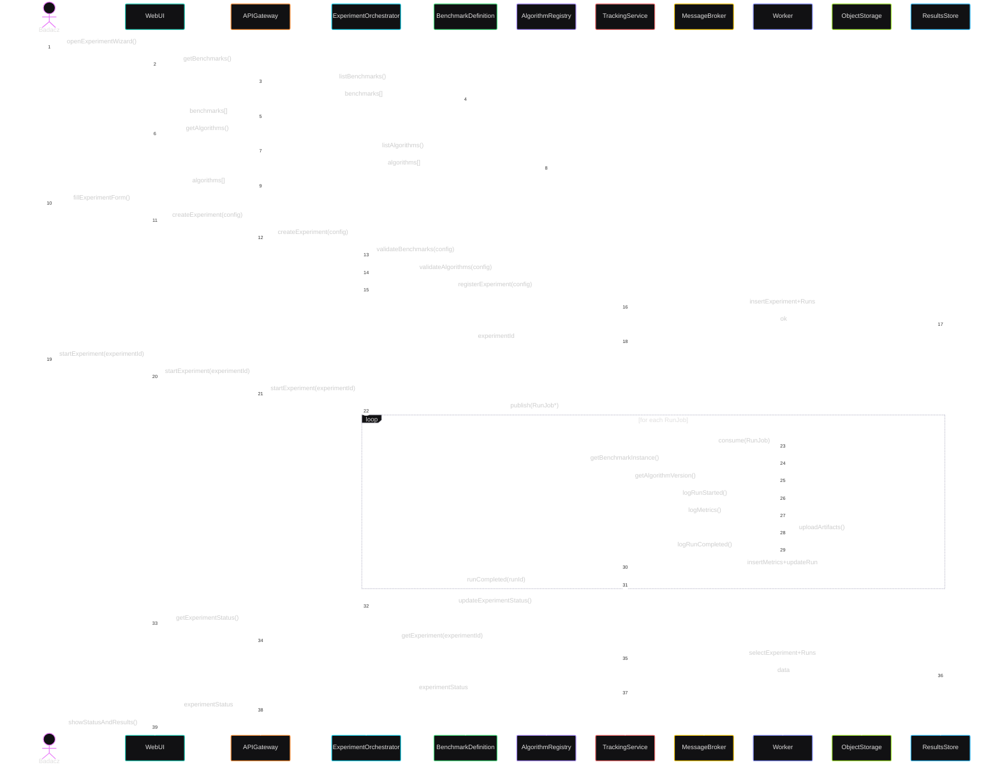
```mermaid
---
config:
  theme: redux-dark-color
---
sequenceDiagram
    autonumber
    actor User as Badacz
    participant UI as WebUI
    participant API as APIGateway
    participant ORCH as ExperimentOrchestrator
    participant BENCH as BenchmarkDefinition
    participant ALG as AlgorithmRegistry
    participant TRK as TrackingService
    participant MB as MessageBroker
    participant W as Worker
    participant OBJ as ObjectStorage
    participant DB as ResultsStore
    User->>UI: openExperimentWizard()
    UI->>API: getBenchmarks()
    API->>BENCH: listBenchmarks()
    BENCH-->>API: benchmarks[]
    API-->>UI: benchmarks[]
    UI->>API: getAlgorithms()
    API->>ALG: listAlgorithms()
    ALG-->>API: algorithms[]
    API-->>UI: algorithms[]
    User->>UI: fillExperimentForm()
    UI->>API: createExperiment(config)
    API->>ORCH: createExperiment(config)
    ORCH->>BENCH: validateBenchmarks(config)
    ORCH->>ALG: validateAlgorithms(config)
    ORCH->>TRK: registerExperiment(config)
    TRK->>DB: insertExperiment+Runs
    DB-->>TRK: ok
    TRK-->>ORCH: experimentId
    User->>UI: startExperiment(experimentId)
    UI->>API: startExperiment(experimentId)
    API->>ORCH: startExperiment(experimentId)
    ORCH->>MB: publish(RunJob*)
    loop for each RunJob
        W->>MB: consume(RunJob)
        W->>BENCH: getBenchmarkInstance()
        W->>ALG: getAlgorithmVersion()
        W->>TRK: logRunStarted()
        W->>TRK: logMetrics()
        W->>OBJ: uploadArtifacts()
        W->>TRK: logRunCompleted()
        TRK->>DB: insertMetrics+updateRun
        TRK-->>ORCH: runCompleted(runId)
    end
    ORCH->>TRK: updateExperimentStatus()
    UI->>API: getExperimentStatus()
    API->>TRK: getExperiment(experimentId)
    TRK->>DB: selectExperiment+Runs
    DB-->>TRK: data
    TRK-->>API: experimentStatus
    API-->>UI: experimentStatus
    UI-->>User: showStatusAndResults()
```

---

#### UC2: Dodaj nowy wbudowany algorytm HPO

**Aktorzy główni:**
- Administrator (Primary)

**Aktorzy poboczni:**
- Algorithm Registry Service
- PublicationService

**Cel:**
Dodanie do systemu nowego *wbudowanego* algorytmu HPO, który będzie dostępny w katalogu algorytmów dla wszystkich użytkowników oraz – opcjonalnie – powiązany z publikacjami naukowymi.

**Warunki początkowe:**
- Administrator jest uwierzytelniony i posiada uprawnienia administracyjne (rola Administrator).
- System jest uruchomiony w trybie lokalnym lub chmurowym (Web UI, API Gateway, Algorithm Registry, Publication Service, Results Store dostępne).
- Administrator zna podstawowe informacje o algorytmie:
  - Nazwa, opis, typ algorytmu (np. Bayesian, TPE, random search),
  - Definicja przestrzeni hiperparametrów,
  - Informacja o implementacji (np. moduł w repozytorium kodu),
  - Opcjonalnie: DOI lub inne identyfikatory publikacji.

**Główny scenariusz:**
1. Administrator otwiera w Web UI panel **„Algorytmy HPO”**.
2. System wyświetla listę zarejestrowanych algorytmów (wbudowanych oraz pluginów).
3. Administrator wybiera akcję **„Dodaj algorytm wbudowany”**.
4. System wyświetla formularz z polami:
   - Nazwa algorytmu, krótki opis,
   - Typ algorytmu (klasa/rodzina HPO),
   - Przestrzeń hiperparametrów (schemat),
   - Domyślne parametry,
   - Flaga `is_builtin`,
   - Informacja o implementacji (np. nazwa klasy, modułu),
   - Opcjonalne powiązane DOI / identyfikatory publikacji.
5. Administrator wypełnia formularz danymi algorytmu.
6. Web UI wykonuje wstępną walidację (pola wymagane, format DOI, poprawność schematu przestrzeni hiperparametrów).
7. Administrator potwierdza zapis algorytmu.
8. Web UI wysyła do API Gateway żądanie `createBuiltinAlgorithm(metadata, pubIds?)`.
9. API Gateway:
   - 9.1. Sprawdza uprawnienia użytkownika (rola Administrator),
   - 9.2. W przypadku braku uprawnień odrzuca żądanie (patrz scenariusz alternatywny).
10. API przekazuje metadane do **Algorithm Registry Service**.
11. Algorithm Registry:
    - 11.1. Waliduje metadane algorytmu (np. unikalność nazwy, poprawność przestrzeni hiperparametrów),
    - 11.2. Tworzy rekord **Algorithm** z flagą `is_builtin = true`,
    - 11.3. Tworzy rekord **AlgorithmVersion** (np. `v1.0`, status `approved` lub `draft` wg polityki).
12. Algorithm Registry zapisuje dane w Results Store.
13. API otrzymuje informację o utworzeniu algorytmu (`algorithmId`, `versionId`).
14. Jeżeli w żądaniu podano listę DOI / identyfikatorów publikacji:
    - 14.1. API wywołuje **PublicationService** z żądaniem `createPublicationLinks(algorithmId, pubIds)`,
    - 14.2. Publication Service tworzy brakujące rekordy `Publication` na podstawie DOI (w razie potrzeby),
    - 14.3. Publication Service tworzy rekordy `PublicationLink` łączące algorytm z publikacjami.
15. API zwraca do Web UI informację o sukcesie oraz identyfikatory nowego algorytmu i wersji.
16. Web UI:
    - 16.1. Wyświetla komunikat sukcesu,
    - 16.2. Odświeża listę algorytmów, pokazując nowy algorytm w katalogu.

**Scenariusze alternatywne / błędy:**

- **2A. Brak uprawnień administratora**
  1. W kroku 9.1 API stwierdza, że użytkownik nie ma roli Administrator.
  2. API zwraca błąd autoryzacji (np. 403 Forbidden).
  3. Web UI wyświetla komunikat o braku uprawnień i nie zapisuje algorytmu.

- **2B. Błędy walidacji po stronie UI**
  1. W kroku 6 Web UI wykrywa błędy (np. brak nazwy algorytmu, niepoprawny format DOI).
  2. System podświetla błędne pola i wyświetla komunikaty walidacyjne.
  3. Administrator poprawia dane i wraca do kroku 7.

- **2C. Błąd walidacji po stronie Algorithm Registry**
  1. W kroku 11 walidacja metadanych nie przechodzi (np. nazwa algorytmu już istnieje, schemat parametrów jest niepoprawny).
  2. Algorithm Registry zwraca błąd walidacji do API.
  3. API przekazuje szczegóły błędów do Web UI.
  4. Web UI wyświetla komunikat o błędzie z informacją, które pola należy poprawić.
  5. Administrator poprawia dane i ponawia próbę od kroku 7.

- **2D. Błąd komunikacji z Publication Service**
  1. W kroku 14 Publication Service nie jest dostępny lub zwraca błąd.
  2. API może:
     - 2D.1. Zwrócić częściowy sukces (algorytm zapisany, ale publikacje niepowiązane),
     - 2D.2. Lub przerwać operację w całości (w zależności od przyjętej polityki).
  3. Web UI wyświetla odpowiedni komunikat:
     - a) „Algorytm zapisany, ale publikacje nie zostały powiązane”,
     - b) lub „Nie udało się zapisać algorytmu – spróbuj ponownie”.

**Warunki końcowe:**
- W przypadku sukcesu:
  - Nowy wbudowany algorytm HPO jest zapisany w Results Store (Algorithm + AlgorithmVersion),
  - Jest widoczny w katalogu algorytmów i może być używany w eksperymentach benchmarkowych,
  - Jeżeli podano DOI – algorytm jest powiązany z odpowiednimi publikacjami.
- W przypadku błędu:
  - System pozostaje w stanie spójnym – albo nie powstał żaden nowy algorytm, albo algorytm powstał, ale brak jest częściowo powiązań z publikacjami (w zależności od scenariusza).


```mermaid
---
config:
  layout: elk
  theme: redux-dark
---
flowchart LR
    Admin(["Administrator"]) --> UI["Web UI\n(Panel algorytmów HPO)"]
    UI --> API["API Gateway"]
    API --> REG["Algorithm Registry Service"] & PUB["Publication Service"]
    REG --> DBALG[("Results Store\nAlgorithm/AlgorithmVersion")]
    PUB --> DBPUB[("Results Store\nPublication/PublicationLink")]
    Admin -- metadane algorytmu\n(nazwa, typ, parametry,\nflaga is_builtin) --> UI
    UI -- createBuiltinAlgorithm() --> API
    API -- alg metadata --> REG
    REG -- INSERT Algorithm + AlgorithmVersion --> DBALG
    UI -- opcjonalne DOI / publikacje --> API
    API -- linkPublication(algorithmId, pubIds) --> PUB
    PUB -- INSERT PublicationLink --> DBPUB
```

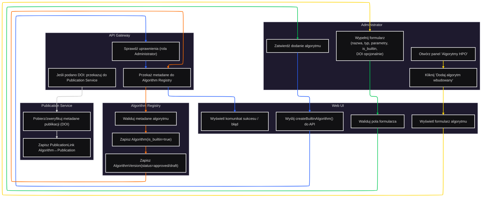
```mermaid
---
config:
  layout: elk
  theme: redux-dark
---
flowchart TB
 subgraph Swim_Admin["Administrator"]
        A1@{ label: "Otwórz panel 'Algorytmy HPO'" }
        A2@{ label: "Kliknij 'Dodaj algorytm wbudowany'" }
        A3["Wypełnij formularz\n(nazwa, typ, parametry, is_builtin,\nDOI opcjonalnie)"]
        A4["Zatwierdź dodanie algorytmu"]
  end
 subgraph Swim_UI["Web UI"]
        U1["Wyświetl formularz algorytmu"]
        U2["Waliduj pola formularza"]
        U3["Wyślij createBuiltinAlgorithm() do API"]
        U4["Wyświetl komunikat sukcesu / błąd"]
  end
 subgraph Swim_API["API Gateway"]
        G1["Sprawdź uprawnienia (rola Administrator)"]
        G2["Przekaż metadane do Algorithm Registry"]
        G3["Jeśli podano DOI: przekazuj do Publication Service"]
  end
 subgraph Swim_REG["Algorithm Registry"]
        R1["Waliduj metadane algorytmu"]
        R2["Zapisz Algorithm(is_builtin=true)"]
        R3["Zapisz AlgorithmVersion(status=approved/draft)"]
  end
 subgraph Swim_PUB["Publication Service"]
        P1["Pobierz/zweryfikuj metadane publikacji (DOI)"]
        P2["Zapisz PublicationLink Algorithm↔Publication"]
  end
    A1 --> A2
    A2 --> U1
    U1 --> A3
    A3 --> U2
    U2 --> A4
    A4 --> U3
    U3 --> G1
    G1 --> G2
    G2 --> R1 & U4
    R1 --> R2
    R2 --> R3
    R3 --> G2
    G3 --> P1
    P1 --> P2
    A1@{ shape: rect}
    A2@{ shape: rect}
    linkStyle 0 stroke:#FFD600,fill:none
    linkStyle 1 stroke:#FFD600,fill:none
    linkStyle 2 stroke:#FFD600,fill:none
    linkStyle 3 stroke:#00C853,fill:none
    linkStyle 4 stroke:#00C853,fill:none
    linkStyle 5 stroke:#2962FF,fill:none
    linkStyle 6 stroke:#2962FF,fill:none
    linkStyle 7 stroke:#2962FF,fill:none
    linkStyle 8 stroke:#FF6D00,fill:none
    linkStyle 9 stroke:#2962FF
    linkStyle 10 stroke:#FF6D00,fill:none
    linkStyle 11 stroke:#FF6D00,fill:none
    linkStyle 12 stroke:#FF6D00,fill:none
```

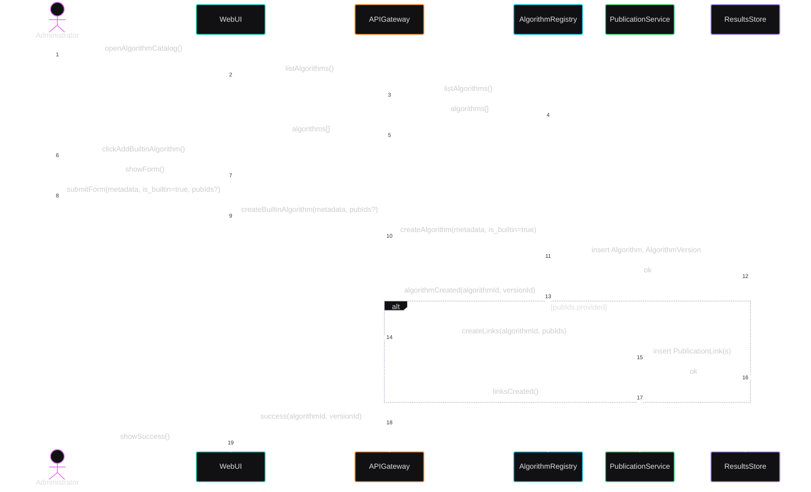
```mermaid
---
config:
  theme: redux-dark-color
---
sequenceDiagram
    autonumber
    actor Admin as Administrator
    participant UI as WebUI
    participant API as APIGateway
    participant REG as AlgorithmRegistry
    participant PUB as PublicationService
    participant DB as ResultsStore
    Admin->>UI: openAlgorithmCatalog()
    UI-->>API: listAlgorithms()
    API->>REG: listAlgorithms()
    REG-->>API: algorithms[]
    API-->>UI: algorithms[]
    Admin->>UI: clickAddBuiltinAlgorithm()
    UI-->>Admin: showForm()
    Admin->>UI: submitForm(metadata, is_builtin=true, pubIds?)
    UI->>API: createBuiltinAlgorithm(metadata, pubIds?)
    API->>REG: createAlgorithm(metadata, is_builtin=true)
    REG->>DB: insert Algorithm, AlgorithmVersion
    DB-->>REG: ok
    REG-->>API: algorithmCreated(algorithmId, versionId)
    alt pubIds provided
        API->>PUB: createLinks(algorithmId, pubIds)
        PUB->>DB: insert PublicationLink(s)
        DB-->>PUB: ok
        PUB-->>API: linksCreated()
    end
    API-->>UI: success(algorithmId, versionId)
    UI-->>Admin: showSuccess()
```

---

#### UC3: Zaimplementuj i zarejestruj własny algorytm HPO (plugin)

- **Aktorzy:**  
  - Główny: Twórca algorytmu HPO (A2)  
  - Współuczestniczący: Algorithm SDK/Plugin Runtime, Algorithm Registry, PublicationService  
- **Cel:**  
  - Udostępnienie nowego algorytmu HPO jako pluginu, kompatybilnego z platformą benchmarkową.  
- **Warunki początkowe:**  
  - A2 ma dostęp do SDK i repozytorium pluginów.
  - Użytkownik jest zalogowany i ma uprawnienia do rejestracji pluginów.  
- **Główny scenariusz:**
  1. A2 pobiera SDK (np. pip install).
  2. A2 implementuje klasę/serwis IAlgorithmPlugin (metody init/suggest/observe).
  3. A2 uruchamia lokalne testy (komenda SDK, np. `hpo-sdk validate`), które odpalają PluginValidator.
  4. PluginValidator sprawdza zgodność API, uruchamia krótką symulację.
  5. A2 pakuje plugin (np. wheel lub obraz kontenera).
  6. A2 w Web UI otwiera widok „Rejestruj algorytm HPO”.  
  7. A2 podaje metadane (nazwa, opis, typ, parametry, publikacje) oraz wskazuje lokalizację pluginu (URL, plik).  
  8. API przekazuje dane do Algorithm Registry.
  9. Algorithm Registry zapisuje Algorithm i AlgorithmVersion ze statusem „draft”.
  10. System (lub A3 – administrator) zatwierdza algorytm (status „approved”).  
- **Scenariusze alternatywne / błędy:**
  - **3A. Walidacja lokalna się nie powiedzie**
    1. W kroku 4 PluginValidator wykrywa błędy implementacji:
       - Brak wymaganych metod (`suggest`, `observe`, `init`)
       - Nieprawidłowe sygnatury metod
       - Plugin nie implementuje interfejsu `IAlgorithmPlugin`
       - Błędy runtime podczas testowej symulacji
    2. SDK generuje szczegółowy raport walidacji z przykładami poprawnej implementacji.
    3. A2 analizuje błędy i poprawia kod pluginu.
    4. Proces powraca do kroku 2 (walidacja lokalna).
  - **3B. Błędy testowej symulacji pluginu**
    1. W kroku 4 plugin przechodzi walidację interfejsu, ale zawodzi w testowej symulacji HPO.
    2. PluginValidator wykrywa: timeout w `suggest()`, nieprawidłowe wartości zwracane, wycieki pamięci.
    3. SDK zapisuje logi symulacji i profilowanie zasobów do pliku diagnostycznego.
    4. A2 otrzymuje raport z metrics wydajności i sugestiami optymalizacji.
    5. A2 optymalizuje plugin i ponawia walidację.
  - **3C. Rejestracja w Algorithm Registry się nie powiedzie**
    1. W kroku 9 Algorithm Registry zwraca błąd:
       - `ALGORITHM_NAME_EXISTS`: nazwa algorytmu już istnieje
       - `INVALID_PLUGIN_LOCATION`: nie można pobrać paczki pluginu z podanej lokalizacji
       - `STORAGE_ACCESS_ERROR`: brak dostępu do Object Storage
       - `METADATA_VALIDATION_ERROR`: nieprawidłowe metadane (np. niewspierane typy problemów)
    2. System zwraca szczegółowy komunikat błędu z kodem i sugestiami naprawy.
    3. A2 poprawia metadane lub lokalizację pluginu i ponawia rejestrację.
  - **3D. Błąd pobierania/walidacji publikacji (DOI)**
    1. W kroku 9 Publication Service nie może pobrać metadanych z zewnętrznego systemu bibliograficznego.
    2. System oferuje opcje:
       - Pominąć publikacje i zarejestrować plugin bez powiązań
       - Wprowadzić metadane publikacji ręcznie
       - Ponowić próbę później (plugin zapisany jako draft)
    3. A2 wybiera opcję i kontynuuje lub poprawia dane publikacji.
  - **3E. Plugin zawiera potencjalnie niebezpieczny kod**
    1. Podczas walidacji SandboxManager wykrywa podejrzane operacje:
       - Próby dostępu do systemu plików poza dozwolonymi katalogami
       - Próby połączeń sieciowych
       - Użycie zabronionych bibliotek
    2. System odrzuca plugin z komunikatem `SECURITY_VIOLATION`.
    3. A2 musi usunąć niebezpieczny kod i ponownie przesłać plugin.
  - **3F. Konflikt wersji SDK**
    1. Plugin został zbudowany z niekompatybilną wersją SDK.
    2. Algorithm Registry wykrywa niezgodność wersji i odrzuca rejestrację.
    3. System informuje o wymaganej wersji SDK i linku do aktualizacji.
    4. A2 aktualizuje SDK, przebudowuje plugin i ponawia rejestrację.
- **Warunki końcowe:**  
  - Nowy algorytm HPO jest dostępny w Algorithm Registry i może być użyty w UC1.

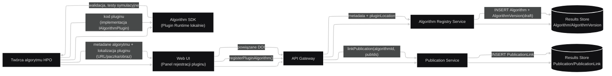
```mermaid
---
config:
  layout: elk
  theme: redux-dark
---
flowchart LR
    Dev["Twórca algorytmu HPO"] --> SDK["Algorithm SDK\n(Plugin Runtime lokalnie)"] & UI["Web UI\n(Panel rejestracji pluginu)"]
    UI --> API["API Gateway"]
    API --> REG["Algorithm Registry Service"] & PUB["Publication Service"]
    REG --> DBALG[("Results Store\nAlgorithm/AlgorithmVersion")]
    PUB --> DBPUB[("Results Store\nPublication/PublicationLink")]
    Dev -- kod pluginu\n(implementacja IAlgorithmPlugin) --> SDK
    SDK -- walidacja, testy symulacyjne --> Dev
    Dev -- metadane algorytmu + lokalizacja pluginu\n(URL/paczka/obraz) --> UI
    UI -- registerPluginAlgorithm() --> API
    API -- metadata + pluginLocation --> REG
    REG -- INSERT Algorithm + AlgorithmVersion(draft) --> DBALG
    UI -- powiązane DOI --> API
    API -- linkPublication(algorithmId, pubIds) --> PUB
    PUB -- INSERT PublicationLink --> DBPUB
```

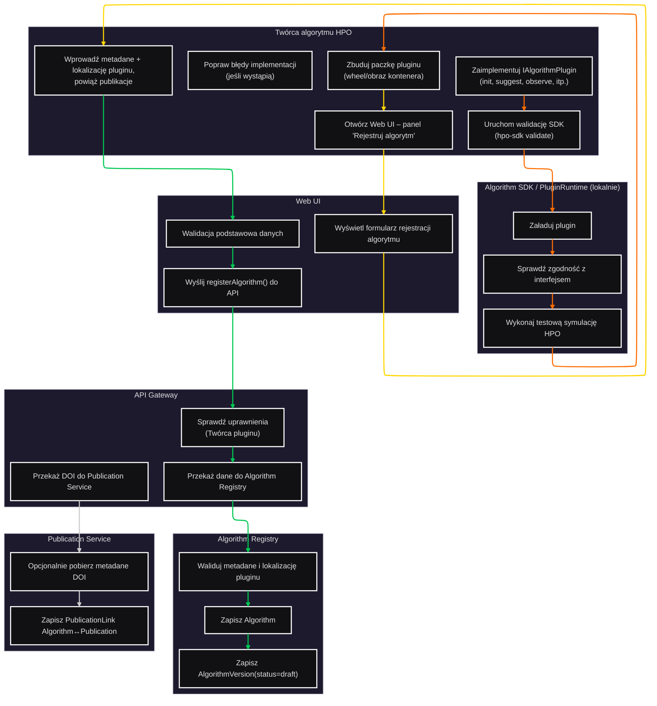
```mermaid
---
config:
  layout: elk
  theme: redux-dark
---
flowchart TB
 subgraph Dev["Twórca algorytmu HPO"]
        D1["Zaimplementuj IAlgorithmPlugin\n(init, suggest, observe, itp.)"]
        D2["Uruchom walidację SDK\n(hpo-sdk validate)"]
        D3["Popraw błędy implementacji\n(jeśli wystąpią)"]
        D4["Zbuduj paczkę pluginu\n(wheel/obraz kontenera)"]
        D5@{ label: "Otwórz Web UI – panel 'Rejestruj algorytm'" }
        D6["Wprowadź metadane + lokalizację pluginu,\npowiąż publikacje"]
  end
 subgraph SDK["Algorithm SDK / PluginRuntime (lokalnie)"]
        S1["Załaduj plugin"]
        S2["Sprawdź zgodność z interfejsem"]
        S3["Wykonaj testową symulację HPO"]
  end
 subgraph UI["Web UI"]
        U1["Wyświetl formularz rejestracji algorytmu"]
        U2["Walidacja podstawowa danych"]
        U3["Wyślij registerAlgorithm() do API"]
  end
 subgraph API["API Gateway"]
        A1["Sprawdź uprawnienia\n(Twórca pluginu)"]
        A2["Przekaż dane do Algorithm Registry"]
        A3["Przekaż DOI do Publication Service"]
  end
 subgraph REG["Algorithm Registry"]
        R1["Waliduj metadane i lokalizację pluginu"]
        R2["Zapisz Algorithm"]
        R3["Zapisz AlgorithmVersion(status=draft)"]
  end
 subgraph PUB["Publication Service"]
        P1["Opcjonalnie pobierz metadane DOI"]
        P2["Zapisz PublicationLink Algorithm↔Publication"]
  end
    D1 --> D2
    D2 --> S1
    S1 --> S2
    S2 --> S3
    S3 --> D4
    D4 --> D5
    D5 --> U1
    U1 --> D6
    D6 --> U2
    U2 --> U3
    U3 --> A1
    A1 --> A2
    A2 --> R1
    R1 --> R2
    R2 --> R3
    A3 --> P1
    P1 --> P2
    D5@{ shape: rect}
    linkStyle 0 stroke:#FF6D00,fill:none
    linkStyle 1 stroke:#FF6D00,fill:none
    linkStyle 2 stroke:#FF6D00,fill:none
    linkStyle 3 stroke:#FF6D00,fill:none
    linkStyle 4 stroke:#FF6D00,fill:none
    linkStyle 5 stroke:#FFD600,fill:none
    linkStyle 6 stroke:#FFD600,fill:none
    linkStyle 7 stroke:#FFD600,fill:none
    linkStyle 8 stroke:#00C853,fill:none
    linkStyle 9 stroke:#00C853,fill:none
    linkStyle 10 stroke:#00C853,fill:none
    linkStyle 11 stroke:#00C853,fill:none
    linkStyle 12 stroke:#00C853,fill:none
    linkStyle 13 stroke:#00C853,fill:none
    linkStyle 14 stroke:#00C853
```

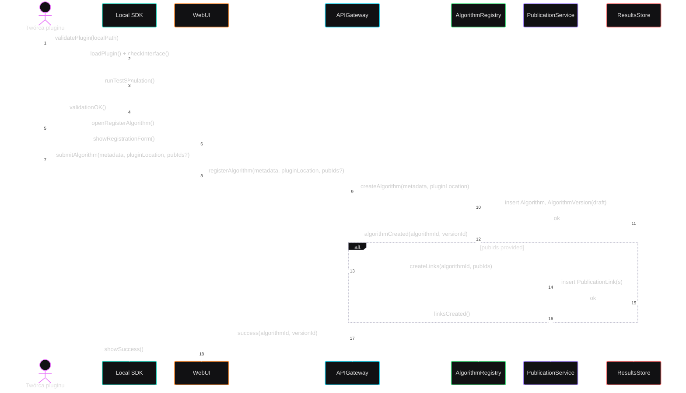
```mermaid
---
config:
  theme: redux-dark-color
---
sequenceDiagram
    autonumber
    actor Author as Twórca pluginu
    participant SDK as Local SDK
    participant UI as WebUI
    participant API as APIGateway
    participant REG as AlgorithmRegistry
    participant PUB as PublicationService
    participant DB as ResultsStore
    Author->>SDK: validatePlugin(localPath)
    SDK->>SDK: loadPlugin() + checkInterface()
    SDK->>SDK: runTestSimulation()
    SDK-->>Author: validationOK()
    Author->>UI: openRegisterAlgorithm()
    UI-->>Author: showRegistrationForm()
    Author->>UI: submitAlgorithm(metadata, pluginLocation, pubIds?)
    UI->>API: registerAlgorithm(metadata, pluginLocation, pubIds?)
    API->>REG: createAlgorithm(metadata, pluginLocation)
    REG->>DB: insert Algorithm, AlgorithmVersion(draft)
    DB-->>REG: ok
    REG-->>API: algorithmCreated(algorithmId, versionId)
    alt pubIds provided
        API->>PUB: createLinks(algorithmId, pubIds)
        PUB->>DB: insert PublicationLink(s)
        DB-->>PUB: ok
        PUB-->>API: linksCreated()
    end
    API-->>UI: success(algorithmId, versionId)
    UI-->>Author: showSuccess()
```

---

#### UC4: Porównaj wyniki algorytmów (w tym autorskich)

- **Aktorzy:**  
  - Główny: Badacz / Inżynier ML (A1)  
  - Współuczestniczący: MetricsAnalysisService, Experiment Tracking Service  
- **Cel:**  
  - Wizualne i statystyczne porównanie algorytmów HPO na zestawie benchmarków.  
- **Warunki początkowe:**  
  - Istnieją zakończone eksperymenty z runami dla co najmniej dwóch algorytmów.  
- **Główny scenariusz:**
  1. A1 otwiera Web UI – sekcję „Porównaj algorytmy”.
  2. A1 wybiera eksperymenty lub zestaw runów do porównania (np. filtr po algorytmie, benchmarku, tagach).
  3. Web UI pobiera listę runów i metryk z Experiment Tracking Service.
  4. Web UI wysyła zapytanie do MetricsAnalysisService z wybranymi runami.
  5. MetricsAnalysisService agreguje metryki per algorytm/benchmark, wykonuje testy statystyczne.
  6. MetricsAnalysisService zwraca dane do wizualizacji (np. tablica wyników, rankingi, wartości p).
  7. Web UI prezentuje wykresy i tabele.
  8. A1 może zapisać „widok porównania” lub wygenerować raport.  
- **Scenariusze alternatywne / błędy:**
  - **4A. Zbyt mała liczba runów dla wiarygodnej analizy statystycznej**
    1. W kroku 5 MetricsAnalysisService wykrywa, że liczba runów < 10 per algorytm.
    2. System wyświetla ostrzeżenie: "Niedostateczna liczba runów dla testów statystycznych. Zalecane minimum: 30 runów per algorytm."
    3. A1 może:
       - Kontynuować analizę z zastrzeżeniem o niskiej wiarygodności
       - Uruchomić dodatkowe runy (UC1) i powrócić do porównania
       - Zmienić kryteria porównania (np. inny zestaw algorytmów z większą liczbą runów)
  - **4B. Niekompletne dane metryk**
    1. W kroku 5 część runów nie ma wymaganych metryk (np. brak `accuracy` dla części eksperymentów).
    2. MetricsAnalysisService generuje raport brakujących danych:
       - Lista runów z brakującymi metrykami
       - % kompletności danych per algorytm
       - Sugerowane akcje (re-run eksperymentów lub wykluczenie niepełnych runów)
    3. A1 wybiera strategię obsługi brakujących danych:
       - Interpolacja/imputacja brakujących wartości
       - Wykluczenie niepełnych runów z analizy
       - Ograniczenie porównania do dostępnych metryk
  - **4C. Błędy obliczeniowe w testach statystycznych**
    1. W kroku 5 StatisticalTestsEngine napotyka błąd numeryczny (np. singular matrix w teście Friedmana).
    2. System loguje szczegóły błędu i próbuje alternatywne testy:
       - Jeśli Friedman test fails → użyj Kruskal-Wallis
       - Jeśli parametric tests fails → użyj non-parametric alternatives
    3. System informuje A1 o zmianie metody testowania i wpływie na interpretację wyników.
  - **4D. Przekroczenie limitu czasu obliczeń**
    1. Analiza dużego zestawu danych (>10000 runów) przekracza timeout (5 min).
    2. MetricsAnalysisService przerywa obliczenia i oferuje opcje:
       - Sampling danych (analiza na próbie reprezentatywnej)
       - Analiza w batch'ach (częściowe wyniki)
       - Zwiększenie timeout dla administratora
    3. A1 wybiera strategię i ponawia analizę z zmodyfikowanymi parametrami.
  - **4E. Niekompatybilne metryki między algorytmami**
    1. Wybrane algorytmy używają różnych metryk (np. accuracy vs. F1-score vs. AUC).
    2. System wykrywa niezgodność i proponuje:
       - Mapowanie metryk na wspólną skalę (jeśli możliwe)
       - Ograniczenie porównania do wspólnych metryk
       - Oddzielne analizy per typ metryki
    3. A1 wybiera metodę unifikacji lub akceptuje ograniczone porównanie.
  - **4F. Błąd dostępu do danych eksperymentów**
    1. Tracking Service nie może pobrać danych z Results Store (np. connection timeout).
    2. System próbuje retry (3 próby z exponential backoff).
    3. Jeśli nadal błąd: informuje A1 o problemie infrastruktury i sugeruje ponowienie za kilka minut.
    4. System oferuje użycie cached data (jeśli dostępne) z ostrzeżeniem o potencjalnej nieaktualności.
- **Warunki końcowe:**  
  - A1 uzyskuje porównanie algorytmów, może podjąć decyzję badawczą i ewentualnie opublikować wyniki.

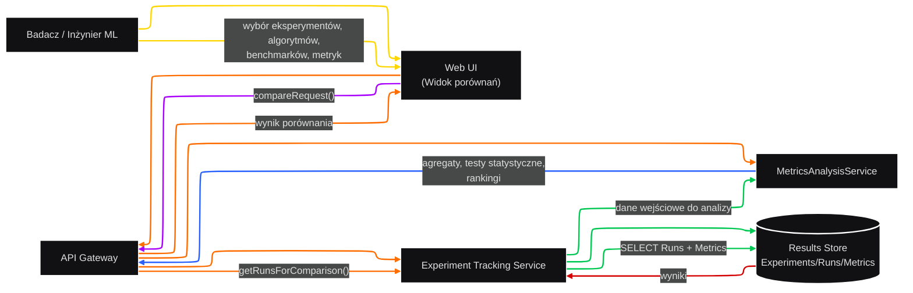
```mermaid
---
config:
  theme: redux-dark
  layout: elk
---
flowchart LR
    U["Badacz / Inżynier ML"] --> UI["Web UI\n(Widok porównań)"]
    UI --> API["API Gateway"]
    API --> TRK["Experiment Tracking Service"] & ANAL["MetricsAnalysisService"]
    TRK --> DB[("Results Store\nExperiments/Runs/Metrics")]
    U -- wybór eksperymentów, algorytmów,\nbenchmarków, metryk --> UI
    UI -- compareRequest() --> API
    API -- getRunsForComparison() --> TRK
    TRK -- SELECT Runs + Metrics --> DB
    DB -- wyniki --> TRK
    TRK -- dane wejściowe do analizy --> ANAL
    ANAL -- agregaty, testy statystyczne,\nrankingi --> API
    API -- wynik porównania --> UI
    linkStyle 0 stroke:#FFD600,fill:none
    linkStyle 1 stroke:#FF6D00,fill:none
    linkStyle 2 stroke:#FF6D00,fill:none
    linkStyle 3 stroke:#FF6D00,fill:none
    linkStyle 4 stroke:#00C853,fill:none
    linkStyle 5 stroke:#FFD600,fill:none
    linkStyle 6 stroke:#AA00FF
    linkStyle 7 stroke:#FF6D00,fill:none
    linkStyle 8 stroke:#00C853,fill:none
    linkStyle 9 stroke:#D50000,fill:none
    linkStyle 10 stroke:#00C853,fill:none
    linkStyle 11 stroke:#2962FF,fill:none
    linkStyle 12 stroke:#FF6D00,fill:none
```

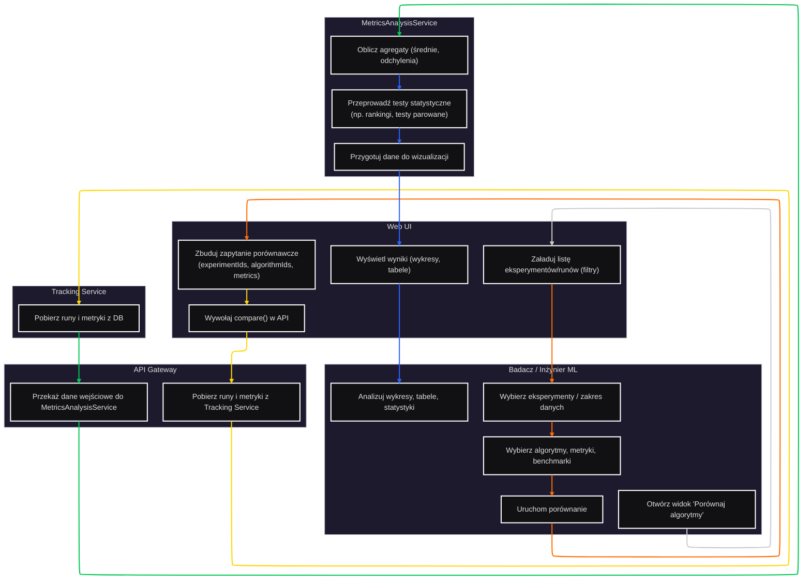
```mermaid
---
config:
  layout: elk
  theme: redux-dark
---
flowchart TB
 subgraph Swim_User["Badacz / Inżynier ML"]
        U1@{ label: "Otwórz widok 'Porównaj algorytmy'" }
        U2["Wybierz eksperymenty / zakres danych"]
        U3["Wybierz algorytmy, metryki, benchmarki"]
        U4["Uruchom porównanie"]
        U5["Analizuj wykresy, tabele, statystyki"]
  end
 subgraph Swim_UI["Web UI"]
        W1["Załaduj listę eksperymentów/runów (filtry)"]
        W2["Zbuduj zapytanie porównawcze\n(experimentIds, algorithmIds, metrics)"]
        W3["Wywołaj compare() w API"]
        W4["Wyświetl wyniki (wykresy, tabele)"]
  end
 subgraph Swim_API["API Gateway"]
        A1["Pobierz runy i metryki z Tracking Service"]
        A2["Przekaż dane wejściowe do MetricsAnalysisService"]
  end
 subgraph Swim_TRK["Tracking Service"]
        T1["Pobierz runy i metryki z DB"]
  end
 subgraph Swim_ANAL["MetricsAnalysisService"]
        M1["Oblicz agregaty (średnie, odchylenia)"]
        M2["Przeprowadź testy statystyczne\n(np. rankingi, testy parowane)"]
        M3["Przygotuj dane do wizualizacji"]
  end
    U1 --> W1
    W1 --> U2
    U2 --> U3
    U3 --> U4
    U4 --> W2
    W2 --> W3
    W3 --> A1
    A1 --> T1
    T1 --> A2
    A2 --> M1
    M1 --> M2
    M2 --> M3
    M3 --> W4
    W4 --> U5
    U1@{ shape: rect}
    linkStyle 1 stroke:#FF6D00,fill:none
    linkStyle 2 stroke:#FF6D00,fill:none
    linkStyle 3 stroke:#FF6D00,fill:none
    linkStyle 4 stroke:#FF6D00,fill:none
    linkStyle 5 stroke:#FFD600,fill:none
    linkStyle 6 stroke:#FFD600,fill:none
    linkStyle 7 stroke:#FFD600,fill:none
    linkStyle 8 stroke:#00C853,fill:none
    linkStyle 9 stroke:#00C853,fill:none
    linkStyle 10 stroke:#2962FF,fill:none
    linkStyle 11 stroke:#2962FF,fill:none
    linkStyle 12 stroke:#2962FF,fill:none
    linkStyle 13 stroke:#2962FF
```

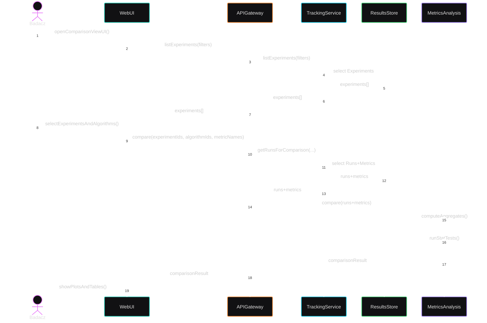
```mermaid
---
config:
  theme: redux-dark-color
---
sequenceDiagram
    autonumber
    actor User as Badacz
    participant UI as WebUI
    participant API as APIGateway
    participant TRK as TrackingService
    participant DB as ResultsStore
    participant ANAL as MetricsAnalysis
    User->>UI: openComparisonViewUI()
    UI->>API: listExperiments(filters)
    API->>TRK: listExperiments(filters)
    TRK->>DB: select Experiments
    DB-->>TRK: experiments[]
    TRK-->>API: experiments[]
    API-->>UI: experiments[]
    User->>UI: selectExperimentsAndAlgorithms()
    UI->>API: compare(experimentIds, algorithmIds, metricNames)
    API->>TRK: getRunsForComparison(...)
    TRK->>DB: select Runs+Metrics
    DB-->>TRK: runs+metrics
    TRK-->>API: runs+metrics
    API->>ANAL: compare(runs+metrics)
    ANAL->>ANAL: computeAggregates()
    ANAL->>ANAL: runStatTests()
    ANAL-->>API: comparisonResult
    API-->>UI: comparisonResult
    UI-->>User: showPlotsAndTables()
```

---

#### UC5: Przeglądaj i filtruj eksperymenty w panelu śledzenia

- **Aktorzy:**  
  - Główny: Badacz / Inżynier ML (A1), Twórca algorytmu HPO (A2)  
  - Współuczestniczący: Experiment Tracking Service  
- **Cel:**  
  - Szybkie znalezienie eksperymentów, runów, ich statusów, metryk i logów.  
- **Warunki początkowe:**  
  - Istnieją zarejestrowane eksperymenty i runy.  
- **Główny scenariusz:**
  1. Użytkownik otwiera panel śledzenia w Web UI.
  2. Web UI wysyła zapytanie do Tracking Service (lista eksperymentów).
  3. Użytkownik filtruje po tagach, czasie, benchmarkach, algorytmach, statusach.
  4. Tracking Service zwraca przefiltrowane eksperymenty i agregaty (np. liczba runów).
  5. Użytkownik wybiera konkretny eksperyment i rozwija listę runów.
  6. Użytkownik ogląda detale runu (metryki, logi, konfiguracja, linki do artefaktów).  
- **Scenariusze alternatywne / błędy:**
  - 2a. Duża liczba eksperymentów – paginacja, cache, lazy loading.
- **Warunki końcowe:**  
  - Użytkownik może efektywnie nawigować po historii eksperymentów.


```mermaid
---
config:
  theme: redux-dark
  layout: elk
---
flowchart LR
    U["Badacz / Twórca pluginu"] --> UI["Web UI\n(Panel śledzenia)"]
    UI --> API["API Gateway"] & OBJ["Object Storage\n(logi, artefakty)\n*pobieranie po linkach*"]
    API --> TRK["Experiment Tracking Service"]
    TRK --> DB[("Results Store\nExperiments/Runs/Metrics")]
    U -- filtry: tagi, status, algorytmy,\nbenchmarki, daty --> UI
    UI -- listExperiments(filters) --> API
    API -- listExperiments(filters) --> TRK
    TRK -- SELECT Experiments --> DB
    DB -- lista eksperymentów --> TRK
    TRK -- "experiments[] + agregaty (liczba runów itp.)" --> API
    API -- experiments[] --> UI
    U -- kliknięcie w eksperyment/run --> UI
    UI -- getRunDetails(runId) --> API
    API -- getRunDetails(runId) --> TRK
    TRK -- SELECT Run, Metrics --> DB
    DB -- Run + Metrics --> TRK
    TRK -- Run + Metrics + links do artefaktów --> API
    API -- dane runu --> UI
    UI -- pobranie logów/artefaktów\npo URL --> OBJ
    linkStyle 1 stroke:#FF6D00,fill:none
    linkStyle 2 stroke:#FF6D00,fill:none
    linkStyle 3 stroke:#FFD600,fill:none
    linkStyle 4 stroke:#AA00FF,fill:none
    linkStyle 6 stroke:#FF6D00,fill:none
    linkStyle 7 stroke:#FFD600,fill:none
    linkStyle 8 stroke:#AA00FF,fill:none
    linkStyle 9 stroke:#D50000
    linkStyle 10 stroke:#2962FF,fill:none
    linkStyle 11 stroke:#00C853,fill:none
    linkStyle 13 stroke:#FF6D00,fill:none
    linkStyle 14 stroke:#FFD600,fill:none
    linkStyle 15 stroke:#AA00FF,fill:none
    linkStyle 16 stroke:#D50000,fill:none
    linkStyle 17 stroke:#2962FF,fill:none
    linkStyle 18 stroke:#00C853,fill:none
    linkStyle 19 stroke:#FF6D00,fill:none
```

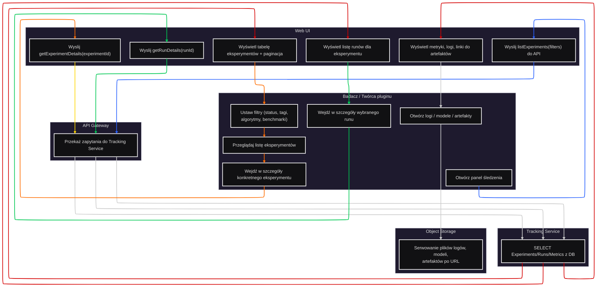
```mermaid
---
config:
  layout: elk
  theme: redux-dark
---
flowchart TB
 subgraph Swim_User["Badacz / Twórca pluginu"]
        U1["Otwórz panel śledzenia"]
        U2["Ustaw filtry (status, tagi,\nalgorytmy, benchmarki)"]
        U3["Przeglądaj listę eksperymentów"]
        U4["Wejdź w szczegóły konkretnego eksperymentu"]
        U5["Wejdź w szczegóły wybranego runu"]
        U6["Otwórz logi / modele / artefakty"]
  end
 subgraph Swim_UI["Web UI"]
        W1["Wyslij listExperiments(filters) do API"]
        W2["Wyświetl tabelę eksperymentów + paginacja"]
        W3["Wyslij getExperimentDetails(experimentId)"]
        W4["Wyświetl listę runów dla eksperymentu"]
        W5["Wyslij getRunDetails(runId)"]
        W6["Wyświetl metryki, logi, linki do artefaktów"]
  end
 subgraph Swim_API["API Gateway"]
        A1["Przekaż zapytania do Tracking Service"]
  end
 subgraph Swim_TRK["Tracking Service"]
        T1["SELECT Experiments/Runs/Metrics z DB"]
  end
 subgraph Swim_OBJ["Object Storage"]
        O1["Serwowanie plików logów, modeli,\nartefaktów po URL"]
  end
    U1 --> W1
    W1 --> A1
    A1 --> T1 & T1 & T1
    T1 --> W2 & W4 & W6
    W2 --> U2
    U2 --> U3
    U3 --> U4
    U4 --> W3
    W3 --> A1
    W4 --> U5
    U5 --> W5
    W5 --> A1
    W6 --> U6
    U6 --> O1
    linkStyle 0 stroke:#2962FF,fill:none
    linkStyle 1 stroke:#2962FF,fill:none
    linkStyle 5 stroke:#D50000,fill:none
    linkStyle 6 stroke:#D50000,fill:none
    linkStyle 7 stroke:#D50000,fill:none
    linkStyle 8 stroke:#FF6D00,fill:none
    linkStyle 9 stroke:#FF6D00,fill:none
    linkStyle 10 stroke:#FF6D00,fill:none
    linkStyle 11 stroke:#FF6D00,fill:none
    linkStyle 12 stroke:#FFD600,fill:none
    linkStyle 13 stroke:#00C853,fill:none
    linkStyle 14 stroke:#00C853,fill:none
    linkStyle 15 stroke:#00C853
```

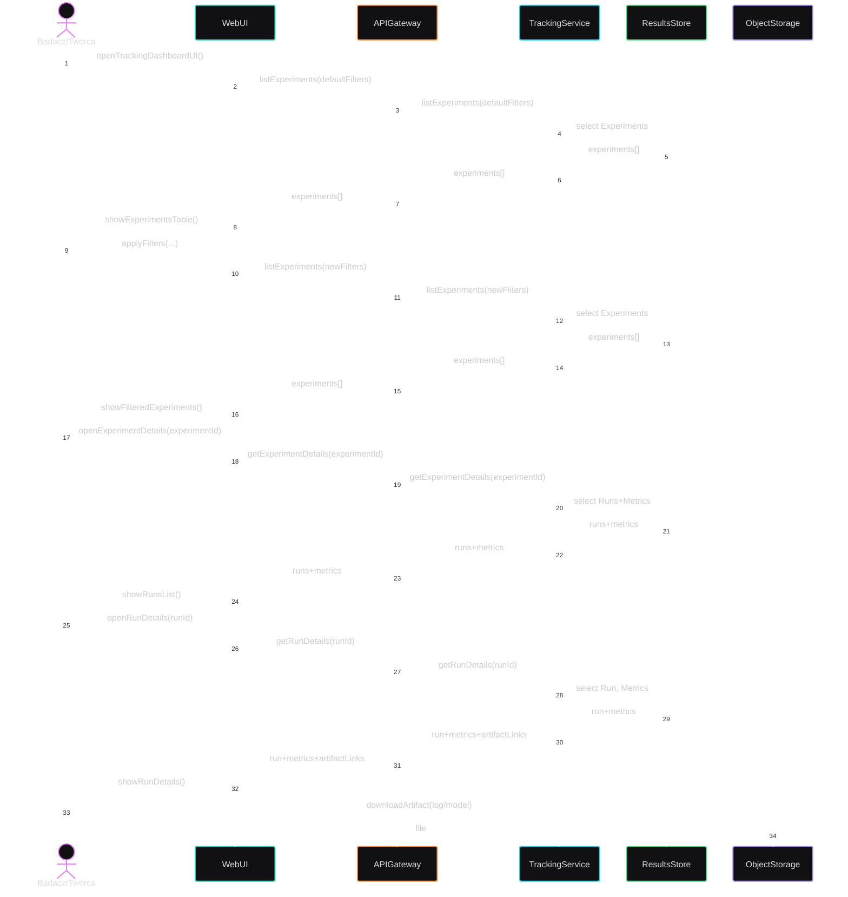
```mermaid
---
config:
  theme: redux-dark-color
---
sequenceDiagram
    autonumber
    actor User as Badacz/Twórca
    participant UI as WebUI
    participant API as APIGateway
    participant TRK as TrackingService
    participant DB as ResultsStore
    participant OBJ as ObjectStorage
    User->>UI: openTrackingDashboardUI()
    UI->>API: listExperiments(defaultFilters)
    API->>TRK: listExperiments(defaultFilters)
    TRK->>DB: select Experiments
    DB-->>TRK: experiments[]
    TRK-->>API: experiments[]
    API-->>UI: experiments[]
    UI-->>User: showExperimentsTable()
    User->>UI: applyFilters(...)
    UI->>API: listExperiments(newFilters)
    API->>TRK: listExperiments(newFilters)
    TRK->>DB: select Experiments
    DB-->>TRK: experiments[]
    TRK-->>API: experiments[]
    API-->>UI: experiments[]
    UI-->>User: showFilteredExperiments()
    User->>UI: openExperimentDetails(experimentId)
    UI->>API: getExperimentDetails(experimentId)
    API->>TRK: getExperimentDetails(experimentId)
    TRK->>DB: select Runs+Metrics
    DB-->>TRK: runs+metrics
    TRK-->>API: runs+metrics
    API-->>UI: runs+metrics
    UI-->>User: showRunsList()
    User->>UI: openRunDetails(runId)
    UI->>API: getRunDetails(runId)
    API->>TRK: getRunDetails(runId)
    TRK->>DB: select Run, Metrics
    DB-->>TRK: run+metrics
    TRK-->>API: run+metrics+artifactLinks
    API-->>UI: run+metrics+artifactLinks
    UI-->>User: showRunDetails()
    User->>OBJ: downloadArtifact(log/model)  
    OBJ-->>User: file
```

---

#### UC6: Zarządzaj referencjami do artykułów i powiąż je z algorytmami / eksperymentami

- **Aktorzy:**  
  - Główny: Badacz / Inżynier ML (A1), Administrator (A3)  
  - Współuczestniczący: PublicationService, Algorithm Registry, Experiment Tracking  
- **Cel:**  
  - Utrzymywanie bazy publikacji oraz powiązań z obiektami systemu (algorytmy, benchmarki, eksperymenty).  
- **Warunki początkowe:**  
  - Użytkownik jest zalogowany, ma odpowiednie uprawnienia.  
- **Główny scenariusz:**
  1. Użytkownik otwiera moduł „Publikacje” w Web UI.
  2. Użytkownik dodaje nową publikację, podając DOI lub dane ręcznie.
  3. Publication Service, jeśli jest DOI, pobiera metadane z zewnętrznego systemu.
  4. Użytkownik zapisuje publikację.
  5. Użytkownik wybiera algorytm/benchmark/eksperyment i dodaje do niego referencję (link PublicationLink).
  6. System zapisuje powiązanie i aktualizuje widoki (np. w katalogu algorytmów pokazuje „powiązane publikacje”).  
- **Scenariusze alternatywne / błędy:**
  - 3a. DOI nie zostaje odnalezione – użytkownik uzupełnia dane ręcznie.
- **Warunki końcowe:**  
  - Publikacje są dostępne w systemie i poprawnie powiązane z artefaktami benchmarku.

```mermaid
---
config:
  theme: redux-dark
  layout: elk
---
flowchart LR
    U["Badacz / Administrator"] --> UI@{ label: "Web UI\\n(Moduł 'Publikacje')" }
    UI --> API["API Gateway"]
    API --> PUB["PublicationService"] & REG["Algorithm Registry"] & TRK["Tracking Service"]
    PUB --> DBPUB[("Results Store\nPublication/PublicationLink")] & BIB["Zewnętrzne systemy bibliograficzne\n(CrossRef / arXiv / DOI)"]
    U -- DOI / dane publikacji --> UI
    UI -- "addPublication(doi/...)" --> API
    API -- addPublication() --> PUB
    PUB -- fetch metadata --> BIB
    BIB -- metadata --> PUB
    PUB -- INSERT Publication --> DBPUB
    U -- powiąż publikację z algorytmem,\nbenchmarkiem, eksperymentem --> UI
    UI -- linkPublication(entityType, entityId, pubId) --> API
    API -- "linkPublication(...)" --> PUB
    PUB -- INSERT PublicationLink --> DBPUB
    REG -. odczyt linków publikacji\nprzy widoku algorytmów .-> DBPUB
    TRK -. odczyt linków publikacji\nprzy widoku eksperymentów .-> DBPUB
    UI@{ shape: rect}
    linkStyle 5 stroke:#FF6D00,fill:none
    linkStyle 6 stroke:#FF6D00,fill:none
    linkStyle 10 stroke:#FF6D00,fill:none
    linkStyle 11 stroke:#00C853
    linkStyle 12 stroke:#FF6D00,fill:none
    linkStyle 16 stroke:#FF6D00,fill:none
```

```mermaid
---
config:
  layout: elk
  theme: redux-dark
---
flowchart TB
 subgraph Swim_User["Badacz / Administrator"]
        U1@{ label: "Otwórz moduł 'Publikacje'" }
        U2["Wprowadź DOI lub dane publikacji"]
        U3["Zatwierdź dodanie publikacji"]
        U4["Wybierz algorytm / benchmark / eksperyment"]
        U5["Dodaj powiązanie z wybraną publikacją"]
  end
 subgraph Swim_UI["Web UI"]
        W1["Wyświetl listę publikacji"]
        W2["Wyświetl formularz dodawania publikacji"]
        W3["Wyślij addPublication() do API"]
        W4["Wyświetl listę obiektów do powiązania\n(algorytmy, benchmarki, eksperymenty)"]
        W5["Wyślij linkPublication() do API"]
  end
 subgraph Swim_API["API Gateway"]
        A1["Przekaż żądania do Publication Service"]
  end
 subgraph Swim_PUB["Publication Service"]
        P1["Jeśli jest DOI: pobierz metadane\nz systemu bibliograficznego"]
        P2["Zapisz Publication w DB"]
        P3["Zapisz PublicationLink(entityType, entityId, pubId)"]
  end
 subgraph Swim_BIB["Zewnętrzne systemy bibliograficzne"]
        B1["Zapytanie o publikację po DOI"]
  end
    U1 --> W1
    W1 --> U2
    U2 --> W2
    W2 --> U3
    U3 --> W3
    W3 --> A1
    A1 --> P1 & P3
    P1 --> B1
    B1 --> P2
    P2 --> W1
    U4 --> W4
    W4 --> U5
    U5 --> W5
    W5 --> A1
    P3 --> W4
    U1@{ shape: rect}
    linkStyle 1 stroke:#2962FF,fill:none
    linkStyle 2 stroke:#2962FF,fill:none
    linkStyle 3 stroke:#2962FF,fill:none
    linkStyle 4 stroke:#2962FF,fill:none
    linkStyle 5 stroke:#2962FF,fill:none
    linkStyle 6 stroke:#FF6D00,fill:none
    linkStyle 7 stroke:#00C853,fill:none
    linkStyle 8 stroke:#FF6D00,fill:none
    linkStyle 9 stroke:#FF6D00,fill:none
    linkStyle 10 stroke:#FF6D00,fill:none
    linkStyle 11 stroke:#AA00FF
    linkStyle 12 stroke:#FFD600,fill:none
    linkStyle 13 stroke:#FFD600,fill:none
    linkStyle 14 stroke:#FFD600,fill:none
    linkStyle 15 stroke:#00C853,fill:none
```

```mermaid
---
config:
  theme: redux-dark-color
---
sequenceDiagram
    autonumber
    actor User as Badacz/Admin
    participant UI as WebUI
    participant API as APIGateway
    participant PUB as PublicationService
    participant BIB as ExternalBibliography
    participant DB as ResultsStore
    User->>UI: openPublicationsModule()
    UI->>API: listPublications()
    API->>PUB: listPublications()
    PUB->>DB: select Publications
    DB-->>PUB: publications[]
    PUB-->>API: publications[]
    API-->>UI: publications[]
    UI-->>User: showPublications()
    User->>UI: addPublication(doi)
    UI->>API: addPublication(doi)
    API->>PUB: addPublication(doi)
    PUB->>BIB: fetchMetadata(doi)
    BIB-->>PUB: metadata
    PUB->>DB: insert Publication
    DB-->>PUB: ok
    PUB-->>API: publicationCreated(pubId)
    API-->>UI: publicationCreated(pubId)
    UI-->>User: showNewPublication()
    User->>UI: linkPublicationToAlgorithm(pubId, algorithmId)
    UI->>API: linkPublication(entityType="Algorithm", entityId=algorithmId, pubId)
    API->>PUB: createPublicationLink(...)
    PUB->>DB: insert PublicationLink
    DB-->>PUB: ok
    PUB-->>API: linkCreated()
    API-->>UI: linkCreated()
    UI-->>User: showLinkedPublication()
```

--- 

#### UC7: Uruchom system lokalnie na PC

**Aktorzy główni:**
- Administrator (Primary)

**Aktorzy poboczni:**
- Docker Engine / środowisko kontenerowe
- Komponenty systemu (DB, Message Broker, API/Orchestrator, Tracking Service, Worker Runtime, Web UI, Monitoring)

**Cel:**
Uruchomienie kompletnego systemu benchmarkowego HPO na pojedynczym komputerze (tryb „local deployment”), w konfiguracji opartej na `docker-compose` lub równoważnej, tak aby wszystkie funkcjonalności (eksperymenty, tracking, raporty) były dostępne na jednym hoście.

**Warunki początkowe:**
- Na PC zainstalowany jest Docker / Docker Desktop lub kompatybilne środowisko kontenerowe.
- Administrator ma dostęp do repozytorium z konfiguracją systemu (np. git) lub paczki zawierającej pliki `docker-compose.yml`, `.env` itp.
- Porty lokalne wymagane przez system (UI, API, DB) są wolne lub odpowiednio skonfigurowane.

**Główny scenariusz:**
1. Administrator klonuje repozytorium / pobiera paczkę z konfiguracją systemu na PC.
2. Administrator otwiera plik `.env` i konfiguruje podstawowe parametry:
   - Porty publikowane (np. 8080 dla UI),
   - Ścieżki do wolumenów (np. katalog na dane DB),
   - Dane dostępowe (hasła do DB itp.).
3. Administrator uruchamia w terminalu polecenie `docker-compose up -d` (lub równoważne skryptem).
4. Docker Engine:
   - 4.1. Wczytuje plik `docker-compose.yml` i `.env`,
   - 4.2. Tworzy potrzebne sieci i wolumeny,
   - 4.3. Uruchamia kontenery systemu:
     - bazę danych (Results Store),
     - message broker,
     - API Gateway + Orchestrator,
     - Experiment Tracking Service,
     - jednego lub więcej Worker Runtime,
     - Web UI,
     - Monitoring / Logging (opcjonalnie).
5. Po starcie kontenerów:
   - 5.1. Kontener DB inicjalizuje się i nasłuchuje na połączenia,
   - 5.2. Message Broker uruchamia kolejki (np. RunJob),
   - 5.3. API Gateway + usługi domenowe (Tracking, Benchmark Definition, Algorithm Registry) łączą się z DB i Brokerem,
   - 5.4. Tracking Service wykonuje migracje schematu bazy danych,
   - 5.5. Workery rejestrują się (subskrybują kolejkę RunJob),
   - 5.6. Web UI uruchamia serwer HTTP i jest dostępny pod adresem `http://localhost:<PORT>`.
6. Administrator sprawdza status kontenerów poprzez:
   - 6.1. `docker ps` / logi kontenerów,
   - 6.2. ewentualnie endpointy health-check (np. `/healthz` dla API).
7. Administrator otwiera Web UI w przeglądarce (`http://localhost:<PORT>`).
8. System wyświetla stronę logowania / ekran główny, sygnalizując gotowość do pracy.

**Scenariusze alternatywne / błędy:**

- **7A. Brak Dockera lub błędna instalacja**
  1. W kroku 3 wywołanie `docker-compose` kończy się błędem (komenda nieznana lub brak uprawnień).
  2. Administrator instaluję lub naprawia Dockera (poza zakresem systemu HPO).
  3. Po naprawie wraca do kroku 3.

- **7B. Konflikt portów**
  1. W kroku 4 Docker zgłasza błąd, że port UI/API jest już w użyciu.
  2. Administrator modyfikuje plik `.env` / `docker-compose.yml`, zmieniając porty.
  3. Ponownie uruchamia `docker-compose up -d` (wraca do kroku 3/4).

- **7C. Błąd startu jednego z kontenerów (np. DB)**
  1. W kroku 5 logi kontenera wskazują na błąd (np. brak uprawnień do katalogu danych).
  2. Administrator analizuje logi, poprawia konfigurację (np. prawa do katalogu, zmiana ścieżki wolumenu).
  3. Restartuje konkretny kontener lub cały stos (wraca do kroku 3–4).

**Warunki końcowe:**
- W przypadku sukcesu:
  - Na PC działa pełny zestaw kontenerów systemu HPO.
  - Web UI jest dostępny lokalnie i umożliwia tworzenie eksperymentów, śledzenie runów, analizę wyników.
- W przypadku błędu:
  - System nie jest w pełni dostępny, ale konfiguracja nie jest trwale uszkodzona – po poprawkach (porty, wolumeny, Docker) można powtórzyć procedurę startu.

```mermaid
---
config:
  theme: redux-dark
  layout: elk
---
flowchart LR
    Admin["Administrator"] --> Repo["Repozytorium / paczka\n(konfiguracja docker-compose, .env)"] & Shell["Shell / Terminal"]
    Repo --> FS["System plików PC"]
    Shell --> Docker["Docker Engine / docker-compose"]

    Docker --> C_DB["Kontener DB\n(Results Store)"] & C_MB["Kontener Message Broker"] & C_API["Kontener API Gateway + Orchestrator"] & C_TRK["Kontener Tracking Service"] & C_W["Kontener(y) Worker Runtime"] & C_UI["Kontener Web UI"] & C_MON["Kontener Monitoring / Logging"]

    %% POPRAWIONE POŁĄCZENIA
    %% API/Orchestrator NIE łączy się z DB – tylko z usługami i brokerem
    C_API --> C_TRK
    C_API --> C_MB

    %% Tracking Service rozmawia z DB – to on jest „frontem” do Results Store
    C_TRK --> C_DB

    %% Workery gadają z brokerem i Trackingiem (logowanie runów)
    C_W --> C_MB 
    C_W --> C_TRK

    %% Monitoring może czytać z DB (metryki, logi) – zostawiam jak było
    C_MON --> C_DB

    Admin -- git clone / pobranie archiwum --> Repo
    Admin -- "docker-compose up -d" --> Shell
    Shell -- tworzenie sieci, wolumenów,\nuruchamianie kontenerów --> Docker
```

```mermaid
---
config:
  theme: redux-dark
  layout: elk
---
flowchart TB
 subgraph Swim_Admin["Administrator (na PC)"]
        A1["Sklonuj repozytorium / pobierz paczkę\nz konfiguracją (docker-compose, .env)"]
        A2["Skonfiguruj plik .env\n(porty, ścieżki, hasła lokalne)"]
        A3@{ label: "Uruchom 'docker-compose up -d'" }
        A4["Sprawdź status kontenerów\n(docker ps / logi)"]
        A5["Otwórz Web UI w przeglądarce"]
  end
 subgraph Swim_Host["Host PC / Docker"]
        H1["Odczytaj docker-compose.yml i .env"]
        H2["Utwórz sieci i wolumeny Dockera"]
        H3["Uruchom kontenery:\nDB, Broker, API/Orch, Tracking, Workers, UI, Monitoring"]
        H4["Wykonaj healthchecki\n(API /healthz, DB ready itp.)"]
  end
 subgraph Swim_System["Kontenery systemu HPO"]
        S1["DB startuje i jest gotowa na połączenia"]
        S2["Message Broker startuje\n(kolejka RunJob)"]
        S3["API/Orchestrator startuje\n(łączenie z DB i Brokerem)"]
        S4["Tracking Service uruchamia migracje schematu"]
        S5["Workers startują i rejestrują się\n(subskrypcja kolejki)"]
        S6["Web UI startuje i jest dostępne\nna localhost:port"]
  end
    A1 --> A2
    A2 --> A3
    A3 --> H1
    H1 --> H2
    H2 --> H3
    H3 --> H4 & S1
    H4 --> A4
    A4 --> A5
    S1 --> S2
    S2 --> S3
    S3 --> S4
    S4 --> S5
    S5 --> S6
    A3@{ shape: rect}
    linkStyle 0 stroke:#FF6D00,fill:none
    linkStyle 1 stroke:#FF6D00,fill:none
    linkStyle 2 stroke:#FF6D00,fill:none
    linkStyle 3 stroke:#FF6D00,fill:none
    linkStyle 4 stroke:#FF6D00,fill:none
    linkStyle 5 stroke:#FFD600,fill:none
    linkStyle 7 stroke:#FFD600,fill:none
    linkStyle 8 stroke:#FFD600
```

```mermaid
---
config:
  theme: redux-dark-color
---
sequenceDiagram
    autonumber
    actor Admin as Administrator
    participant Repo as Repo (config)
    participant FS as FileSystem
    participant Shell as Shell / CLI
    participant Docker as Docker Engine
    participant DB as DB Container
    participant MB as Broker Container
    participant API as API/Orchestrator Container
    participant TRK as Tracking Container
    participant W as Worker Container
    participant UI as WebUI Container
    Admin->>Repo: cloneConfigRepo()
    Repo-->>Admin: docker-compose.yml, .env
    Admin->>FS: edit(.env)
    FS-->>Admin: saved .env
    Admin->>Shell: docker-compose up -d
    Shell->>Docker: start(stack)
    Docker->>DB: start()
    Docker->>MB: start()
    Docker->>API: start()
    Docker->>TRK: start()
    Docker->>W: start()
    Docker->>UI: start()
    API->>DB: connect()
    TRK->>DB: migrateSchema()
    W->>MB: subscribe(runJobQueue)
    Admin->>Shell: docker ps / docker logs
    Shell-->>Admin: status containers
    Admin->>UI: open http://localhost:PORT
    UI-->>Admin: render login / main page
```


#### UC8: Uruchom system w chmurze / skaluj workerów

**Aktorzy główni:**
- Administrator DevOps (Primary)

**Aktorzy poboczni:**
- CI/CD / GitOps (np. GitHub Actions, ArgoCD)
- Kubernetes (API, Scheduler, HPA)
- Monitoring / Metrics (Prometheus, itp.)

**Cel:**
Uruchomienie systemu HPO Benchmarking w środowisku chmurowym (np. klaster Kubernetes) w sposób skalowalny – z możliwością automatycznego poziomego skalowania workerów w zależności od obciążenia (np. długości kolejki RunJob, użycia CPU).

**Warunki początkowe:**
- Istnieje klaster Kubernetes (managed lub self-hosted).
- Repozytorium z manifestami / chartami Helm systemu HPO jest dostępne.
- Administrator DevOps ma dostęp do klastra (kubeconfig) i/lub skonfigurowany pipeline CI/CD / GitOps.
- Monitoring i metryki są dostępne (np. Prometheus, Metrics Server) lub przewidziane w manifestach.

**Główny scenariusz:**
1. Administrator DevOps przygotowuje konfigurację chmurową (np. plik `values-cloud.yaml` dla Helma):
   - Informacje o adresach usług zarządzanych (DB, Message Broker, Object Storage),
   - Limity zasobów dla podów (CPU, RAM),
   - Konfigurację HPA dla Workerów (min/max replik, metryki).
2. Administrator commit’uje zmiany konfiguracji do repozytorium.
3. CI/CD / GitOps:
   - 3.1. Wykrywa zmiany w repozytorium,
   - 3.2. Uruchamia pipeline wdrożeniowy (np. `helm upgrade` / `kubectl apply`).
4. Pipeline wysyła manifesty / chart do Kubernetes API.
5. Kubernetes:
   - 5.1. Tworzy / aktualizuje Deploymenty i Service’y dla:
     - API Gateway + Orchestrator,
     - Experiment Tracking Service,
     - Worker Runtime (Deployment Workerów),
     - Web UI,
     - ewentualnie Monitoring / Logging.
   - 5.2. Upewnia się, że konfiguracja (ConfigMap, Secrets) jest wstrzyknięta do podów.
6. Pody startują:
   - 6.1. API/Orchestrator łączy się z zarządzaną DB i Brokerem,
   - 6.2. Tracking Service wykonuje migracje,
   - 6.3. Worker Runtime rejestruje się i subskrybuje kolejkę zadań,
   - 6.4. Web UI jest wystawiony przez Ingress / LoadBalancer.
7. Monitoring / Prometheus:
   - 7.1. Zbiera metryki z podów (API, Tracking, Worker),
   - 7.2. Udostępnia je dla HPA.
8. Kontroler HPA:
   - 8.1. Okresowo odczytuje metryki (np. CPU, length of RunJob queue),
   - 8.2. W razie potrzeby zwiększa liczbę replik Deploymentu Workerów,
   - 8.3. Gdy obciążenie spada – zmniejsza liczbę replik w granicach `min/max`.
9. Administrator DevOps monitoruje stan klastra (np. `kubectl get pods`, dashboardy) i potwierdza, że system działa poprawnie.

**Scenariusze alternatywne / błędy:**

- **8A. Błąd w konfiguracji chmurowej (values-cloud.yaml / manifesty)**
  1. W kroku 3 pipeline CI/CD kończy się błędem (np. niepoprawny YAML).
  2. Administrator analizuje logi pipeline’u, poprawia konfigurację.
  3. Ponownie commit’uje zmiany i wraca do kroku 3.

- **8B. Problemy z zasobami klastra**
  1. W kroku 5 Kubernetes nie może uruchomić części podów (brak CPU/RAM).
  2. Pody pozostają w stanie `Pending`.
  3. Administrator powiększa zasoby klastra lub zmniejsza wymagania podów.
  4. Po zmianach pody startują poprawnie.

- **8C. HPA nie skaluje Workerów**
  1. W kroku 7–8 HPA nie podejmuje akcji, bo nie widzi metryk (np. brak Prometheusa / Metrics Server).
  2. Administrator konfiguruje / naprawia monitoring (wdrożenie Prometheusa/adaptera).
  3. Po naprawie HPA zaczyna reagować na obciążenie.

**Warunki końcowe:**
- W przypadku sukcesu:
  - System HPO działa w klastrze Kubernetes, dostępny przez Web UI/Ingress,
  - Worker Runtime’y są automatycznie skalowane na podstawie metryk,
  - System jest gotowy do uruchamiania eksperymentów w skali.
- W przypadku błędów:
  - Wdrożenie może być częściowe (np. część usług nie działa),
  - Zespół DevOps ma logi i manifesty do korekty, po której można powtórzyć procedurę.

```mermaid
---
config:
  layout: elk
  theme: redux-dark
---
flowchart LR
    Admin["Administrator DevOps"] --> Repo["Repozytorium\n(Helm charts / manifesty K8s)"]
    Repo --> CI["CI/CD / GitOps"]
    CI --> K8SAPI["Kubernetes API"]
    K8SAPI --> NS["Namespace: hpo-benchmark"]
    NS --> DEP_API["Deployment API/Orchestrator"] & DEP_TRK["Deployment Tracking Service"] & DEP_W["Deployment Workers"] & DEP_UI["Deployment WebUI"] & ST_DB[("Managed DB\n(Results Store)")] & ST_OBJ[("Object Storage\n(S3/GCS/MinIO)")] & ST_MB[("Managed Message Broker")] & MON["Monitoring / Prometheus / Grafana"]
    HPA["Horizontal Pod Autoscaler"] --> DEP_W
    Admin -- "helm install/upgrade\nvalues-cloud.yaml" --> CI
    CI -- apply manifests / helm upgrade --> K8SAPI
    DEP_API --> ST_DB
    DEP_TRK --> ST_DB
    DEP_W --> ST_MB & ST_OBJ
```

```mermaid
---
config:
  theme: redux-dark
  layout: elk
---
flowchart TB
 subgraph DevOps["Administrator DevOps"]
        A1["Przygotuj konfigurację chmurową\n(values-cloud.yaml / manifests)"]
        A2["Zacommituj zmiany do repo"]
        A3@{ label: "Uruchom 'helm install/upgrade'\\nlub poczekaj na GitOps" }
        A4["Skonfiguruj HPA dla Workerów\n(np. min=1, max=50)"]
        A5["Monitoruj metryki obciążenia\n(kolejka, CPU, czas oczekiwania runów)"]
  end
 subgraph CI["CI/CD / GitOps"]
        C1["Wykryj zmianę w repo"]
        C2["Zastosuj zmiany do klastra\n(kubectl apply / helm upgrade)"]
  end
 subgraph K8s["Kubernetes"]
        K1["Tworzenie / aktualizacja Deploymentów,\nService, Ingress, ConfigMap, Secret"]
        K2["Uruchamianie podów\n(API, Tracking, Workers, WebUI, Broker)"]
        K3["HPA pobiera metryki z Prometheus\nlub Metrics Server"]
        K4["HPA skaluje Deployment Workers\n(liczba replik)"]
  end
 subgraph Monitoring["Monitoring / Prometheus"]
        M1["Zbieranie metryk z podów\n(API, Tracking, Workers)"]
  end
    A1 --> A2
    A2 --> C1
    C1 --> C2
    C2 --> K1
    K1 --> K2
    A3 --> C2
    K2 --> M1
    M1 --> K3
    K3 --> K4
    K4 --> A4
    A4 --> A5
    A3@{ shape: rect}
    linkStyle 0 stroke:#FF6D00,fill:none
    linkStyle 1 stroke:#FF6D00,fill:none
    linkStyle 2 stroke:#FF6D00,fill:none
    linkStyle 3 stroke:#FFD600,fill:none
    linkStyle 4 stroke:#FFD600,fill:none
    linkStyle 5 stroke:#00C853
    linkStyle 6 stroke:#FFD600,fill:none
    linkStyle 7 stroke:#FFD600,fill:none
    linkStyle 8 stroke:#FFD600,fill:none
    linkStyle 9 stroke:#FFD600,fill:none
    linkStyle 10 stroke:#FFD600,fill:none
```

```mermaid
---
config:
  theme: redux-dark-color
---
sequenceDiagram
    autonumber
    actor DevOps as Admin DevOps
    participant Repo as Git Repo
    participant CI as CI/GitOps
    participant K8s as KubernetesAPI
    participant DEP_API as Deployment API/Orch
    participant DEP_TRK as Deployment Tracking
    participant DEP_W as Deployment Workers
    participant HPA as HPA Controller
    participant METRICS as Monitoring/Prometheus
    DevOps->>Repo: push(config changes)
    Repo-->>CI: webhook / trigger
    CI->>K8s: apply/helm upgrade (API, TRK, Workers, WebUI)
    K8s-->>DEP_API: create/update pods
    K8s-->>DEP_TRK: create/update pods
    K8s-->>DEP_W: create/update worker pods
    DEP_API->>METRICS: expose metrics
    DEP_TRK->>METRICS: expose metrics
    DEP_W->>METRICS: expose metrics
    loop continuous
        HPA->>METRICS: getMetrics(CPU, queue length)
        METRICS-->>HPA: metrics
        HPA->>K8s: scale(DEP_W, replicasN)
    end
    DevOps->>K8s: kubectl get pods
    K8s-->>DevOps: statusRunning()
```

--- 

#### UC9: Wygeneruj raport z eksperymentu

**Aktor główny:** Użytkownik (Data Scientist / Researcher)  
**Aktorzy systemowi:**  
- Web UI  
- Report Generator Service (ReportGenerator) 
- Experiment Tracking Service
- Results Store

**Cel:** Wygenerowanie raportu z wybranego eksperymentu (lub zestawu eksperymentów)
w jednym z obsługiwanych formatów (np. HTML, PDF, LaTeX).

#### Scenariusz główny

1. Użytkownik w Web UI wybiera eksperyment (lub eksperymenty), dla którego chce wygenerować raport.
2. Użytkownik wybiera typ raportu (szablon, poziom szczegółowości, format wyjściowy).
3. Web UI wywołuje API **Report Generator Service** (ReportGenerator) z identyfikatorem eksperymentu(ów)
   oraz parametrami raportu.
4. Report Generator Service (ReportGenerator) pobiera metadane eksperymentu z **Experiment Tracking Service**.
5. Report Generator Service (ReportGenerator) pobiera wyniki, metryki i artefakty z **Results Store**
   oraz dane z usług analitycznych (np. MetricsAnalysisService, LineageTracker).
6. Report Generator Service (ReportGenerator) składa dane w wewnętrzny model raportu i renderuje go
   do wybranego formatu (HTML/PDF/LaTeX).
7. Po zakończeniu generowania Report Generator Service (ReportGenerator) udostępnia raport pod
   adresem URL lub jako załącznik do pobrania i zwraca odpowiedź do Web UI.
8. Web UI prezentuje użytkownikowi link / przycisk „Pobierz raport” lub otwiera
   raport w nowej karcie.
9. Użytkownik pobiera raport lub przegląda go w przeglądarce.

#### Scenariusze alternatywne

9A. Błąd podczas generowania raportu (np. brak danych w Results Store):
1. Report Generator Service (ReportGenerator) loguje błąd oraz zwraca do Web UI komunikat o niepowodzeniu
   wraz z komunikatem diagnostycznym (o ile możliwe).
2. Web UI wyświetla użytkownikowi czytelny komunikat o błędzie i ewentualne sugestie
   (np. sprawdzenie, czy eksperyment został poprawnie zakończony).

```mermaid
---
config:
  layout: elk
  theme: redux-dark
---
flowchart LR
    U["Badacz / Inżynier ML"] --> UI["Web UI\n(Moduł eksportu)"]
    UI --> API["API Gateway"]
    API --> TRK["Experiment Tracking Service"] & REP["Export / ReportGenerator Service"]
    TRK --> DB[("Results Store\nExperiments / Runs / Metrics")]
    REP --> OBJ[("Object Storage\n(pliki eksportu)")] & DB
    U -- wybór zakresu: eksperymenty,\nruny, metryki, format (CSV/JSON/Parquet) --> UI
    UI -- exportData(scope, filters, format) --> API
    API -- fetchData(scope, filters) --> TRK
    TRK -- zapytania SQL/ORM --> DB
    DB -- zestaw danych --> TRK
    TRK -- zestaw danych --> REP
    REP -- agregacja, transformacja,\nformatowanie --> OBJ
    OBJ -- URL pliku eksportu --> REP
    REP -- fileUrl --> API
    API -- fileUrl --> UI
    UI -- pobieranie pliku --> U
    linkStyle 1 stroke:#2962FF,fill:none
    linkStyle 2 stroke:#FFD600,fill:none
    linkStyle 3 stroke:#FFD600,fill:none
    linkStyle 5 stroke:#FF6D00,fill:none
    linkStyle 6 stroke:#FF6D00,fill:none
    linkStyle 8 stroke:#00C853,fill:none
    linkStyle 9 stroke:#FFD600,fill:none
    linkStyle 11 stroke:#424242
    linkStyle 13 stroke:#FF6D00,fill:none
    linkStyle 15 stroke:#AA00FF,fill:none
    linkStyle 16 stroke:#FFD600,fill:none
```

```mermaid
---
config:
  layout: elk
  theme: redux-dark
---
flowchart TB
 subgraph User["Badacz / Inżynier ML"]
        U1@{ label: "Otwórz moduł 'Eksport danych'" }
        U2["Wybierz zakres eksportu\n(eksperymenty, runy, metryki)"]
        U3["Ustaw filtry (daty, benchmarki,\nalgorytmy, tagi)"]
        U4["Wybierz format (CSV/JSON/Parquet)"]
        U5@{ label: "Kliknij 'Generuj eksport'" }
        U6["Pobierz wygenerowany plik\nlub skopiuj link"]
  end
 subgraph WebUI["Web UI"]
        W1["Załaduj formularz eksportu z możliwymi opcjami"]
        W2["Waliduj dane wejściowe użytkownika"]
        W3["Wyślij exportData(scope, filters, format) do API"]
        W4["Prezentuj status (oczekuje / gotowy)"]
        W5["Wyświetl link do pliku eksportu"]
  end
 subgraph API["API Gateway / Export API"]
        A1["Przyjmij żądanie eksportu"]
        A2["Przekaż zadanie do ReportGenerator"]
  end
 subgraph TRK["Tracking Service / DB"]
        T1["Pobierz eksperymenty, runy, metryki\nzgodnie z filtrami"]
  end
 subgraph REP["Export / ReportGenerator"]
        R1["Przetwórz dane (agregacja, filtrowanie,\nmapowanie do formatu)"]
        R2["Zapisz plik do Object Storage"]
        R3["Zwróć URL pliku do API"]
  end
 subgraph OBJ["Object Storage"]
        O1["Przechowuj plik eksportu\n(późniejsze pobranie)"]
  end
    U1 --> W1
    W1 --> U2
    U2 --> U3
    U3 --> U4
    U4 --> U5
    U5 --> W2
    W2 --> W3
    W3 --> A1
    A1 --> A2
    A2 --> T1
    T1 --> R1
    R1 --> R2
    R2 --> O1
    O1 --> R3
    R3 --> W4
    W4 --> W5
    W5 --> U6
    U1@{ shape: rect}
    U5@{ shape: rect}
    linkStyle 0 stroke:#D50000,fill:none
    linkStyle 1 stroke:#FF6D00,fill:none
    linkStyle 2 stroke:#FF6D00,fill:none
    linkStyle 3 stroke:#FF6D00,fill:none
    linkStyle 4 stroke:#FF6D00,fill:none
    linkStyle 5 stroke:#FF6D00,fill:none
    linkStyle 6 stroke:#FFD600,fill:none
    linkStyle 7 stroke:#FFD600,fill:none
    linkStyle 8 stroke:#FFD600,fill:none
    linkStyle 9 stroke:#FFD600,fill:none
    linkStyle 10 stroke:#FFD600,fill:none
    linkStyle 11 stroke:#FFD600,fill:none
    linkStyle 12 stroke:#FFD600,fill:none
    linkStyle 13 stroke:#FFD600,fill:none
    linkStyle 14 stroke:#FFD600,fill:none
    linkStyle 15 stroke:#FFD600,fill:none
    linkStyle 16 stroke:#FFD600
```

```mermaid
---
config:
  theme: redux-dark-color
---
sequenceDiagram
    autonumber
    actor User as Badacz
    participant UI as WebUI
    participant API as APIGateway
    participant TRK as TrackingService
    participant DB as ResultsStore
    participant REP as ReportGenerator
    participant OBJ as ObjectStorage
    User->>UI: openExportView()
    UI->>API: getExportOptions()
    API-->>UI: options()
    UI-->>User: showOptions()
    User->>UI: selectScopeAndFilters()
    UI->>API: exportData(scope, filters, format)
    API->>REP: createExportJob(scope, filters, format)
    REP->>TRK: fetchData(scope, filters)
    TRK->>DB: SELECT Experiments/Runs/Metrics
    DB-->>TRK: dataSet
    TRK-->>REP: dataSet
    REP->>REP: aggregateAndFormat(dataSet, format)
    REP->>OBJ: uploadFile(exportFile)
    OBJ-->>REP: fileUrl
    REP-->>API: exportReady(fileUrl)
    API-->>UI: exportReady(fileUrl)
    UI-->>User: showDownloadLink(fileUrl)
    User->>OBJ: downloadFile(fileUrl)
    OBJ-->>User: file
```

--- 

Na diagramie UML komponenty są prostokątami z nazwą; interfejsy reprezentowane lollipopami. Strzałki pokazują zależności „używa”.

---


### 5.2 Pokrycie wymagań przez UC (traceability)

#### 5.2.1 Lista wymagań

- **R1** – katalog algorytmów wbudowanych  
- **R2** – pluginy algorytmów HPO  
- **R3** – wersjonowanie algorytmów  
- **R4** – katalog benchmarków  
- **R5** – konfiguracja eksperymentów  
- **R6** – orkiestracja eksperymentów  
- **R7** – panel śledzenia  
- **R8** – porównywanie wyników  
- **R9** – logi i artefakty  
- **R10** – zarządzanie publikacjami  
- **R11** – generowanie raportów  
- **R12** – API integracyjne (AutoML)  
- **R13** – API/SDK pluginów  
- **R14** – eksport danych  
- **R15** – PC-local + cloud/K8s deployment  

Niefunkcjonalne (RNF1–RNF8) powiązane są raczej z architekturą niż pojedynczym UC, ale wskażemy główne powiązania.

### 5.2.2 Macierz pokrycia (tabela tekstowa)

Legenda: `X` – UC realizuje istotnie wymaganie, `(x)` – częściowo / pomocniczo.

| Wymaganie | UC1 | UC2 | UC3 | UC4 | UC5 | UC6 | UC7 | UC8 | UC9 |
|-----------|-----|-----|-----|-----|-----|-----|-----|-----|-----|
| R1        | (x) | X   |     |     | (x) |     |     |     |     |
| R2        |     |     | X   |     | (x) |     |     |     |     |
| R3        |     | X   | X   |     | (x) |     |     |     |     |
| R4        | X   |     |     | (x) | (x) |     |     |     |     |
| R5        | X   |     |     |     |     |     |     |     |     |
| R6        | X   |     |     |     |     |     |     |     |     |
| R7        | (x) |     |     |     | X   |     |     |     |     |
| R8        |     |     |     | X   |     |     |     |     |     |
| R9        | X   |     |     | (x) | X   |     |     |     |     |
| R10       |     |     | (x) |     |     | X   |     |     |     |
| R11       | (x) |     |     | (x) | (x) | (x) |     |     | X   |
| R12       | (x) |     |     | (x) | (x) |     |     |     | X   |
| R13       |     |     | X   |     |     |     |     |     |     |
| R14       |     |     |     | (x) | (x) |     |     |     | X   |
| R15       |     |     |     |     |     |     | X   | X   |     |

**RNF – przykładowe powiązania:**

- **RNF1 (skalowalność):** mocno dotknięte przez UC1, UC8 (runy, skalowanie workerów).  
- **RNF2 (niezawodność):** UC1 (retry, idempotencja), UC5 (odporność panelu).  
- **RNF3 (bezpieczeństwo):** wszystkie UC, ale krytyczne UC2, UC3, UC7, UC8.  
- **RNF4 (obserwowalność):** UC1, UC4, UC5 (metryki, logi).  
- **RNF5 (pluginy):** UC3 przede wszystkim.  
- **RNF6 (cloud-ready, PC-first):** UC7, UC8.  
- **RNF7 (reprodukowalność):** UC1, UC4, UC9.  

---

## 6. Deployment i Operations

### 6.1. Strategie Deployment

#### 6.1.1. Blue-Green Deployment

**Zastosowanie:** Deployment nowych wersji API, Web UI, usług domenowych (bez przerwy w działaniu)

**Proces:**
1. **Przygotowanie Green Environment:**
   - Deploy nowej wersji do oddzielnego namespace `hpo-green`
   - Uruchomienie smoke tests i health checks
   - Weryfikacja połączeń z shared resources (DB, Message Broker)

2. **Traffic Switch:**
   - Ingress/Load Balancer przełącza ruch z `hpo-blue` na `hpo-green`
   - Monitoring metryk biznesowych (response time, error rate)
   - Canary traffic (10% → 50% → 100%) z możliwością rollback

3. **Cleanup:**
   - Po 24h bez problemów: usunięcie `hpo-blue`
   - W razie problemów: natychmiastowy rollback na `hpo-blue`

**Implementacja K8s:**
```yaml
# Blue-Green przełączenie przez zmianę selector w Service
apiVersion: v1
kind: Service
metadata:
  name: api-gateway-service
spec:
  selector:
    app: api-gateway
    version: blue  # zmiana na 'green' = traffic switch
```

#### 6.1.2. Rolling Updates

**Zastosowanie:** Worker Runtime (można przerywać running jobs), Monitoring

**Proces:**
1. **Graceful Termination:**
   - Worker otrzymuje SIGTERM
   - Kończy aktualnie przetwarzany run (max 10 min timeout)
   - Nowe RunJobs nie są przyjmowane
   - Pod terminuje się po zakończeniu zadań

2. **Progressive Rollout:**
   - Deployment strategy: `maxUnavailable: 25%`, `maxSurge: 25%`
   - Nowe pody startują z nową wersją
   - Health checks weryfikują poprawność uruchomienia
   - Automatyczne wycofanie przy >10% failed pods

**Implementacja K8s:**
```yaml
apiVersion: apps/v1
kind: Deployment
metadata:
  name: worker-runtime
spec:
  strategy:
    type: RollingUpdate
    rollingUpdate:
      maxUnavailable: 25%
      maxSurge: 25%
  template:
    spec:
      terminationGracePeriodSeconds: 600  # 10 min na dokończenie runów
```

#### 6.1.3. Canary Deployment

**Zastosowanie:** Nowe wersje algorytmów wbudowanych, experimentalne features

**Proces:**
1. **Partial Traffic Split:**
   - 5% eksperymentów używa nowej wersji
   - Monitoring business metrics (success rate, accuracy metrics)
   - Porównanie z baseline przez MetricsAnalysisService

2. **Progressive Rollout:**
   - Jeśli metryki OK: 5% → 25% → 50% → 100%
   - Automatyczne wycofanie przy degradacji metryk
   - Manual approval gates na każdym etapie

**Implementacja (Istio/Nginx):**
```yaml
apiVersion: networking.istio.io/v1beta1
kind: VirtualService
spec:
  http:
  - match:
    - headers:
        experiment-type:
          exact: "canary"
    route:
    - destination:
        host: api-gateway
        subset: v2
      weight: 5
    - destination:
        host: api-gateway
        subset: v1
      weight: 95
```

#### 6.1.4. Database Migration Strategy

**Zero-downtime schema migrations:**
1. **Backward-compatible changes pierwsze:**
   - Dodanie nowych kolumn (nullable)
   - Dodanie nowych tabel
   - Dodanie nowych indeksów (online)

2. **Application deployment:**
   - Nowa wersja aplikacji obsługuje old i new schema
   - Migracja danych w tle (batch processing)

3. **Cleanup phase:**
   - Usunięcie starych kolumn/tabel po pełnym rollout
   - Separate maintenance window dla breaking changes

**Narzędzia:**
- **Flyway/Liquibase** dla wersjonowania schema
- **Online DDL** (MySQL) lub `CREATE INDEX CONCURRENTLY` (PostgreSQL)
- **Feature flags** dla kondycjonalnego kodu migracji

### 6.2. Cykl życia pluginu algorytmu HPO

```mermaid
---
config:
  layout: elk
  theme: redux-dark
---
flowchart TB
 subgraph DEV["Twórca algorytmu HPO"]
        D1["Implementacja pluginu\n(IAlgorithmPlugin – init/suggest/observe/cleanup)"]
        D2["Uruchom walidację lokalną\n(np. hpo-sdk validate)"]
        D3["Popraw błędy w kodzie pluginu"]
        D4["Zbuduj paczkę pluginu\n(wheel/zip/obraz kontenera)"]
        D5["Zarejestruj plugin w systemie\n(Web UI / API – status draft)"]
        D6["(opcjonalnie) Zainicjuj proces zatwierdzenia\n(plugin gotowy do użycia)"]
        D7["(opcjonalnie) Zgłoś plugin do wycofania\n(status deprecated)"]
  end
 subgraph SDK["SDK / PluginRuntime (lokalnie)"]
        S1["Załaduj plugin\n(sprawdź import)"]
        S2["Sprawdź zgodność z IAlgorithmPlugin\n(obecność metod, sygnatury)"]
        S3["Wykonaj testowe wywołania\n(np. symulacja kilku iteracji HPO)"]
        S4{"Walidacja OK?"}
  end
 subgraph REG["Algorithm Registry"]
        R1["Przyjmij metadane pluginu\n(registerAlgorithm)"]
        R2["Zapamiętaj plugin jako Algorithm\n+ AlgorithmVersion(status = draft)"]
        R3["Zatwierdź wersję pluginu\n(status = approved)"]
        R4["Zmień status pluginu na deprecated\n(nowe eksperymenty nie używają wersji)"]
  end
 subgraph WRT["WorkerRuntime"]
        W1["Otrzymaj RunJob z algorytmem pluginowym\n(AlgorithmVersion = approved)"]
        W2["Załaduj plugin przez PluginRuntime\nna podstawie AlgorithmVersion"]
        W3["Wywołuj metody pluginu w trakcie eksperymentu\n(init/suggest/observe/...)"]
        W4["Loguj wyniki i metryki runu\n(Tracking Service)"]
  end
    D1 --> D2
    D2 --> S1
    S1 --> S2
    S2 --> S3
    S3 --> S4
    S4 -- Nie --> D3
    D3 --> D2
    S4 -- Tak --> D4
    D4 --> D5
    D5 --> R1
    R1 --> R2
    D6 --> R3
    R3 --> W1
    W1 --> W2
    W2 --> W3
    W3 --> W4
    D7 --> R4
```

### 6.3. Pipeline generowania raportu

```mermaid
---
config:
  layout: elk
  theme: redux-dark
---
flowchart TB
 subgraph USER["Użytkownik (Badacz / Inżynier ML)"]
        U1["Otwórz widok raportów / podsumowań"]
        U2["Wybierz eksperyment / eksperymenty\ndo uwzględnienia w raporcie"]
        U3["Wybrań zakres raportu\n(metryki, algorytmy, benchmarki, zakres czasu)"]
        U4@{ label: "Kliknij 'Generuj raport'" }
        U5["Pobierz wygenerowany raport\n(lub otwórz link)"]
  end
 subgraph UI["Web UI"]
        W1["Wyświetl listę eksperymentów i opcji raportu"]
        W2["Waliduj wybór użytkownika\n(co najmniej 1 eksperyment, poprawne kryteria)"]
        W3["Wyślij żądanie generateReport(experiments, options)\ndo ReportGenerator"]
        W4["Odbierz informację o gotowym raporcie\n(URL z Object Storage)"]
        W5@{ label: "Wyświetl link / przycisk 'Pobierz raport'" }
  end
 subgraph REP["ReportGenerator / Report Service"]
        R1["Przyjmij żądanie generacji raportu"]
        R2["Pobierz szczegóły eksperymentów i runów\nz Tracking Service"]
        R3["Pobierz agregaty i porównania\nz MetricsAnalysisService"]
        R4["Pobierz powiązane publikacje\nz Publication Service"]
        R5["Złóż raport\n(np. Markdown/HTML/PDF)"]
        R6["Zapisz raport do Object Storage"]
        R7["Zwróć URL raportu do Web UI / API"]
  end
 subgraph TRK["Tracking Service"]
        T1["Pobierz eksperymenty, runy, metryki\n(SELECT z Results Store)"]
  end
 subgraph MNA["MetricsAnalysisService"]
        M1["Oblicz agregaty\n(średnie, odchylenia, rankingi)"]
        M2["Przygotuj dane do wykresów\n(np. przebiegi metryk vs. iteracje)"]
  end
 subgraph PUB["PublicationService"]
        P1["Pobierz metadane publikacji\npowiązanych z eksperymentami / algorytmami"]
        P2@{ label: "Przygotuj listę referencji\\n(do sekcji 'Bibliografia' raportu)" }
  end
 subgraph OBJ["Object Storage"]
        O1["Przyjmij plik raportu\n(i nadaj URL / ścieżkę)"]
  end
    U1 --> W1
    W1 --> U2
    U2 --> U3
    U3 --> U4
    U4 --> W2
    W2 --> W3
    W3 --> R1
    R1 --> R2 & R3 & R4
    R2 --> T1
    R3 --> M1
    M1 --> M2
    R4 --> P1 & R5
    P1 --> P2
    T1 --> R2
    M2 --> R3
    P2 --> R4
    R5 --> R6
    R6 --> O1
    O1 --> R7
    R7 --> W4
    W4 --> W5
    W5 --> U5
    U4@{ shape: rect}
    W5@{ shape: rect}
    P2@{ shape: rect}
```

### 6.4. Migracja deploymentu z PC do chmury

```mermaid
---
config:
  layout: elk
  theme: redux-dark
---
flowchart TB
 subgraph ADMIN["Administrator / DevOps"]
        A1["Zidentyfikuj aktualną konfigurację lokalną\n(docker-compose, .env, wolumeny)"]
        A2["Wyeksportuj konfigurację\n(env, secrets, ścieżki danych, porty)"]
        A3["Uruchom skrypty migracyjne\n(do wygenerowania manifestów K8s / Helm values)"]
        A4["Zweryfikuj i ewentualnie popraw\nwygenerowane manifesty / values"]
        A5["Wykonaj deployment w chmurze\n(helm install/upgrade / kubectl apply)"]
        A6["Skonfiguruj połączenia do\nDB, Object Storage, Message Broker\n(cloud lub zmigrowane)"]
        A7["Uruchom testowy eksperyment\nw nowym środowisku"]
        A8["Porównaj wyniki i spójność danych\n(lokalne vs chmura)"]
  end
 subgraph TOOL["DeploymentTooling\n(Helm / Terraform / skrypty)"]
        T1["Wczytaj konfigurację z docker-compose/.env"]
        T2["Zmapuj usługi lokalne na zasoby chmurowe\n(Deployment, Service, Ingress, PVC itp.)"]
        T3["Wygeneruj manifesty K8s /\nwartości dla Helm chartów"]
        T4["Zastosuj manifesty do klastra\n(Kubernetes API)"]
  end
 subgraph SYS["System (Deployment w chmurze)"]
        S1["Utworzenie zasobów:\nDB (managed lub migrowana),\nObject Storage, Message Broker"]
        S2["Utworzenie Deploymentów:\nAPI/Orchestrator, Tracking, Workers, Web UI, Monitoring"]
        S3["Połączenie usług ze sobą\n(Services/Ingress/Secrets)"]
        S4["Wskazanie na istniejące lub zmigrowane dane\n(Results Store / Object Storage)"]
        S5["Wykonanie testowego eksperymentu\n(z użyciem nowej infrastruktury)"]
        S6["Logowanie i monitoring\n(ocena poprawności działania)"]
  end
    A1 --> A2
    A2 --> A3
    A3 --> T1
    T1 --> T2
    T2 --> T3
    T3 --> A4
    A4 --> A5
    A5 --> T4
    T4 --> S1
    S1 --> S2
    S2 --> S3
    S3 --> S4
    S4 --> A6
    A6 --> A7
    A7 --> S5
    S5 --> S6
    S6 --> A8
```  

---

## 7. Dodatkowe kluczowe aktywności

### 7.1. Monitorowanie i SLA

**Service Level Objectives:**
- **API Response Time:** 95% requestów < 200ms, 99% < 500ms
- **System Availability:** 99.9% uptime (max 8.76h downtime/rok)
- **Experiment Success Rate:** >95% runów kończy się sukcesem
- **Data Durability:** 99.999999999% (11 nines) dla Results Store i Object Storage

**Monitoring Stack:**
- **Prometheus:** metryki techniczne (CPU, RAM, response time)
- **Grafana:** dashboardy dla ops i business metrics
- **Jaeger:** distributed tracing dla debug performance
- **ELK Stack:** centralized logging z alertami

**Key Performance Indicators:**
- Queue depth (RunJob) - alert jeśli >1000 pending
- Worker utilization - target 70-80%, alert jeśli <50% lub >90%
- Database connection pool - alert jeśli >80% wykorzystania
- Failed experiment rate - alert jeśli >5%

### 7.2. Capacity Planning

**Scaling Triggers:**
- **Worker Horizontal Scaling:** queue depth >100 pending jobs przez >5 min
- **Database Vertical Scaling:** CPU >80% przez >10 min lub connection pool >90%
- **API Gateway Scaling:** avg response time >300ms przez >2 min

**Resource Estimation:**
- **1 Worker:** obsługuje ~10 concurrent jobs, potrzebuje 2 CPU, 4GB RAM
- **Database:** 1GB storage per 10k experimentów + indeksy (~2x multiply)
- **Object Storage:** średnio 100MB per run (modele + logi)

**Growth Planning:**
- Miesięczny wzrost o 20% eksperymentów
- Szczytowe obciążenie: 3x normal podczas konferencji naukowych
- Budget na auto-scaling: max 5x base capacity

---

## 8. Jak architektura wspiera dobre praktyki benchmarkingu

### 8.1. Cele G1–G5 a architektura

Przypomnienie (w skrócie):

- **G1** – Ocena wydajności algorytmu  
- **G2** – Porównanie algorytmów między sobą  
- **G3** – Analiza wrażliwości / robustności  
- **G4** – Ekstrapolacja / generalizacja wyników  
- **G5** – Wsparcie teorii i rozwoju algorytmów  

**Mapowanie:**

| Cel benchmarku | Opis / rola w systemie                                                                                                   | Powiązane kontenery / usługi                                                                                             | Powiązane przypadki użycia        | Kluczowe komponenty / mechanizmy                                                                                           |
|----------------|--------------------------------------------------------------------------------------------------------------------------|---------------------------------------------------------------------------------------------------------------------------|------------------------------------|----------------------------------------------------------------------------------------------------------------------------|
| **G1 – Ocena** | Ocena jakości pojedynczych algorytmów HPO na dobrze zdefiniowanych benchmarkach i metrykach.                           | Experiment Orchestrator, WorkerRuntime, Experiment Tracking Service, MetricsAnalysisService                           | UC1 (Skonfiguruj i uruchom eksperyment), UC5 (Przeglądaj i filtruj eksperymenty) | MetricCalculator, RunLifecycleManager, ExperimentConfigManager, TrackingAPI                                               |
| **G2 – Porównanie** | Porównanie wielu algorytmów HPO (w tym autorskich) na tych samych benchmarkach i metrykach.                       | MetricsAnalysisService, Web UI (ComparisonViewUI), Experiment Tracking Service                                          | UC4 (Porównaj wyniki algorytmów), UC1 (jako źródło danych eksperymentów)        | AggregationEngine, StatisticalTestsEngine, ComparisonViewUI, queries w TrackingService                                     |
| **G3 – Wrażliwość** | Analiza wrażliwości wyników na zmiany konfiguracji, seedów, instancji benchmarków i parametrów.                   | Experiment Orchestrator, Benchmark Definition Service, MetricsAnalysisService                                         | UC1 (konfiguracja eksperymentu), UC4 (analiza wyników)                          | PlanBuilder (plany z różnymi seedami/parametrami), BenchmarkRepository, MetricCalculator (wariancja, robustność)          |
| **G4 – Ekstrapolacja** | Badanie, jak algorytmy HPO zachowują się na zróżnicowanych instancjach problemu (skalowalność, trudność, rozmiar). | Benchmark Definition Service, Experiment Orchestrator, WorkerRuntime                                                      | UC1 (eksperymenty na wielu instancjach), UC4 (porównania w różnych skalach)     | ProblemInstanceManager, BenchmarkVersioning, możliwość definiowania familiów instancji, scenariusze w Orchestratorze      |
| **G5 – Teoria i rozwój** | Wsparcie rozwoju nowych algorytmów HPO oraz powiązanie wyników z teorią i literaturą naukową.                | PublicationService, Algorithm Registry, Plugin SDK / Plugin Runtime, Web UI (moduł publikacji i algorytmów) | UC3 (Zaimplementuj i zarejestruj algorytm HPO – plugin), UC6 (Zarządzaj referencjami), UC1/UC4 (eksperymenty i analiza) | ReferenceCatalog, ReferenceLinker, CitationFormatter, IAlgorithmPlugin / SDK, AlgorithmMetadataStore, AlgorithmVersionManager |


### 8.2. Checklist dobrych praktyk benchmarkingu i ich wsparcie

Poniżej lista praktyk i powiązania z architekturą.

| ID | Cel / dobra praktyka                                          | Powiązane komponenty / kontenery                                                                                       | Powiązane UC                                      |
|----|---------------------------------------------------------------|------------------------------------------------------------------------------------------------------------------------|---------------------------------------------------|
| 1  | Jasno określone cele eksperymentu (G1–G5)                     | Web UI (**ExperimentDesignerUI**), Experiment Orchestrator                                                             | UC1 (konfiguracja celu), UC4 (interpretacja wyników) |
| 2  | Dobrze zdefiniowane problemy / instancje benchmarku           | Benchmark Definition Service, **BenchmarkRepository**, **ProblemInstanceManager**                                      | UC1 (wybór instancji)                             |
| 3  | Świadomy dobór algorytmów / konfiguracji                      | Algorithm Registry, **AlgorithmMetadataStore**, **CompatibilityChecker**                                              | UC1, UC2, UC3                                     |
| 4  | Dobrze zdefiniowane miary wydajności                          | MetricsAnalysisService, **MetricCalculator**                                                                               | UC1 (wybór metryk), UC4 (analiza)                 |
| 5  | Plan eksperymentu (design), w tym budżety i powtórzenia       | Experiment Orchestrator, **ExperimentPlanBuilder**, **RunScheduler**                                                   | UC1                                               |
| 6  | Analiza wyników i prezentacja                                 | MetricsAnalysisService, Web UI (**ComparisonViewUI**, dashboardy)                                                            | UC4, UC5                                          |
| 7  | Pełna reprodukowalność                                         | **ReproducibilityManager**, **LineageTracker**, Results Store, Object Storage                                          | UC1 (zapisywanie konfiguracji), UC9 (eksport i raport) |
| 8  | Możliwość powiązania wyników z literaturą naukową            | PublicationService, **ReferenceLinker**                                                                   | UC6, UC3 (przypisanie publikacji do pluginu)      |
| 9  | Iteracyjne projektowanie i testowanie algorytmów HPO          | Algorithm SDK / Plugin Runtime, Algorithm Registry, Experiment Orchestrator                                            | UC3 (dodanie algorytmu), UC1 (kolejne eksperymenty), UC4 (porównania), UC5 (panel śledzenia) |
| 10 | Cloud-ready, PC-first                                         | Warstwa kontrolna: API, Orchestrator, Registry, Benchmark Definition, Publication. <br> Warstwa wykonawcza: Workery. | UC7, UC8 (procedury deploymentu i skalowania)     |